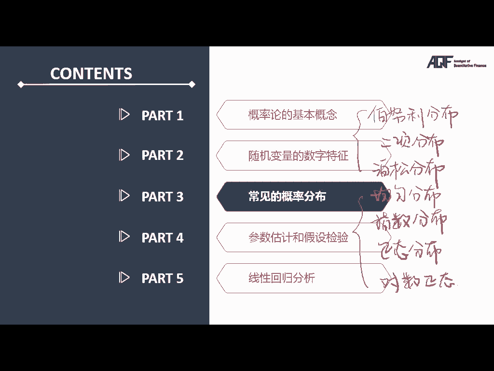
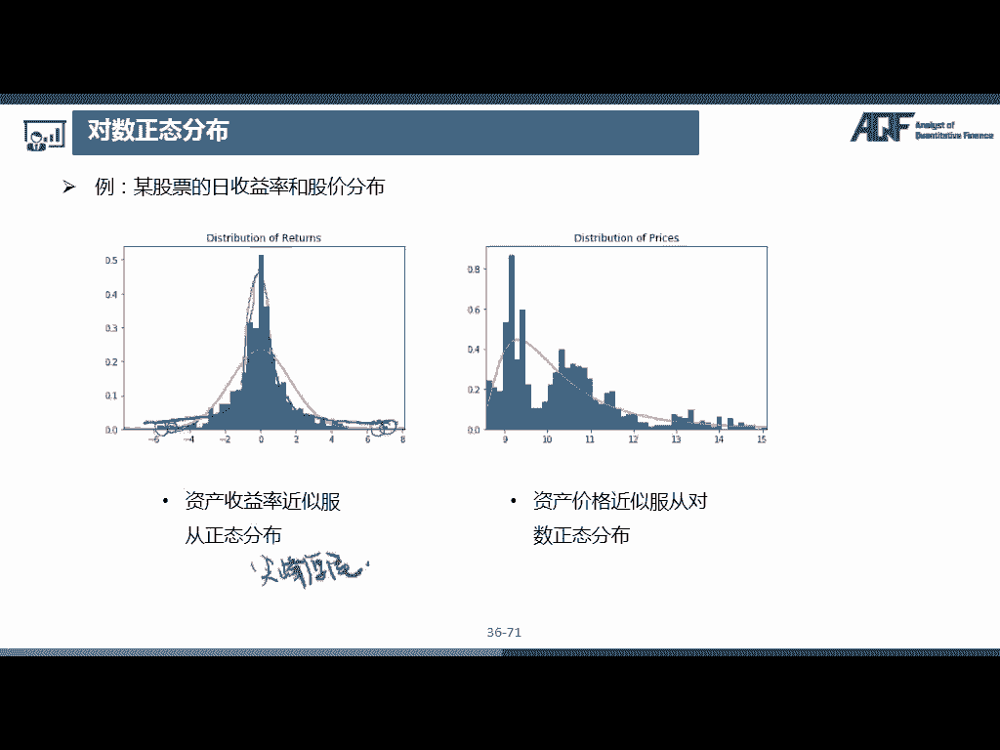

# 2024年金融大神老师讲解量化金融分析师.AQF—量化金融基础知识（完整版课程） - P3：《金融基础》03.数量分析-03_常见的概率分布

在本节课中，我们将介绍几种常见的概率分布，包括三种离散型分布和四种连续型分布。通过学习这些分布，你将能够理解它们的特点及应用，并掌握如何在量化分析中使用它们。

## 离散型分布

### 1. 伯努利分布 (Bernoulli Distribution) 🎲

伯努利分布是最简单的离散型随机变量分布。它描述了只有两种可能结果的实验，例如抛硬币、考试及格与否等。

**定义**：  
如果随机变量 \(X\) 只取值 0 或 1，那么它服从伯努利分布。设 \(P(X=1) = p\)，则 \(P(X=0) = 1-p\)。

**概率质量函数（PMF）**：
\[
P(X=x) = p^x(1-p)^{1-x}, \quad x \in \{0,1\}
\]

**期望和方差**：
- 期望：  
\[
E(X) = p
\]
- 方差：  
\[
Var(X) = p(1 - p)
\]

### 2. 二项分布 (Binomial Distribution) 📦

二项分布描述了进行 \(n\) 次独立的伯努利试验，成功次数为 \(k\) 的概率。

**定义**：  
在 \(n\) 次伯努利试验中，成功 \(k\) 次的概率为：
\[
P(X=k) = \binom{n}{k} p^k (1-p)^{n-k}
\]

**期望和方差**：
- 期望：
\[
E(X) = np
\]
- 方差：
\[
Var(X) = np(1-p)
\]

### 3. 泊松分布 (Poisson Distribution) 🕰

泊松分布适用于描述单位时间内某事件发生次数的分布，通常用于低频但稳定的事件，例如每分钟接到的电话数量。

**定义**：  
当事件发生的平均频率为 \(\lambda\) 时，事件发生 \(k\) 次的概率为：
\[
P(X=k) = \frac{\lambda^k e^{-\lambda}}{k!}
\]

**期望和方差**：
- 期望：
\[
E(X) = \lambda
\]
- 方差：
\[
Var(X) = \lambda
\]

## 连续型分布

### 4. 均匀分布 (Uniform Distribution) 📏

均匀分布描述的是在某一范围内，所有值出现的概率是相等的。

**定义**：  
在区间 \([a,b]\) 内，随机变量 \(X\) 服从均匀分布，其概率密度函数为：
\[
f_X(x) = \frac{1}{b-a}, \quad a \leq x \leq b
\]

**期望和方差**：
- 期望：
\[
E(X) = \frac{a+b}{2}
\]
- 方差：
\[
Var(X) = \frac{(b-a)^2}{12}
\]

### 5. 指数分布 (Exponential Distribution) ⏳

指数分布用于描述两次事件发生之间的时间间隔，通常与泊松过程相关。

**定义**：  
如果事件的平均发生率为 \(\lambda\)，则随机变量 \(X\) 服从指数分布，概率密度函数为：
\[
f_X(x) = \lambda e^{-\lambda x}, \quad x \geq 0
\]

**期望和方差**：
- 期望：
\[
E(X) = \frac{1}{\lambda}
\]
- 方差：
\[
Var(X) = \frac{1}{\lambda^2}
\]

### 6. 正态分布 (Normal Distribution) 📈

正态分布广泛用于自然和社会科学中，描述了许多自然现象，如人的身高、体重等。

**定义**：  
正态分布的概率密度函数为：
\[
f_X(x) = \frac{1}{\sqrt{2\pi\sigma^2}} e^{-\frac{(x - \mu)^2}{2\sigma^2}}
\]
其中，\(\mu\) 为期望，\(\sigma^2\) 为方差。

**期望和方差**：
- 期望：
\[
E(X) = \mu
\]
- 方差：
\[
Var(X) = \sigma^2
\]

### 7. 对数正态分布 (Lognormal Distribution) 🔒

对数正态分布是当随机变量的对数服从正态分布时，原始变量的分布。

**定义**：  
如果 \(\ln(X)\) 服从正态分布，那么 \(X\) 服从对数正态分布。

**概率密度函数**：
\[
f_X(x) = \frac{1}{x\sigma \sqrt{2\pi}} e^{-\frac{(\ln(x) - \mu)^2}{2\sigma^2}}, \quad x > 0
\]

---

## 总结

在本节课中，我们学习了七种常见的概率分布，包括伯努利分布、二项分布、泊松分布、均匀分布、指数分布、正态分布和对数正态分布。我们了解了它们的概率质量函数、期望和方差，并掌握了如何使用这些分布在实际问题中进行建模。