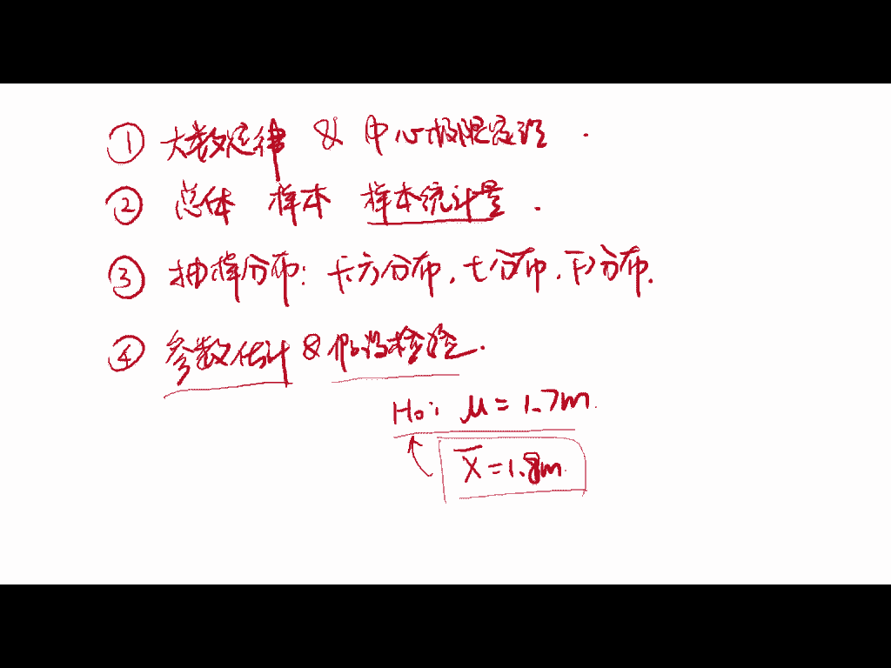
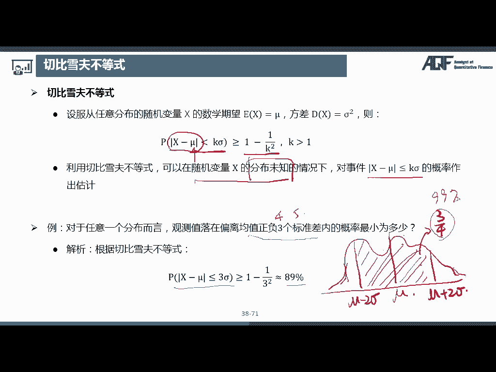
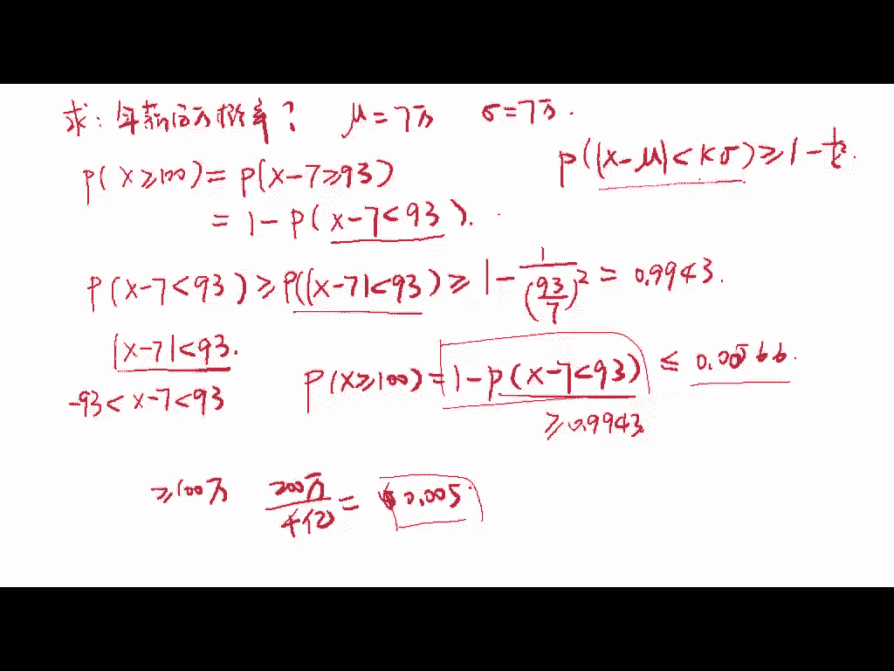
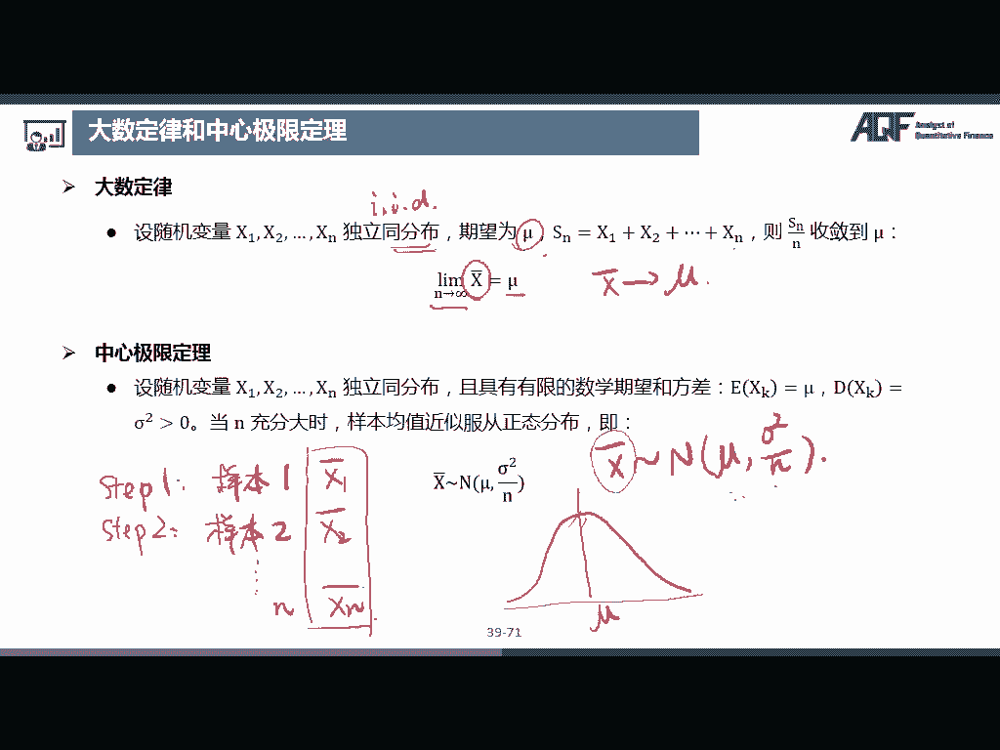

# 量化金融基础知识：04：大数定律与中心极限定理 📊

在本节课中，我们将介绍大数定律和中心极限定理，这是量化金融和统计学中的两个核心概念。我们将首先回顾一些概率论的基本知识，然后引入切比雪夫不等式作为基础，最后重点讲解大数定律和中心极限定理如何帮助我们推断总体特征。

---

### 1. 概述

我们之前在学习概率论时，已经掌握了基本的随机现象、随机变量以及其数字特征。接下来，我们将重点讨论如何利用统计推断，特别是大数定律和中心极限定理，来根据样本数据推断总体的性质。

推断统计是统计学的重要部分，它通过样本数据推测总体特征。大数定律和中心极限定理为这一过程提供了理论基础。

---

### 2. 切比雪夫不等式

在讨论大数定律和中心极限定理之前，我们先介绍一个重要的工具——切比雪夫不等式。这个不等式可以在我们不知道随机变量分布的情况下，估计样本偏离均值的概率。

#### 切比雪夫不等式公式：

设随机变量 \( X \) 的期望为 \( \mu \)，方差为 \( \sigma^2 \)，则：

\[
P(|X - \mu| \geq K \sigma) \leq \frac{1}{K^2}
\]

该公式的含义是：随机变量 \( X \) 偏离均值 \( \mu \) 超过 \( K \) 个标准差的概率，至少为 \( 1 - \frac{1}{K^2} \)。

#### 示例：

假设随机变量 \( X \) 服从任意分布，已知其期望为 \( \mu \) 和方差为 \( \sigma^2 \)。我们希望计算 \( X \) 落在 \( \mu \pm 3\sigma \) 范围内的概率。根据切比雪夫不等式：

\[
P(|X - \mu| \leq 3 \sigma) \geq 1 - \frac{1}{3^2} = \frac{8}{9} \approx 0.89
\]

这意味着，至少有 89% 的样本数据会集中在均值的 3 个标准差之内。

---

### 3. 大数定律

大数定律是统计学中的一个重要定理，它描述了随着样本量的增加，样本均值会趋近于总体均值的现象。大数定律为统计推断提供了理论基础。

#### 大数定律公式：

假设随机变量 \( X_1, X_2, \dots, X_n \) 独立同分布，期望为 \( \mu \)，那么当 \( n \) 趋近于无穷大时，样本均值 \( \bar{X_n} \) 收敛到总体均值 \( \mu \)，即：

\[
\lim_{n \to \infty} \frac{1}{n} \sum_{i=1}^n X_i = \mu
\]

这意味着，随着样本量的增加，样本均值会越来越接近总体均值。

#### 示例：

例如，想要知道中国成年男性的平均身高。如果我们多次抽取样本，随着样本量的增大，计算出来的平均身高会越来越接近全国成年男性的真实平均身高。

---

### 4. 中心极限定理

中心极限定理进一步说明了大数定律的细节。它告诉我们，即使总体的分布未知，当样本量足够大时，样本均值的分布趋近于正态分布。

#### 中心极限定理公式：

设 \( X_1, X_2, \dots, X_n \) 独立同分布，且具有有限的期望 \( \mu \) 和方差 \( \sigma^2 \)，那么样本均值 \( \bar{X_n} \) 的分布趋近于正态分布，且：

\[
\bar{X_n} \sim N\left( \mu, \frac{\sigma^2}{n} \right)
\]

这意味着，无论总体分布是什么，样本均值总是趋向于正态分布。

#### 示例：

假设我们想知道中国成年男性的平均身高。即使我们不知道成年男性身高的总体分布，我们可以通过抽取多个样本，计算每个样本的平均身高。随着样本数量的增加，所有样本均值的分布会趋近于正态分布，其均值为总体均值 \( \mu \)，方差为 \( \frac{\sigma^2}{n} \)。

---

### 5. 总结

在本节课中，我们学习了大数定律和中心极限定理，这两个定理为统计推断提供了坚实的理论基础。大数定律表明，随着样本量的增加，样本均值趋近于总体均值。中心极限定理则告诉我们，样本均值的分布趋近于正态分布，无论总体分布是什么。理解这两个定理对我们进行统计分析和推断至关重要。