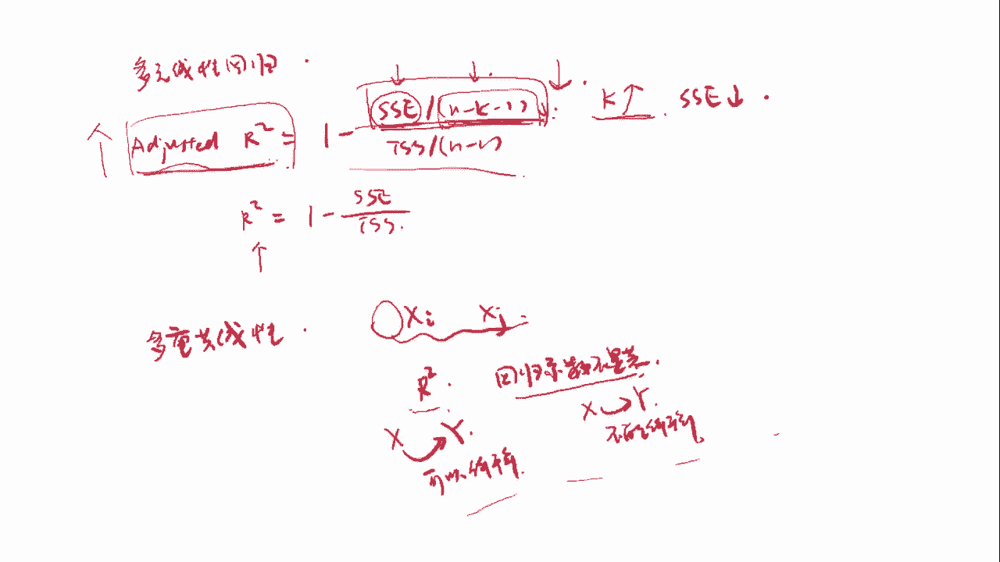

# 量化金融基础知识：08：数量分析 - 线性回归分析2 📉

在本节课中，我们将继续探讨线性回归分析，重点讨论回归曲线的拟合程度评估。我们将学习如何通过方差分析来衡量回归模型的拟合效果，并深入理解回归分析中的相关概念。

## 1. 回归曲线的评估

在上一节中，我们学习了如何绘制回归曲线。现在，我们将讨论如何评估这条回归曲线的拟合程度。我们通过**方差分析**（ANOVA）来进行评估，方差分析帮助我们理解回归曲线与数据之间的拟合关系。

首先，我们介绍几个关键术语：

- **样本回归线**：这是根据回归模型计算出来的回归线，通常表示为 `y_i_hat = β0_hat + β1_hat * x_i`。
- **解释平方和（RSS）**：表示样本回归线所解释的Y的变异程度，即回归模型的效果。
- **残差平方和（SSE）**：表示观测值与回归线之间的差异，也可以看作回归模型无法解释的部分。
- **总平方和（TSS）**：表示观测值距离均值的整体变异程度。

### **公式总结**

- **总平方和**：`TSS = Σ(y_i - Y_mean)²`
- **解释平方和**：`RSS = Σ(y_i_hat - Y_mean)²`
- **残差平方和**：`SSE = Σ(y_i - y_i_hat)²`

这三者之间的关系为：
\[ \text{TSS} = \text{RSS} + \text{SSE} \]

### **回归的拟合度**

拟合度的一个常见指标是**决定系数（R²）**，它表示解释平方和（RSS）占总平方和（TSS）的比例。R²越高，说明模型的拟合度越好。

公式为：
\[
R^2 = \frac{\text{RSS}}{\text{TSS}}
\]
R²的取值范围是[0, 1]，值越接近1，表示拟合效果越好。

## 2. 方差分析（ANOVA）

在进行回归分析时，我们需要通过方差分析来检验回归模型的效果。以下是ANOVA表的主要组成部分：

- **回归**：表示回归平方和（RSS），自由度为1。
- **残差**：表示残差平方和（SSE），自由度为N-2。
- **总计**：表示总平方和（TSS），自由度为N-1。

### **自由度与MSS**

每个部分的均方（MSS）可以通过平方和除以自由度来计算：
\[
\text{MSS} = \frac{\text{SS}}{\text{df}}
\]

## 3. 拟合优度指标

在回归分析中，我们可以通过以下几种指标来评估拟合优度：

### 1. **R²（决定系数）**

R²反映了因变量的变化有多少是由自变量解释的。其计算公式为：
\[
R^2 = 1 - \frac{\text{SSE}}{\text{TSS}}
\]
R²越大，拟合效果越好。

### 2. **回归标准误差（Standard Error of Regression）**

回归标准误差衡量真实Y值与回归线的偏离程度，计算公式为：
\[
\text{SE} = \sqrt{\frac{\text{SSE}}{\text{df}_\text{residual}}}
\]
其中，`df_residual`是残差的自由度。

## 4. Python 实现线性回归

接下来，我们通过Python实现一个线性回归实例。假设我们有一组数据，描述工作年限与工资水平的关系。我们将使用回归分析来拟合这组数据，并评估拟合效果。

### **散点图与回归线**

我们首先绘制散点图，其中X轴为工作年限，Y轴为工资水平。接着，我们使用OLS回归法拟合一条回归线。

### **回归结果**

回归结果包括回归系数、R²值等。假设我们得到的R²为0.957，说明模型拟合效果非常好。

## 5. 多元线性回归

与一元线性回归不同，多元线性回归模型有多个自变量。其基本假设与一元回归类似，但需要注意的是：

- 自变量之间不能存在完全的共线性（即，某一个自变量可以由其他自变量的线性组合表示）。
- 多元回归的一个挑战是**多重共线性**，即自变量之间的高度相关性可能导致回归结果不稳定。

### **回归系数的显著性检验**

对于每一个自变量的回归系数，我们可以进行显著性检验，通常使用**t检验**来判断系数是否显著。

## 6. 调整后的R²

在多元回归中，R²会随着自变量的增加而增大。为了解决这一问题，我们引入了**调整后的R²**。调整后的R²不仅考虑了模型的拟合度，还惩罚了过多自变量的加入。

调整后的R²公式为：
\[
\text{Adjusted } R^2 = 1 - \left( \frac{\text{SSE}}{\text{df}_\text{residual}} \right) \times \left( \frac{\text{df}_\text{total}}{\text{df}_\text{residual}} \right)
\]
其中，`df_total`是总的自由度，`df_residual`是残差的自由度。

## 7. 多重共线性

多重共线性指的是多个自变量之间高度相关，这会影响回归系数的显著性检验。常见的诊断方法是检查R²值和T统计量的显著性。

### **多重共线性的影响**

多重共线性会导致T检验失效，因为标准误差被高估，从而使得回归系数的显著性降低。诊断多重共线性时，通常关注R²值是否过高，而T统计量是否不显著。

## 总结

本节课中，我们学习了如何使用方差分析评估回归曲线的拟合度，了解了解释平方和、残差平方和和总平方和的关系，并探讨了拟合优度的多个指标。我们还介绍了多元线性回归及其挑战，包括调整后的R²和多重共线性。通过这些知识，您可以更好地理解和应用线性回归分析。