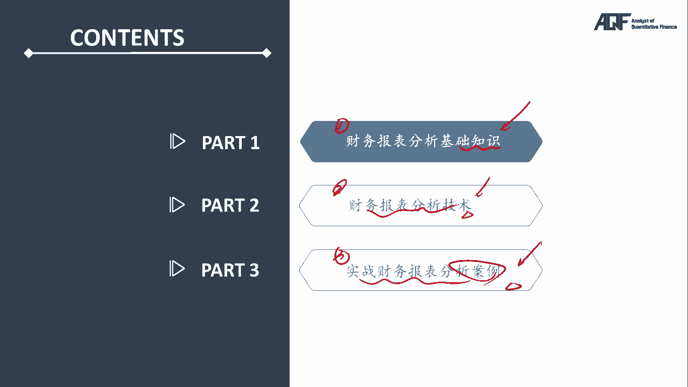

# 量化金融基础知识：09.财务分析-1 财务报表分析原理：报表关系 📊

在本节课中，我们将学习财务报表分析的基础知识，重点讲解财务报表之间的关系和如何分析这些报表。即使是量化分析师，理解财务报表的关系也是至关重要的，因为它有助于我们做出更准确的投资决策。

## 财务报表的核心内容

财务报表通常包括三张主要报表：资产负债表、利润表和现金流量表。在量化分析中，我们需要理解这三者之间的相互关系。

以下是这三张报表的简要介绍：

1. **资产负债表（Balance Sheet）**：用来衡量一个公司在某一时点的资产和负债状况。
2. **利润表（Income Statement）**：反映一个公司在某一时间段内的盈利能力。
3. **现金流量表（Cash Flow Statement）**：用来衡量公司现金流的状况。

### 财务报表分析的三大支柱

财务报表分析的核心包括以下三个方面：

1. **财务报表的勾稽关系**
2. **复式记账法**
3. **权责发生制**

我们会逐一讲解这些内容，并带你了解如何从财务报表中提取有效信息。

## 财务报表的关系：资产负债表、利润表与现金流量表

### 1. 资产负债表的作用

资产负债表主要衡量企业在某一时点上的资产、负债和所有者权益。它展示了公司拥有的资产，以及公司所欠的负债。其基本结构如下：

- **资产（Assets）**：公司所拥有的资源。
- **负债（Liabilities）**：公司所欠的债务。
- **所有者权益（Equity）**：股东或所有者对公司资产的所有权。

### 2. 利润表的作用

利润表展示了公司在一定时间段内的盈利情况，主要反映了企业的收入与支出的差额，最终得出净利润。其核心内容包括：

- **收入（Revenue）**：公司通过产品或服务获得的资金。
- **费用（Expense）**：公司在经营过程中支出的金额。
- **净利润（Net Income）**：收入减去费用后得到的利润。

### 3. 现金流量表的作用

现金流量表记录了企业的现金收入与支出，主要包括以下三类现金流：

- **经营活动现金流**：与公司主营业务相关的现金流。
- **投资活动现金流**：与公司投资活动相关的现金流。
- **融资活动现金流**：与公司融资相关的现金流。

### 4. 财务报表之间的关系

#### 资产负债表与利润表的关系

资产负债表与利润表之间是通过“留存收益”（Retained Earnings）这一科目相连接的。利润表中的净利润会影响资产负债表中的留存收益，从而影响所有者权益。例如：

- 当公司盈利时，利润表中的净利润会增加资产负债表中的留存收益。
- 当公司亏损时，净利润为负，导致留存收益减少。

#### 资产负债表与现金流量表的关系

现金流量表中的现金流变动将直接影响资产负债表中的现金和现金等价物。因此，现金流量表反映的现金变化，最终会在资产负债表的资产部分得到体现。

## 案例分析：如何通过财务报表分析公司

让我们通过一个具体的例子来理解如何使用财务报表进行分析。

### 示例1：公司用房产偿还债务

假设某上市公司有一个1.6亿元的银行贷款，但它手头没有足够的现金偿还。于是，公司将一栋原值为3000万元的房产作为抵押偿还贷款。此时，公司使用了资产负债表中的**资产**部分进行操作。

该操作的关键在于房产的市值，假设它的市值已经增长到1.6亿元，足以覆盖贷款金额。通过这一操作，公司可以从负债中减去债务，并将房产增加到资产负债表中的资产项下。

最终的结果是，公司通过这笔交易将亏损转为盈利，因此要分析公司是否存在通过财务操作进行“粉饰”财务的可能性。

### 示例2：设备折旧对利润的影响

另一种常见的财务操作是对设备的折旧进行调整。例如，一个公司购买了一台价值5000万元的设备，假设它的使用寿命为10年，那么每年的折旧为500万元。但如果公司重新评估该设备的使用寿命，并将其延长至20年，那么每年的折旧将减少到250万元，从而提高了公司的净利润。

这种操作虽然合法，但它改变了公司利润的计算方式，因此作为分析师，需要对这些调整进行审查，以避免错误的财务决策。

## 总结

在本节课中，我们了解了财务报表分析的基本框架，特别是资产负债表、利润表和现金流量表之间的相互关系。通过分析这些报表，我们不仅能够了解公司当前的财务状况，还能够识别潜在的财务操作或“粉饰”行为。在未来的量化分析中，掌握这些基本概念是至关重要的。

我们将在接下来的章节中继续深入探讨如何应用这些知识进行量化投资分析。