# 2024最值得学习的金融量化交易课程：第八讲：Value at Risk 与 Expected Shortfall（P1）📊


## 一、课程概述 🎯


在本节课中，我们将系统学习**风险管理的核心概念**，重点掌握两个关键指标：

- **Value at Risk（VaR，在险价值）**
- **Expected Shortfall（ES，预期损失）**

本节内容以概念理解为主，数学推导较少，重点帮助初学者建立清晰的风险管理框架，并理解 VaR 与 ES 的定义、性质、计算方法及其优缺点。

---

## 二、什么是风险？⚠️


在进入VaR之前，我们需要回答一个最基础的问题：**什么是风险？**


### 1️⃣ 风险的本质


entity["people","Frank Knight","economist risk theory"] 曾指出：风险来源于**不确定性（Uncertainty）**。

风险不是一个简单的数字，也不能仅仅用标准差描述。

更严谨地说，风险应包含两个要素：

```
Risk = Probability × Negative Impact
```

即：

- 发生概率（Probability）
- 负面影响（Negative Impact，通常为损失）


---

## 三、什么是风险管理？🛡️


理解风险之后，我们进一步讨论风险管理的定义。


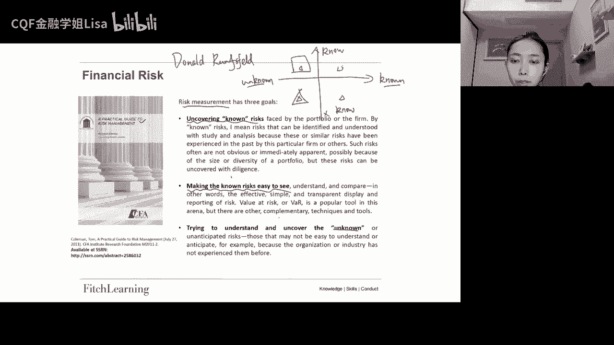

风险管理是一个**动态过程**，而非一次性的计算行为。它包括以下三个核心步骤：


### 风险管理的三大步骤


1. **识别风险（Identify Risk）**
2. **测量风险（Measure Risk）**
3. **排序风险（Prioritize Risk）**


不同风险有不同衡量方式，例如：

- 市场风险 → VaR、回撤等
- 信用风险 → 违约概率、信用评级等


风险管理强调持续监控与修正，而不是依赖单一模型结果。它既包含数学建模，也涉及行为金融学，例如损失厌恶。


---

## 四、风险的四象限模型 🧭


风险可按“是否已知”进行分类，形成四象限结构：


|                | 已知风险 | 未知风险 |
|----------------|----------|----------|
| **已意识到**   | Known Known | Known Unknown |
| **未意识到**   | Unknown Known | Unknown Unknown |


目标是：

- 扩大 “Known Known”
- 减少 “Unknown Unknown”


随着时间推移，未知风险会逐步被认识，但新的未知风险也会出现，例如黑天鹅事件。


---

## 五、风险度量的公理（Coherent Risk Measure）📐


一个风险度量 \( R(X) \) 若满足以下四个性质，则称为**一致风险度量（Coherent）**。


### 1️⃣ 单调性（Monotonicity）

如果：

```
Y ≥ X
```

则：

```
R(Y) ≤ R(X)
```


---

### 2️⃣ 次可加性（Subadditivity）

```
R(X + Y) ≤ R(X) + R(Y)
```

体现分散化原则。

> 注意：VaR 不满足次可加性。


---

### 3️⃣ 正齐次性（Positive Homogeneity）

```
R(hX) = hR(X)
```

表示杠杆放大倍数与风险成比例。


---

### 4️⃣ 平移不变性（Translation Invariance）

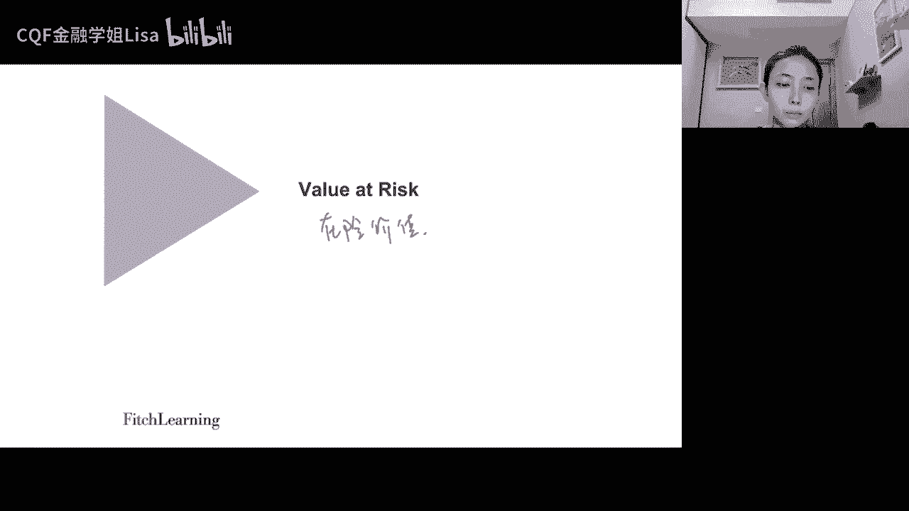

```
R(X + N) = R(X) - N
```

其中 N 为无风险资产。


---

## 六、风险分类体系 🗂️


风险分为两大类：


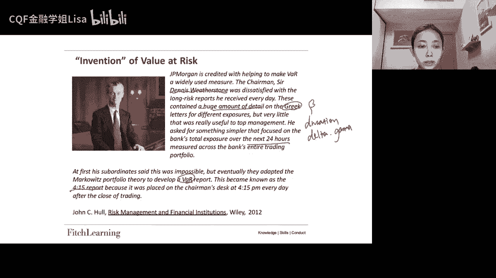

### 1️⃣ 金融风险（Financial Risk）


- 市场风险（Market Risk）
- 信用风险（Credit Risk）
- 流动性风险（Liquidity Risk）


### 2️⃣ 非金融风险（Non-Financial Risk）


- 操作风险（Operational Risk）
- 法律风险（Legal Risk）
- 监管风险（Regulatory Risk）
- 声誉风险（Reputational Risk）
- 模型风险（Model Risk）


本节重点研究：**市场风险**。


---

## 七、Value at Risk（VaR）📉


### 1️⃣ 定义


VaR 是指：

> 在给定置信水平 C 和时间期限 T 下，可能发生的最大损失。


数学表达为：

```
P(Loss ≥ VaR) = 1 - C
```


在正态分布假设下：

```
VaR = μ + Zσ
```

其中：

- μ：均值
- σ：标准差
- Z：标准正态分布分位数


例如：

```
Z(99%) = 2.33
```


若 μ ≈ 0，则：

```
VaR = Zσ
```


---

### 2️⃣ 平方根法则（时间扩展）


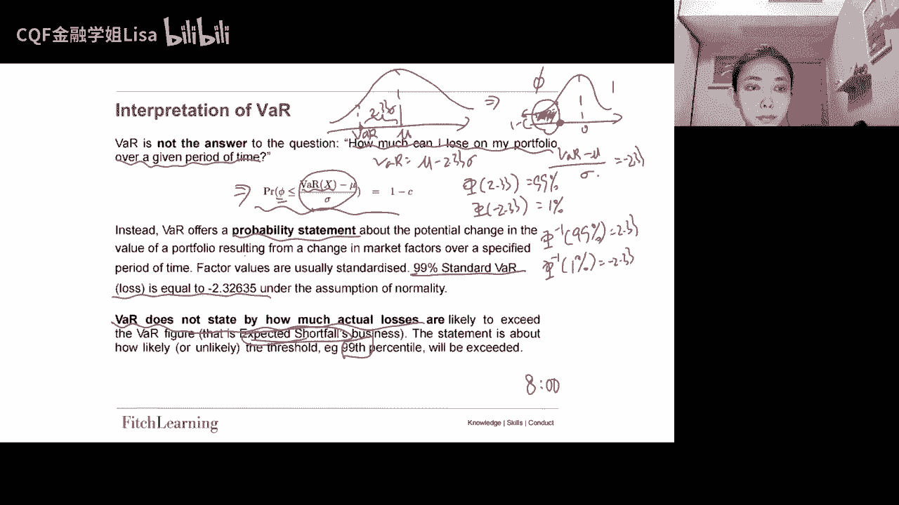

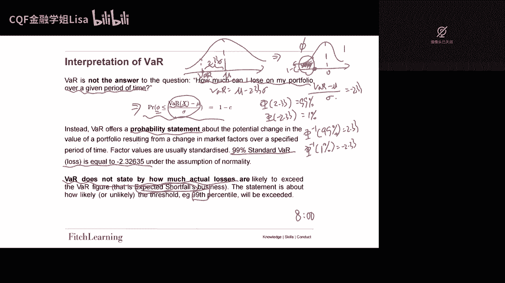

若需计算 N 天 VaR：

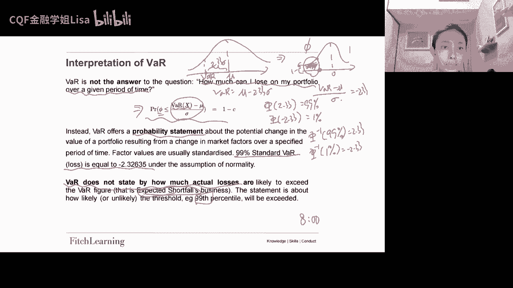

```
VaR(N) = √N × VaR(1)
```

成立条件：

- 日收益 IID
- μ ≈ 0
- 连续复利
- 方差可加


---

## 八、Expected Shortfall（ES）📊


VaR 只告诉我们“边界点”，但没有说明超过该点后损失有多大。


因此引入 ES：


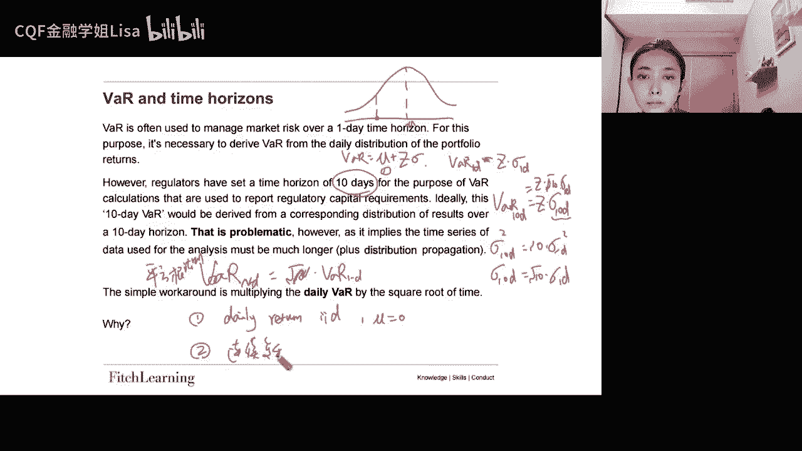

> 当损失超过 VaR 后的平均损失。


数学表达：

```
ES = E[Loss | Loss ≥ VaR]
```

连续形式：

```
ES = (1 / (1 - C)) ∫VaR^∞ x f(x) dx
```


ES 满足次可加性，因此是 Coherent 的。


---

## 九、VaR 不满足次可加性示例 ⚡


假设两只独立债券：

- 面值：1000
- 违约概率：3%
- 回收率：0%


组合 5% VaR = 1000

单个债券 5% VaR = 0


```
VaR(A + B) > VaR(A) + VaR(B)
```

违反次可加性。


---

## 十、VaR 三种计算方法 🧮


### 1️⃣ 参数法（Parametric Method）


假设正态分布：

```
VaR = μ + Zσ
```

优点：简单快速  
缺点：依赖分布假设


---

### 2️⃣ 历史模拟法（Historical Simulation）


步骤：

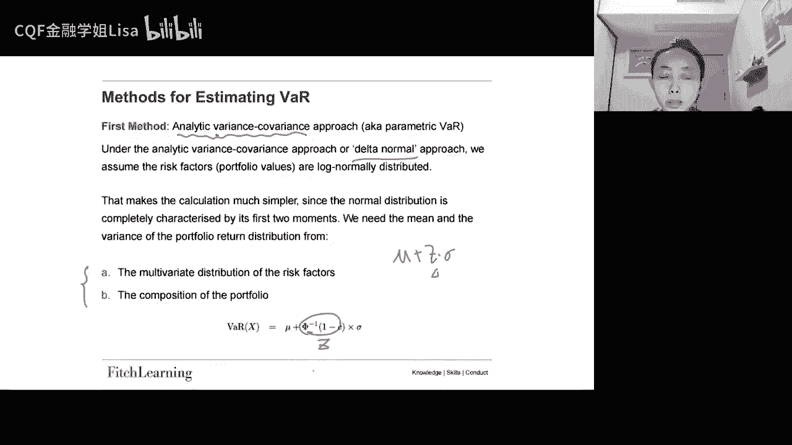

1. 收集历史收益
2. 排序
3. 找到对应分位点


ES：

```
ES = 所有超过VaR的平均值
```


优点：

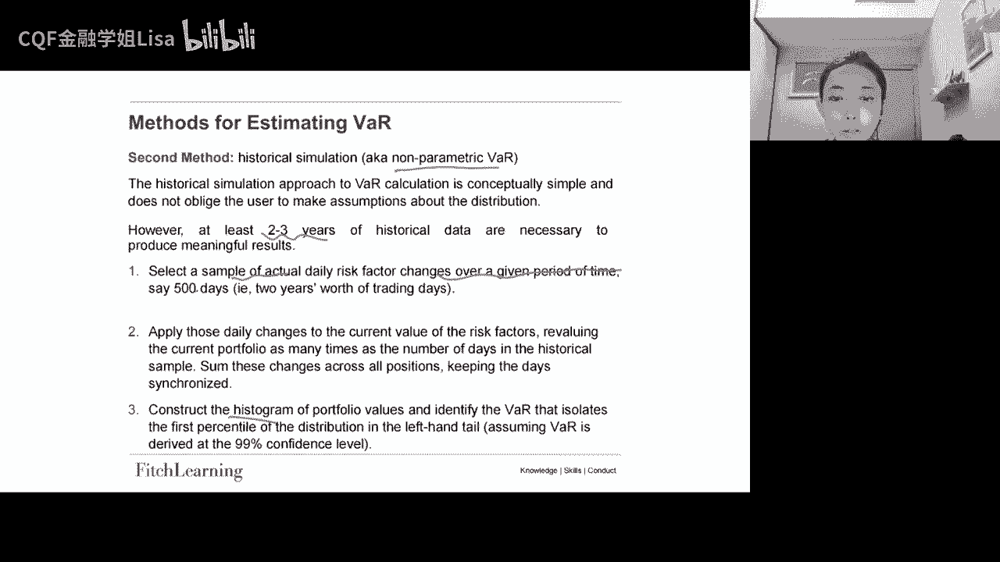

- 非参数
- 自动反映肥尾

缺点：

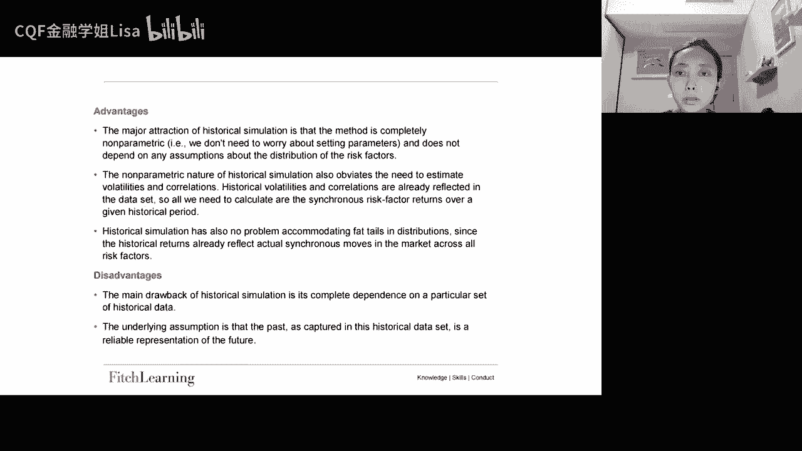

- 假设历史会重演


---

### 3️⃣ 蒙特卡洛模拟（Monte Carlo Simulation）


步骤：

1. 设定随机过程
2. 生成大量路径
3. 形成终点分布
4. 找分位点


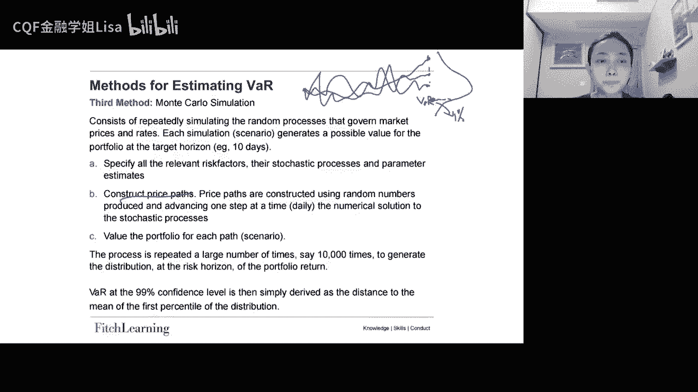

优点：

- 灵活
- 可做情景分析

缺点：

- 模型风险高
- 参数设定困难


---

## 十一、VaR 的局限性 ⚠️


主要问题包括：


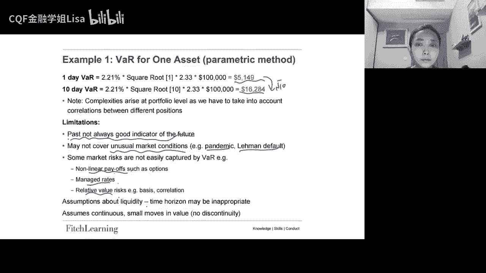

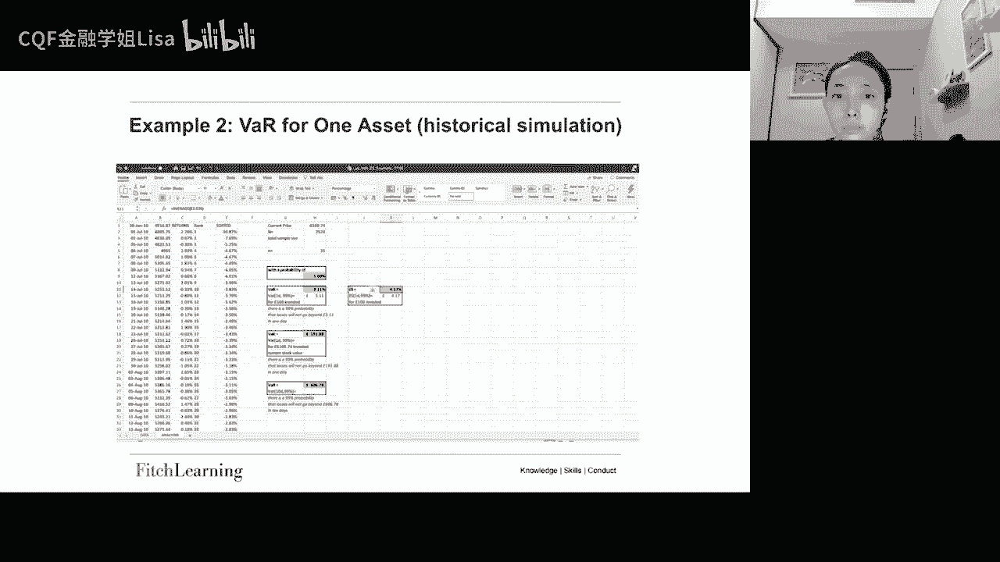

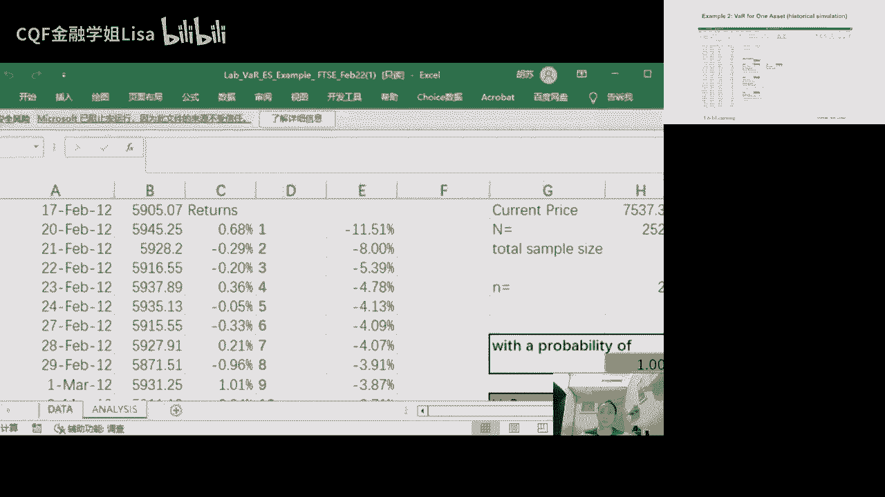

- 不满足次可加性
- 忽略尾部严重程度
- 依赖正态分布
- 无法捕捉非线性资产（如期权）
- 假设 IID
- 无法应对极端事件


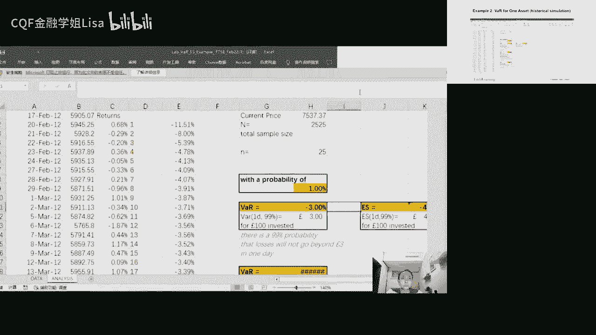

因此需要 ES 进行补充。


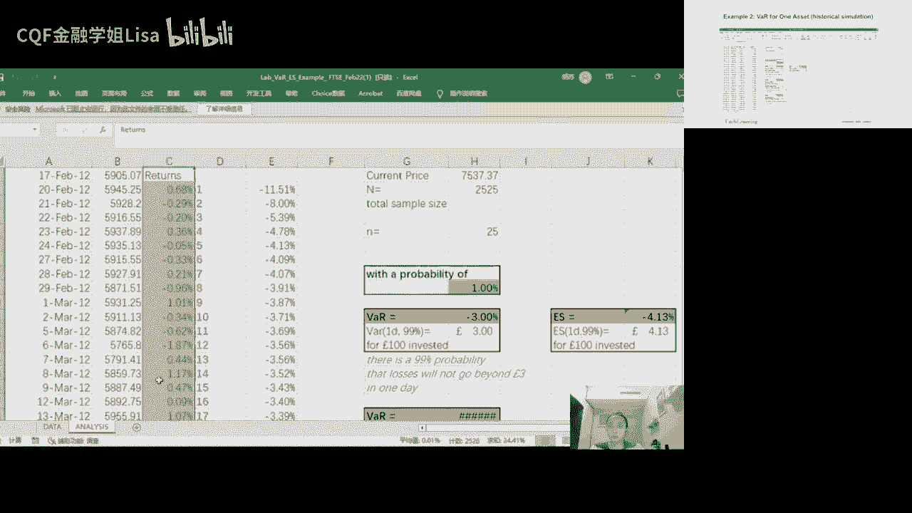

---

## 十二、本节总结 📝


在本节课中，我们系统学习了：


- 风险的定义与风险管理流程  
- 风险的四象限模型  
- 一致风险度量的四大公理  
- 市场风险分类  
- VaR 的定义、公式与平方根法则  
- ES 的条件期望定义  
- VaR 不满足次可加性的例子  
- 三种 VaR 计算方法  


核心理解是：

```
VaR 解决“发生概率是多少”
ES 解决“超过后会损失多少”
```

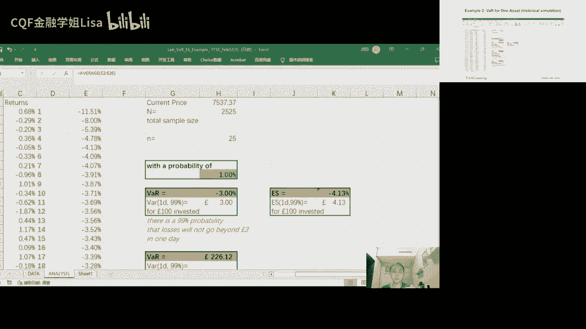

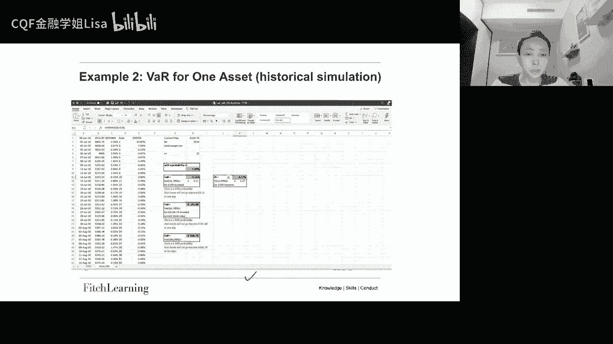

二者结合，才能更全面地衡量市场风险。