# 量化金融课程：M2-1：现代投资组合理论 (MPT) 基础

在本节课中，我们将学习量化投资领域的基石——现代投资组合理论。我们将从基本概念入手，了解如何将风险和回报纳入一个统一的框架进行分析，并理解分散化投资的核心原理。

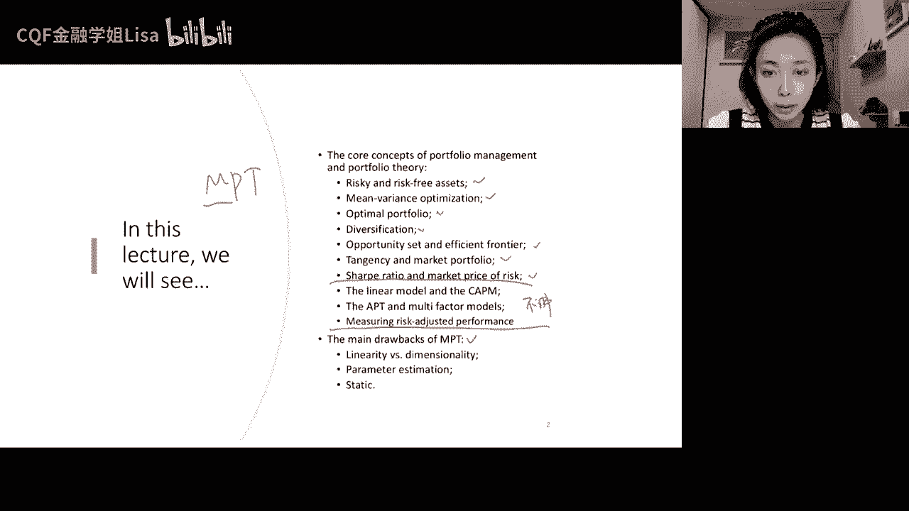

## 课程背景与重要性

上一模块（M1）涉及了较为复杂的数学内容，而本模块（M2）对大多数同学来说会相对轻松。M2的核心是组合管理与信用相关主题，而本节课作为开端，将聚焦于由哈里·马科维茨开创的现代投资组合理论。

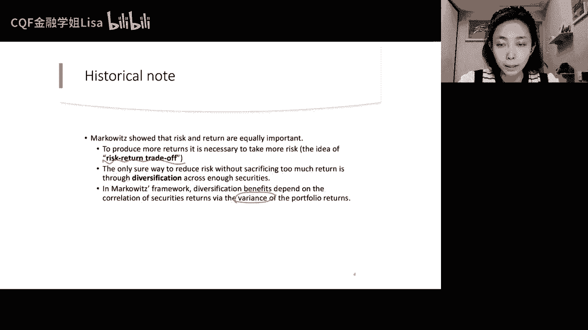

MPT诞生于1952年，它最大的意义在于开创了量化投资的时代。在MPT之前，人们虽然知道“不要把所有鸡蛋放在一个篮子里”，但对于如何精确量化风险与收益、如何进行最优的分散化投资缺乏系统性的分析框架。MPT首次将风险定义为**方差**，并利用**相关系数**来量化分散化降低风险的效果，从而将投资问题转化为一个数学上的最优化问题。

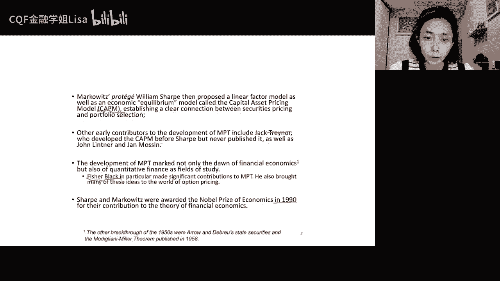

## 模型的基本设定与假设

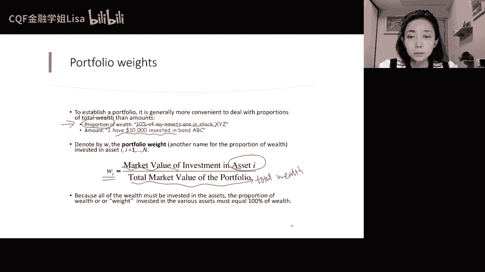

任何金融模型都建立在一些假设之上，MPT也不例外。理解这些假设是理解模型适用性和局限性的关键。

以下是MPT模型的核心设定与假设：

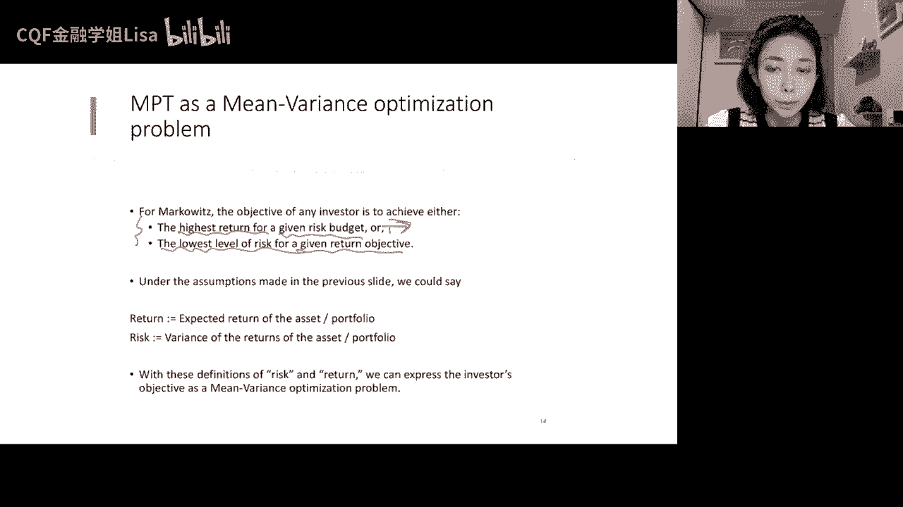

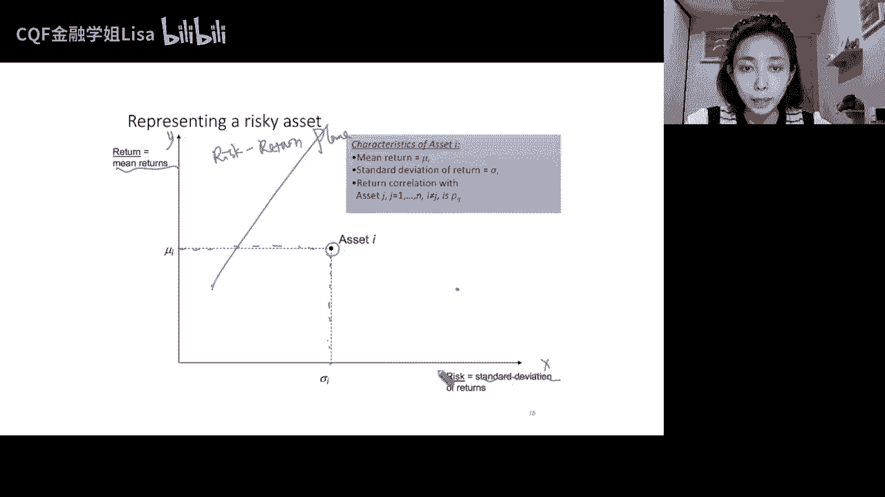

*   **投资范围**：模型考虑一个包含`N >= 2`个可交易资产的经济体，这些资产构成了“投资宇宙”。
*   **投资行为**：投资者拥有初始财富 `W0`，并采用“买入并持有”策略，在投资期内不再调整组合。这是一个**静态模型**。
*   **组合构建**：目标是通过为这N个资产分配权重 `wi` 来构建最佳投资组合。权重计算公式为：
    `wi = (资产i的市场价值) / (整个投资组合的市场价值)`
    模型要求将所有初始财富全部投资出去，即所有权重之和为1。
*   **核心统计量**：
    1.  资产i的预期回报率：`μi`
    2.  资产i回报率的标准差（波动率）：`σi`
    3.  资产i与资产j回报率的相关系数：`ρij`
*   **分布假设**：资产回报率服从**椭圆分布**（如正态分布、t分布）。这是模型有效性的重要前提。
*   **优化目标**：MPT是一个均值-方差最优化模型，旨在实现以下两个目标之一：
    1.  在给定风险（方差）水平下，最大化预期回报。
    2.  在给定预期回报目标下，最小化风险（方差）。
*   **其他简化假设**：
    1.  基于总回报（包含资本利得和股息等）进行计算。
    2.  资产无限可分（可投资任意小比例）。
    3.  可以无风险利率 `r` 进行借贷。
    4.  可以做空资产且无限制。
    5.  无摩擦市场（无税收、无交易成本、无需保证金）。

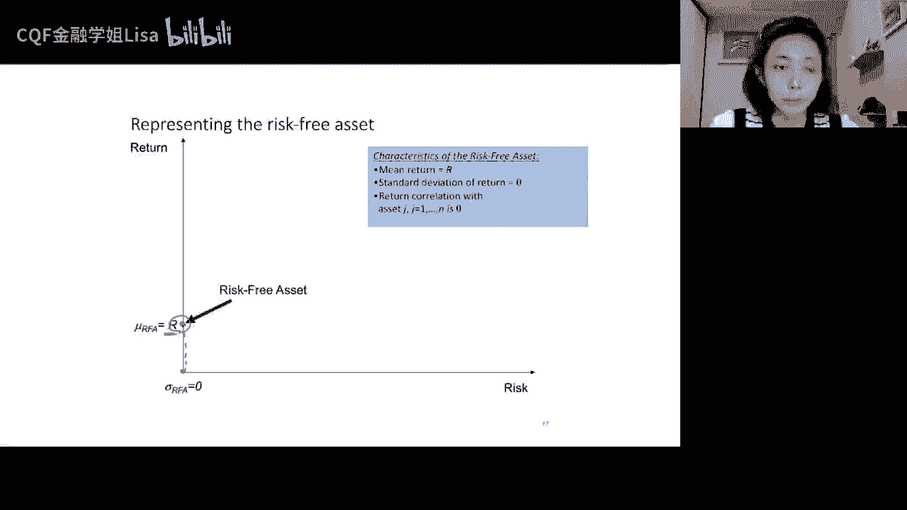

## 风险-回报坐标系与资产类别

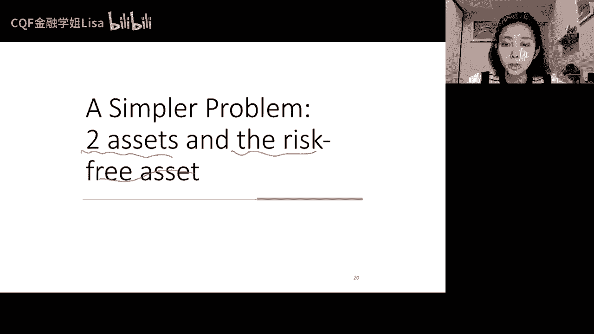

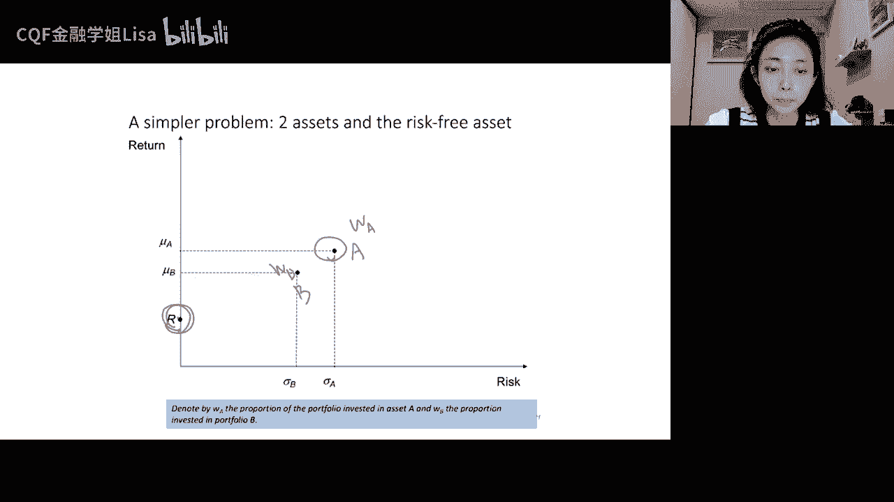

为了用数学方法解决最优化问题，我们首先需要建立一个分析框架。MPT使用一个二维坐标系来可视化所有可能的投资选择。

*   **坐标系**：通常以风险（标准差 `σ`）为横轴（X轴），以预期回报（`μ`）为纵轴（Y轴）。在这个坐标系中，每一个风险资产都对应一个点 `(σi, μi)`。
*   **无风险资产**：指没有违约风险的资产（如国债）。它在坐标系中是一个特殊的点：
    *   预期回报：`r` (无风险利率)
    *   风险（标准差）：`0`
    *   与任何风险资产的相关系数：`0`
    因此，无风险资产位于Y轴上的点 `(0, r)`。

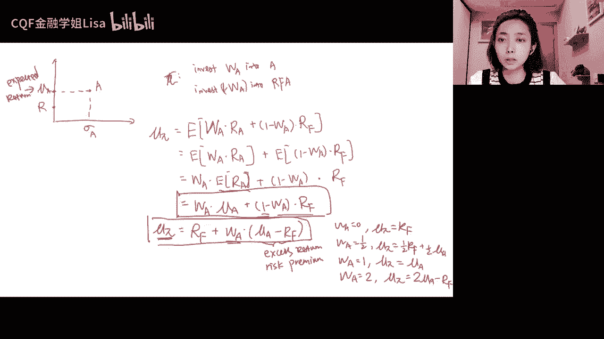

## 两个资产的组合分析

理解了单个资产的表示方法后，我们开始分析如何将资产组合起来。我们从最简单的情况开始：仅包含两个资产。

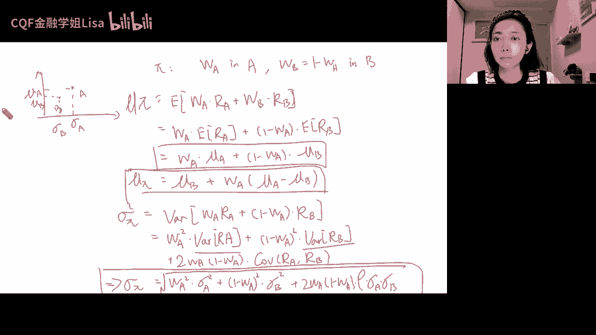

### 情况一：一个风险资产与无风险资产的组合

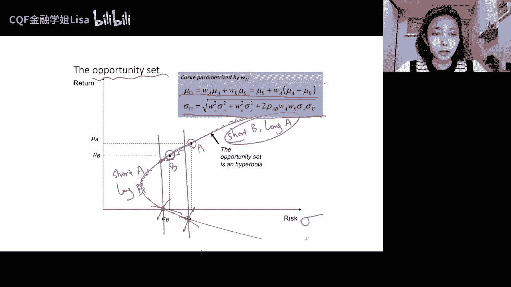

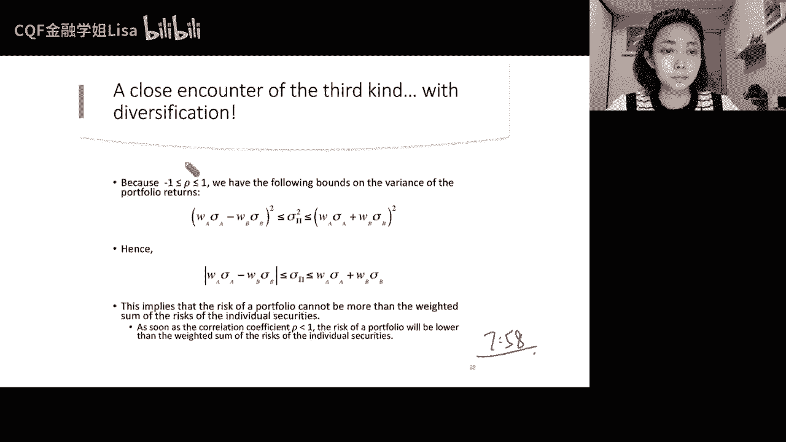

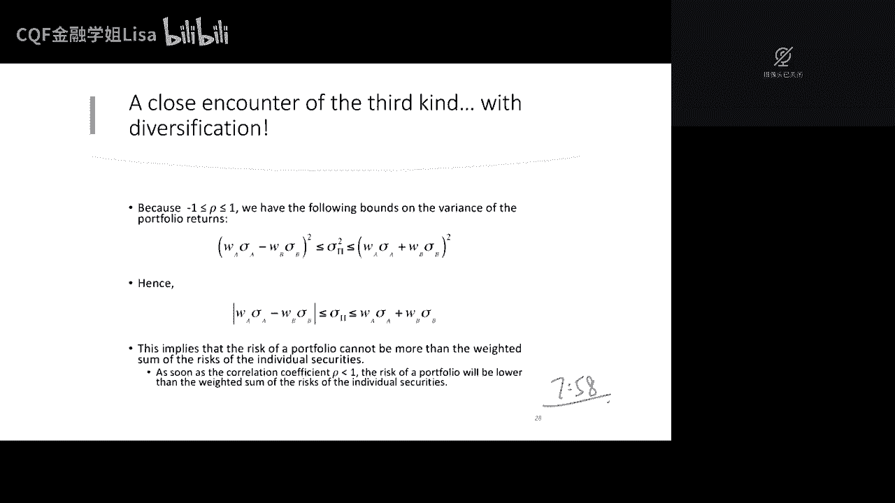

假设我们只有资产A（风险资产）和无风险资产R。我们将资金按权重 `w` 投资于A，剩余部分 `(1-w)` 投资于R。

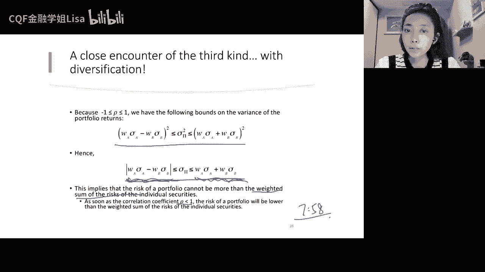

*   **组合预期回报 `μp`**：
    `μp = w * μA + (1-w) * r = r + w * (μA - r)`
    可见，组合回报是无风险利率加上风险资产超额回报的加权。
*   **组合风险 `σp`**：
    `σp = w * σA` （因为无风险资产方差为0且与A不相关）
*   **机会集**：在风险-回报坐标系中，所有由A和R构成的组合都落在一条**直线**上。这条线从点 `(0, r)` 出发，穿过点 `(σA, μA)`。投资者可以通过调整权重 `w` 在这条直线上选择任何一点。

### 情况二：两个风险资产的组合

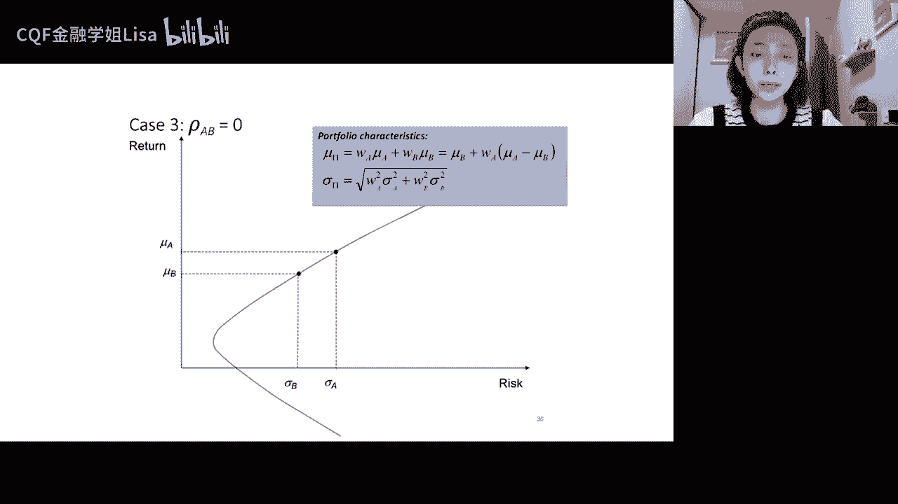

现在考虑两个风险资产A和B。我们将资金按权重 `w` 投资于A，剩余部分 `(1-w)` 投资于B。

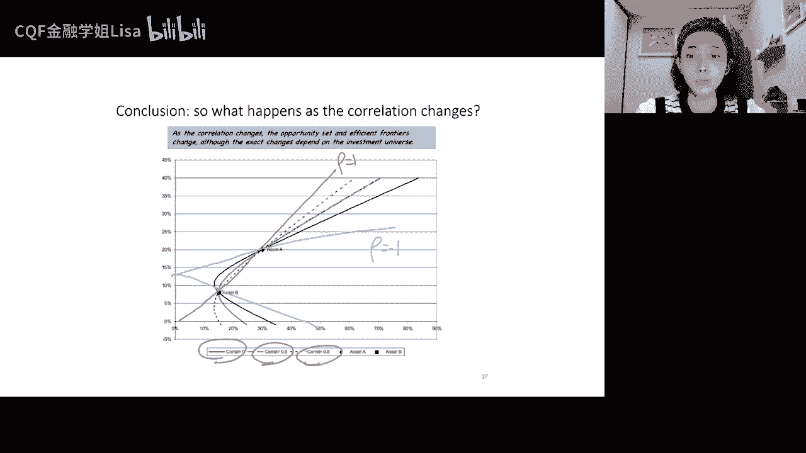

*   **组合预期回报 `μp`**：
    `μp = w * μA + (1-w) * μB`
*   **组合风险 `σp`**：
    `σp = sqrt( w² * σA² + (1-w)² * σB² + 2 * w * (1-w) * ρAB * σA * σB )`
*   **机会集与有效前沿**：在风险-回报坐标系中，所有由A和B构成的组合形成一条**曲线**。这条曲线被称为“机会集”。然而，并非机会集上的所有点都是“有效”的。对于任一给定的风险水平，我们只关心能提供最高回报的那个组合。因此，我们只保留机会集的上半部分，这部分被称为**有效前沿**。有效前沿上最左端的点（风险最小）被称为**全局最小方差组合**。

**相关系数 `ρ` 的影响**：两个资产相关系数的不同，会极大改变有效前沿的形状。
*   当 `ρ = 1`（完全正相关）：有效前沿是一条**直线**，分散化无法降低风险。
*   当 `ρ = -1`（完全负相关）：有效前沿是两条**射线**，存在一个权重配置能使组合风险降为0。
*   当 `-1 < ρ < 1`：有效前沿是一条**向左弯曲的曲线**，体现了分散化降低风险的效果。`ρ` 越小，曲线向左弯曲的程度越大，分散化效果越显著。

## 引入无风险资产：资本市场线 (CML)

在分析了两个风险资产后，我们将无风险资产重新引入，考虑一个包含无风险资产和多个风险资产的世界。

1.  **构建风险资产组合**：首先，所有风险资产（如A, B, C...）可以构建出一条有效前沿（黑色曲线）。
2.  **寻找最佳风险组合**：从无风险资产点 `(0, r)` 出发，可以向这条有效前沿画出无数条直线（每条线代表一个无风险资产与一个特定风险组合的结合）。这些线称为**资本配置线**。
3.  **切线组合与CML**：所有这些CAL中，**斜率最高**的那一条是最有效的，因为它意味着在同等风险下能获得最高的超额回报。这条线与风险资产有效前沿相切，切点代表的组合被称为**切线组合**或**市场组合**。这条最优的CAL有一个专有名称——**资本市场线**。
4.  **CML的方程**：CML的方程清晰地表达了其含义：
    `μp = r + [(μm - r) / σm] * σp`
    其中，`(μm, σm)` 是市场组合的预期回报和风险。
5.  **夏普比率**：CML的斜率 `(μm - r) / σm` 正是市场组合的**夏普比率**。夏普比率衡量的是**单位风险所获得的超额回报**，是评估投资组合效率的核心指标。CML上的所有组合都共享这个市场级的夏普比率。

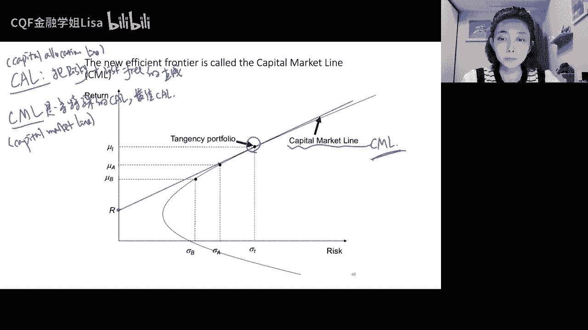

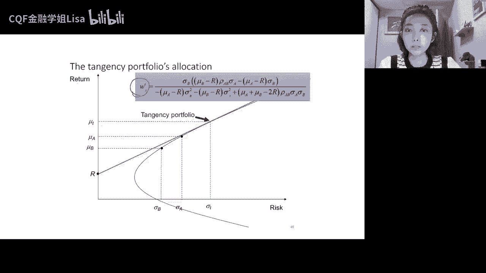

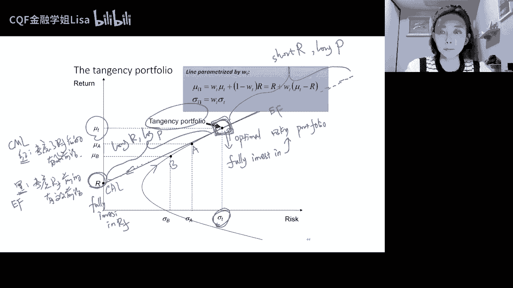

## 总结

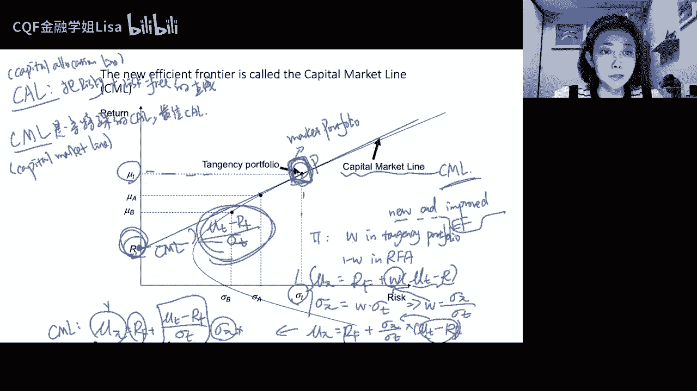

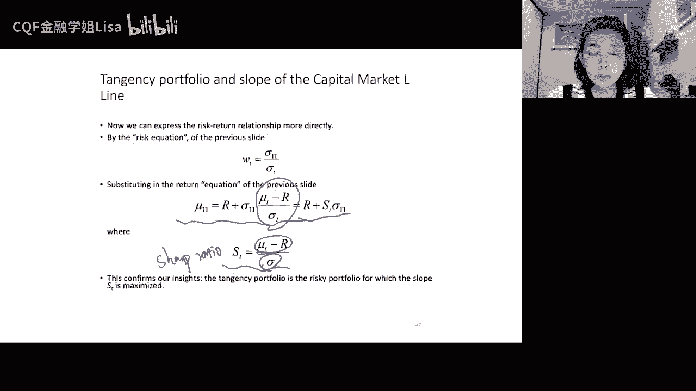

本节课我们一起学习了现代投资组合理论的基础框架。我们首先了解了MPT的历史地位和基本假设，然后建立了以风险和回报为坐标的分析体系。通过分析两个资产的组合，我们深入理解了**分散化**如何通过资产间的**相关系数**来降低风险，并引出了**有效前沿**的概念。最后，通过引入无风险资产，我们找到了最优的资本配置路径——**资本市场线**，并认识了衡量投资效率的关键指标**夏普比率**。

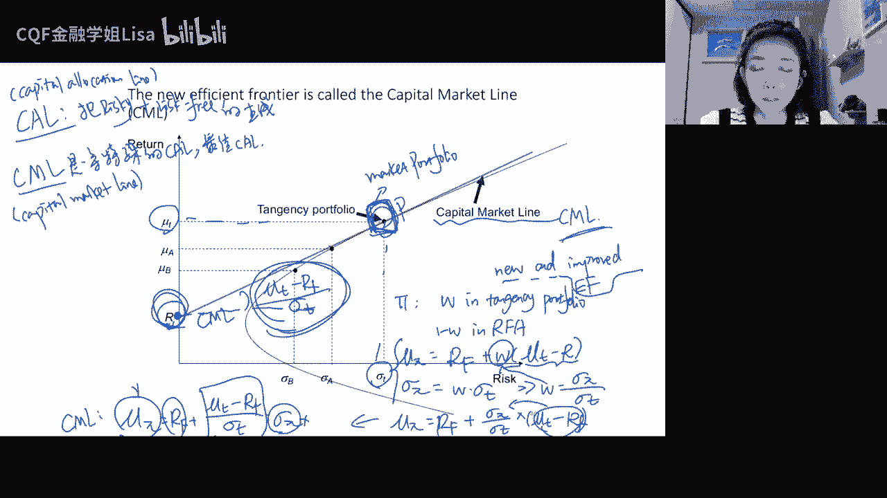

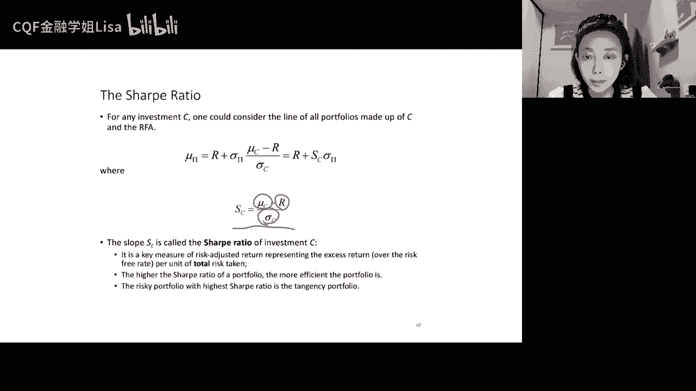

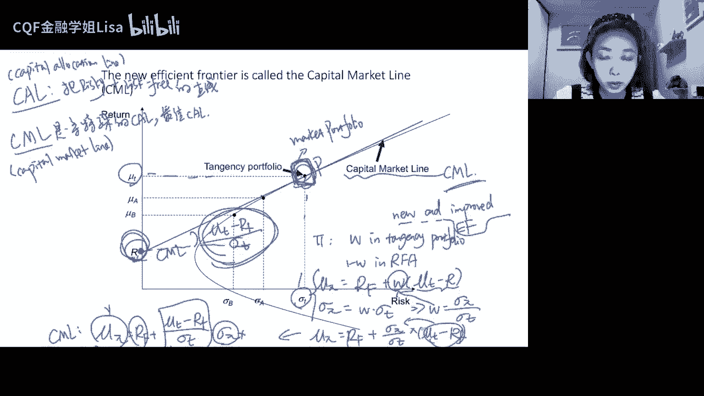

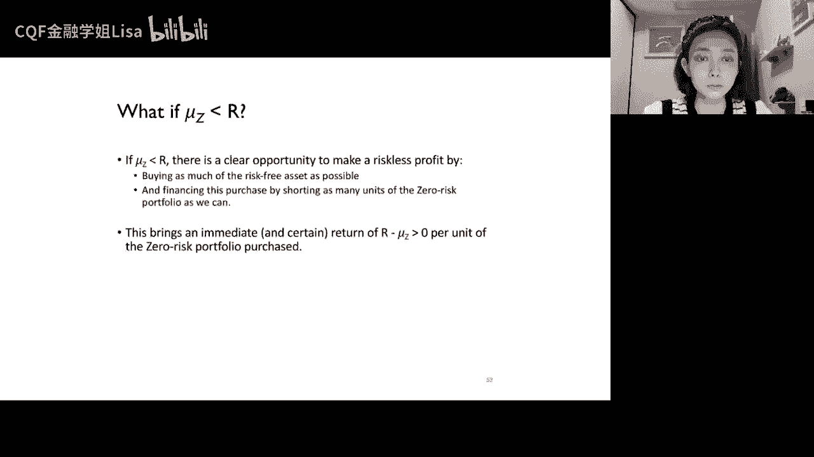

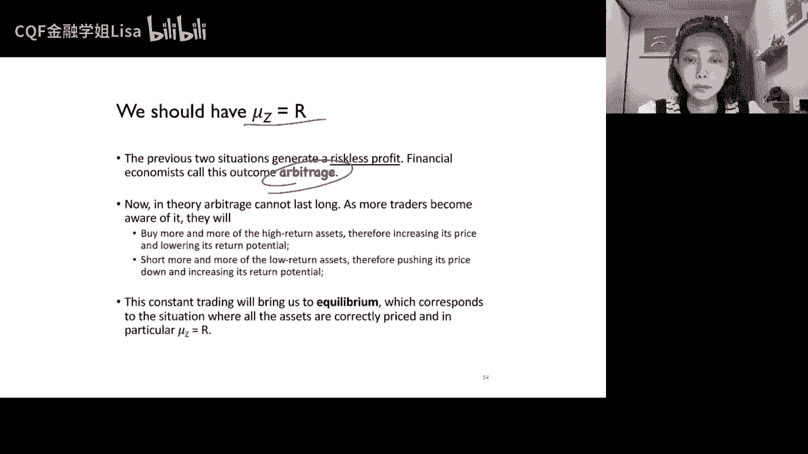

MPT为我们提供了一种将投资选择系统化、数量化的强大工具。然而，它的诸多严格假设（如静态、正态分布、无摩擦市场等）也在实际应用中面临挑战，这也催生了后续许多改进模型。在下一节课中，我们将深入MPT的数学核心，学习如何通过最优化方法，具体计算出有效前沿上这些最优组合的权重。