# 【2024最新系统课程】用Python开发金融量化与股票分析交易平台，实战项目70集，学完做项目！ - P36：36 matplotlib 画布与子图 🎨

在本节课中，我们将要学习如何使用 `matplotlib` 创建和管理多个图形。在前面的内容中，我们展示了如何在单个图形中绘制多个线条。而今天，我们将介绍如何在同一个窗口中显示多个图形，这对于多图展示和数据对比非常有用。

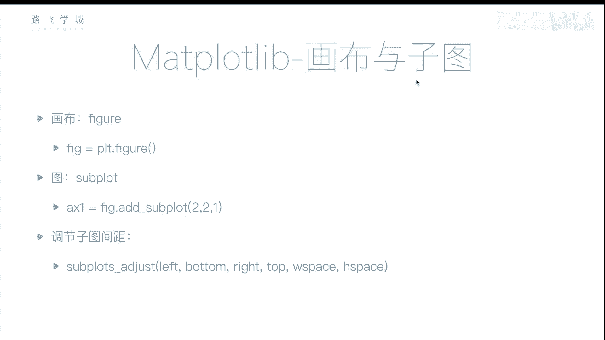

## 画布和子图概述

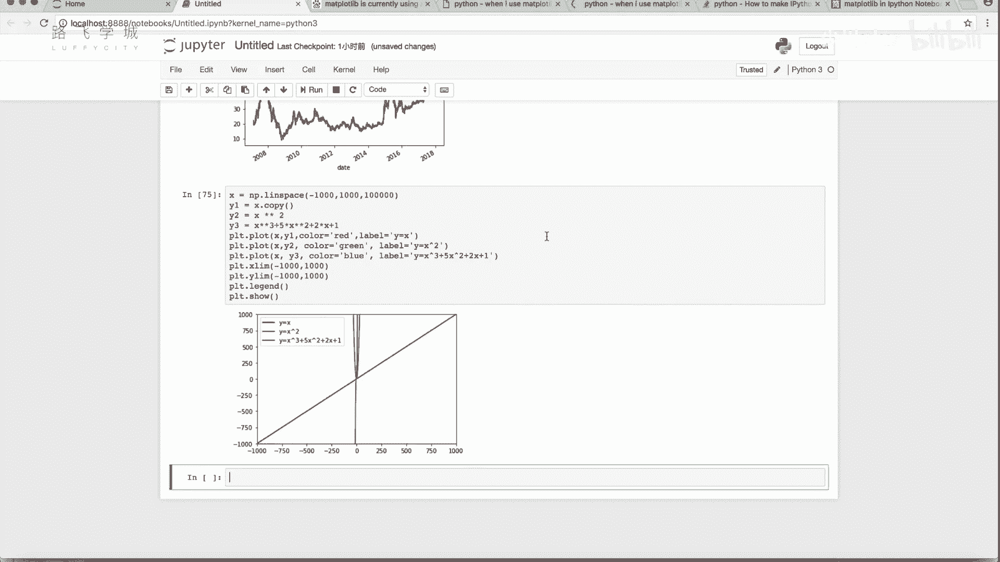

通常情况下，我们在一个窗口中只能显示一个图形。然而，在一些应用中，我们可能需要在同一个窗口中显示多个图形。为了实现这一点，我们需要理解 **画布** 和 **子图** 的概念。画布是整个图形显示区域，而子图则是画布中的一个区域，允许我们在其中绘制不同的图形。

### 画布与子图的创建

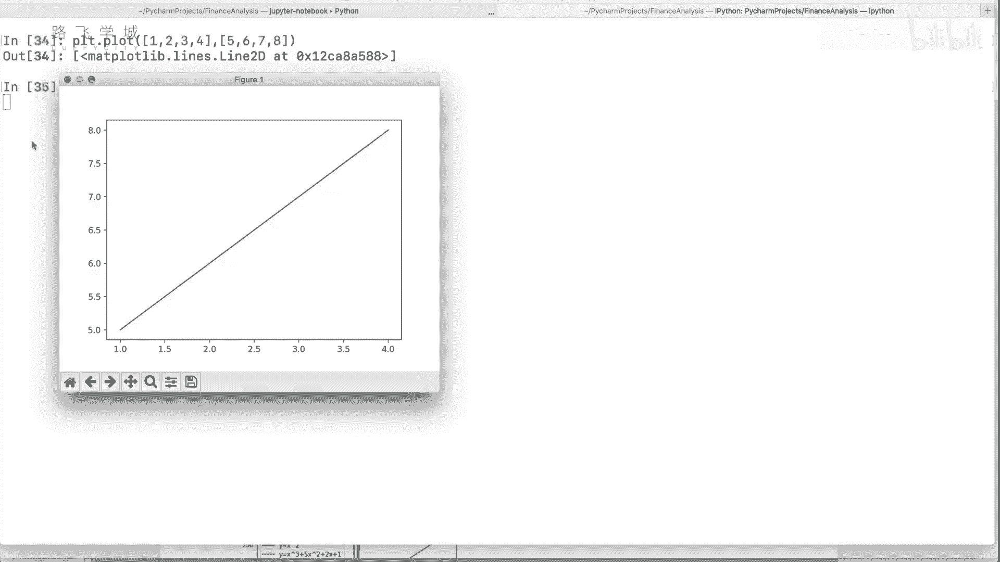

在 `matplotlib` 中，我们首先创建一个画布（figure），然后在这个画布上添加子图（subplot）。以下是画布和子图的基本用法：

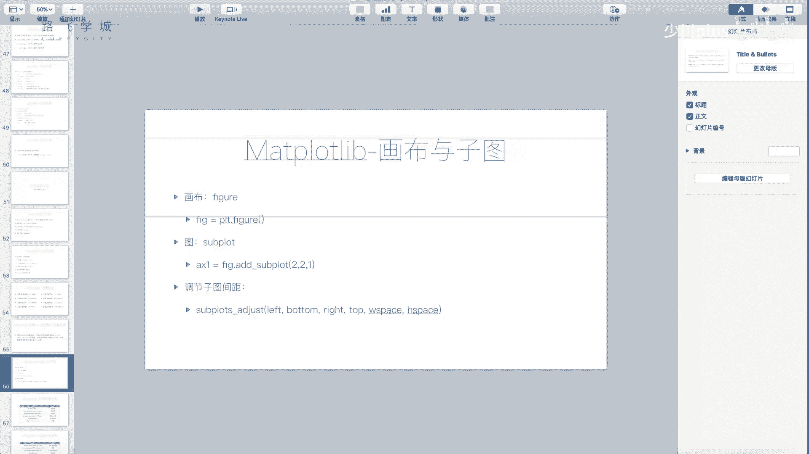

1. 创建一个画布：
   ```python
   import matplotlib.pyplot as plt
   fig = plt.figure()
   ```

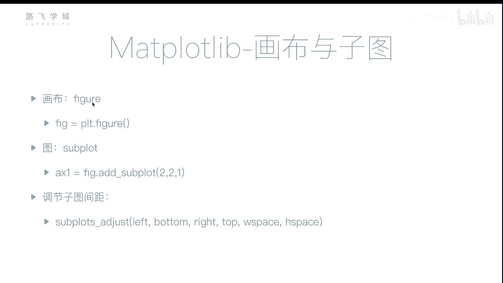

2. 向画布添加子图：
   使用 `add_subplot()` 方法可以在画布上创建子图。子图的参数由三部分组成：总行数、总列数和当前子图的位置。
   ```python
   ax1 = fig.add_subplot(221)  # 两行两列中的第一个子图
   ```

3. 在子图上绘制图形：
   一旦子图被创建，我们可以在子图对象上调用 `plot()` 方法来绘制图形。
   ```python
   ax1.plot([1, 2, 3], [4, 5, 6])
   ```

通过上面的步骤，我们就可以在一个窗口内创建多个子图，并在每个子图中绘制不同的内容。

### 子图排列和定位

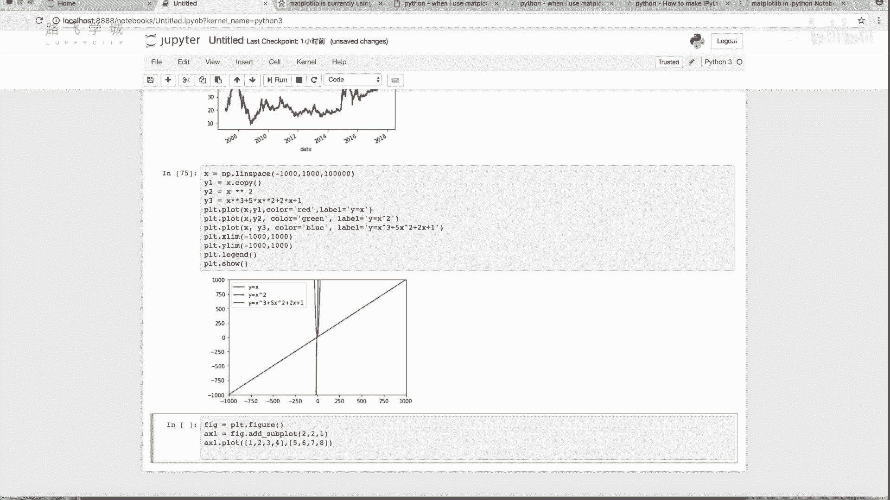

`add_subplot()` 中的数字参数决定了子图的排列位置。例如，`221` 表示画布被划分为 2 行 2 列，当前子图在第一个位置；`222` 表示当前子图在第二个位置。你可以使用不同的数字来调整子图的排列方式。

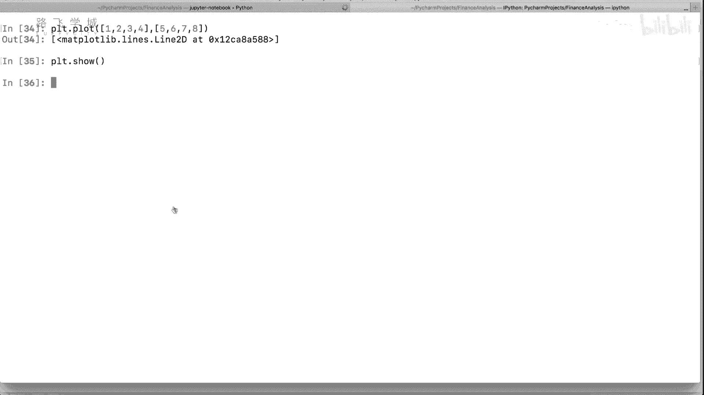

例如：

```python
ax2 = fig.add_subplot(222)  # 两行两列中的第二个子图
ax3 = fig.add_subplot(223)  # 两行两列中的第三个子图
ax4 = fig.add_subplot(224)  # 两行两列中的第四个子图
```

这样，画布就会分为四个部分，每个部分都可以绘制不同的内容。

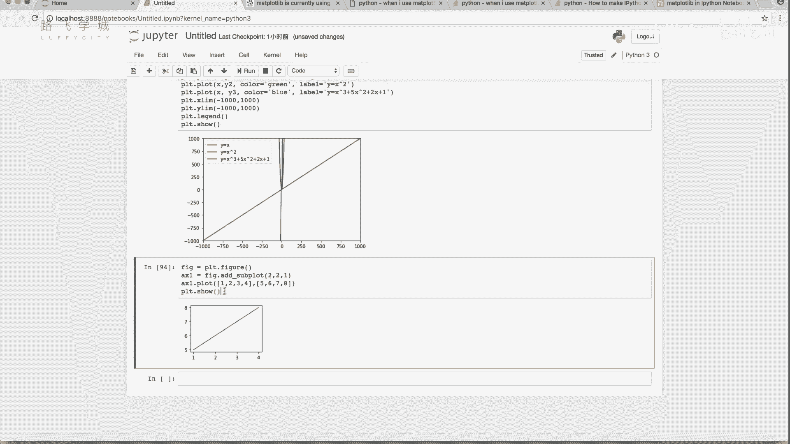

### 调整子图之间的间距

有时多个子图之间的间距过大或过小，需要进行调整。`subplots_adjust()` 方法可以帮助我们控制子图之间的间距。常用的参数有：

- `left`: 左边的空白
- `right`: 右边的空白
- `bottom`: 下边的空白
- `top`: 上边的空白
- `wspace`: 子图之间的宽度间距
- `hspace`: 子图之间的高度间距

例如：
```python
plt.subplots_adjust(wspace=0.4, hspace=0.4)
```

### 示例：绘制多个子图

下面是一个示例，展示了如何在同一个画布上绘制多个子图：

```python
import matplotlib.pyplot as plt

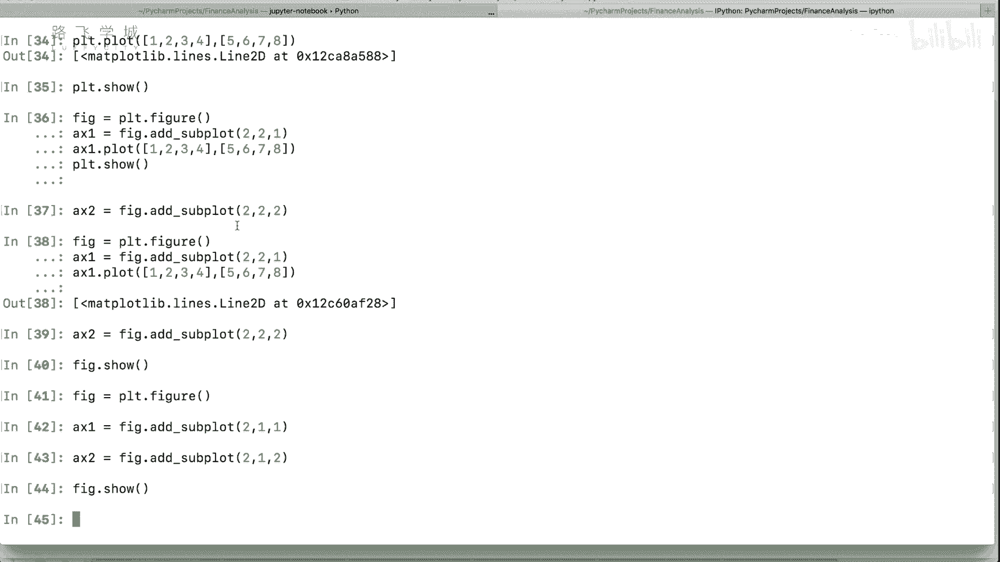

# 创建画布
fig = plt.figure()

# 添加第一个子图（第一行第一列）
ax1 = fig.add_subplot(221)
ax1.plot([1, 2, 3], [4, 5, 6])


# 添加第二个子图（第一行第二列）
ax2 = fig.add_subplot(222)
ax2.plot([1, 2, 3], [6, 5, 4])

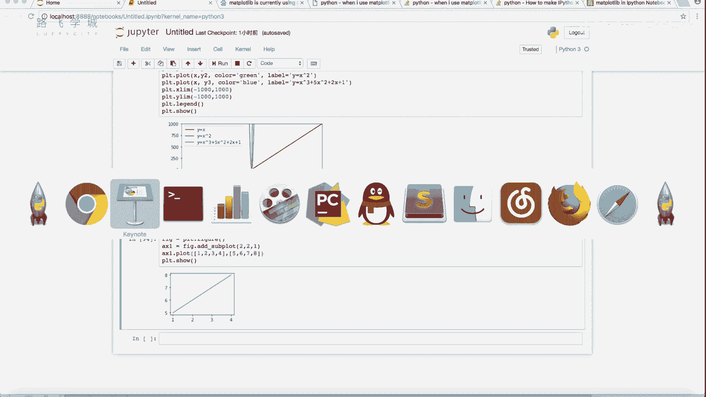

# 添加第三个子图（第二行第一列）
ax3 = fig.add_subplot(223)
ax3.plot([1, 2, 3], [4, 2, 3])

# 添加第四个子图（第二行第二列）
ax4 = fig.add_subplot(224)
ax4.plot([1, 2, 3], [5, 3, 1])

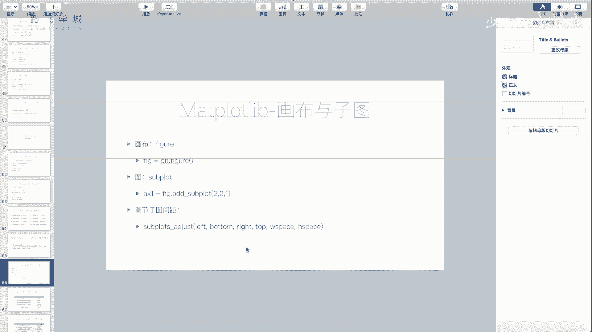

# 调整子图间距
plt.subplots_adjust(wspace=0.4, hspace=0.4)

# 显示画布
plt.show()
```

### 小结

在本节课中，我们一起学习了如何使用 `matplotlib` 创建一个包含多个子图的画布。通过掌握画布与子图的概念，我们可以在同一个窗口中显示多个不同的图形，从而进行数据的对比和展示。此外，我们还了解了如何调整子图之间的间距，以便让图形更加整齐。