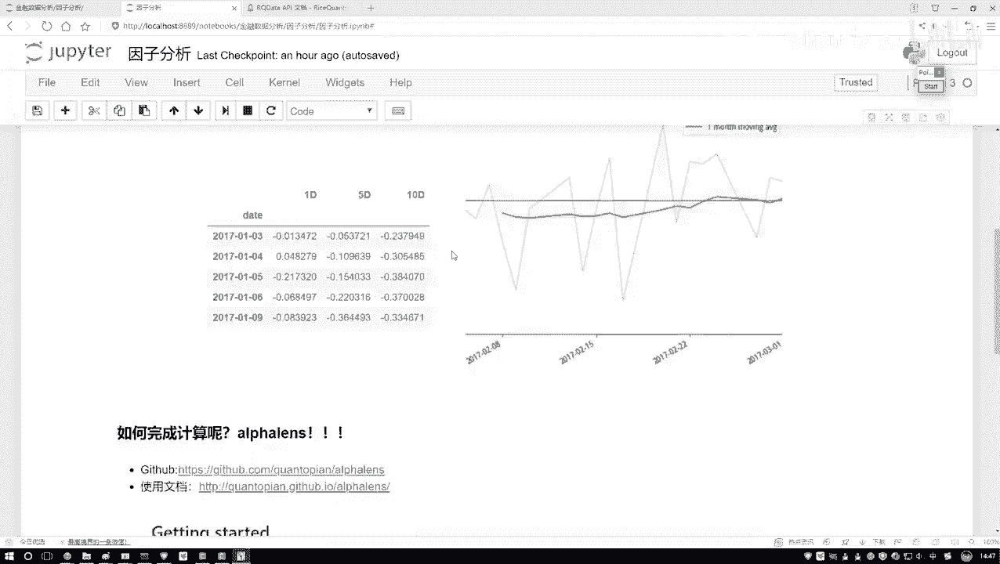
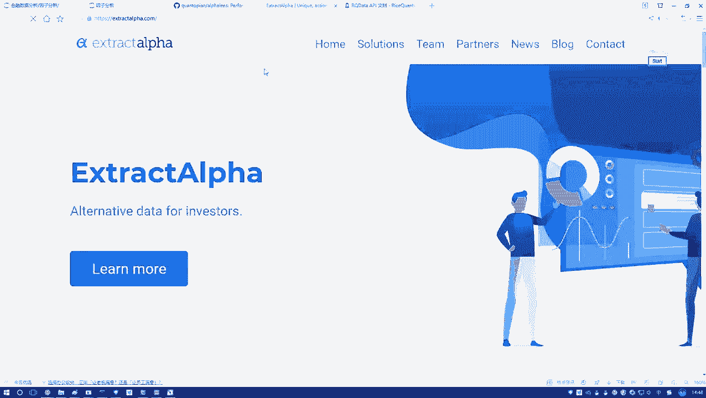
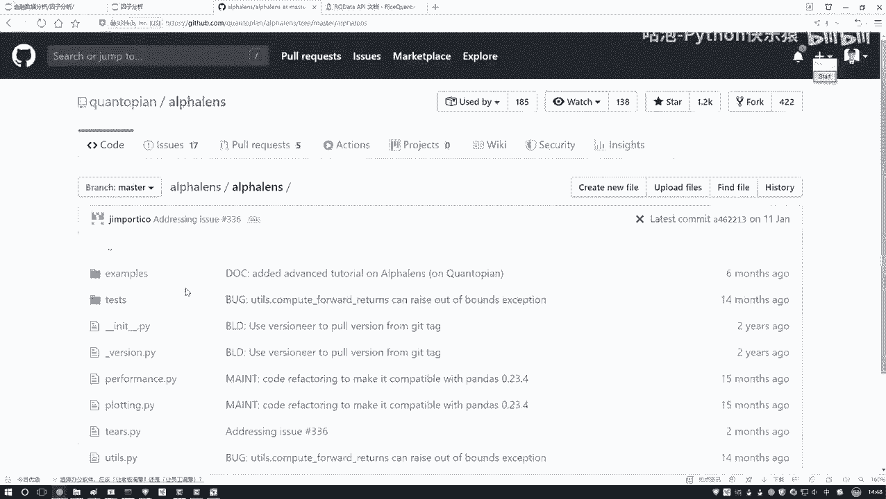
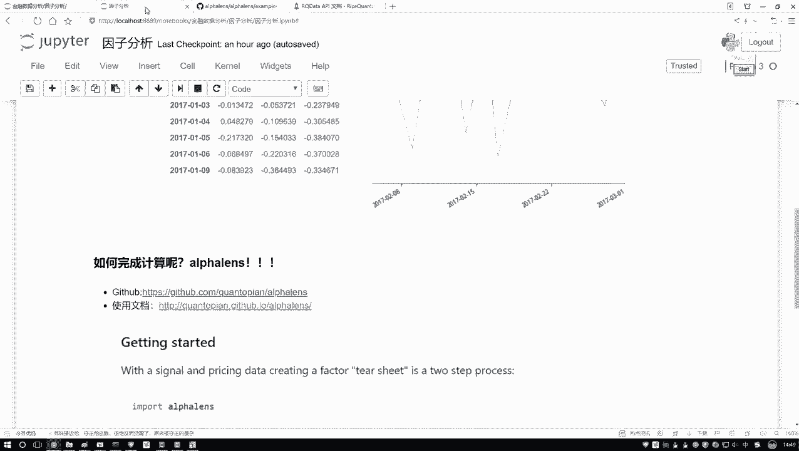

# Python金融分析与量化交易实战教程：P41：Alphalens工具包介绍 📊

在本节课中，我们将介绍如何使用Alphalens工具包来进行因子分析。Alphalens是一个功能强大的Python工具包，能够帮助我们更轻松地进行因子分析和数据可视化，简化了很多复杂的操作。接下来，我们会详细讲解如何安装并使用它，帮助大家节省开发时间。

## 1. Alphalens工具包概述




Alphalens是专门用于因子分析的Python工具包。它为我们提供了计算和绘图的现成功能，避免了手动编写复杂的代码。这个工具包可以帮助我们更好地分析因子对金融数据的影响。

以下是Alphalens工具包的主要功能：
- **因子分析**：计算因子的IC值等。
- **可视化**：帮助我们绘制因子相关的图表。

## 2. 安装Alphalens

首先，我们需要安装Alphalens。安装过程非常简单。只需执行以下命令：

```bash
pip install alphalens
```




在安装完成后，你可以使用Alphalens进行因子分析了。如果你不想在本地安装，可以直接使用平台上已经安装好的环境。


## 3. Alphalens的使用文档和示例



Alphalens的GitHub页面提供了丰富的使用文档和示例代码，帮助我们更好地理解和使用该工具。访问GitHub页面后，您可以看到很多有用的文档和代码示例。以下是一些建议：


- 阅读**官方文档**，了解如何使用Alphalens的各项功能。
- 查阅**示例代码**，学习如何应用这些功能。


这些示例代码将帮助你快速上手Alphalens。通过这些文档和代码，你可以了解如何计算因子分析结果，如何使用Alphalens绘制图表等。

## 4. Alphalens的核心功能

Alphalens的核心功能是帮助我们进行因子分析。以下是Alphalens中一些常用的功能：



- **因子排序**：帮助我们将数据按因子值进行排序。
- **IC值计算**：计算因子的IC值，以评估其预测能力。
- **绘制因子相关图表**：帮助我们将因子分析结果以图表的形式展示出来。

例如，如果我们想计算因子的IC值，可以使用以下代码：


```python
import alphalens as al
factor_data = al.utils.get_clean_factor(factor, prices)
ic = al.performance.factor_information_coefficient(factor_data)
```

通过这种方式，我们能够快速计算IC值，帮助我们评估因子的有效性。

## 5. 使用Alphalens进行因子分析

在本节课中，我们将演示如何使用Alphalens进行因子分析。我们首先需要在平台上创建一个新的策略，然后导入数据进行分析。


在平台上，我们选择“投资研究”选项来开始因子分析。然后，可以通过新建一个Python3文件，开始编写分析代码。你可以参考以下步骤：


1. 在平台上创建新的Python3文件。
2. 导入相关数据，并使用Alphalens进行因子分析。
3. 绘制因子图表，展示分析结果。

## 6. 总结


在本节课中，我们学习了如何使用Alphalens工具包进行因子分析。Alphalens提供了强大的功能，帮助我们进行数据分析和可视化。我们介绍了安装步骤、核心功能以及如何在平台上使用Alphalens进行因子分析。通过这些步骤，大家可以更高效地进行金融数据分析和量化交易策略开发。