# 金融量化分析：P10：IPython高级功能 🚀

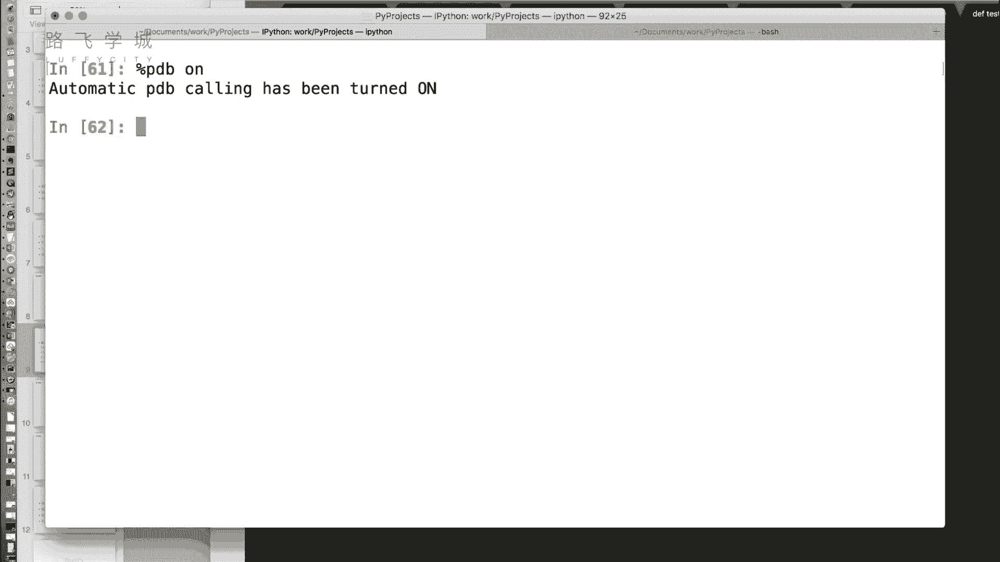

在本节课中，我们将学习IPython的几个高级功能，包括自动调试、命令历史、获取输入输出以及目录标签系统。这些工具能显著提升你在交互式环境下的数据分析与调试效率。

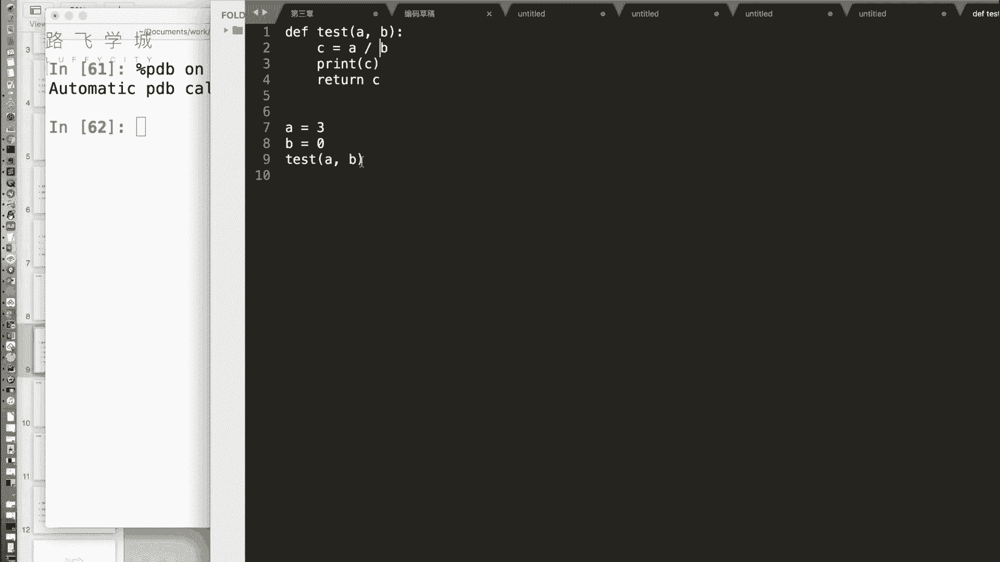

## 自动调试：%pdb命令 🔍

在编写代码时，我们经常会遇到报错。传统的调试方法是手动添加断点，过程可能比较繁琐。IPython提供了一个名为`%pdb`的魔术命令，它是一个开关，可以自动进入调试模式。

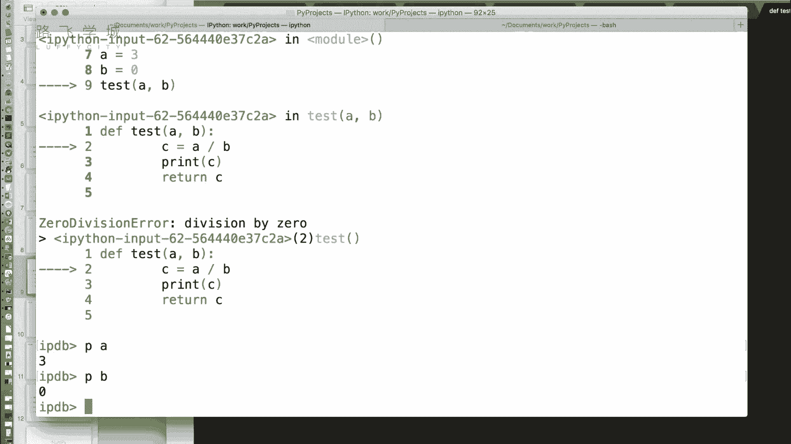

当使用`%pdb on`开启此功能后，如果运行的代码中某一行即将报错，IPython会在报错发生前自动暂停在该行，并进入交互式调试器。这样，你就可以方便地检查当时的变量状态。

以下是`%pdb`命令的使用方法：
*   `%pdb on`：开启自动调试模式。
*   `%pdb off`：关闭自动调试模式。

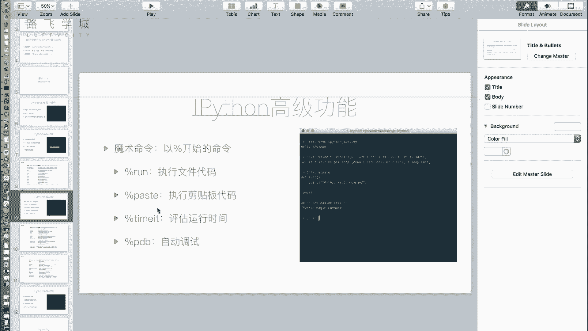

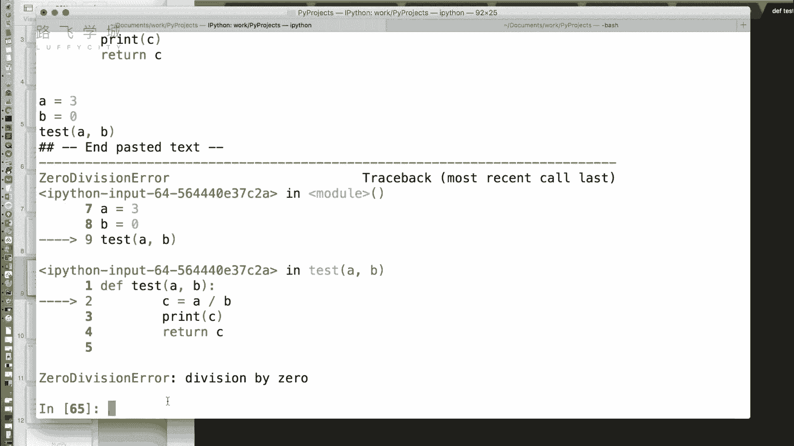

在调试器中，最常用的命令是`p`（print），用于打印变量的值。例如，`p a`可以查看变量`a`的当前值。

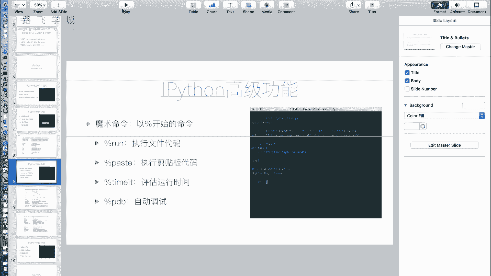

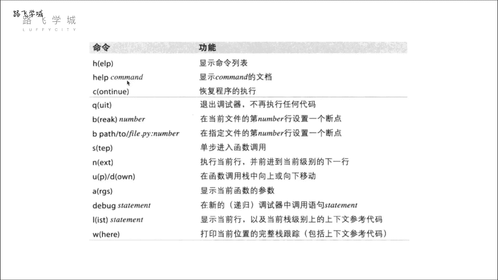

虽然IPython也提供了更完整的`%debug`命令进行手动调试，但对于快速定位简单错误（如变量值不符预期），`%pdb`命令非常高效。

## 使用命令历史 🔄

IPython支持强大的命令历史功能，类似于Linux终端。你可以使用上下箭头键浏览之前执行过的命令。

此外，它还能进行前缀搜索。例如，如果你之前输入过以`a`开头的命令，现在你输入`a`然后按上箭头，IPython会循环显示所有以`a`开头的历史命令，这能帮助你快速找到并重新执行之前的代码。

## 获取输入与输出结果 💾

在交互式环境中，有时我们运行了代码看到了输出，但忘记将结果保存到变量中。IPython提供了便捷的方式来获取这些历史结果。

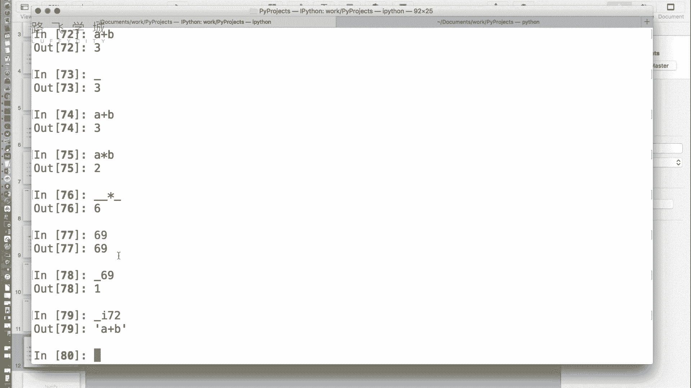

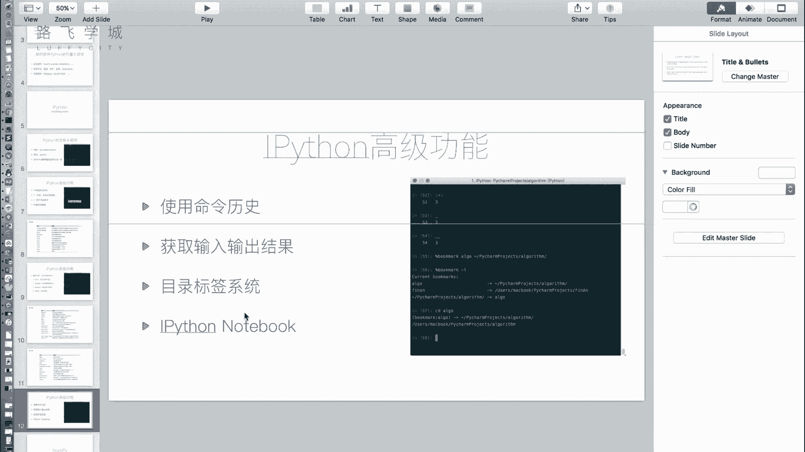

*   **获取输出**：使用下划线`_`可以获取上一行代码的输出结果。使用两个下划线`__`可以获取上上一行的输出，依此类推。
    *   例如，执行`a + b`得到结果`3`后，你可以用`_ * 2`来计算`3 * 2`。
*   **获取输入**：使用`_iX`（其中`X`是行号）可以获取指定行号的输入代码（字符串形式）。例如，`_i72`会返回第72行输入的代码字符串。

这个功能在你临时查看结果后又想使用该结果进行下一步计算时非常有用。

## 目录标签系统：%bookmark命令 📂

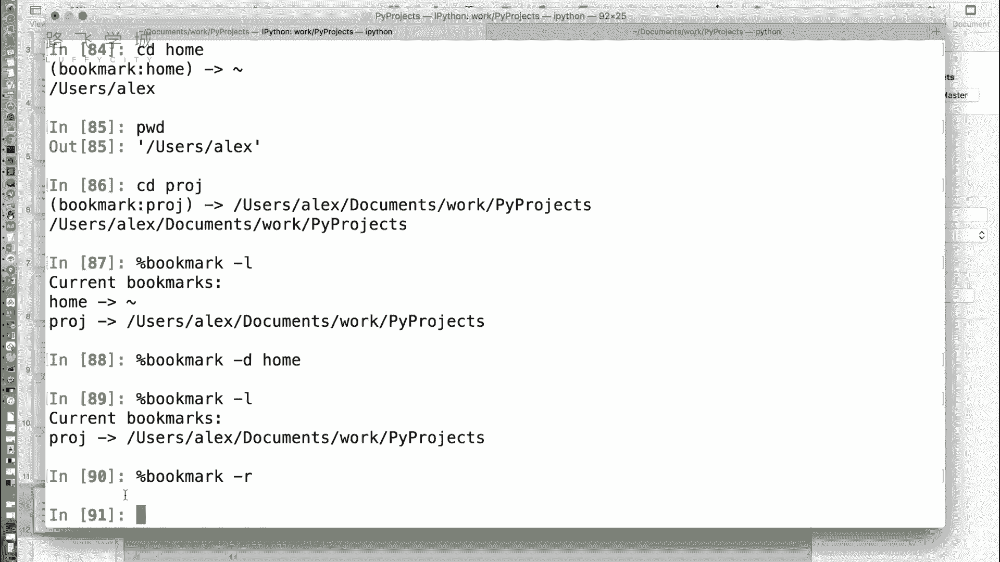

当需要在多个项目目录间频繁切换时，反复输入冗长的`cd`路径非常麻烦。IPython的`%bookmark`命令允许你为常用目录创建快捷标签（书签）。

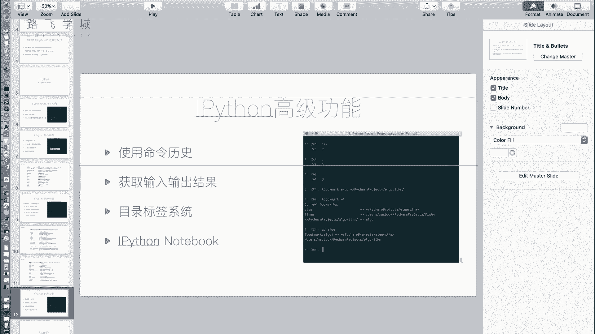

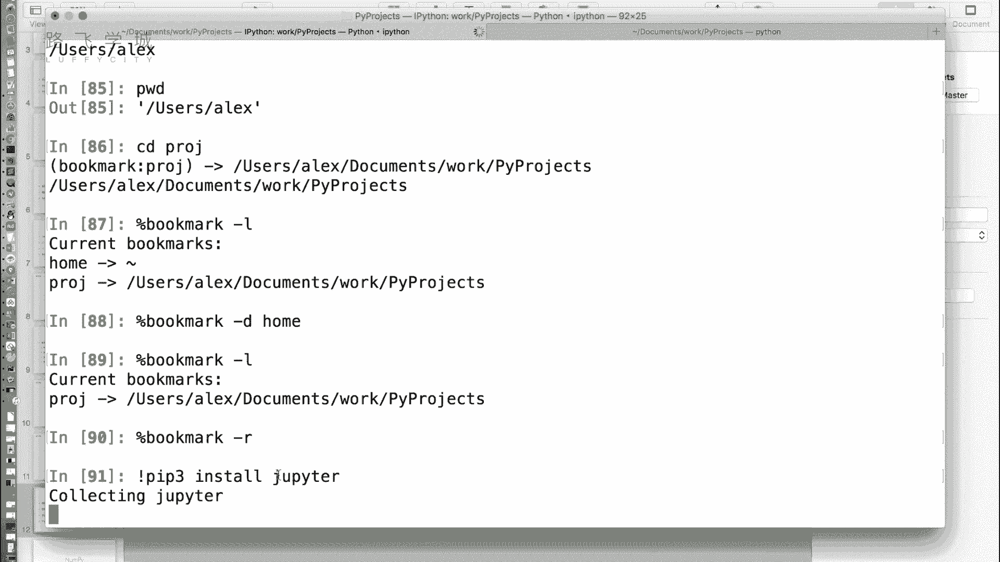

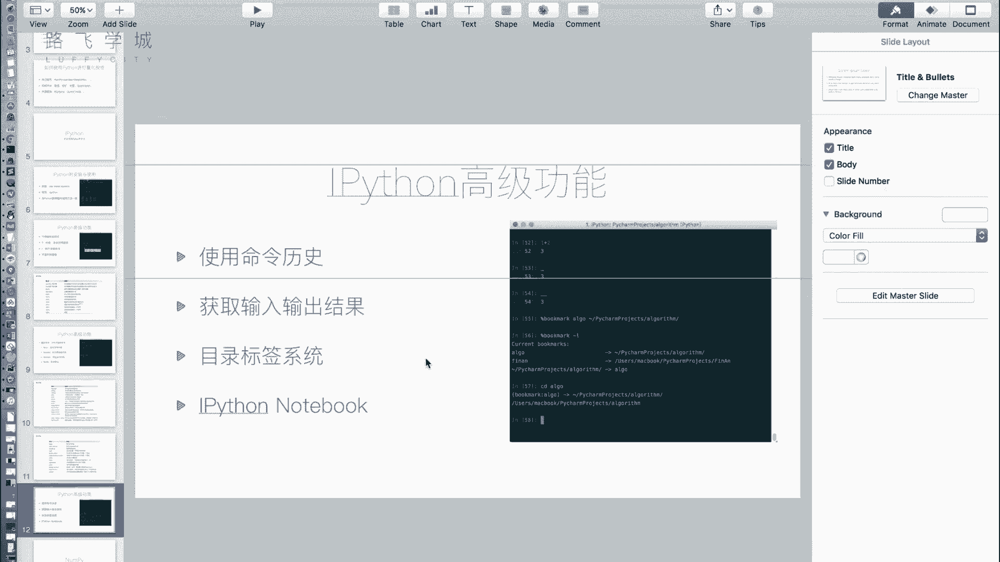

以下是`%bookmark`命令的常见用法：
*   `%bookmark 标签名 目录路径`：创建一个书签。
*   `%bookmark -l`：列出所有已保存的书签。
*   `cd 标签名`：快速切换到该书签指向的目录。
*   `%bookmark -d 标签名`：删除指定的书签。
*   `%bookmark -r`：删除所有书签。

例如，执行`%bookmark proj /home/user/my_project`后，你就可以在任何位置通过`cd proj`直接跳转到该项目目录。

## Jupyter Notebook 🌐

最后，我们介绍一个由IPython衍生出的强大工具——Jupyter Notebook。它是一个基于Web的交互式计算环境，特别适合进行数据清洗、统计建模、可视化和机器学习等工作。

要使用Jupyter Notebook，需要安装`jupyter`模块。安装完成后，在系统命令行输入`jupyter notebook`即可启动服务，并在浏览器中打开一个文件管理界面。

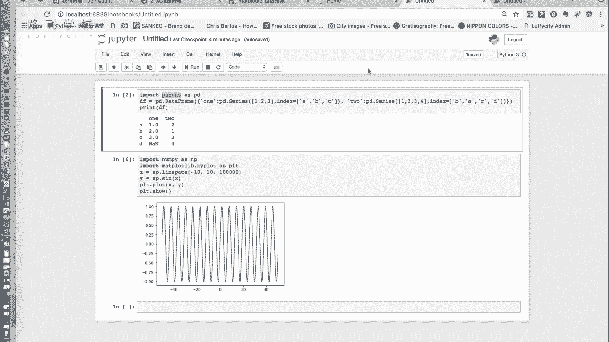

在Notebook中，你可以创建“单元格”来编写和运行代码（支持IPython的所有魔术命令），也可以使用Markdown单元格编写富文本说明。代码的运行结果（包括表格、图表）会直接显示在单元格下方。Notebook文件可以保存为`.ipynb`格式，也可以导出为Python脚本、HTML、PDF等多种格式，非常适合制作可重复的分析报告或教学文档。

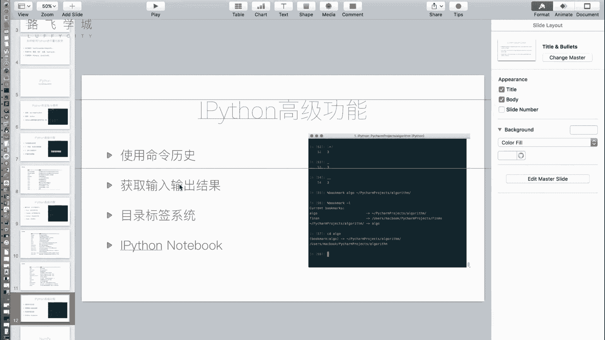

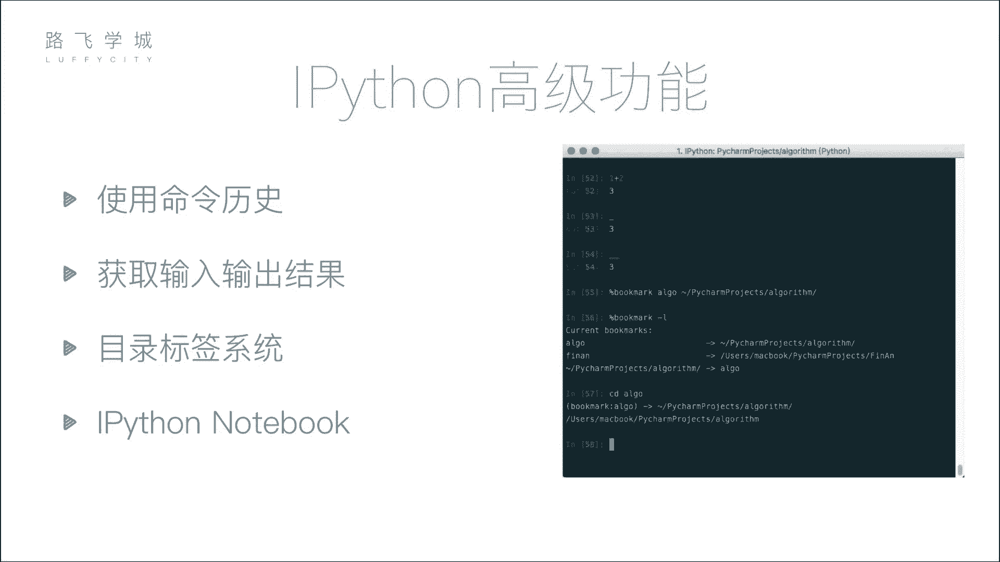

本节课中我们一起学习了IPython的多个高级功能。`%pdb`能帮助自动捕捉错误；命令历史和`_`变量让你能轻松回溯；`%bookmark`简化了目录导航；而Jupyter Notebook则提供了一个集代码、文档和输出于一体的强大工作环境。掌握这些工具，能让你的金融量化分析工作流更加高效和流畅。