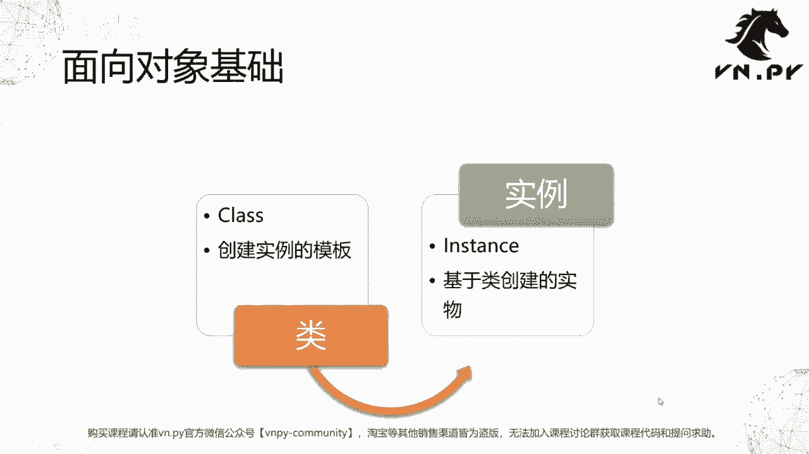
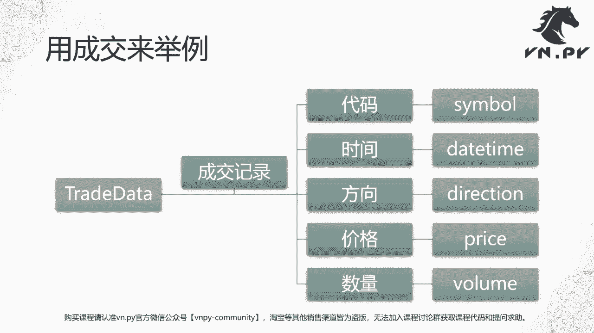
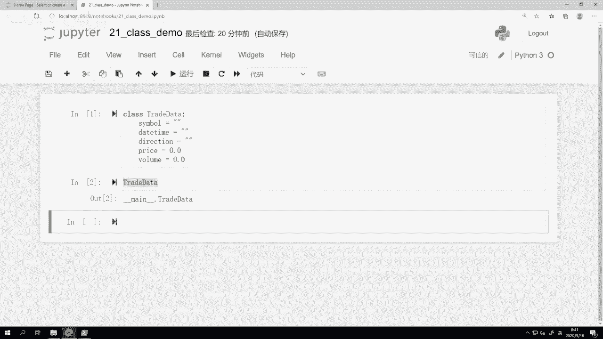
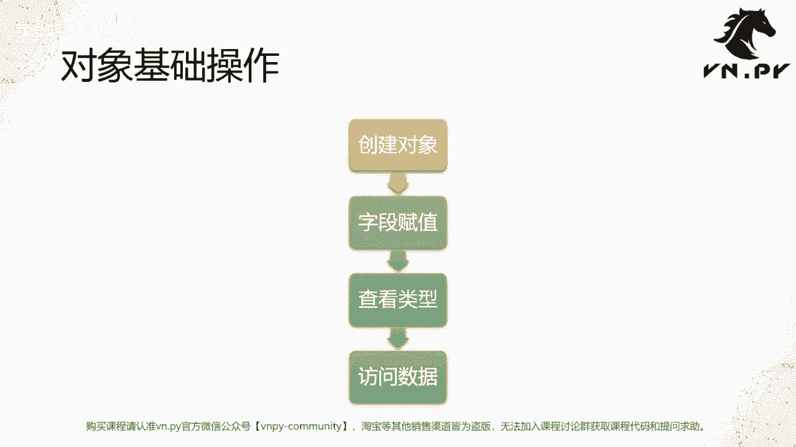
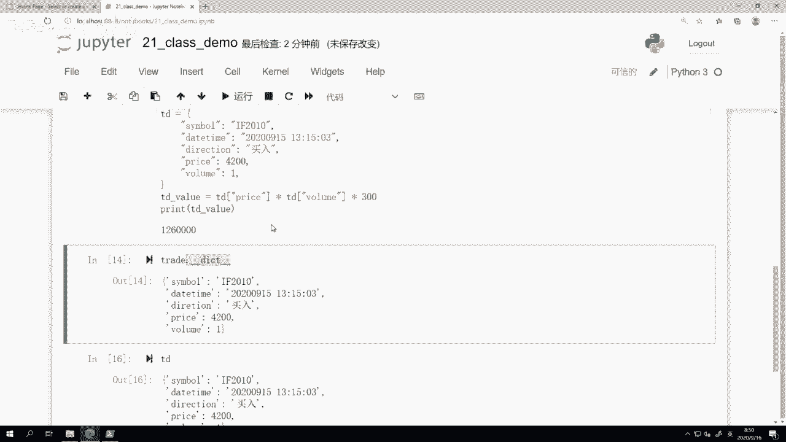

# Python量化开发：21：开发一个类 🧱

## 概述
在本节课中，我们将要学习面向对象编程的第一步：如何开发一个类。我们将通过创建一个金融交易中的“成交记录”类，来理解类与对象的基本概念和操作方法。

---

## 面向对象编程简介
上一节我们深入探讨了函数。从本节开始，我们将进入一个更大的主题：面向对象编程。

面向对象编程（Object Oriented Programming）的核心哲学，是将编程中涉及的各种函数和数据，以一种对人类来说容易理解的方式整合起来。这种设计让我们在写代码时，不必过多思考底层数据结构，从而将思维解放到更高维度的设计上，以提高生产力。

## 核心概念：类与对象
要理解面向对象，首先需要接触两个核心概念：类和对象。

### 什么是类（Class）？
类（Class）是创建实例的模板。你可以把它想象成制造汽车时使用的**图纸**。图纸描述了汽车的组成部分（如底盘、轮胎、发动机）和制造方法，但图纸本身并不是一辆可以驾驶的汽车。

在Python中，`class`是一个关键字，用于定义一个类。



### 什么是对象/实例（Object/Instance）？
对象（Object），也称为实例（Instance），是基于类创建出来的**实物**。沿用造车的比喻，对象就是根据图纸制造出来的、可以实际驾驶的**一辆辆汽车**。

---

## 实战：创建一个“成交记录”类
理论有些抽象，现在我们来看一个具体的编程例子。我们将创建一个名为 `TradeData` 的类，用于表示金融交易中的一笔成交记录。



一笔成交记录通常包含以下基本信息：
*   **代码（Symbol）**：买卖的是哪个合约或资产。
*   **时间（Datetime）**：成交发生的具体时间点。
*   **方向（Direction）**：买入或卖出。
*   **价格（Price）**：成交价格。
*   **数量（Volume）**：成交数量。

以下是创建这个类的代码：

```python
class TradeData:
    symbol = ""
    datetime = ""
    direction = ""
    price = 0.0
    volume = 0.0
```

代码解析：
*   `class` 是定义类的关键字。
*   `TradeData` 是我们为这个类起的名字。
*   冒号 `:` 之后是类的主体。
*   在类主体内，我们定义了五个字段（或称为属性），并赋予了初始值。这就像在图纸上标明了汽车需要有哪些部件。

执行这段代码后，`TradeData` 这个类就已经存在于Python系统中了。

---



## 对象的四大基础操作
有了图纸（类），接下来我们就可以用它来造车（创建对象）了。以下是针对对象的四个基础操作。



### 1. 创建对象
创建对象就像调用一个无参数的函数。

```python
trade = TradeData()
```
这行代码创建了一个 `TradeData` 类的实例，并将其赋值给变量 `trade`。

### 2. 字段赋值
创建对象后，我们可以为其各个字段赋予具体的值。

```python
trade.symbol = "F2010"
trade.datetime = "2020-09-15 13:15:03"
trade.direction = "买入"
trade.price = 4200.0
trade.volume = 1.0
```
操作解析：使用 `对象名.字段名 = 值` 的语法进行赋值。这就像为造好的汽车安装具体的部件（如特定型号的发动机）。

### 3. 查看类型
我们可以使用 `type()` 函数来查看一个对象是由哪个类创建的。

```python
print(type(trade))
# 输出：<class '__main__.TradeData'>
```
这确认了 `trade` 是 `TradeData` 类的一个实例。

### 4. 访问数据
我们可以方便地访问对象中存储的数据。

```python
print(trade.symbol)  # 输出：F2010
print(trade.price)   # 输出：4200.0
```
访问数据后，我们可以基于这些数据进行计算。例如，计算这笔成交的价值（假设合约乘数为300）：
```python
trade_value = trade.price * trade.volume * 300
print(trade_value)  # 输出：1260000.0
```

---

## 类与字典的初步比较
你可能会发现，用类来存储数据，感觉上和之前学过的字典（`dict`）有些相似。

确实，我们可以用一个字典来实现类似的功能：
```python
td = {
    "symbol": "F2010",
    "datetime": "2020-09-15 13:15:03",
    "direction": "买入",
    "price": 4200.0,
    "volume": 1.0
}
td_value = td["price"] * td["volume"] * 300
```

那么，为什么还需要类的概念呢？一个关键原因是，类不仅能存储数据，还能将**数据**和围绕这些数据的**计算函数（方法）** 优雅地捆绑在一起，让代码结构更清晰、更易于理解和维护。这个强大的特性，我们将在后续课程中详细展开。

另外，在Python内部，对象的数据存储很大程度上就是基于字典实现的。我们可以验证一下：
```python
print(trade.__dict__)  # 查看对象背后的字典
# 输出：{'symbol': 'F2010', 'datetime': '2020-09-15 13:15:03', ...}
```
你会发现，`trade.__dict__` 的内容与我们手动创建的 `td` 字典在结构上非常相似。

---

## 总结
本节课中，我们一起学习了面向对象编程的起点：开发一个类。




我们首先介绍了**类（Class）** 作为创建实例的模板，以及**对象/实例（Object/Instance）** 作为类的具体实现这一核心概念。然后，我们通过创建一个 `TradeData` 类来记录金融成交记录，实践了**创建对象、字段赋值、查看类型和访问数据**这四大基础操作。最后，我们初步比较了类与字典的异同，并指出了类在捆绑数据与行为方面的优势，为后续深入学习面向对象特性打下了基础。