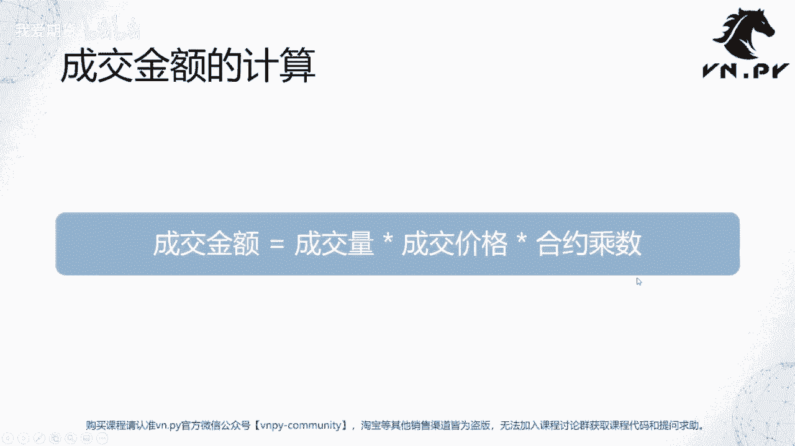
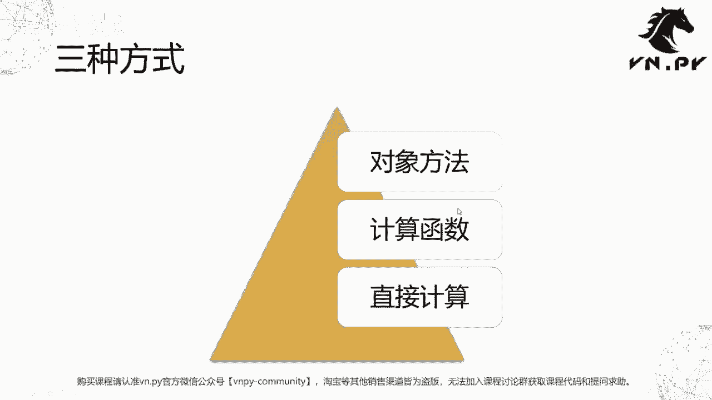
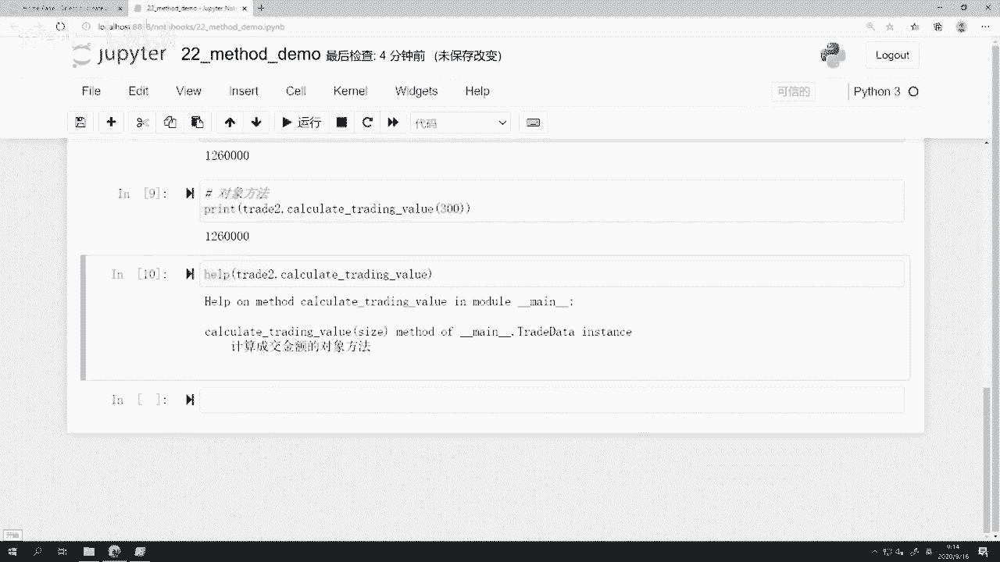
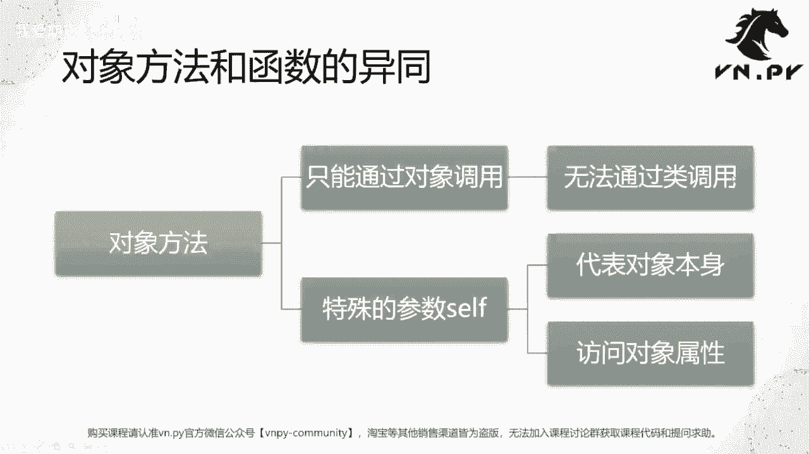
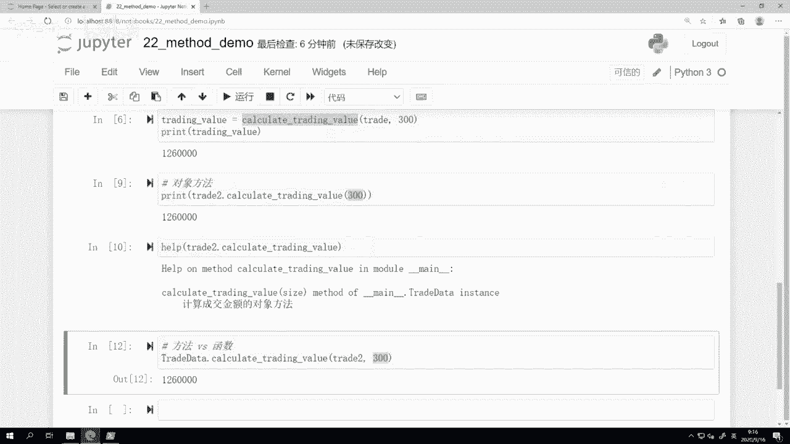
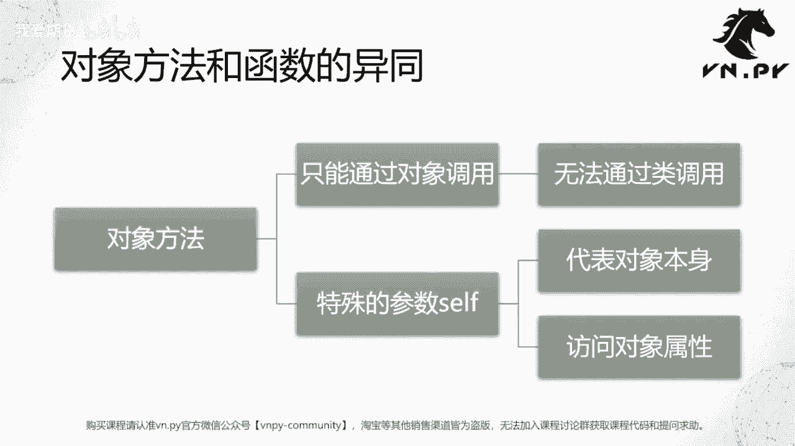
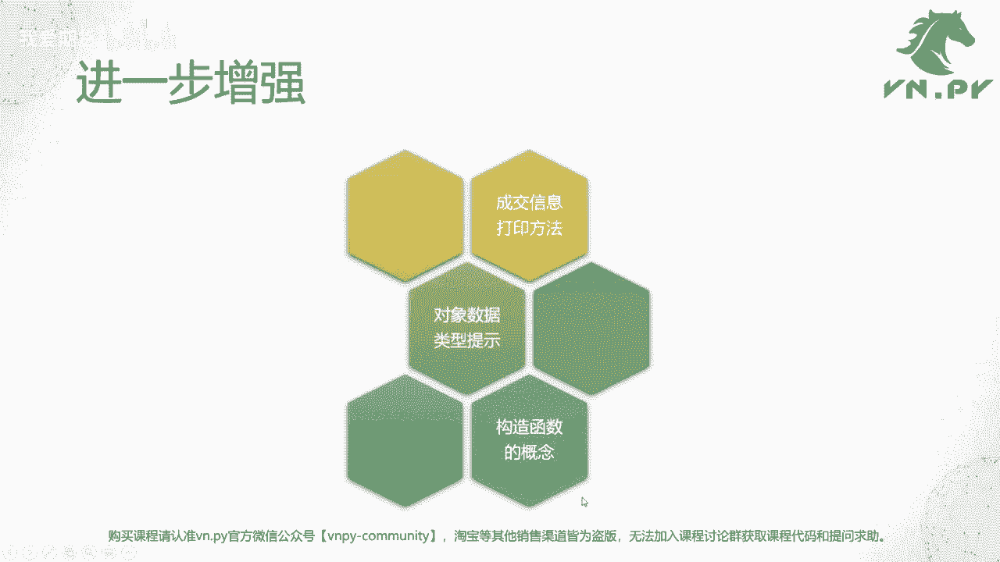
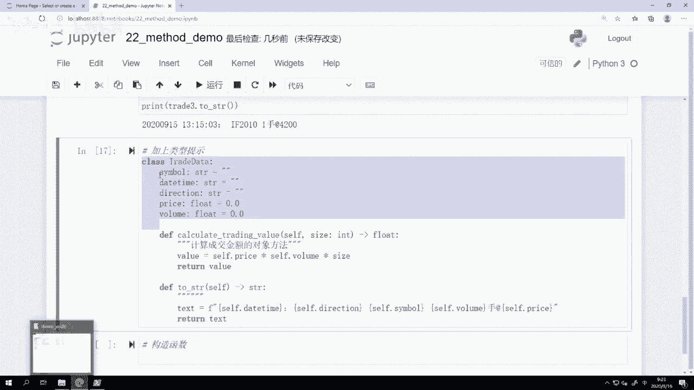
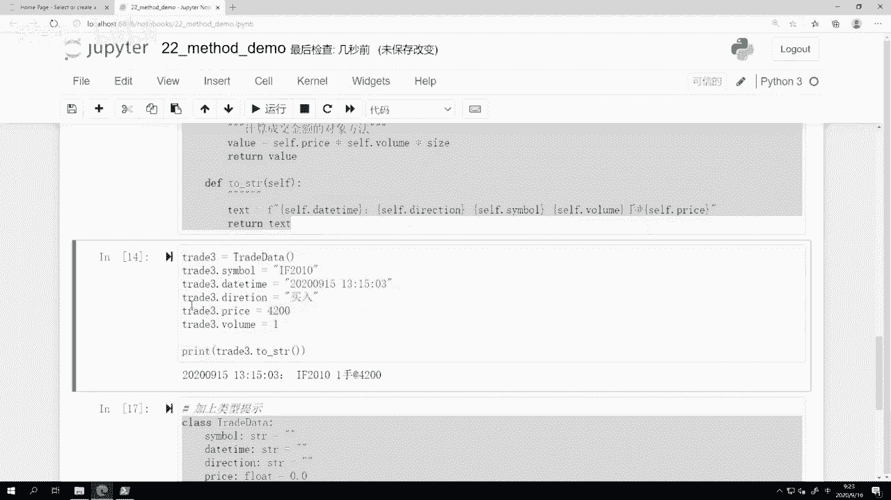
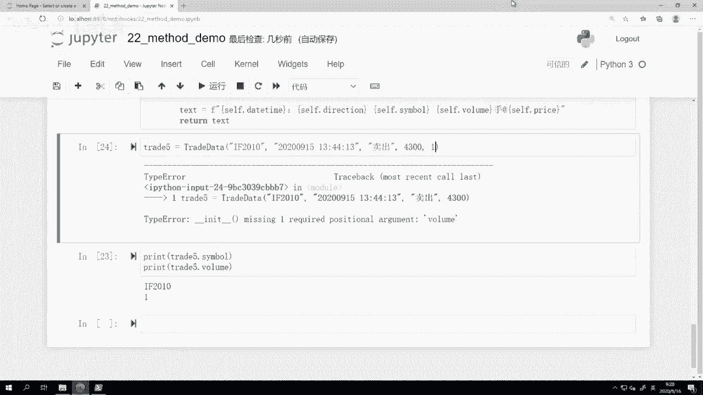

# 量化交易零基础入门：22：对象的方法 🧮

在本节课中，我们将要学习面向对象编程中的一个核心概念：对象的方法。我们将探讨如何将功能封装到对象内部，使代码更加结构化、易于重用和维护。



上一节课我们介绍了对象的基本概念，并学习了如何使用对象来存储数据。本节中我们来看看如何为对象添加行为，即对象的方法。



## 三种计算成交金额的方法

在上一节课的示例中，我们计算了期货交易的成交金额。其计算公式为：

**成交金额 = 成交量 × 成交价格 × 合约乘数**

以下是实现此计算的三种不同方法。

### 方法一：直接计算

这是最基础的方法，直接在需要的地方编写计算公式。

```python
trading_value = trade.price * trade.volume * 300
print(trading_value)
```

这种方法简单直接，但计算逻辑分散在代码各处，难以复用。

### 方法二：定义外部函数

为了复用计算逻辑，我们可以定义一个独立的函数。

以下是定义一个计算成交金额的函数：

```python
def calculate_trading_value(trade_obj, size):
    """计算成交金额的函数"""
    trading_value = trade_obj.price * trade_obj.volume * size
    return trading_value

# 调用函数
value = calculate_trading_value(trade, 300)
print(value)
```

这种方法将逻辑封装起来，可以在程序的不同位置调用，避免了代码重复。

### 方法三：定义对象方法（推荐）

最佳实践是将相关的函数定义在对象所属的类内部，使其成为对象的方法。这样，方法与数据紧密结合，使用起来更加直观。

以下是定义在类内部的对象方法：



```python
class TradeData:
    # ... 其他字段定义 ...

    def calculate_trading_value(self, size):
        """计算成交金额的对象方法"""
        value = self.price * self.volume * size
        return value

# 创建对象并调用方法
trade2 = TradeData()
# ... 为对象字段赋值 ...
result = trade2.calculate_trading_value(300)
print(result)
```



对象方法通过第一个参数 `self` 来访问对象自身的属性和其他方法。调用时，`self` 参数由Python自动传入，我们只需提供 `size` 参数即可。

## 对象方法与普通函数的区别

对象方法与普通函数非常相似，但有一个关键区别：**对象方法必须通过对象来调用**，并且其第一个参数是 `self`，代表调用该方法的对象本身。

尝试通过类直接调用方法会出错，因为它缺少 `self` 参数：

```python
# 错误示例：通过类直接调用
TradeData.calculate_trading_value(300)  # 报错：缺少参数 `self`
```



这种设计是一种“语法糖”，它让我们能用更简洁的方式（`obj.method()`）来表达逻辑，同时将功能与数据紧密绑定。

## 增强对象的功能



将数据存储和方法结合起来，可以极大地增强面向对象编程的威力。以下是三个进一步的增强示例。

### 1. 添加信息打印方法



我们可以添加一个方法，将对象内部的数据格式化为易于阅读的字符串。

以下是添加 `to_string` 方法的示例：

```python
class TradeData:
    # ... 其他字段和方法 ...

    def to_string(self):
        """将对象信息格式化为字符串"""
        text = f"{self.time} | {self.direction} | {self.symbol} | {self.volume}手 @ {self.price}"
        return text

# 使用
trade3 = TradeData()
# ... 赋值 ...
print(trade3.to_string())
```

如果不定义此方法，直接打印对象只会得到其内存地址，对人而言没有意义。

### 2. 添加类型提示

为了提高代码的可读性和可维护性，我们可以在定义方法和字段时添加类型提示。

以下是添加类型提示的示例：

```python
class TradeData:
    symbol: str
    price: float
    volume: float

    def calculate_trading_value(self, size: int) -> float:
        value = self.price * self.volume * size
        return value

    def to_string(self) -> str:
        text = f"{self.time} | {self.direction} | {self.symbol} | {self.volume}手 @ {self.price}"
        return text
```



类型提示不会影响程序运行，但能帮助代码编辑器和检查工具（如 `mypy`）提前发现潜在的类型错误。



### 3. 使用构造函数

目前我们创建对象后需要手动为每个字段赋值，这既繁琐又容易遗漏。构造函数 `__init__` 可以解决这个问题。

`__init__` 是一个特殊的“魔法方法”，在创建对象时自动调用，用于初始化对象的属性。

以下是使用构造函数的示例：

```python
class TradeData:
    def __init__(self, symbol: str, time: str, direction: str, price: float, volume: float):
        """构造函数，在创建对象时初始化所有必要字段"""
        self.symbol = symbol
        self.time = time
        self.direction = direction
        self.price = price
        self.volume = volume

    # ... 其他方法 ...

# 创建对象时必须传入所有参数
trade5 = TradeData(symbol="IF2209", time="2022-09-15 13:50:44",
                   direction="卖出", price=4300.0, volume=1.0)
print(trade5.to_string())
```

使用构造函数的好处是：
*   **强制完整性**：创建对象时必须提供所有必要信息，避免了字段遗漏。
*   **方便快捷**：一行代码即可完成对象的创建和初始化。
*   **错误提前**：如果参数缺失，Python会立即抛出异常，便于快速定位问题。

## 总结

本节课中我们一起学习了对象的方法。我们首先比较了直接计算、外部函数和对象方法三种实现方式，认识到将功能封装到对象内部可以使代码更清晰、更易复用。我们深入探讨了对象方法与普通函数的区别，核心在于 `self` 参数和调用方式。最后，我们通过为对象添加信息打印方法、类型提示和构造函数，进一步增强了对象的实用性和健壮性。



理解并熟练运用对象的方法，是掌握面向对象编程、编写结构化量化代码的关键一步。