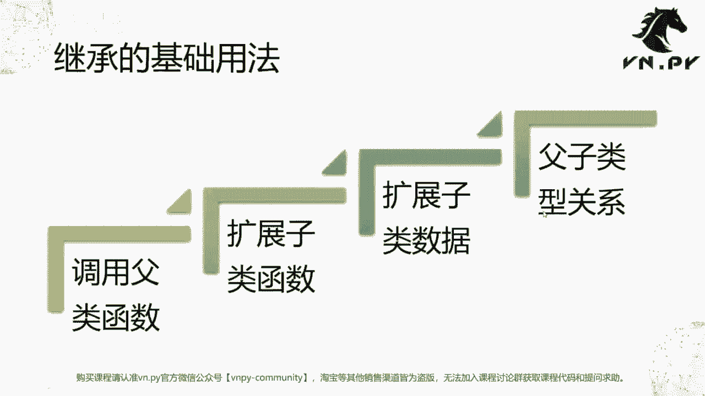
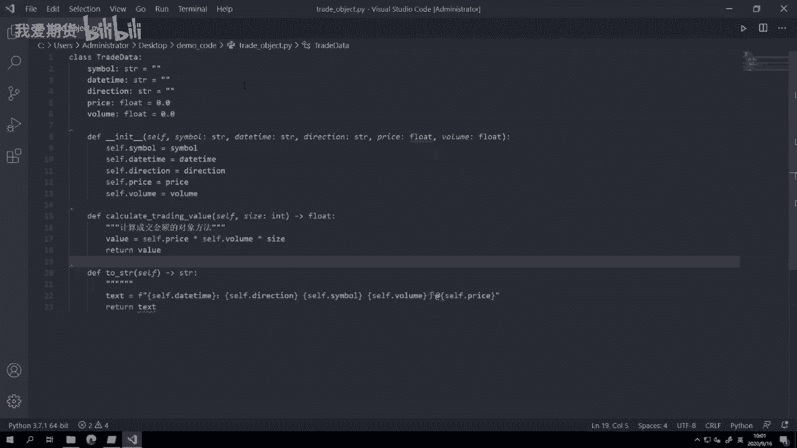
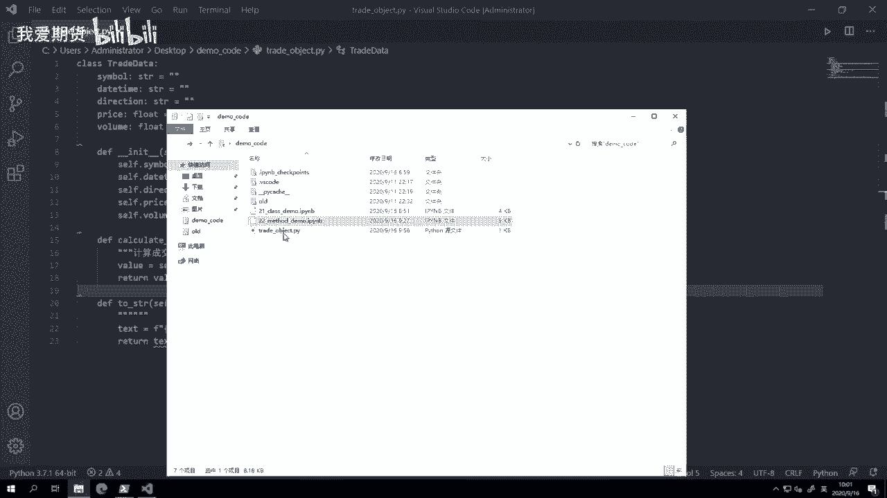
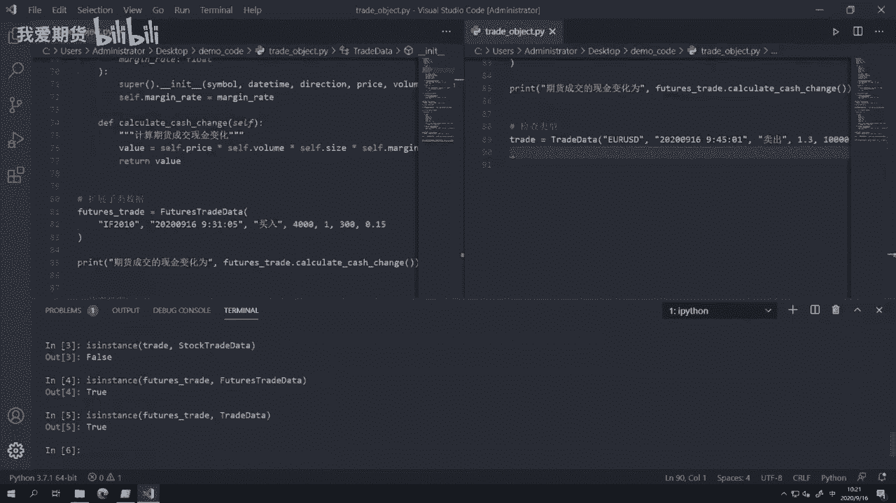
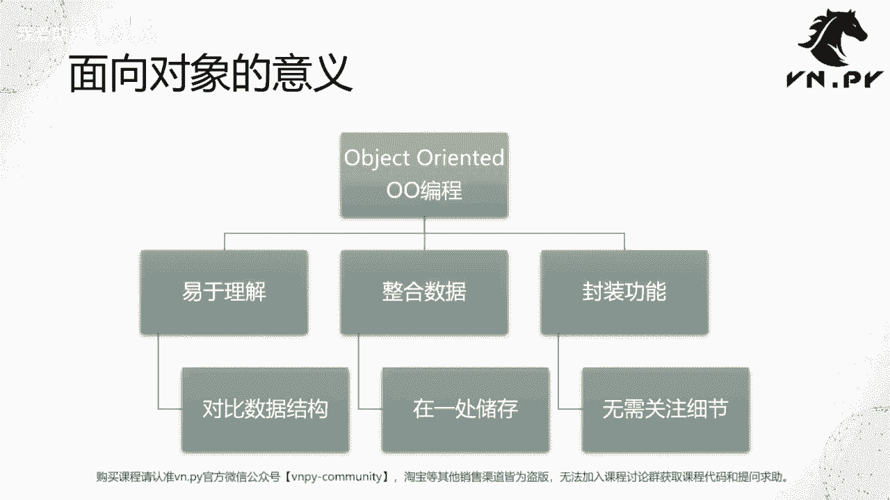

# 量化交易零基础入门：23：类的继承

在本节课中，我们将要学习面向对象编程中一个非常重要的概念——类的继承。通过继承，我们可以创建新的类来复用和扩展现有类的功能，使代码结构更清晰、更易于维护。

上一节我们介绍了类的方法，将相关逻辑封装到类中。本节中我们来看看如何通过继承来构建具有层次关系的类结构。



---

## 调用父类函数





我们首先创建一个基础的成交数据类 `TradeData`，它包含了所有类型成交的通用属性。

```python
class TradeData:
    def __init__(self, symbol, trade_time, direction, price, volume, size):
        self.symbol = symbol
        self.trade_time = trade_time
        self.direction = direction
        self.price = price
        self.volume = volume
        self.size = size

    def __str__(self):
        return (f"合约: {self.symbol}, 时间: {self.trade_time}, "
                f"方向: {self.direction}, 价格: {self.price}, "
                f"数量: {self.volume}, 乘数: {self.size}")
```

接下来，我们创建一个股票成交类 `StockTradeData`，它继承自 `TradeData`。这意味着 `StockTradeData` 自动拥有了父类的所有方法和属性。

```python
class StockTradeData(TradeData):
    def calculate_cash_change(self):
        return self.price * self.volume * self.size
```

以下是创建和使用子类对象的示例：

```python
# 创建一个股票成交对象
stock_trade = StockTradeData('600036', '2020-09-16 09:30:05', '买入', 40.0, 100, 1)

# 调用从父类继承的 __str__ 方法
print(stock_trade)
# 输出：合约: 600036, 时间: 2020-09-16 09:30:05, 方向: 买入, 价格: 40.0, 数量: 100, 乘数: 1

# 调用子类自己定义的方法
print(f"股票成交的现金变化为: {stock_trade.calculate_cash_change()}")
# 输出：股票成交的现金变化为: 4000.0
```

可以看到，子类无需重新定义 `__init__` 和 `__str__` 方法，就能直接使用它们。这就是调用父类函数的功能。

---

## 扩展子类函数

在继承的基础上，子类可以定义父类中没有的新方法，以扩展其功能。我们在 `StockTradeData` 中定义的 `calculate_cash_change` 方法就是一个例子。

父类 `TradeData` 没有这个方法，但子类 `StockTradeData` 的对象可以调用它。这体现了子类对父类功能的扩展。

---

## 扩展子类数据

有时，子类不仅需要新的方法，还需要新的数据属性。例如，期货成交除了通用属性外，还有一个特有的“保证金率”属性。

以下是创建期货成交类 `FuturesTradeData` 的方法：

```python
class FuturesTradeData(TradeData):
    def __init__(self, symbol, trade_time, direction, price, volume, size, margin_rate):
        # 调用父类的构造函数，初始化通用属性
        super().__init__(symbol, trade_time, direction, price, volume, size)
        # 扩展子类特有的数据属性
        self.margin_rate = margin_rate

    def calculate_cash_change(self):
        # 期货的现金变化需要乘以保证金率
        return self.price * self.volume * self.size * self.margin_rate
```

以下是使用示例：

```python
# 创建一个期货成交对象
future_trade = FuturesTradeData('F2010', '2020-09-16 09:31:05', '买入', 4000.0, 1, 300, 0.15)

print(future_trade)
# 输出：合约: F2010, 时间: 2020-09-16 09:31:05, 方向: 买入, 价格: 4000.0, 数量: 1, 乘数: 300

print(f"期货成交的现金变化为: {future_trade.calculate_cash_change()}")
# 输出：期货成交的现金变化为: 180000.0
```

在这个例子中，我们使用 `super().__init__(...)` 来调用父类的构造函数，确保通用属性被正确初始化。然后，我们再初始化子类特有的 `margin_rate` 属性。最后，我们重写了 `calculate_cash_change` 方法，使其符合期货的计算逻辑。

---

## 父子类型关系

理解类之间的继承关系非常重要。Python 提供了 `isinstance()` 函数来检查一个对象是否属于某个类或其父类。

以下是类型关系的判断：

```python
# 创建一个通用的 TradeData 对象
general_trade = TradeData('USD/CNY', '2020-09-16 09:45:00', '买入', 6.8, 10000, 1)

# 创建一个 FuturesTradeData 对象
future_trade = FuturesTradeData('F2010', '2020-09-16 09:31:05', '买入', 4000.0, 1, 300, 0.15)

# 使用 isinstance 检查类型关系
print(isinstance(general_trade, TradeData))        # 输出: True
print(isinstance(general_trade, FuturesTradeData)) # 输出: False
print(isinstance(general_trade, StockTradeData))   # 输出: False

print(isinstance(future_trade, FuturesTradeData))  # 输出: True
print(isinstance(future_trade, TradeData))         # 输出: True
print(isinstance(future_trade, StockTradeData))    # 输出: False
```

从结果可以看出：
*   父类对象只属于父类类型。
*   子类对象既属于子类类型，也属于父类类型。
*   不同子类之间的对象类型互不相关。

这种“是一个”的关系是继承的核心，它允许我们在编写代码时进行更灵活的抽象和处理。

---



## 面向对象编程总结

本节课中我们一起学习了类的继承，这是面向对象编程（Object-Oriented Programming, OOP）的核心概念之一。

面向对象编程的主要优势可以总结为以下三点：

1.  **易于理解**：它提供了一种对现实世界进行建模的抽象方式。通过将数据和方法组织在类中，代码结构更符合人类的思维习惯。
2.  **整合数据**：它将逻辑上相关的数据属性封装在一起，使数据管理更加自然和有序。
3.  **封装功能**：它将操作数据的方法与数据本身绑定在一起。使用者只需知道如何调用方法，而无需关心内部实现细节，这提高了代码的模块化和易用性。



通过继承，我们能够构建出层次清晰的类体系，最大化地复用代码，并优雅地处理不同实体间的共性与特性。这是构建复杂、可维护程序的重要基石。