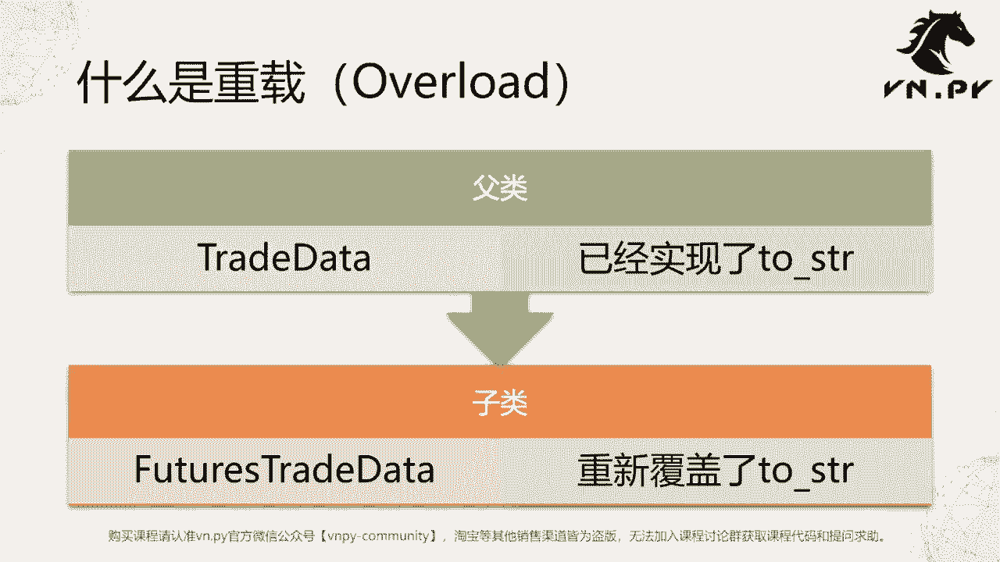
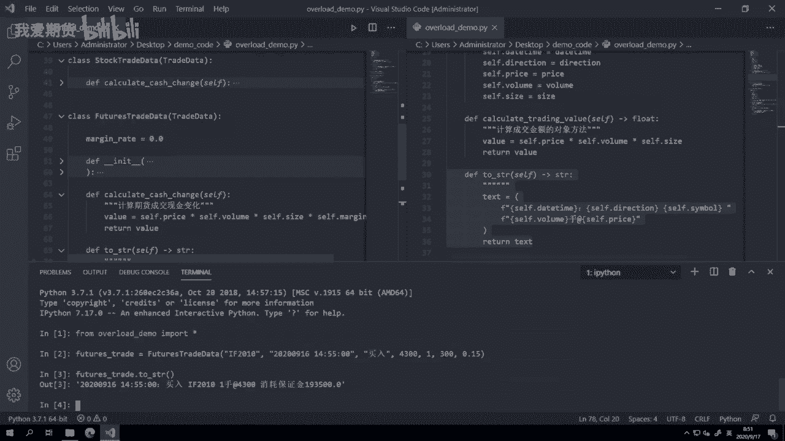
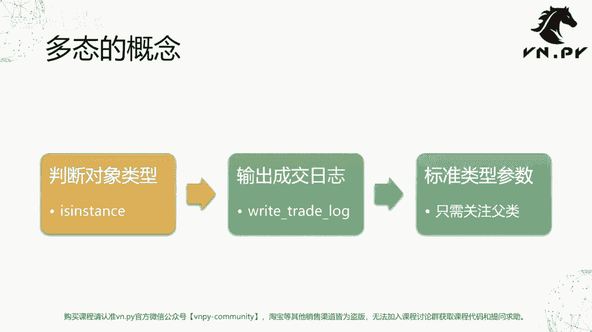
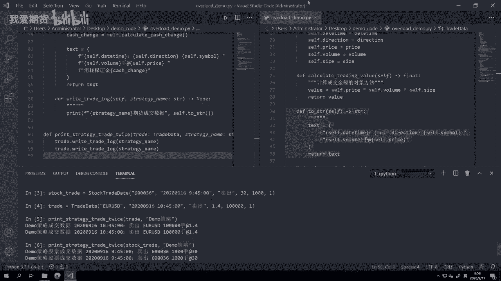
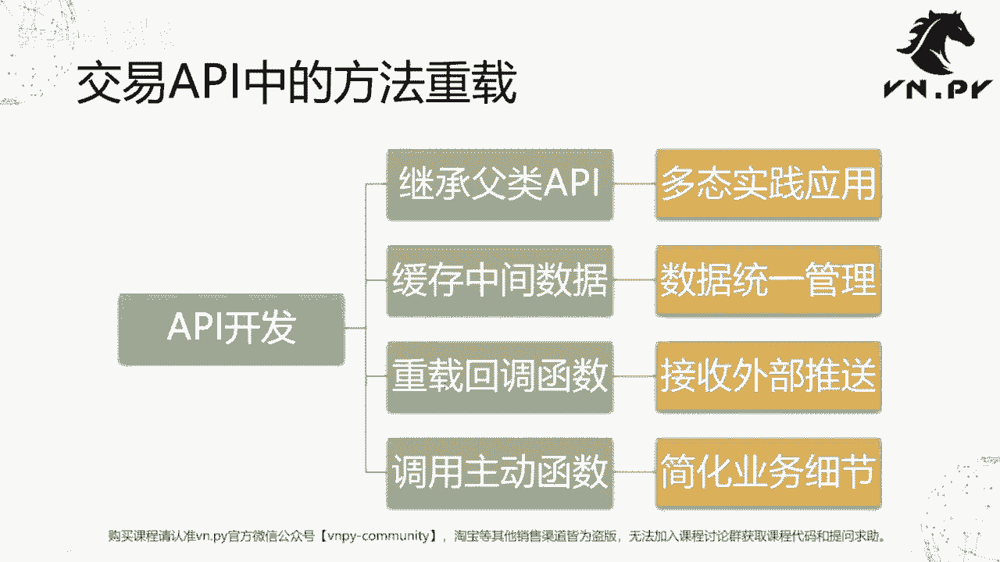

# 量化交易零基础入门：24：方法重载

在本节课中，我们将学习面向对象编程中的一个重要概念——**方法重载**。我们将了解如何通过重载子类中的方法，来修改或扩展从父类继承而来的行为，并初步接触“多态”这一核心思想。

## 什么是方法重载？



上一节我们介绍了类的继承，本节中我们来看看如何通过方法重载来实现子类中特定的方法行为。

**方法重载**的英文是 **Overload**，意为“重新加载”或“重新实现”。其核心思想是：当一个子类继承了父类后，如果子类中定义了一个与父类**同名、同参数**的方法，那么子类的方法将**覆盖**父类的方法。当通过子类对象调用该方法时，执行的是子类中重载后的逻辑。

## 代码示例：重载 `to_string` 方法

我们从一个已有的父类 `TradeData` 开始。这个类中有一个 `to_string` 方法，用于将交易数据对象转换为便于人类阅读的字符串格式。

```python
class TradeData:
    def __init__(self, symbol, trade_date, direction, price, volume):
        self.symbol = symbol
        self.trade_date = trade_date
        self.direction = direction
        self.price = price
        self.volume = volume

    def to_string(self):
        text = f"代码：{self.symbol}， 日期：{self.trade_date}， 方向：{self.direction}\n"
        text += f"数量：{self.volume}， 价格：{self.price}"
        return text
```

我们有一个继承自 `TradeData` 的子类 `FuturesTradeData`，它用于处理期货交易数据，并额外记录了保证金率。

```python
class FuturesTradeData(TradeData):
    def __init__(self, symbol, trade_date, direction, price, volume, size, margin_rate):
        super().__init__(symbol, trade_date, direction, price, volume)
        self.size = size  # 合约乘数
        self.margin_rate = margin_rate  # 保证金率

    def calculate_cash_change(self):
        # 计算期货交易占用的保证金
        cash_change = self.price * self.volume * self.size * self.margin_rate
        return cash_change
```

目前，`FuturesTradeData` 对象调用 `to_string()` 时，输出的是父类的通用格式。但对于期货交易，我们希望在字符串中额外显示“消耗的保证金”信息。这时，就需要在子类中**重载** `to_string` 方法。

以下是重载后的 `FuturesTradeData` 类：

```python
class FuturesTradeData(TradeData):
    # ... __init__ 和 calculate_cash_change 方法保持不变 ...

    def to_string(self):
        # 首先调用父类的 to_string 获取基础信息（可选，这里选择完全重写）
        # 然后添加期货特有的保证金信息
        text = f"代码：{self.symbol}， 日期：{self.trade_date}， 方向：{self.direction}\n"
        text += f"数量：{self.volume}， 价格：{self.price}\n"
        # 调用子类自身的 calculate_cash_change 方法计算保证金
        margin_used = self.calculate_cash_change()
        text += f"消耗保证金：{margin_used}"
        return text
```

**关键点**：
1.  方法名 `to_string` 和参数（本例中无参数）必须与父类保持一致。
2.  在重载的方法内部，可以调用子类特有的其他方法（如 `calculate_cash_change`）或属性。
3.  重载后，通过 `FuturesTradeData` 对象调用 `to_string()`，将执行子类中的新逻辑。

## 多态性的体现

方法重载是实现**多态性**的关键技术之一。多态意味着“多种形态”，它允许我们使用统一的接口（如方法名）来处理不同类型的对象，而具体执行哪个版本的方法，则由对象的实际类型决定。

让我们通过一个例子来理解。首先，我们在父类和子类中定义一个统一的方法 `write_trade_log`，并在子类中重载它以添加类型标识。



```python
class TradeData:
    # ... 其他代码 ...
    def write_trade_log(self, strategy_name):
        print(f"{strategy_name}的成交数据：{self.to_string()}")



class StockTradeData(TradeData):
    # ... 其他代码 ...
    def write_trade_log(self, strategy_name):
        print(f"[股票] {strategy_name}的成交数据：{self.to_string()}")

class FuturesTradeData(TradeData):
    # ... 其他代码 ...
    def write_trade_log(self, strategy_name):
        print(f"[期货] {strategy_name}的成交数据：{self.to_string()}")
```

现在，我们定义一个函数，它接收一个 `TradeData` 类型的参数（或其子类），并调用其 `write_trade_log` 方法。

```python
def print_strategy_trade_twice(trade_obj, strategy_name):
    trade_obj.write_trade_log(strategy_name)
    trade_obj.write_trade_log(strategy_name)
```

以下是使用此函数的效果：

```python
# 创建不同类型的交易对象
forex_trade = TradeData("USD/CNY", "20230916", "买入", 7.20, 1000000)
stock_trade = StockTradeData("600036", "20230916 09:30:00", "卖出", 30.0, 1000)
future_trade = FuturesTradeData("IF2010", "20230916 14:55:00", "买入", 4300.0, 1, 300, 0.15)

# 调用同一个函数，传入不同类型的对象
print_strategy_trade_twice(forex_trade, "DEMO策略")
print_strategy_trade_twice(stock_trade, "DEMO策略")
print_strategy_trade_twice(future_trade, "DEMO策略")
```



**输出结果分析**：
*   函数 `print_strategy_trade_twice` 的接口是统一的，它只关心传入的对象有 `write_trade_log` 方法。
*   具体执行时：
    *   传入 `TradeData` 对象，执行父类的 `write_trade_log`。
    *   传入 `StockTradeData` 对象，执行子类重载后的 `write_trade_log`，并打印“`[股票]`”标识。
    *   传入 `FuturesTradeData` 对象，执行子类重载后的 `write_trade_log`，并打印“`[期货]`”标识和保证金信息。

这就是多态的威力：**一段代码可以处理多种类型的对象，且行为根据对象的实际类型自动变化**。这极大地提高了代码的通用性和可扩展性。

## 方法重载的应用场景：交易API封装

方法重载和继承、多态结合，是封装复杂交易API（如CTP）的经典模式。其步骤通常如下：

1.  **继承父类API**：首先继承交易所或技术提供商给出的API父类，创建我们自己的子类。
2.  **管理内部数据**：在子类中添加额外的属性或方法来缓存和管理交易所需的数据（如合约列表、持仓信息），这类似于我们在 `FuturesTradeData` 中添加 `margin_rate`。
3.  **重载回调函数**：API中通常包含一系列**回调函数**，当服务器有数据推送（如行情更新、订单回报）时，会自动触发这些函数。我们通过重载这些回调函数，来定义接收到数据后我们自己的处理逻辑。回调函数的调用权不在我们手中，而是由外部系统（柜台）控制。
4.  **封装主动函数**：API也提供一系列**主动函数**供我们调用以执行操作（如下单、查询）。我们可以在子类中对这些复杂的主动函数进行二次封装，简化调用参数和流程，使其更符合我们的业务逻辑。

## 总结



本节课中我们一起学习了**方法重载**。我们了解到，通过在子类中定义与父类同名同参数的方法，可以覆盖父类的实现，从而为子类定制特殊行为。这是实现**多态性**的基础，它允许我们编写更通用、更灵活的代码。我们还预览了如何将这些概念应用于实际交易API的封装中，为后续更复杂的实战开发打下基础。记住核心：**统一的接口，多样的实现**。