# Python金融分析与量化交易实战：1：fbprophet股价预测任务概述 📈

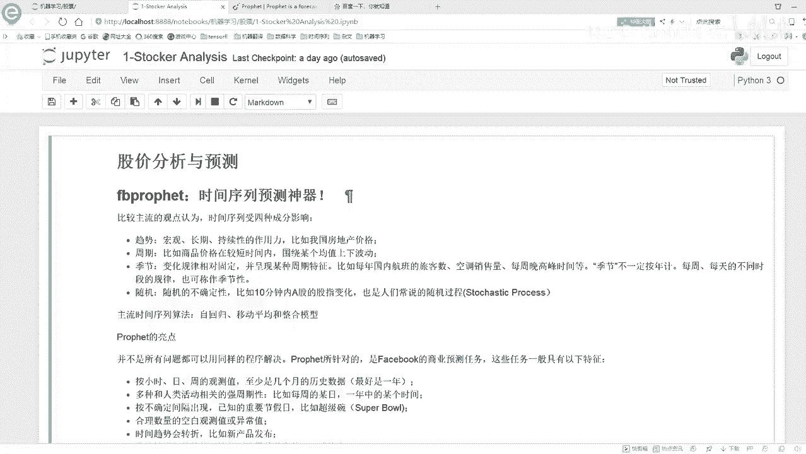

在本节课中，我们将要学习如何使用Facebook开源的Prophet框架进行股价分析与预测。这是一个时间序列预测任务，我们将从任务概述开始，介绍Prophet框架的核心概念、优势以及基本使用流程。

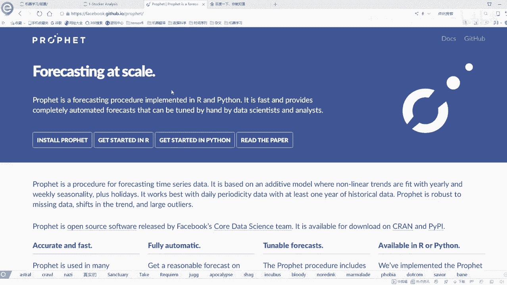

## 什么是股价分析与预测？

股价分析与预测，本质上是基于股票价格随时间变化的数据，对未来价格走势进行预测。股票价格每天都会变动，有涨有跌，并且与日期紧密相关。因此，股价预测实际上是一个**时间序列预测**任务。

上一节我们介绍了时间序列预测的概念，本节中我们来看看一个更便捷的工具。

## 为什么选择Prophet？

在时间序列预测领域，我们之前可能接触过ARIMA等模型，但这些模型使用起来可能较为复杂。本次课程将介绍一个由Facebook开源的时间序列预测神器——**Prophet**。

Prophet框架的最大亮点在于其**易用性**。它封装良好，我们只需调节少量参数，就能轻松构建出预测模型。这使其成为入门和实践的高效工具。

除了易用性，Prophet还具有以下特征：

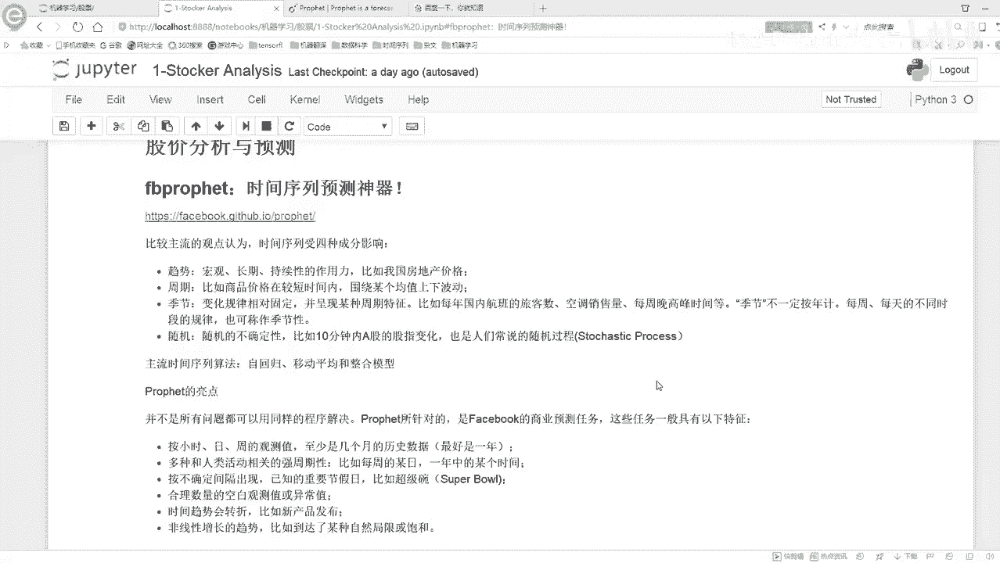

以下是Prophet框架的主要特性列表：
*   **灵活的预测频率**：支持按小时、天、周、月等多种时间粒度进行预测。
*   **考虑周期性**：能够自动处理年度、季节、每周等周期性模式。
*   **节假日效应**：可以添加节假日信息，以考虑其对时间序列的特殊影响。
*   **处理异常值与缺失值**：能够自动处理数据中的异常点和缺失值。
*   **趋势变化点检测**：自动识别历史数据中的趋势转折点，以更好地拟合数据。

其中，**趋势变化点**是一个重要概念。它指的是序列中趋势发生突然变化的点（例如股价突然大幅上涨或下跌）。让模型记住这些点有助于更好地拟合训练数据。但需要注意的是，过多地捕捉训练数据中的剧烈转折点，可能导致模型在未知的测试数据上**过拟合**。因此，变化点的处理是Prophet中一个需要调节的关键参数。

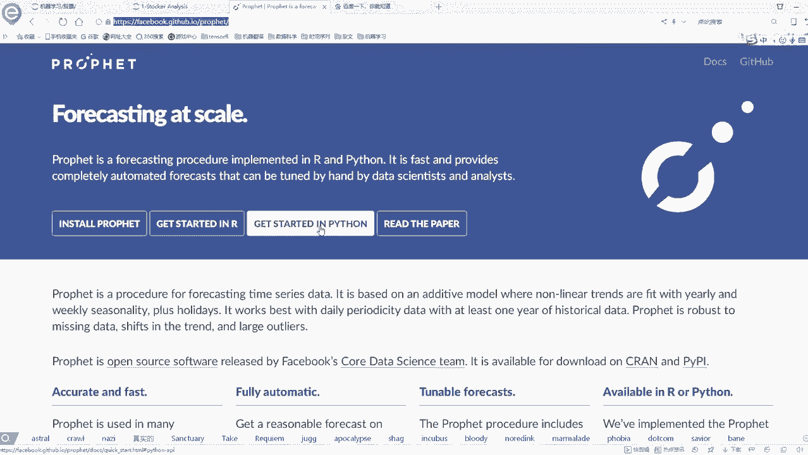


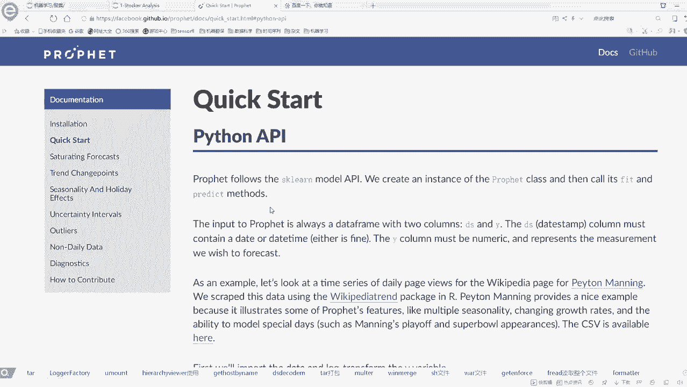

Prophet的算法核心结合了时间序列预测的几种经典成分：
*   **自回归模型**：基于自身历史数据进行预测。
*   **移动平均模型**：对误差项进行建模。
*   **整合模型**：使序列平稳化。

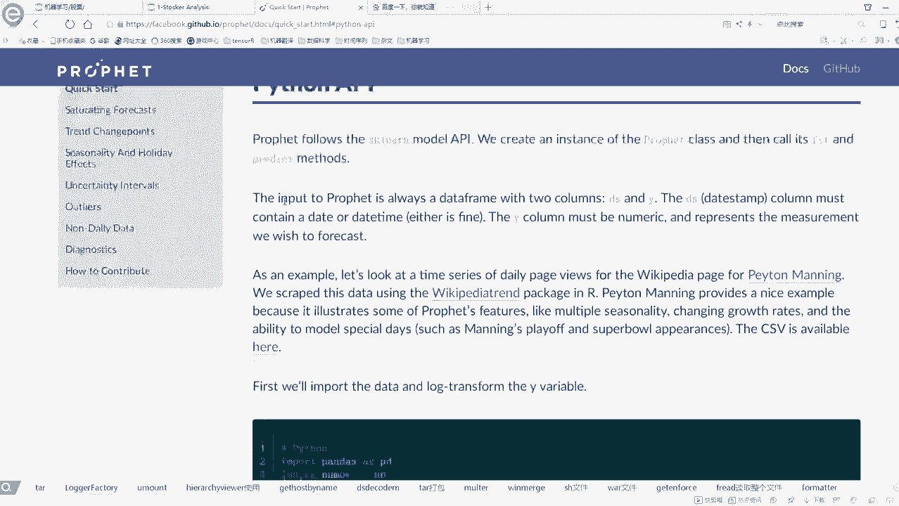

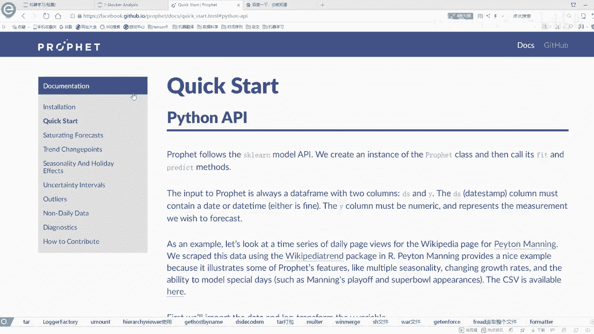

其思想与ARIMA模型类似，但Prophet在**封装和易用性**上做了大量优化。


## Prophet官方文档与基本流程

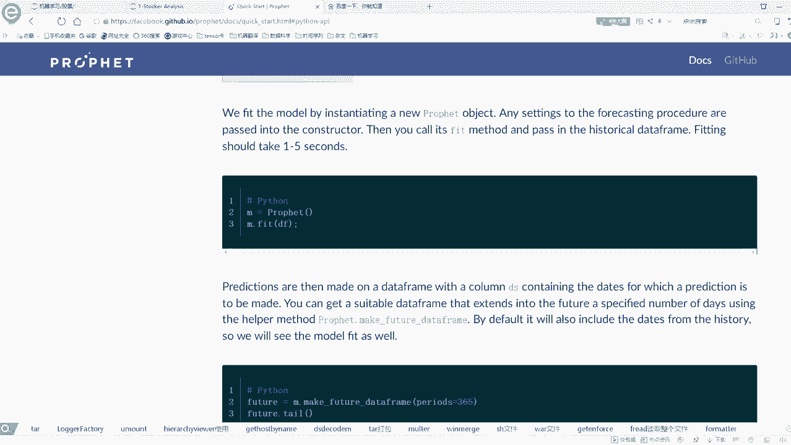


Prophet提供了详细的官方文档，建议初学者花时间阅读。它支持R和Python两种接口，本课程将使用Python接口。

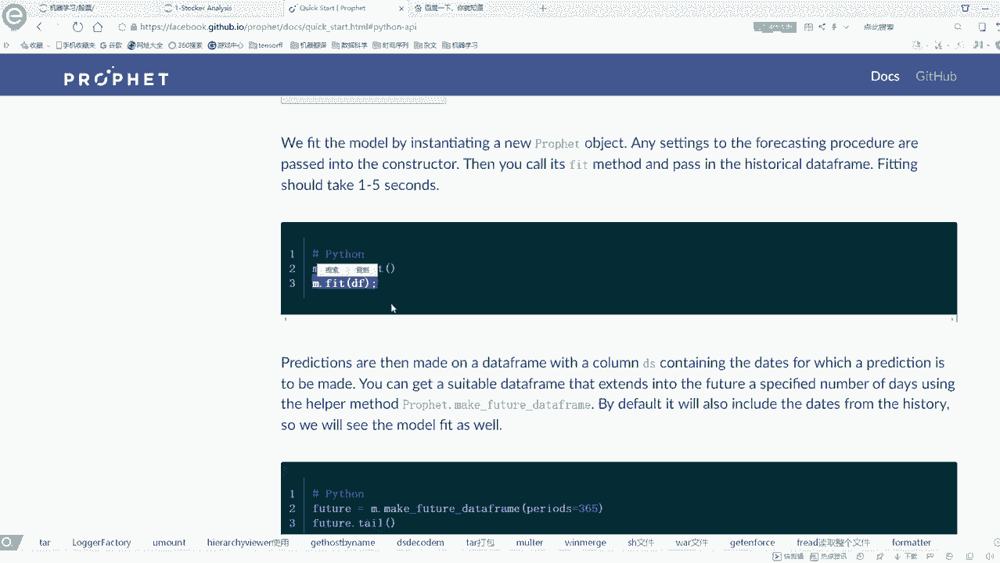


以下是Prophet进行预测的基本步骤：


1.  **数据格式**：输入数据必须是包含两列的DataFrame：`ds`（日期时间列）和 `y`（需要预测的数值指标列）。这是Prophet要求的**标准格式**。
    ```python
    # 示例数据格式
    df = pd.DataFrame({
        'ds': pd.date_range(start='2023-01-01', periods=100, freq='D'),
        'y': np.random.randn(100).cumsum() + 100
    })
    ```


2.  **模型构建与训练**：其API设计与Scikit-learn相似，使用起来非常直观。
    ```python
    from prophet import Prophet
    model = Prophet()  # 实例化模型
    model.fit(df)      # 训练模型
    ```

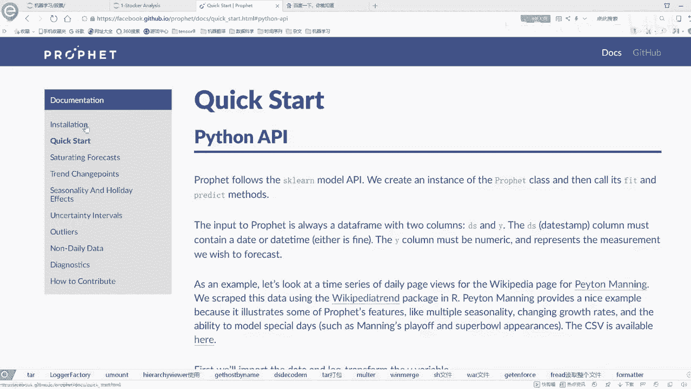

3.  **生成未来时间框**：使用 `make_future_dataframe` 函数创建需要预测的未来时间段。
    ```python
    future = model.make_future_dataframe(periods=30)  # 预测未来30天
    ```


4.  **进行预测**：对未来的时间框进行预测。
    ```python
    forecast = model.predict(future)
    ```

5.  **结果解读**：预测结果 `forecast` 是一个DataFrame，其中包含多列，最重要的是：
    *   `yhat`：预测值。
    *   `yhat_lower`：预测值的下限（置信区间）。
    *   `yhat_upper`：预测值的上限（置信区间）。

6.  **可视化**：Prophet内置了便捷的可视化功能，可以轻松绘制预测趋势、季节性成分等。


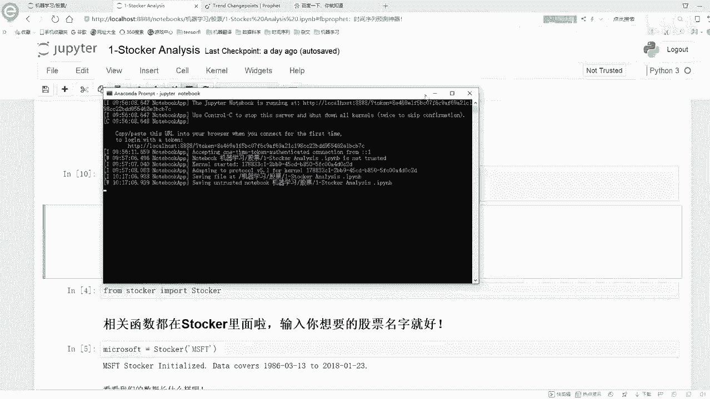

## 本课任务与环境准备

本节课的任务是进行**股价的分析与预测**。因此，我们需要获取股票数据。

在运行本课程的示例代码前，需要安装以下工具：

以下是需要安装的Python库列表：
*   `yfinance`：一个用于从雅虎财经获取股票数据的库。安装命令：`pip install yfinance`。
*   `prophet`：Facebook的Prophet预测库。安装命令：`pip install prophet`。
*   `matplotlib`：用于数据可视化的绘图库。通常已随Anaconda安装，如需安装：`pip install matplotlib`。

**安装提示**：如果使用 `pip install` 命令安装某些包失败，可以尝试以下方法：
1.  访问 [Python Extension Packages for Windows](https://www.lfd.uci.edu/~gohlke/pythonlibs/) 网站，下载对应的 `.whl` 文件，然后使用 `pip install 文件名.whl` 进行安装。
2.  或者，从GitHub等源码仓库下载源码，进入解压后的目录，执行 `python setup.py install` 进行安装。

确保在安装和运行代码时，计算机**连接互联网**，以便下载库和获取股票数据。

本课程的核心代码已封装在提供的Jupyter Notebook和配套的Python类中。我们将：
1.  在Notebook中演示完整的预测流程并查看结果。
2.  在集成开发环境（如PyCharm/VSCode）中使用调试功能，深入代码内部，一步步理解每个函数的具体操作。

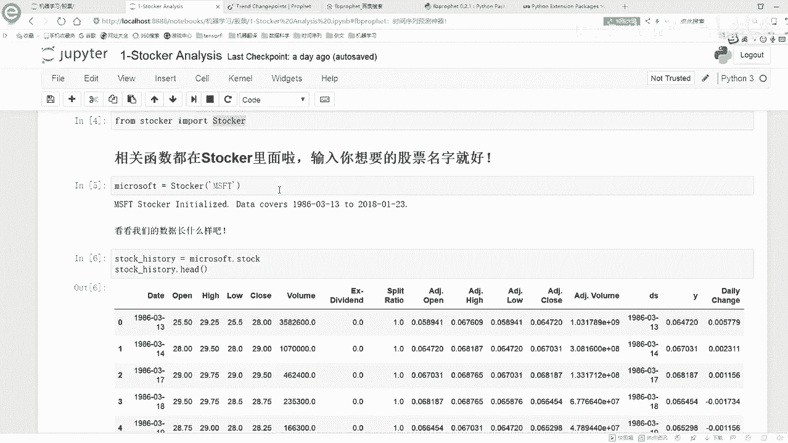

本节课中我们一起学习了股价预测作为时间序列任务的本质，认识了Prophet框架的强大功能与易用性，了解了其基本工作原理和使用流程，并完成了运行前必要的环境配置。接下来，我们就可以开始动手实践，用Prophet来预测股价了。