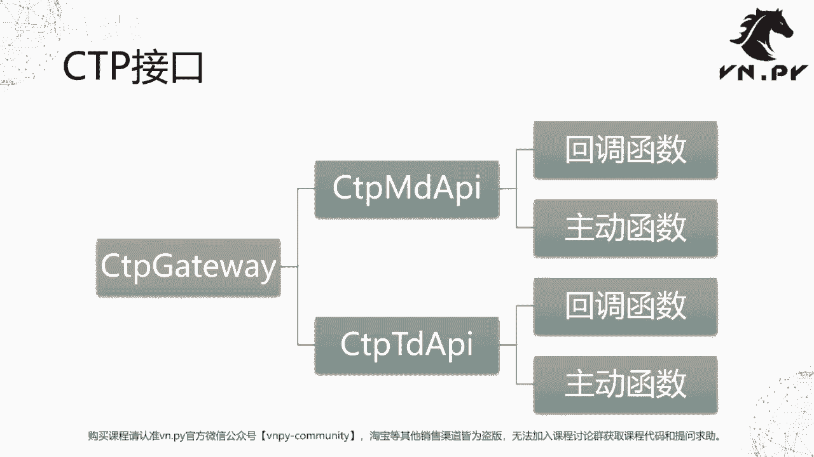
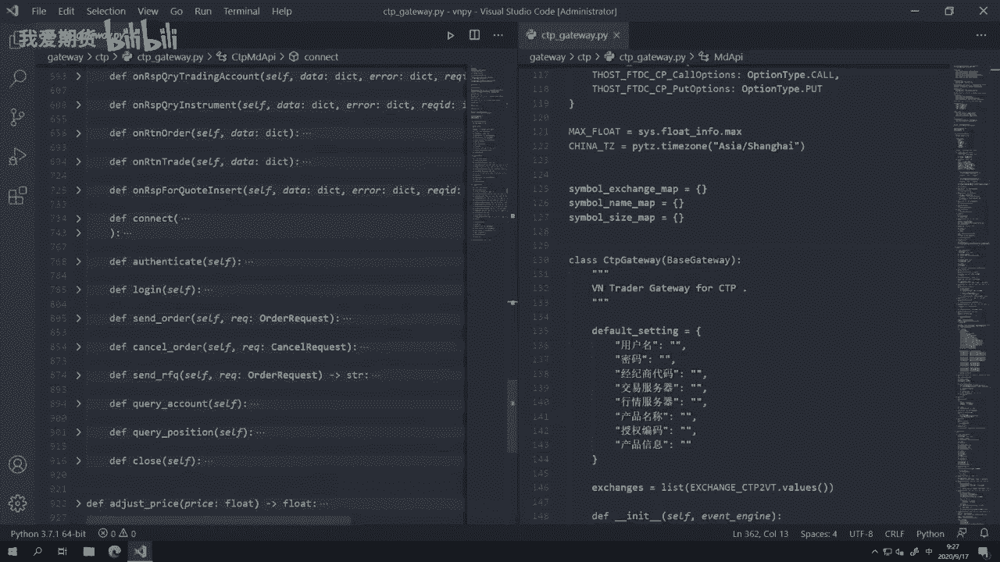
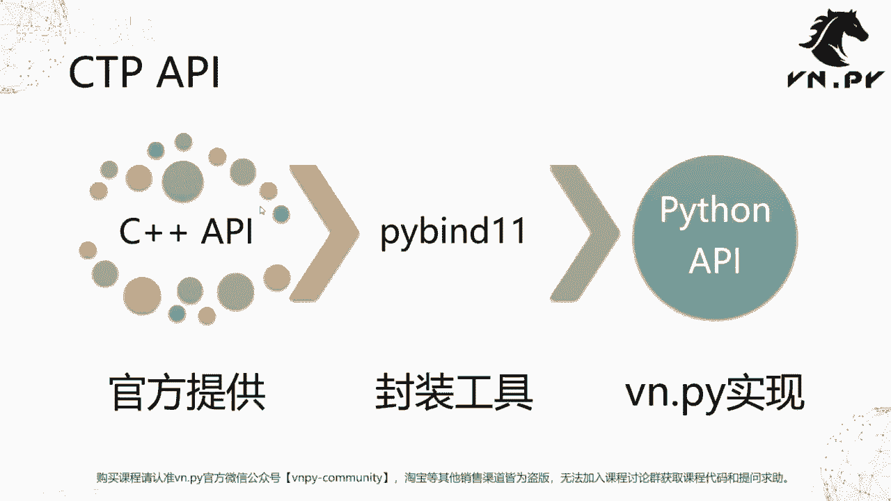
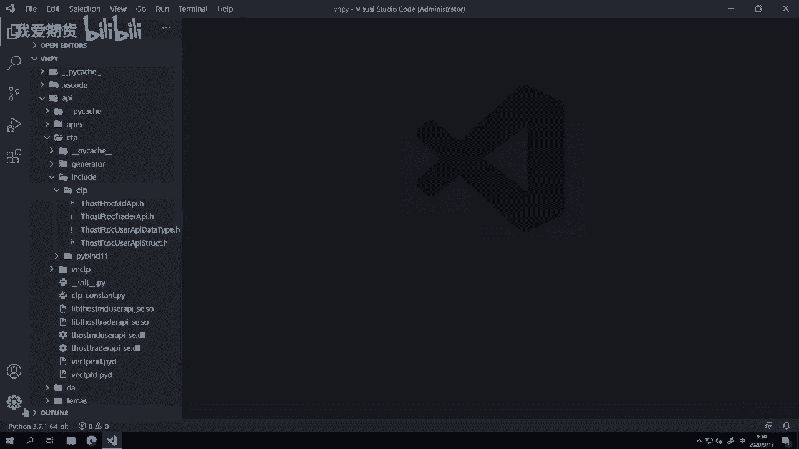
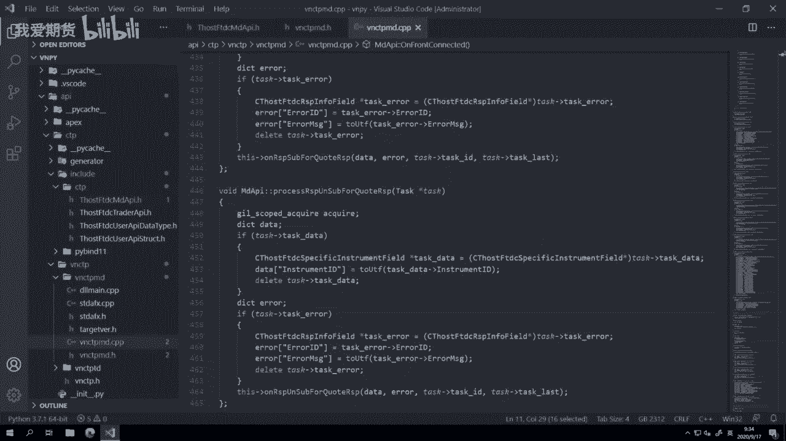

# 量化交易零基础入门：25：初探交易接口

在本节课中，我们将要学习如何将之前学到的Python面向对象编程知识，应用到实际的交易接口开发中。我们将以国内期货市场最常用的CTP接口为例，初步了解其结构和工作原理。

上一节我们介绍了如何在子类中重载父类的方法。至此，我们已经掌握了开发交易接口所需的主要Python概念。当然，实际开发中还有很多代码细节，但大体原理是相通的。本节是我们第一次实践课程，旨在带大家初步探索交易接口，理解其与面向对象编程的关系。

## CTP接口概述



本节课要讲解的是CTP接口，这是国内量化交易初学者最常见的接口之一。在VN Trader中，CTP接口对应的类名为 `CtpHtsGateway`。在其内部，又包含了两个对象，它们的类分别是 `CtpMdApi` 和 `CtpTdApi`。

*   `Md` 是 Market Data 的缩写，代表**行情接口**。
*   `Td` 是 Trade 的缩写，代表**交易接口**。

在每个API类中，都同时包含**回调函数**和**主动函数**。

*   **主动函数**：由程序员主动调用，以执行特定操作，例如登录、发单、撤单、查询合约等。调用时机由程序员控制。
*   **回调函数**：当外部事件发生时（如收到行情数据），由系统自动调用。程序员无法控制其调用时机，但可以定义被调用时执行的逻辑。

这种模式实现了**事件驱动编程**。程序不会傻傻地等待（时间驱动），而是当数据到达时立即触发处理逻辑，这对于实时性要求高的量化交易程序至关重要。

## 代码结构解析

概念讲完了，我们接下来就来看代码。我们打开VN Trader项目目录下的 `gateway/ctp` 文件夹，找到 `ctp_gateway.py` 文件。

这个文件代码量较大（近1000行），我们先折叠起来看整体结构。可以看到主要定义了三个大类：`CtpHtsGateway`、`CtpMdApi` 和 `CtpTdApi`。

### CtpMdApi 类详解

我们以相对简单的行情接口 `CtpMdApi` 为例进行讲解。首先，这个类继承了一个父类 `MdApi`。

```python
class CtpMdApi(MdApi):
```

这个 `MdApi` 父类是通过 `pybind11` 工具，将C++语言的原生CTP API封装而成的Python类。我们重点关注子类 `CtpMdApi` 中的实现。

以下是 `CtpMdApi` 类中方法类型的说明：

*   **以 `on` 开头的回调函数**：例如 `onFrontConnected`, `onRspUserLogin`, `onRtnDepthMarketData`。这些方法在父类中已有定义（通常是空实现），我们在子类中重载它们，以添加收到对应事件（如连接成功、登录响应、行情推送）时的处理逻辑。
*   **其他命名的主动函数**：例如 `connect`, `login`, `subscribe`。这些是我们在子类中自己实现的方法，供程序内部在需要时主动调用。

#### 核心回调函数示例：`onRtnDepthMarketData`

当订阅的合约有行情推送时，`onRtnDepthMarketData` 回调函数会被触发。以下是其内部处理逻辑的简化流程：

1.  **数据校验**：检查收到的数据字典是否包含有效的时间戳，过滤无效的“垃圾数据”。
2.  **合约校验**：通过全局缓存字典 `symbol_exchange_map` 检查合约代码对应的交易所信息是否存在。
3.  **时间戳处理**：将CTP格式的时间字符串与当前日期拼接，并使用 `datetime` 库转化为本地时区（东八区）的时间戳对象。
4.  **数据结构转换**：创建一个VN Trader内部定义的 `TickData` 对象，将CTP的原始数据字段一一对应填充进去。
5.  **数据推送**：调用 `gateway` 的 `on_tick` 回调函数，将处理好的 `TickData` 对象推送出去，交由上层引擎处理。

这个函数清晰地展示了如何将外部API的原始数据，转换并规范化为内部统一的数据结构。



### 主动函数与回调函数的调用关系

*   **主动函数调用**：例如，用户在VN Trader图形界面点击“连接”按钮，这个操作会层层传递，最终调用 `CtpMdApi.connect()` 方法。
*   **回调函数触发**：当 `connect()` 调用后，如果网络通畅且服务器正常，CTP服务器会返回一个连接成功的应答。此时，底层的C++封装层会自动调用 `onFrontConnected()` 回调函数。如果网络断开或服务器未开启，则此回调永远不会被触发。

`CtpTdApi`（交易接口）的原理完全类似，只是回调函数和主动函数更多，处理逻辑更复杂。

## 接口封装原理



你可能会问，那个作为父类的 `MdApi` 是怎么来的？它来自于对官方C++版CTP API的**封装**。



1.  **官方API**：上海期货交易所下属的上期技术公司提供了C++版本的CTP API。
2.  **封装目的**：为了能在Python中直接使用这些功能，我们需要进行“语言转换”。
3.  **封装工具**：使用 `pybind11` 库，将C++的类、函数和数据结构“映射”到Python环境中。
4.  **封装结果**：生成一个Python可调用的 `MdApi` 类。但这只是语言层的转换，还未涉及业务逻辑（如数据字段的映射）。
5.  **业务逻辑实现**：在 `CtpMdApi` 子类中，我们实现将CTP特定数据格式转换为VN Trader内部标准格式的逻辑。这样，VN Trader上层就可以用统一的方式处理来自不同交易接口（如CTP、数字货币REST API等）的数据。你可以将不同的 `Gateway` 类视为**多态**的具体实现。

我们简要查看一下C++封装部分的头文件（位于 `api/ctp/include`），可以看到其中定义了与Python类中对应的回调函数和主动函数接口。实际的封装代码（如 `vnctpmd/vnctpmd.cpp`）有近千行，主要负责数据结构的转换、线程间通信等复杂但重复性高的工作。

## 总结

本节课中，我们一起学习了如何将面向对象编程知识应用于实际的交易接口。我们以CTP接口为例，了解了：

1.  **接口组成**：`CtpHtsGateway` 包含 `CtpMdApi`（行情）和 `CtpTdApi`（交易）两部分。
2.  **两种函数**：**主动函数**由程序控制调用；**回调函数**由外部事件触发，用于实现**事件驱动编程**。
3.  **代码结构**：在子类中重载以 `on` 开头的父类回调函数来处理事件；实现自己的主动函数来执行操作。
4.  **数据流**：回调函数收到原始数据后，进行校验、转换，最终规范化为内部数据结构并推送出去。
5.  **封装原理**：交易接口的核心是对官方原生API（如C++）进行语言层封装，并在Python子类中实现业务逻辑转换。



如果你觉得本节课内容有些复杂，无需担心。这是我们将前25节课所学知识点串联起来，第一次窥见其在实际项目中的应用。所有的复杂程序，都是由这些基础部分构建而成的。编程是一门可以通过持续学习和练习掌握的知识，只要保持耐心，攻克每一个难点，你一定能取得显著的进步。

更多精华内容，请扫码关注我们的社区公众号。