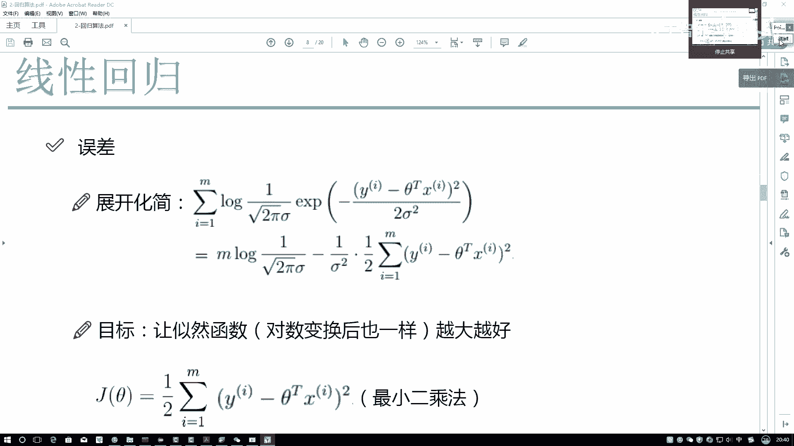
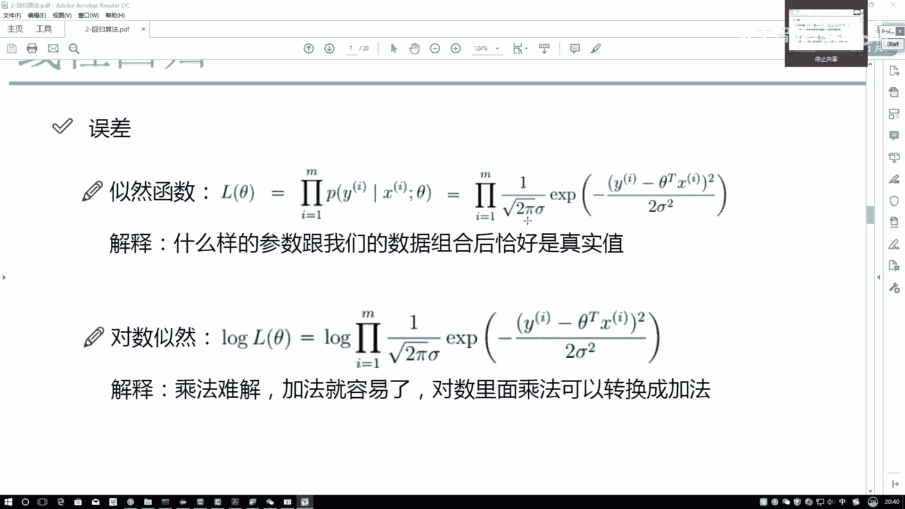
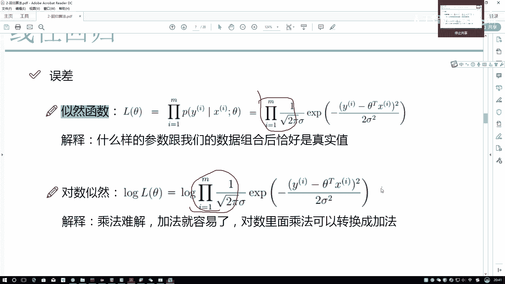
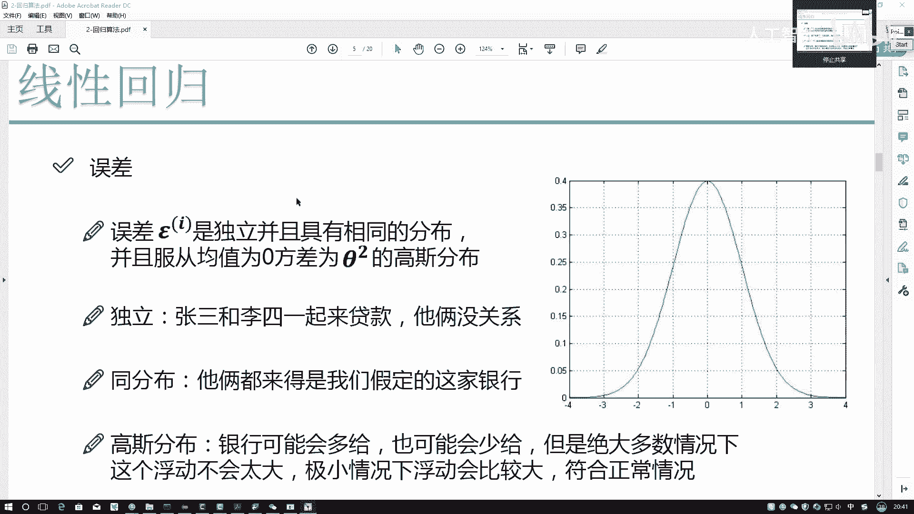
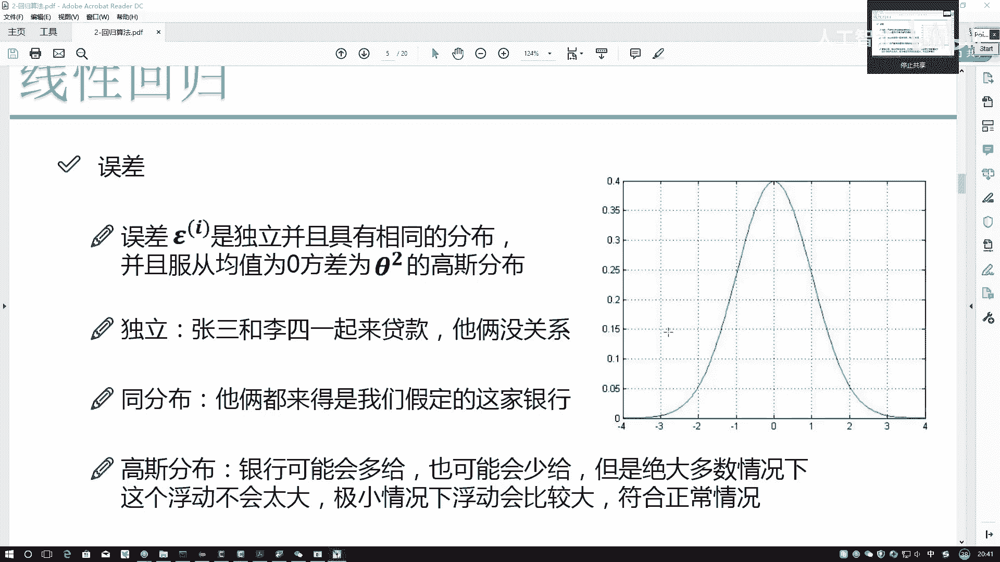
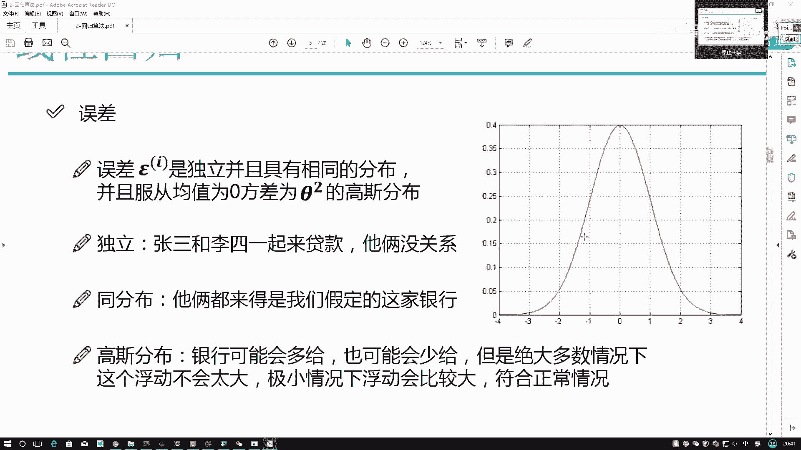
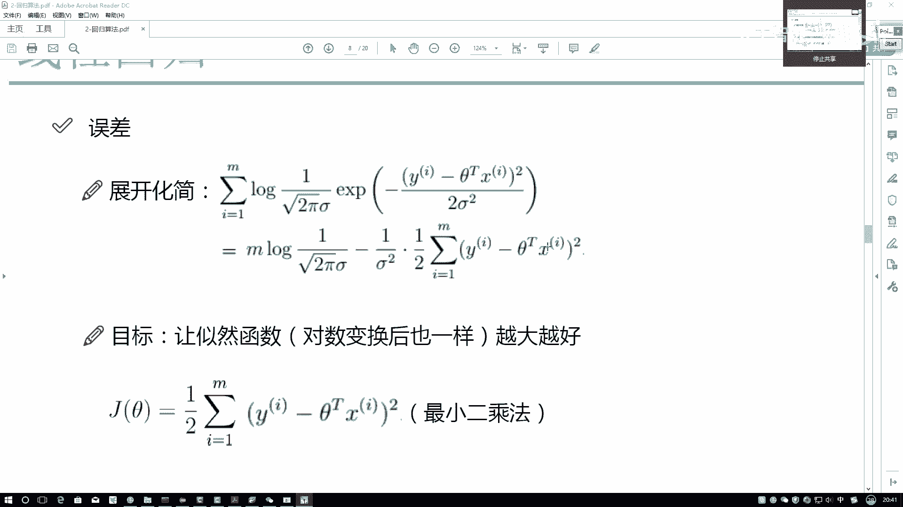
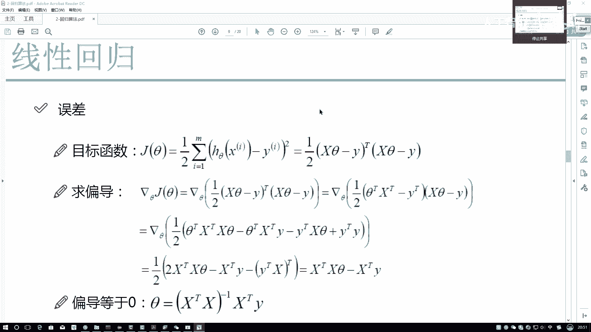
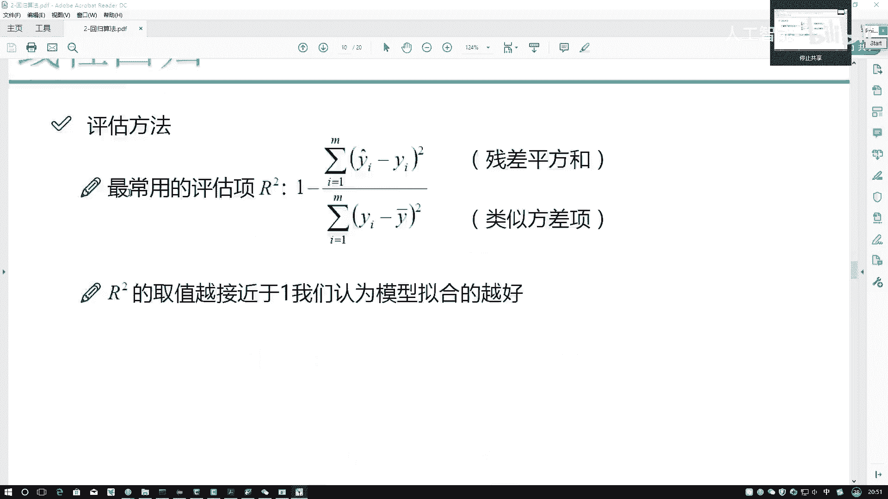

# Python金融分析与量化交易实战教程：P54：5-参数求解

在本节课程中，我们将学习如何求解线性回归模型的参数。我们将从最大似然估计出发，推导出最终的目标函数，并探讨其求解方法及其局限性。

## 从最大似然到最小二乘 ✨

上一节我们介绍了最大似然估计，其目标是找到一组参数，使得观测到当前数据的概率最大。对于线性回归问题，我们假设误差项服从正态分布，从而得到了似然函数。

首先，我们回顾一下似然函数。它是一个累乘的形式，表示所有样本的联合概率。为了便于计算，我们通常对其取对数，将累乘转换为累加。

以下是具体的推导步骤：

1.  **取对数转换**：对似然函数取自然对数，将累乘 `∏` 转换为累加 `∑`。
    *   公式：`log(L(θ)) = ∑_{i=1}^{m} log(P(y_i | x_i; θ))`
2.  **展开与简化**：将正态分布的概率密度函数代入对数似然函数并进行展开。展开后，式子可以分为常数部分和包含参数 `θ` 的部分。
    *   常数部分：与参数 `θ` 无关的项，在优化过程中可以忽略。
    *   核心部分：包含参数 `θ` 的项，经过化简后，其形式为 `-1/2 * ∑_{i=1}^{m} (y_i - θ^T x_i)^2`。
3.  **目标转换**：我们的原始目标是最大化对数似然函数。观察化简后的式子，它等于一个常数减去一个恒为正的平方和项。为了使整体值最大，就必须让这个平方和项越小越好。
    *   因此，优化目标从 **最大化对数似然** 转变为 **最小化平方和误差**。

这个平方和误差函数有一个广为人知的名字：**最小二乘法**。很多教程会直接给出最小二乘法的公式，但理解其背后的概率假设（误差服从正态分布）和推导过程至关重要。这不仅适用于线性回归，也是许多机器学习模型的基础。

没有关于误差项的正态分布假设，后续的最小二乘法推导就无法成立。这是整个推导最基本的前提。

## 目标函数的矩阵形式与求解 🧮

上一节我们得到了最小二乘法的目标函数。本节中，我们来看看如何用矩阵形式表示并求解它。

首先，我们需要用矩阵来表示数据和参数。这里，`X` 不是一个单独的数字，而是一个包含所有样本特征的矩阵（`m x n`），`y` 是所有样本真实值的向量（`m x 1`），`θ` 是待求的参数向量（`n x 1`）。

目标函数 `J(θ)` 的矩阵形式可以写为：
`J(θ) = 1/2 * (Xθ - y)^T (Xθ - y)`

我们的目标是找到参数 `θ`，使得 `J(θ)` 最小。在微积分中，寻找函数极值点的方法是令其导数为零。对于多元函数，就是令其梯度（偏导数向量）为零。

以下是求解 `θ` 的步骤：

1.  **对目标函数求导**：对矩阵形式的 `J(θ)` 关于 `θ` 求偏导。这里会用到一些矩阵求导的公式（例如，`∂(θ^T A θ)/∂θ = 2Aθ`，当 `A` 为对称矩阵时）。
2.  **令导数为零**：令求导后的结果等于零向量，得到一个方程：
    `X^T X θ = X^T y`
3.  **求解参数**：为了解出 `θ`，我们需要“消掉” `X^T X`。如果矩阵 `X^T X` 是可逆的，我们可以在等式两边同时左乘它的逆矩阵 `(X^T X)^{-1}`，从而得到最终解：
    `θ = (X^T X)^{-1} X^T y`

这个公式就是线性回归的**正规方程解**。它意味着，只要我们有了数据 `X` 和标签 `y`，就可以通过一次矩阵运算直接得到最优参数 `θ`。

## 对直接求解方法的思考 🤔

通过正规方程，我们似乎完美地解决了问题。但这里我们需要停下来思考两个关键点。

首先，**这个过程有“学习”吗？** 机器学习强调从数据中逐步学习、改进的过程。然而，正规方程法更像是一个“一步到位”的解析解，直接将所有数据代入公式计算，缺少了模型根据误差反馈进行迭代调整的“学习”感。

其次，**这个方法总是可行吗？** 答案是否定的。它的可行性严重依赖于 `X^T X` 矩阵的可逆性。在以下情况中，可能会出现问题：
*   **特征高度相关（多重共线性）**：导致 `X^T X` 近似奇异，逆矩阵不稳定或无法计算。
*   **样本数量少于特征数量（m < n）**：此时 `X^T X` 不是满秩矩阵，不可逆。

一旦 `X^T X` 不可逆，我们就无法使用正规方程直接求解。这引出了我们对更通用、更健壮的求解方法的需求。

正因为直接求解法存在这些局限性，在实际的机器学习中，我们更常使用一种具有“学习”过程的迭代优化方法。这种方法能处理大规模数据，也不要求矩阵可逆。我们将在后续的评估方法介绍之后，深入探讨这种重要的优化算法。

---

**本节课总结**：
本节课我们一起学习了线性回归模型的参数求解。我们从最大似然估计出发，推导出了最小二乘法目标函数。然后，我们将其表示为矩阵形式，并推导出通过正规方程 `θ = (X^T X)^{-1} X^T y` 直接求解参数的方法。最后，我们分析了这种直接求解法的优点（解析解、直接）和局限性（缺乏迭代学习过程、依赖矩阵可逆性），为接下来学习更通用的优化算法做好了铺垫。