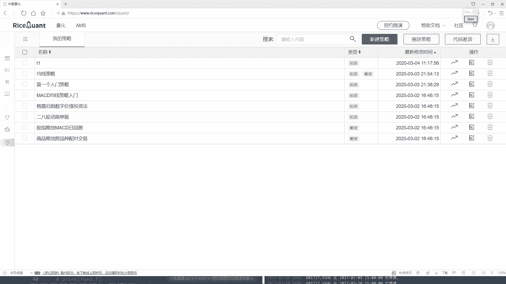
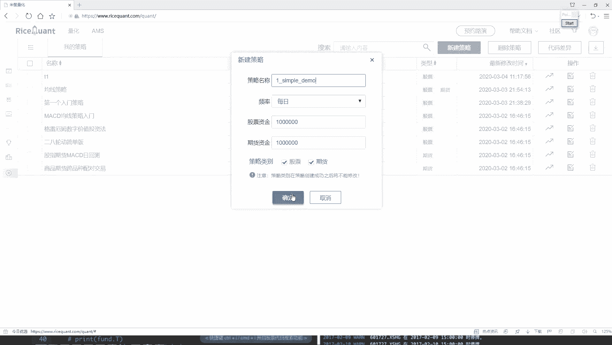
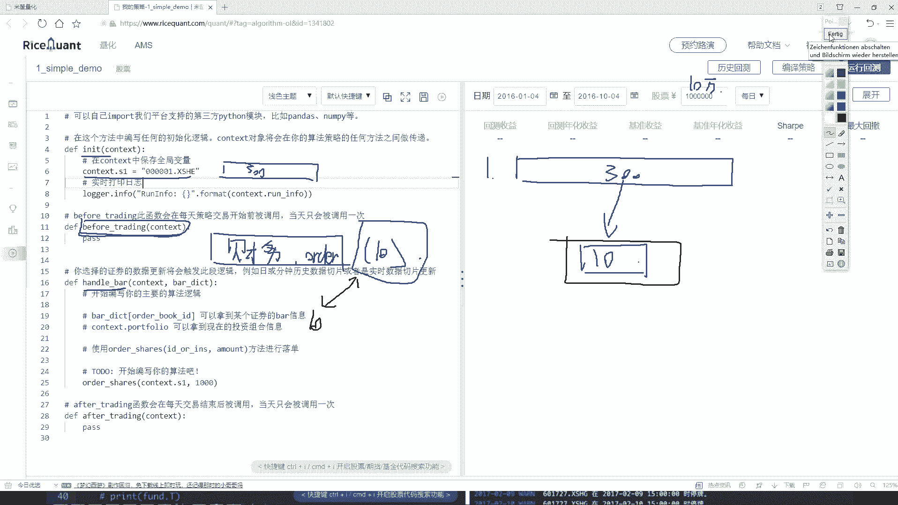
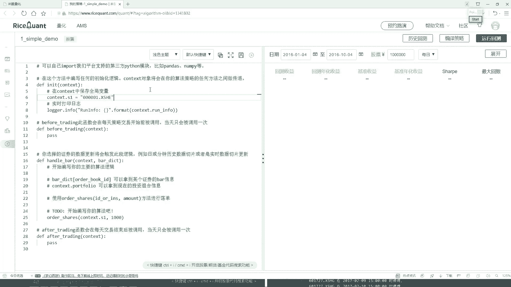

# Python金融量化实战：P20：6-Ricequant回测选股分析实战1-策略任务分析 🎯

在本节课中，我们将学习如何使用Ricequant平台构建一个简单的量化交易策略。我们将通过一个具体的任务——从沪深300指数中动态选取并持有表现最佳的10只股票——来熟悉平台的核心API和策略编写流程。

## 策略任务概述

我们的目标是设计一个策略，始终保持持仓为沪深300指数中表现最好的10只股票。为了实现这个目标，我们需要每天或每个交易周期执行以下操作：获取沪深300成分股，根据选定的财务指标（例如盈利能力）对这些股票进行排序，并买入排名前10的股票。同时，我们需要卖出已持有但不再属于前10名的股票。

## 策略模块与任务分解

上一节我们介绍了策略的基本目标，本节中我们来看看如何将这个目标分解到Ricequant平台的各个策略模块中。

Ricequant的策略模板主要包含三个函数：`initialize`（初始化）、`before_trading`（盘前处理）和`handle_bar`（盘中处理）。每个模块承担不同的职责。

以下是各个模块的具体任务分配：

*   **`initialize` 初始化函数**：在此函数中，我们需要设定策略的初始状态。核心任务是获取我们的股票池，即沪深300指数的所有成分股。
*   **`before_trading` 盘前处理函数**：此函数在每个交易日开始前执行。我们将在这里进行数据查询和计算工作，例如获取所有成分股的财务数据，进行排序，并选出当日最佳的10只股票。**公式**可以表示为：`当日最佳股票 = SORT(股票池, 依据=‘财务指标’, 顺序=降序)[:10]`。
*   **`handle_bar` 盘中处理函数**：此函数在每个交易时间点（如每分钟或每日）执行。我们将在这里执行实际的交易逻辑：比较当前持仓的股票与`before_trading`计算出的最佳股票列表，卖出不再属于最佳列表的股票，并买入新的最佳股票。

## 核心逻辑流程

理解了模块分工后，我们来梳理一下策略运行时的完整逻辑链条。

1.  **策略启动 (`initialize`)**：获取沪深300成分股列表，作为我们的基础股票池。
2.  **每日盘前 (`before_trading`)**：从股票池中查询所有股票的选定财务指标（如净利润），并按照指标值从高到低排序，选取排名前10的股票代码。
3.  **交易时段 (`handle_bar`)**：
    *   检查当前账户的持仓情况。
    *   将持仓股票与盘前计算出的“最佳10只股票”列表进行比较。
    *   执行交易操作：卖出持仓中不在“最佳列表”里的股票；用剩余资金买入“最佳列表”中尚未持有的股票。

通过这样的循环，策略就能实现始终持有当前认为“最好”的10只股票。

## 总结

本节课中我们一起学习了如何为一个具体的量化选股任务进行策略分析和模块设计。我们明确了在Ricequant平台上，通过`initialize`、`before_trading`和`handle_bar`三个函数的分工协作，可以完成“动态持有最佳股票”的策略逻辑。下一节，我们将进入代码实战环节，一步步实现这个策略。