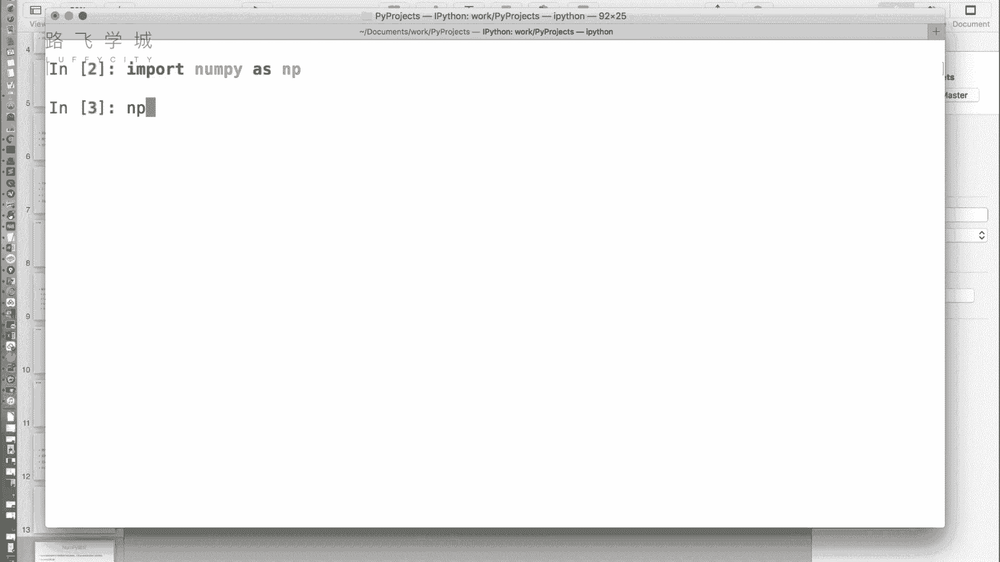
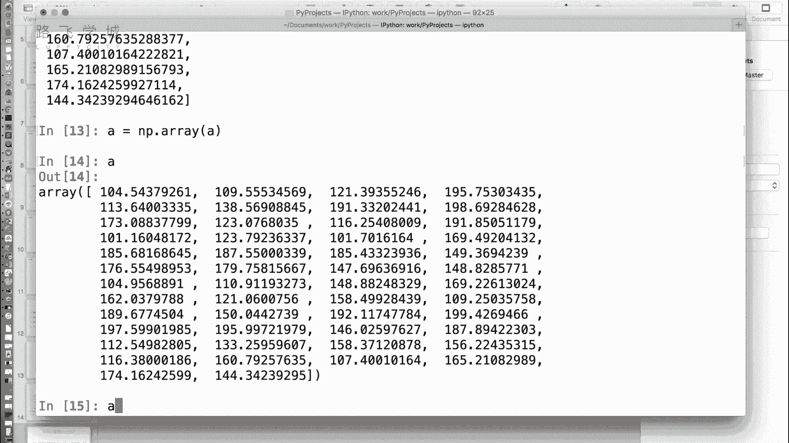
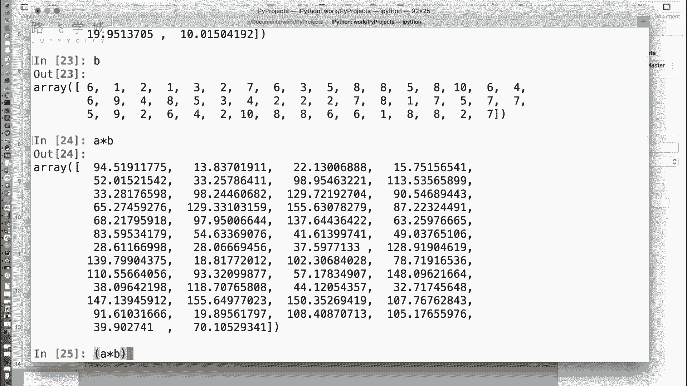
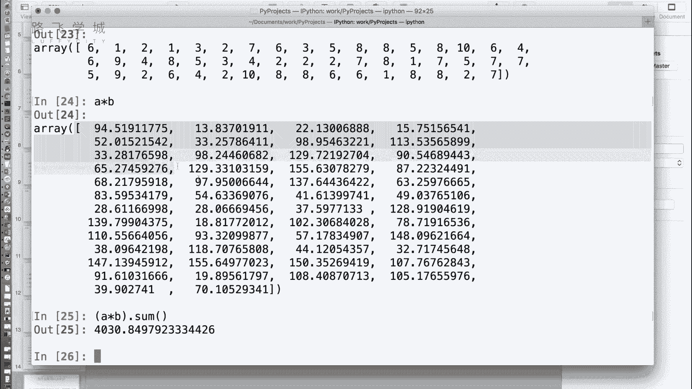
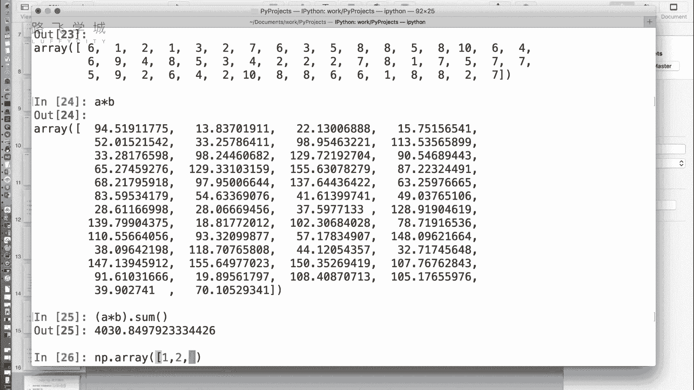
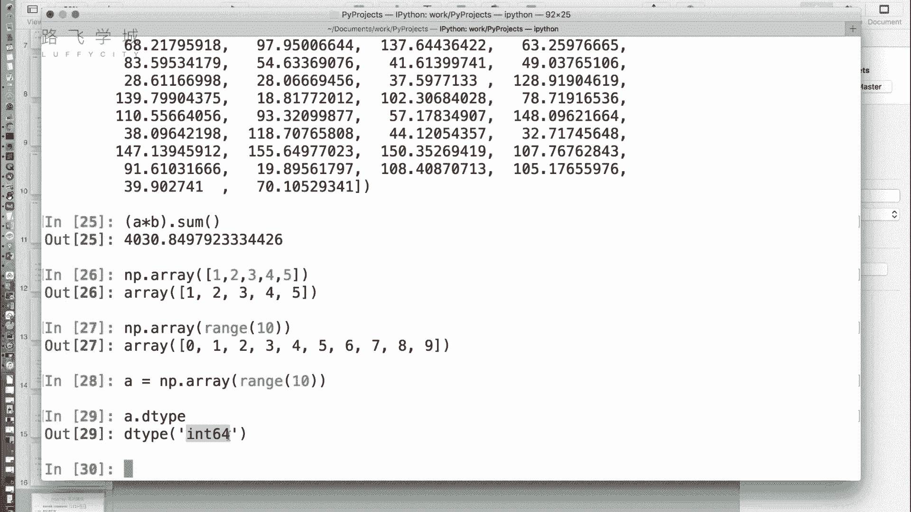
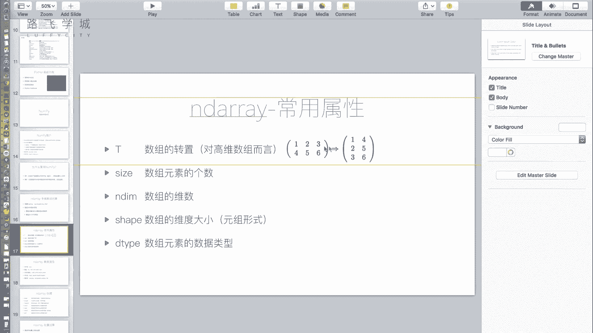

# 金融量化分析：P11：Numpy Array基础 🧮

在本节课中，我们将要学习NumPy库的核心基础——`ndarray`数组对象。NumPy是Python中进行高性能科学计算和数据分析的基础包，也是后续学习Pandas等高级工具的基石。我们将通过实例了解其优势、创建方法以及基本属性。


## 为什么要使用NumPy？




上一节我们提到了NumPy是数据分析的基础工具，本节中我们来看看它为何如此重要。NumPy提供了一个名为`ndarray`的多维数组数据结构，它能高效地处理批量数据运算，无需编写循环。


以下是两个直观的例子：

**示例一：货币批量转换**
假设我们有一个包含50家公司市值的列表（单位：美元），需要将所有值转换为人民币。

```python
import random
# 生成50个100到200之间的随机浮点数，模拟50家公司的市值（万美元）
a = [random.uniform(100, 200) for _ in range(50)]
print(a)
```

使用传统Python列表方法进行转换较为繁琐。而使用NumPy则非常简单：




```python
import numpy as np
# 将列表转换为NumPy数组
arr_a = np.array(a)
exchange_rate = 6.8
# 数组直接与标量相乘，完成批量转换
result = arr_a * exchange_rate
print(result)
```


**示例二：计算购物车总金额**
已知两个列表，分别存储商品单价和对应数量，计算总金额。


```python
# 商品单价列表
prices = [random.uniform(10, 20) for _ in range(5)]
# 商品数量列表
quantities = [random.randint(1, 10) for _ in range(5)]


# 转换为NumPy数组
np_prices = np.array(prices)
np_quantities = np.array(quantities)


# 数组对应元素相乘，得到各商品金额
item_totals = np_prices * np_quantities
# 使用sum()函数计算总和
total_cost = item_totals.sum()
print(total_cost)
```





通过以上例子可以看到，NumPy的数组运算语法简洁、效率高，省去了编写循环的麻烦。


## NumPy数组 (`ndarray`) 的核心概念

我们已经通过例子感受到了NumPy的便捷，现在来深入了解一下其核心对象`ndarray`。创建数组的基本方法是使用`np.array()`函数。


```python
import numpy as np
# 从列表创建一维数组
arr1 = np.array([1, 2, 3, 4, 5])
# 从range对象创建
arr2 = np.array(range(10))
```





NumPy数组与Python列表有两个关键区别：
1.  **元素类型必须一致**：数组中的所有元素必须是相同的数据类型（如全是整数或全是浮点数），而列表可以混合存放不同类型的数据。
2.  **大小不可变**：数组一旦创建，其大小（即元素总数）就固定了，不能像列表那样随意`append`新元素。这种设计与其底层高效的内存结构有关。


## 数组的常用属性




了解了基本概念后，我们来看看如何查看和操作数组的属性。这些属性帮助我们理解数组的形态和内容。

以下是一些最常用的`ndarray`属性：

*   **`dtype`**: 返回数组中元素的数据类型。
    ```python
    arr = np.array([1, 2, 3])
    print(arr.dtype) # 输出：int64 (64位整数)
    ```
*   **`size`**: 返回数组中元素的总数。
    ```python
    arr = np.array([[1, 2, 3], [4, 5, 6]])
    print(arr.size) # 输出：6
    ```
*   **`shape`**: 返回一个元组，表示数组的维度（形状）。例如，一个2行3列的二维数组，其`shape`为`(2, 3)`。
    ```python
    arr = np.array([[1, 2, 3], [4, 5, 6]])
    print(arr.shape) # 输出：(2, 3)
    ```
*   **`ndim`**: 返回数组的维数（轴数）。
    ```python
    arr_1d = np.array([1, 2, 3])
    arr_2d = np.array([[1, 2], [3, 4]])
    print(arr_1d.ndim) # 输出：1
    print(arr_2d.ndim) # 输出：2
    ```
*   **`T`**: 返回数组的转置。对于二维数组，行和列将互换。
    ```python
    arr = np.array([[1, 2, 3], [4, 5, 6]])
    print(‘原始数组：\n‘, arr)
    print(‘转置数组：\n‘, arr.T)
    # 输出：
    # 原始数组：
    #  [[1 2 3]
    #   [4 5 6]]
    # 转置数组：
    #  [[1 4]
    #   [2 5]
    #   [3 6]]
    ```


## 数据类型 (`dtype`) 详解


在查看`dtype`属性时，我们看到了像`int64`这样的类型标识。NumPy提供了丰富的数据类型以优化存储和计算。


以下是NumPy中主要的数据类型分类：
*   **布尔型 (`bool_`)**: 用于存储`True`或`False`。
*   **整型 (`int8`, `int16`, `int32`, `int64`)**: 带符号整数，数字代表位数（比特）。例如，`int8`表示8位整数，范围约为-128到127。
*   **无符号整型 (`uint8`, `uint16`, `uint32`, `uint64`)**: 无符号整数，仅表示非负数。例如，`uint8`的范围是0到255。
*   **浮点型 (`float16`, `float32`, `float64`)**: 浮点数，数字代表精度。`float64`即双精度浮点数，是常用的类型。
*   **复数型 (`complex64`, `complex128`)**: 用于存储复数。

在金融量化分析中，我们主要处理数值数据，因此最常使用的是各种整型和浮点型。

## 多维数组

现实中的数据往往是多维的。NumPy可以轻松创建和操作多维数组。

```python
# 创建一个二维数组（矩阵）
arr_2d = np.array([[1, 2, 3], [4, 5, 6]])
print(‘二维数组：\n‘, arr_2d)
print(‘形状：‘, arr_2d.shape) # (2, 3)
print(‘维数：‘, arr_2d.ndim)   # 2

# 创建一个三维数组（可以想象为一个由多个二维数组组成的“立方体”或“书本”）
arr_3d = np.array([[[1, 2], [3, 4]], [[5, 6], [7, 8]]])
print(‘\n三维数组：\n‘, arr_3d)
print(‘形状：‘, arr_3d.shape) # (2, 2, 2) 可以理解为：2页，每页2行2列
print(‘维数：‘, arr_3d.ndim)   # 3
```




对于金融数据，二维数组最为常见，例如，行代表不同的时间点，列代表不同的股票或指标。

## 总结


本节课中我们一起学习了NumPy库的基础——`ndarray`数组。我们首先通过实例对比，理解了NumPy在批量数据运算上的简洁与高效。然后，我们深入探讨了数组的创建、它与Python列表的核心区别，以及一系列关键属性（`dtype`, `size`, `shape`, `ndim`, `T`）。最后，我们介绍了NumPy的数据类型和多维数组的概念。掌握这些基础知识是后续进行更复杂的金融数据分析和计算的关键第一步。