# 金融量化分析：P12：NumPy数组创建方法详解 🚀

在本节课中，我们将学习如何使用NumPy创建各种数组。掌握不同的数组创建方法是进行高效数据操作和金融量化分析的基础。

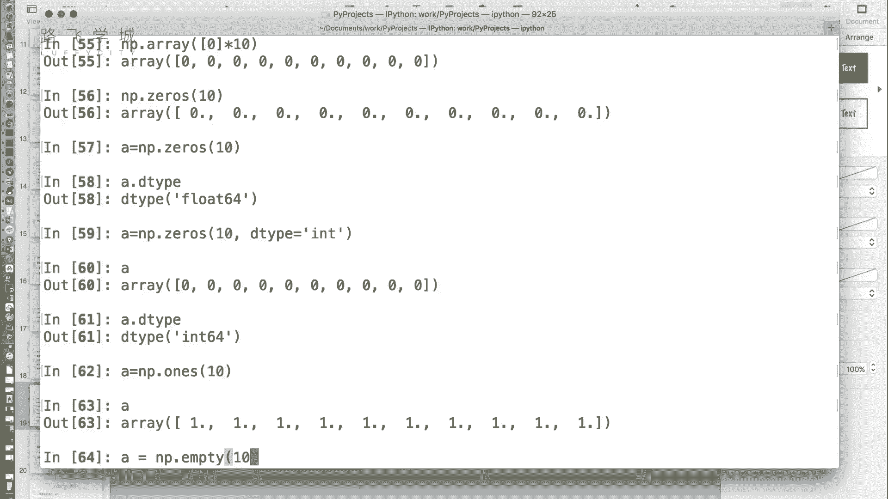

上一节我们介绍了NumPy数组（ndarray）的常用属性，本节中我们来看看如何创建它们。


## 从列表创建数组

最基本的方法是使用 `np.array()` 函数，它可以将一个列表直接转换成一个NumPy数组。

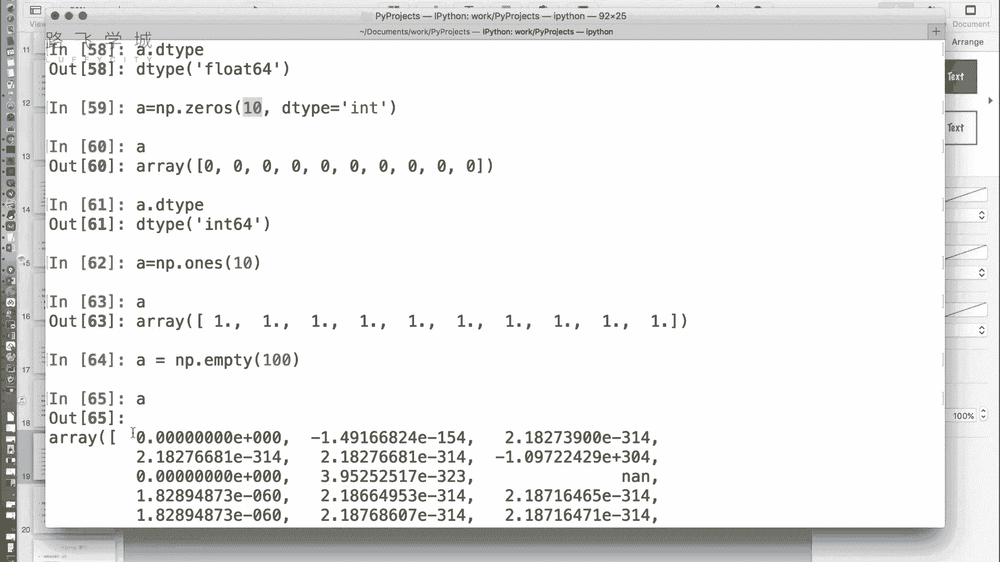


```python
import numpy as np
arr = np.array([1, 2, 3, 4, 5])
```

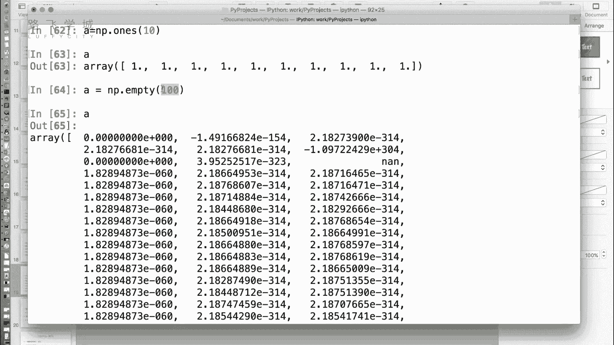


## 创建特殊值数组

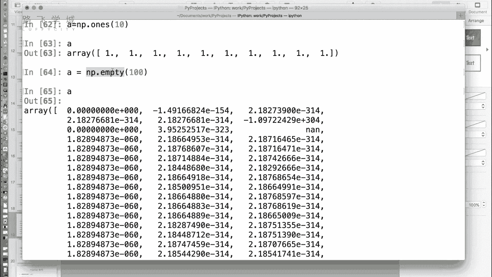

除了从列表转换，NumPy还提供了一系列函数来快速创建具有特定值的数组。


以下是创建全零、全一和“空”数组的方法。


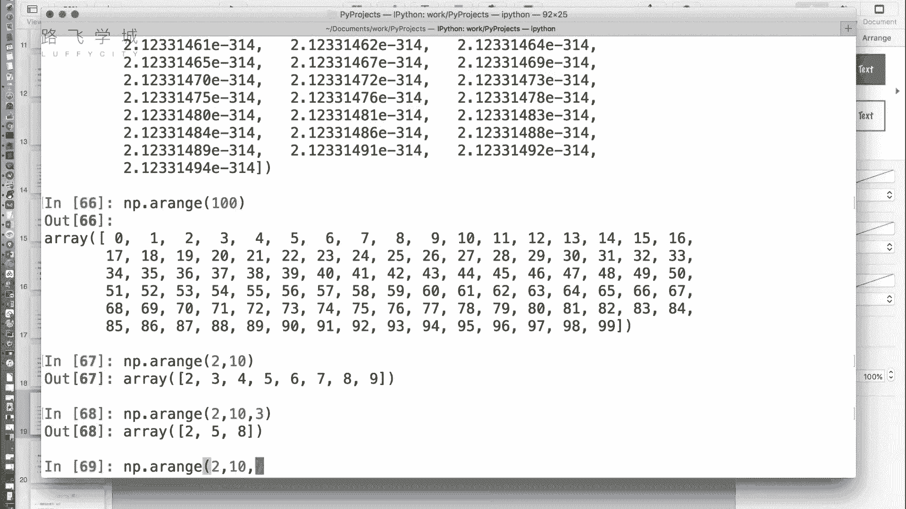

*   **`np.zeros(shape, dtype=float)`**：创建指定形状的全零数组。默认数据类型为浮点数（`float64`）。
    ```python
    # 创建一个长度为10的全零数组（浮点型）
    a = np.zeros(10)
    # 创建一个长度为10的全零数组（整型）
    a_int = np.zeros(10, dtype=int)
    ```

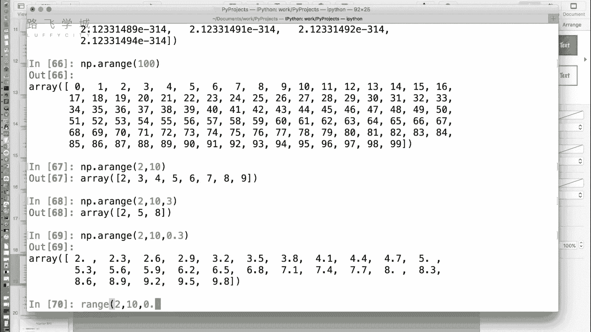

*   **`np.ones(shape, dtype=float)`**：创建指定形状的全一数组。默认数据类型同样为浮点数。
    ```python
    # 创建一个形状为(3, 4)的全一数组
    b = np.ones((3, 4))
    ```


*   **`np.empty(shape, dtype=float)`**：创建指定形状的“空”数组。这里的“空”并非指值为零或None，而是指分配内存后，不进行初始化，其内容为内存中的随机残留值。因此，其值是不确定的。
    ```python
    # 创建一个长度为100的“空”数组
    c = np.empty(100)
    ```
    使用 `empty` 比 `zeros` 少了一步初始化操作，速度稍快。但前提是你后续会覆盖数组中的所有值，否则可能因残留值导致错误。


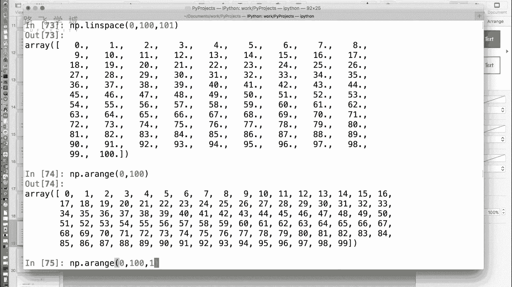

## 创建数值序列数组


在数据处理中，经常需要生成一个数值序列。NumPy提供了类似Python内置 `range` 的函数，但功能更强大。

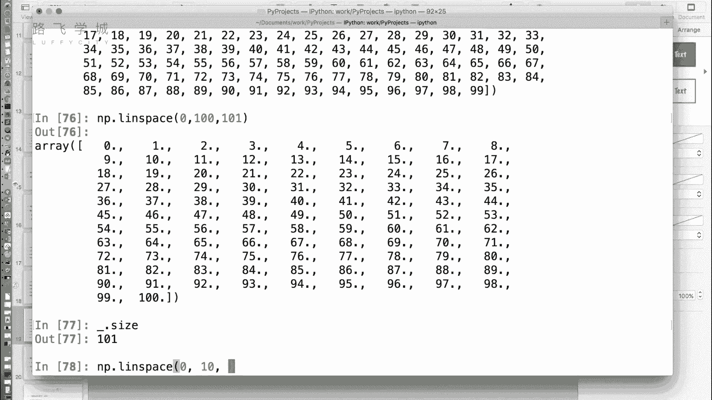

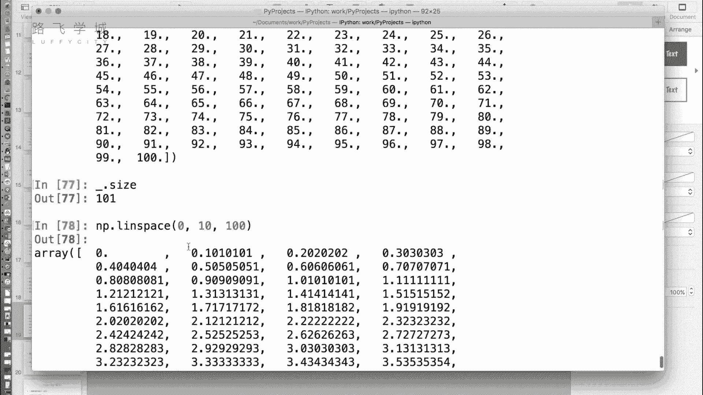

以下是创建数值序列的两种主要方法。

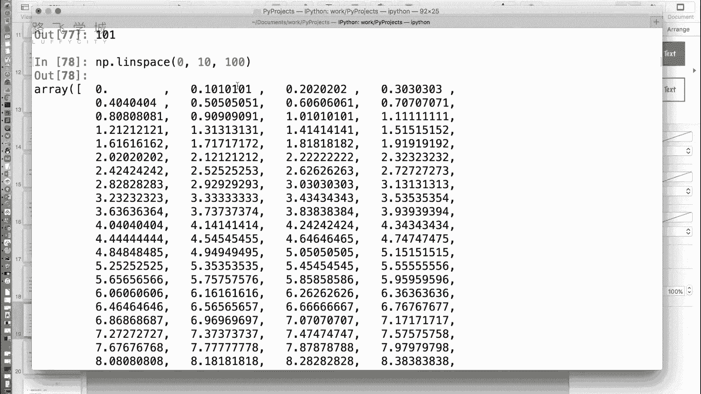


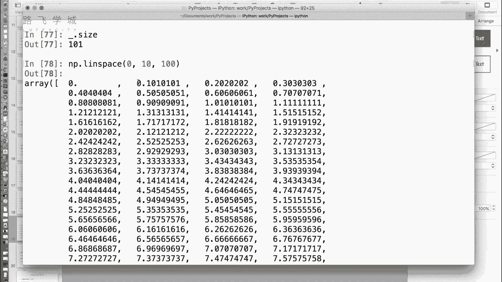

*   **`np.arange(start, stop, step, dtype=None)`**：生成一个在给定区间内，具有固定步长的数组。与 `range` 类似，区间是前闭后开的 `[start, stop)`。步长可以是小数。
    ```python
    # 生成 0 到 99 的整数序列
    seq1 = np.arange(100)
    # 生成 5 到 10，步长为0.5的序列
    seq2 = np.arange(5, 10, 0.5)
    ```


*   **`np.linspace(start, stop, num=50, endpoint=True, dtype=None)`**：在指定的区间 `[start, stop]` 内，生成 `num` 个等间距的样本。默认包含终点（`endpoint=True`）。
    ```python
    # 在 0 到 10 之间生成 5 个等间距的点
    linear_seq = np.linspace(0, 10, 5) # 结果为 [ 0. , 2.5, 5. , 7.5, 10. ]
    # 在 -10 到 10 之间生成 10000 个点，用于绘制函数图像
    x = np.linspace(-10, 10, 10000)
    y = x ** 2 # 计算 y = x^2
    ```
    `linspace` 在需要均匀采样或绘制连续函数图像时非常有用。

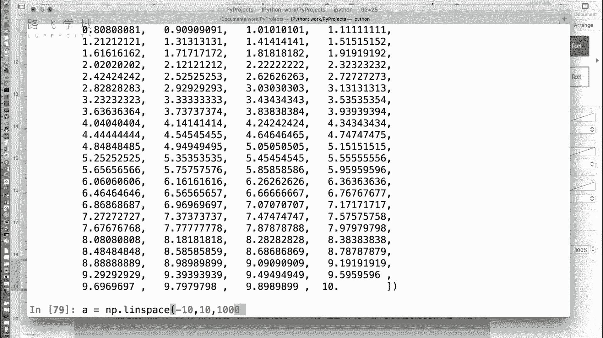

## 创建特殊矩阵


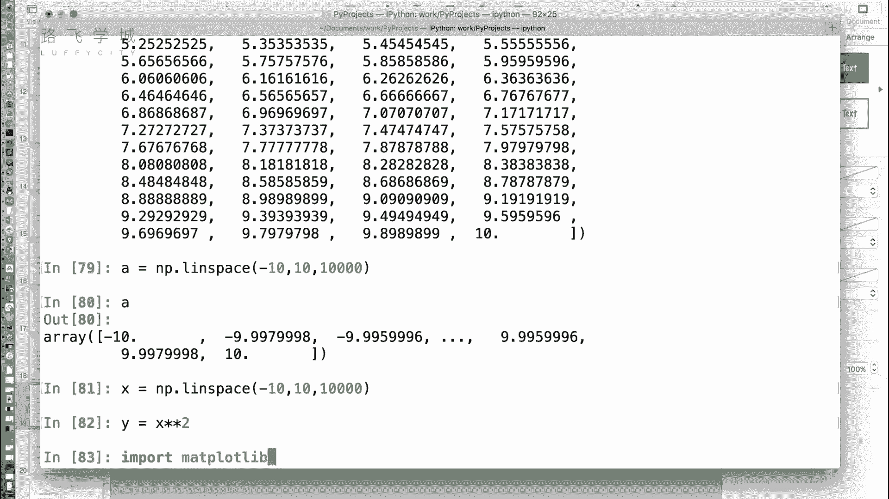

最后，介绍一个在线性代数中常用的函数。

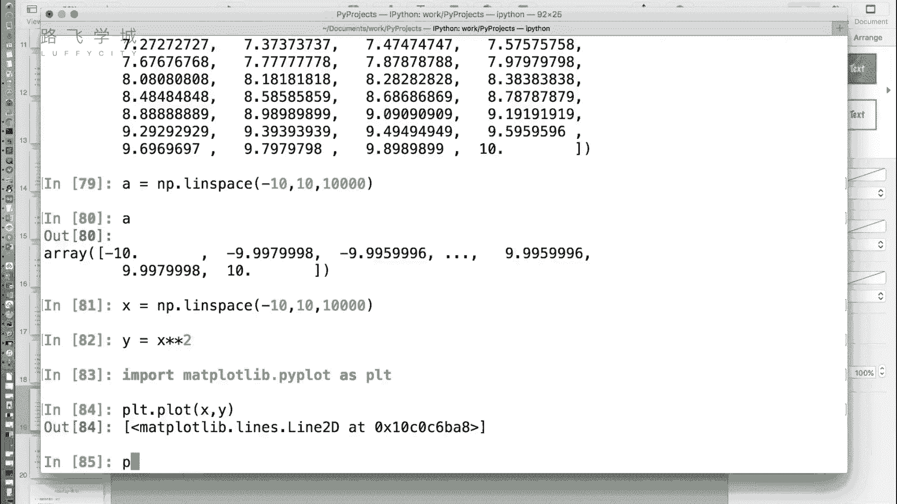


*   **`np.eye(N, M=None, k=0, dtype=float)`**：创建单位矩阵。单位矩阵是一个方阵，主对角线上的元素为1，其余元素为0。
    ```python
    # 创建一个 3x3 的单位矩阵
    identity_matrix = np.eye(3)
    ```
    如果不涉及线性代数运算，这个函数使用频率较低。


本节课中我们一起学习了多种创建NumPy数组的方法，包括从列表转换、创建特殊值数组（`zeros`, `ones`, `empty`）、生成数值序列（`arange`, `linspace`）以及创建单位矩阵（`eye`）。熟练掌握这些方法是利用NumPy进行高效数组操作和后续金融数据分析的第一步。