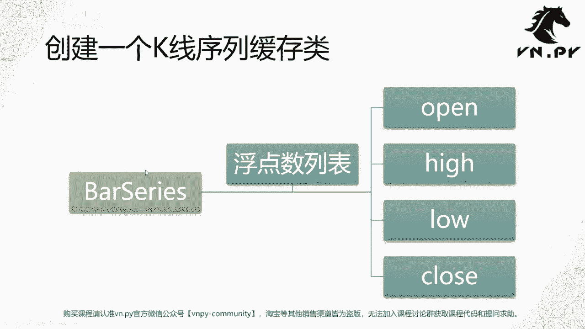
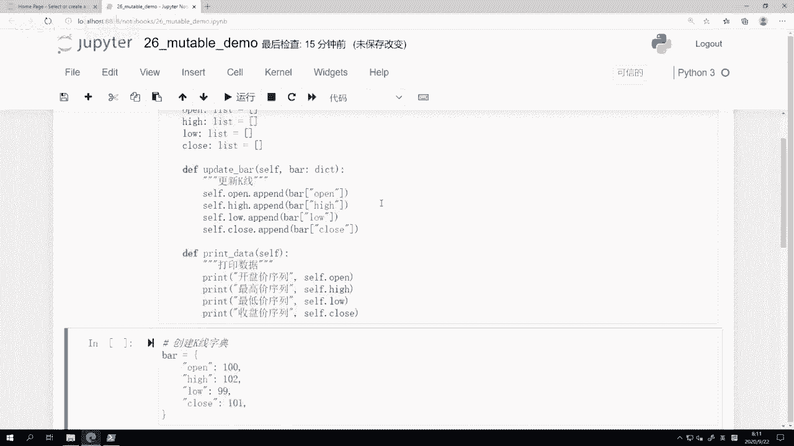
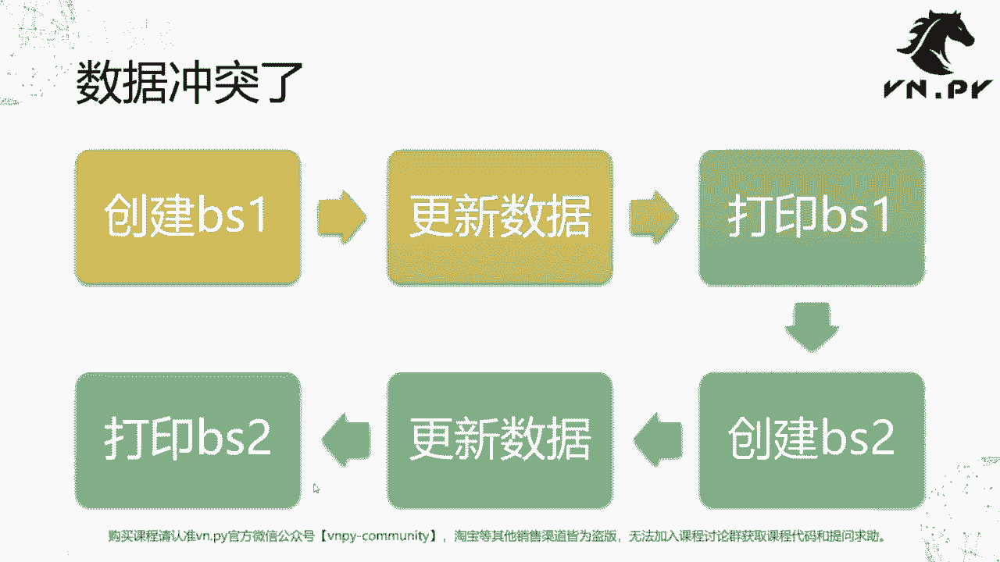
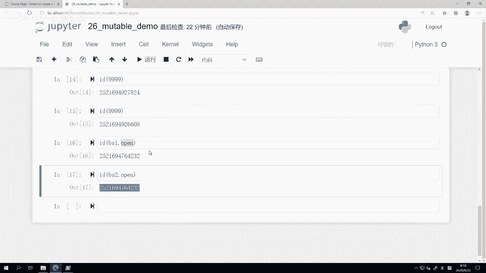
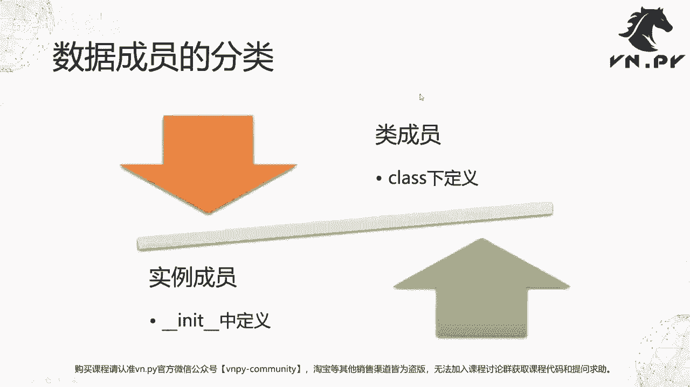
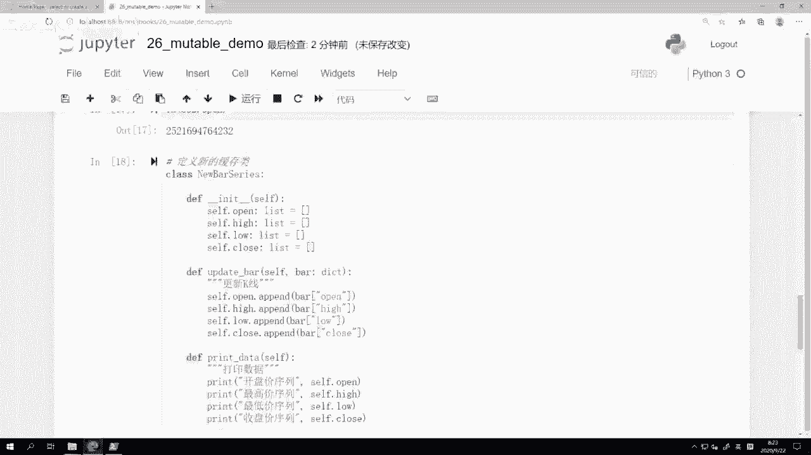
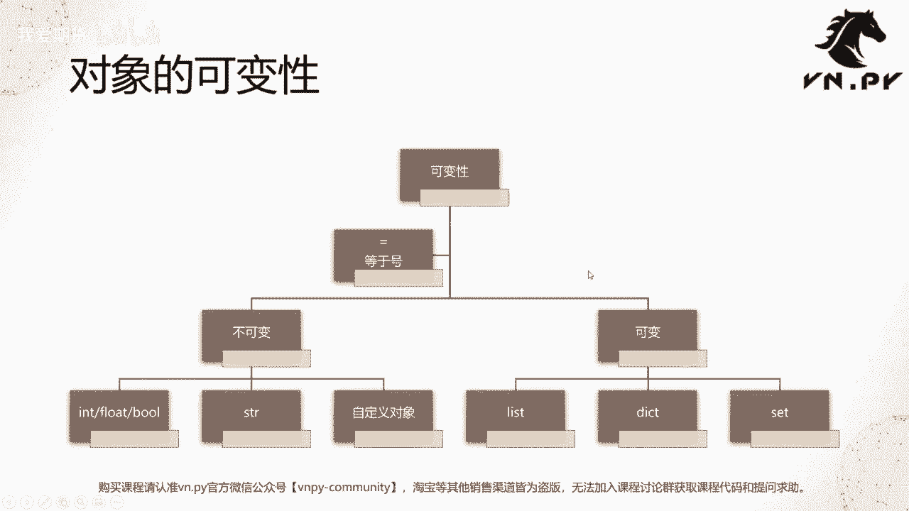
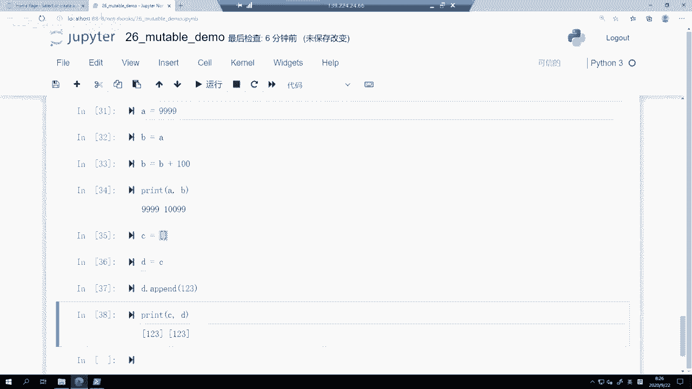
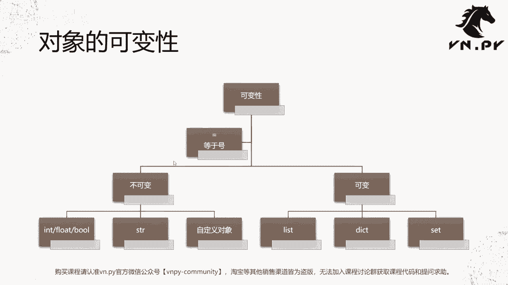

# Python量化开发：26：可变与不可变对象 🧩



## 概述
在本节课中，我们将要学习Python中一个核心且重要的概念：对象的可变性与不可变性。理解这个概念对于编写正确的、无Bug的量化交易代码至关重要。我们将从一个具体的例子出发，探讨为何有时代码行为会与预期不符，并深入理解其背后的原理。

## 从例子开始：K线序列缓存类
上一节我们介绍了如何将面向对象知识与底层交易接口结合。本节中，我们来看看一个具体的类设计问题。

我们首先创建一个名为 `BarSeries` 的类，用于在实盘或回测中缓存不断到来的K线数据，以便后续进行技术指标或统计分析。



以下是这个类的初始定义：
```python
class BarSeries:
    open = []
    high = []
    low = []
    close = []
```
这个类定义了四个成员：`open`, `high`, `low`, `close`，它们都是浮点数列表。



接下来，我们为这个类添加两个方法。

第一个方法是 `update_bar`，用于将一根新K线的数据推送到缓存列表中。
```python
    def update_bar(self, bar):
        self.open.append(bar['open'])
        self.high.append(bar['high'])
        self.low.append(bar['low'])
        self.close.append(bar['close'])
```
第二个方法是 `print_data`，用于打印出缓存的所有数据。
```python
    def print_data(self):
        print("Open:", self.open)
        print("High:", self.high)
        print("Low:", self.low)
        print("Close:", self.close)
```

## 遭遇数据冲突
定义好类之后，我们尝试进行一些操作，看看会发生什么。

首先，我们创建第一个 `BarSeries` 实例 `bs1`，更新一根K线数据并打印。
```python
bar = {'open': 100, 'high': 102, 'low': 99, 'close': 101}
bs1 = BarSeries()
bs1.update_bar(bar)
bs1.print_data()
```
输出结果符合预期，每个列表中都只有我们刚刚添加的那一个数据。

接着，我们创建第二个实例 `bs2`，进行完全相同的操作。
```python
bs2 = BarSeries()
bs2.update_bar(bar)
bs2.print_data()
```
然而，输出结果却出乎意料：每个列表中竟然有两条相同的数据！我们明明只向 `bs2` 更新了一次数据。

## 探究原因：`id`函数与内存地址
为了理解原因，我们需要引入Python的内置函数 `id()`。`id()` 函数用于获取对象在内存中的地址。

我们检查一下两个实例及其属性的内存地址：
```python
print(id(bs1), id(bs2))          # 输出两个不同的地址
print(id(bs1.open), id(bs2.open)) # 输出两个相同的地址！
```
尽管 `bs1` 和 `bs2` 是两个不同的对象（地址不同），但它们的 `open` 列表（以及 `high`, `low`, `close` 列表）却指向内存中同一个列表对象（地址相同）。



这就是数据冲突的根源：我们创建了两个 `BarSeries` 实例，但它们内部的四个列表成员实际上是共享的。对任何一个实例的数据更新，都会影响到另一个实例。



## 类成员 vs 实例成员
在Python中，类定义体内的成员分为两类：
*   **类成员**：直接在 `class` 关键字下定义的变量。所有实例共享同一份类成员。
*   **实例成员**：在 `__init__` 方法中，通过 `self.xxx` 定义的变量。每个实例拥有自己独立的副本。

我们最初将四个列表定义为类成员，这导致了所有实例共享这些列表。

解决方法是将这些列表的定义移到 `__init__` 方法中，使其成为实例成员。

以下是修正后的类定义：
```python
class NewBarSeries:
    def __init__(self):
        self.open = []
        self.high = []
        self.low = []
        self.close = []

    def update_bar(self, bar):
        self.open.append(bar['open'])
        self.high.append(bar['high'])
        self.low.append(bar['low'])
        self.close.append(bar['close'])

    def print_data(self):
        print("Open:", self.open)
        print("High:", self.high)
        print("Low:", self.low)
        print("Close:", self.close)
```
现在，每个 `NewBarSeries` 实例都会在初始化时创建自己独立的四个列表，数据冲突问题得以解决。



## 核心概念：可变与不可变对象
理解了上面的例子，我们来看看其背后的核心概念。Python中的对象基于其创建后内容能否被修改，分为两大类：

**1. 不可变对象**
对象一旦创建，其内容（值）就不能被改变。对它的操作通常会返回一个新的对象。
常见的不可变对象类型包括：
*   基本数据类型：`int`, `float`, `bool`, `None`
*   字符串：`str`
*   元组：`tuple`
*   自定义类的实例（但其属性可能可变）

**2. 可变对象**
对象创建后，其内容可以被修改。
常见的可变对象类型包括：
*   列表：`list`
*   字典：`dict`
*   集合：`set`



## 赋值操作的区别
可变与不可变的特性，深刻影响了赋值 `=` 操作的行为。

对于不可变对象，赋值传递的是值（或说创建了新对象的引用）。
```python
a = 999
b = a        # b 是 a 值的一个新引用
b = b + 100  # 修改 b，会创建一个新的整数对象
print(a)     # 输出 999，a 未受影响
print(b)     # 输出 1099
```



对于可变对象，赋值传递的是引用（内存地址）。
```python
c = [1, 2, 3]
d = c          # d 和 c 指向同一个列表对象
d.append(4)    # 通过 d 修改了这个共享的列表
print(c)       # 输出 [1, 2, 3, 4]，c 也被改变了！
print(d)       # 输出 [1, 2, 3, 4]
```
这种特性赋予了Python强大的灵活性，但也要求开发者必须清晰地知道自己在操作可变对象还是不可变对象，以避免意外的副作用。



## 总结
本节课中我们一起学习了Python中对象的可变性与不可变性。我们从一个K线缓存类的数据冲突问题入手，通过 `id()` 函数探查了内存地址，揭示了**类成员**与**实例成员**的区别。进而，我们深入理解了**可变对象**（如 `list`, `dict`, `set`）和**不可变对象**（如 `int`, `str`, `tuple`）的核心差异，以及它们对赋值操作产生的不同影响。掌握这一概念是写出稳健Python代码，尤其是复杂量化策略代码的基石。在下一节课中，我们将具体探讨这一特性在vn.py策略开发中的实际应用与常见陷阱。