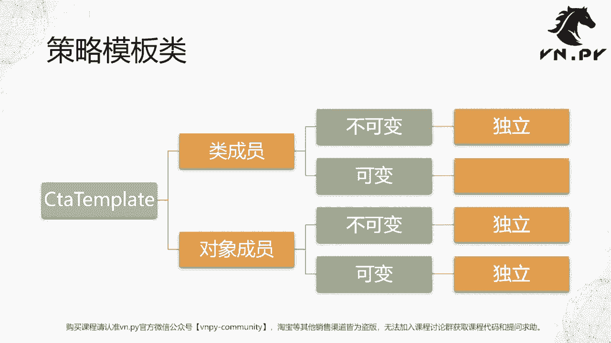
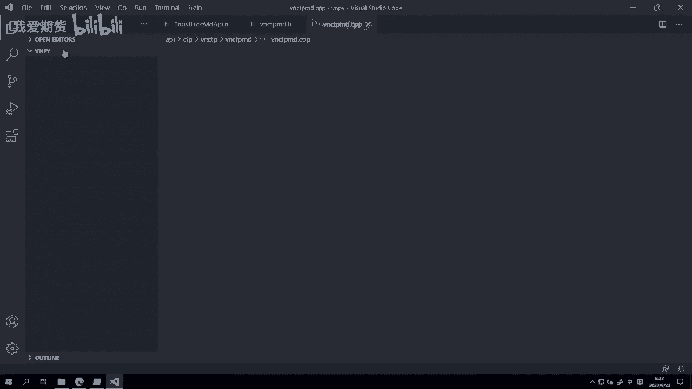
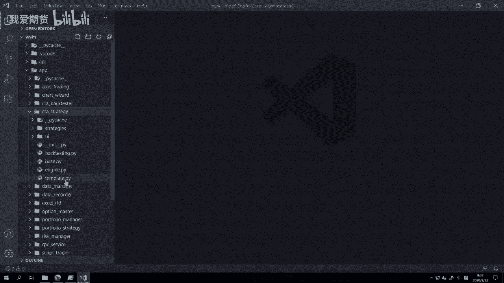
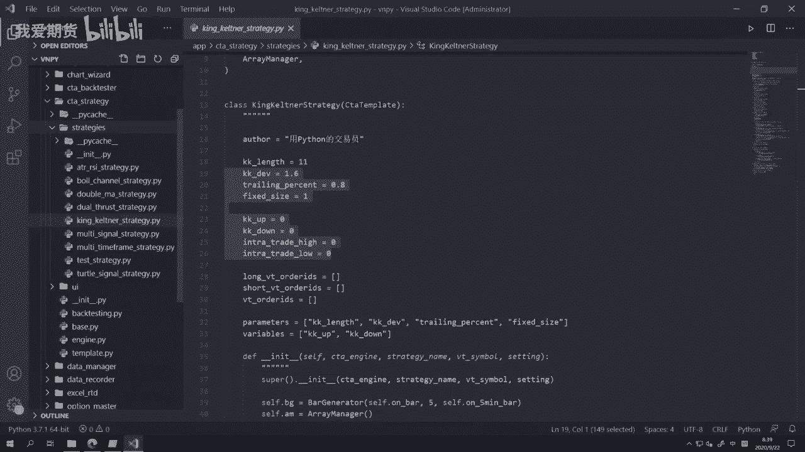
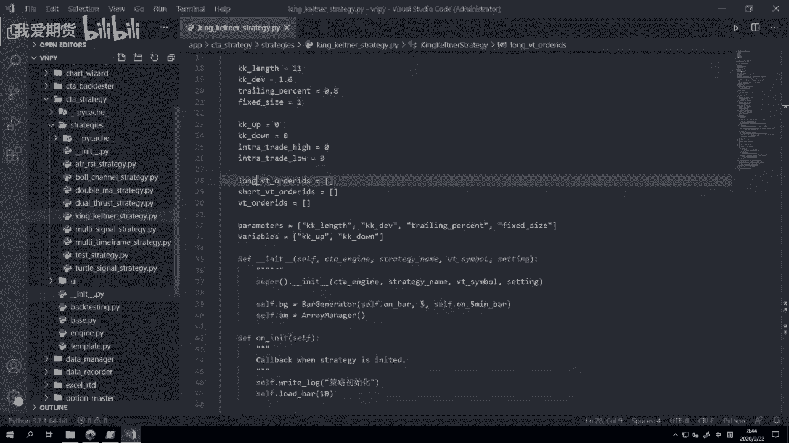

# Python量化开发：27：CTA策略的变量 🧠

在本节课中，我们将学习Python中可变与不可变对象的概念，并深入探讨它们在vn.py框架下编写CTA策略时的具体应用。理解这一区别对于避免策略开发中的常见错误至关重要。

## 策略模板类：回调与主动函数

上一节我们介绍了Python对象的可变性与不可变性。本节中，我们来看看它们在vn.py的CTA策略模板类 `CtaTemplate` 中的实践应用。

`CtaTemplate` 类的作用与我们之前讲解交易接口时的接口层类似。它的函数主要分为两类：



*   **回调函数**：用于接收外部推送的数据或事件通知。
*   **主动函数**：供策略逻辑主动调用，以执行发单、撤单、查询等操作。





以下是回调函数的主要类型及其作用：

*   `on_init`：策略在图形界面被点击“初始化”按钮时触发。
*   `on_start`：策略被点击“启动”按钮时触发。
*   `on_stop`：策略被点击“停止”按钮时触发。
*   `on_tick`：当策略所交易合约的行情推送（Tick）到达时触发。
*   `on_bar`：当由Tick数据合成的新K线生成时触发。
*   `on_trade`：当策略的委托成交时触发。
*   `on_order`：当策略的委托状态发生变化时触发。

以下是常用的主动函数示例：

*   `buy` / `sell` / `short` / `cover`：用于下达买入、卖出、卖空、平仓的委托。
*   `cancel_order`：撤销指定委托。
*   `write_log`：记录策略日志。
*   `load_bar` / `load_tick`：在初始化时加载历史数据。

## 类成员与对象成员：可变性的陷阱

在策略类中，我们需要定义一些成员变量来缓存数据或记录状态。这些变量可能是一个简单的数字（不可变对象），也可能是一个数据容器，如列表、字典或集合（可变对象）。

定义这些变量时，可以选择将其定义为**类成员**（在类内部直接定义）或**对象成员**（在 `__init__` 函数内通过 `self.` 定义）。这两种方式在类的实例化时有本质区别。

*   **类成员中的不可变对象**：当创建多个策略实例（例如实例A和实例B）时，它们各自的该成员指向**不同的独立对象**。修改实例A的该成员不会影响实例B。
    ```python
    class StrategyExample:
        fixed_value = 100  # 类成员，不可变对象（整数）
    ```

*   **类成员中的可变对象**：当创建多个策略实例时，它们各自的该成员默认**指向同一个内存地址（共享同一个对象）**。在任何一个实例中修改该对象，都会影响到所有其他实例。
    ```python
    class StrategyExample:
        shared_list = []  # 类成员，可变对象（列表）
    ```

*   **对象成员（定义在 `__init__` 中）**：无论成员是可变还是不可变对象，每个策略实例都拥有**完全独立的一份拷贝**，不会相互干扰。
    ```python
    class StrategyExample:
        def __init__(self):
            self.unique_list = []  # 对象成员，每个实例独立
            self.unique_value = 100 # 对象成员，每个实例独立
    ```

因此，如果在类成员中定义了可变对象（如列表、字典），并且策略可能会被创建多个实例，就必须警惕由此引发的数据冲突问题。



## 实战代码解析：问题与解决方案


让我们通过vn.py官方示例中的一个策略来具体分析。以下是 `KingKeltnerStrategy` 策略的部分代码：

```python
class KingKeltnerStrategy(CtaTemplate):
    # 类成员定义
    author = “作者”
    fast_window = 10
    slow_window = 20

    # 潜在的问题：类成员中的可变对象
    long_pos = 0
    short_pos = 0
    long_orders = []  # 列表，可变对象！
    short_orders = [] # 列表，可变对象！
    cover_orders = [] # 列表，可变对象！

    parameters = [“fast_window”, “slow_window”]
    variables = [“long_pos”, “short_pos”]

    def __init__(self, cta_engine, strategy_name, vt_symbol, setting):
        super().__init__(cta_engine, strategy_name, vt_symbol, setting)
        # 关键：在初始化函数中重新指向新的空列表
        self.long_orders = []
        self.short_orders = []
        self.cover_orders = []
```

在这个例子中，`long_orders`、`short_orders`、`cover_orders` 三个列表被定义为了类成员。如果不对其进行特殊处理，创建该策略的多个实例（例如同时交易IF、IH、IC三个合约）会导致这些实例共享这三个列表，从而造成委托号记录混乱。

**解决方案有两种：**

1.  **推荐方法：定义为对象成员**
    直接将这三个列表的定义从类成员中删除，仅在 `__init__` 函数中初始化。这样最清晰，每个实例都拥有独立的列表。
    ```python
    class KingKeltnerStrategy(CtaTemplate):
        # ... 其他不可变类成员 ...
        def __init__(self, cta_engine, strategy_name, vt_symbol, setting):
            super().__init__(cta_engine, strategy_name, vt_symbol, setting)
            self.long_orders = []  # 仅在对象初始化时创建
            self.short_orders = []
            self.cover_orders = []
    ```

2.  **备用方法：在 `__init__` 中重新初始化**
    如果出于某些原因（例如希望在图形界面变量监控中显示这些列表），仍需将其保留为类成员，则**必须**在 `__init__` 函数中对其进行重新赋值（指向一个新的空列表）。这相当于覆盖了类成员初始的共享引用，使每个实例获得独立的对象。
    ```python
    self.long_orders = []  # 这行代码创建了一个新的列表，覆盖了类成员指向的原始共享列表
    ```

**核心区别**：方法1中，列表在类级别不存在，仅在实例化后才创建。方法2中，列表在类级别已存在一个默认的共享版本，实例化时被新的独立列表覆盖。



## 总结与灵活应用

本节课中，我们一起学习了可变与不可变对象在vn.py CTA策略开发中的关键应用。

*   **核心要点**：在策略类中定义缓存数据的容器（列表、字典、集合等可变对象）时，若策略可能被创建多个实例，务必确保它们被定义为**对象成员**（在 `__init__` 中初始化），以避免多个实例间数据意外共享导致的错误。
*   **并非绝对错误**：需要强调的是，将可变对象定义为类成员并非绝对错误，它实际上实现了一种“全局变量”或“共享状态”的机制。如果你有意识地在多个策略实例间共享某些数据（例如汇总计算总仓位、总资金占用），那么这正是正确的用法。
*   **设计原则**：关键在于根据你的设计意图来选择。如果数据应严格归属于单个策略实例，请使用对象成员。如果数据需要在所有实例间共享和通信，则可以使用类成员（但需充分理解其影响）。


理解并妥善处理可变对象的共享问题，是写出健壮、可靠量化策略代码的重要一步。