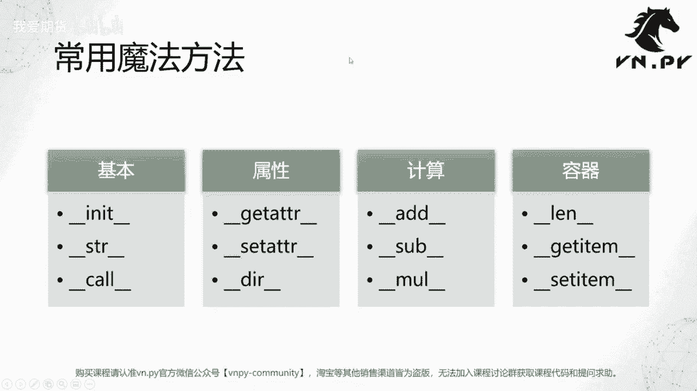

# Python量化开发：28：定制魔法方法 🧙‍♂️

## 概述
在本节课中，我们将学习Python中一个高级且强大的概念——魔法方法。我们将了解它们是什么、它们如何工作，并通过实例演示如何利用它们来定制类的行为，使我们的代码更加灵活和强大。

---

## 什么是魔法方法？
上一节我们介绍了对象的可变性与不可变性。本节中，我们来看看魔法方法。

魔法方法是Python类中一种特殊的方法。它们有两个关键特征：
1.  它们是类内部定义的方法，不是独立的函数。
2.  它们的名称前后都有双下划线 `__` 包围。

最著名的例子就是 `__init__` 方法。这些方法的作用是**定义对象在进行基础操作时的行为**。通俗地说，就是当Python解释器对对象执行内置操作（如打印、相加、求长度）时，我们可以通过定义这些方法来控制对象的具体反应。

这引出了一个更深层的概念——**元编程**。元编程允许编程语言在运行时动态地修改或生成代码。Python在这方面功能强大，而魔法方法正是实现元编程的重要工具之一。

---

## 两个核心魔法方法示例
以下是两个最常用魔法方法的详细说明。

### `__init__` 方法
`__init__` 方法在类被实例化为对象时，由Python解释器**自动调用**。我们通常在此方法中初始化对象的属性。

```python
class TradeData:
    def __init__(self, symbol, price, volume):
        self.symbol = symbol
        self.price = price
        self.volume = volume

# 实例化对象时，__init__被自动调用
trade = TradeData('AAPL', 150.0, 100)
```

**注意**：我们几乎从不主动调用 `trade.__init__()`，它的执行是由创建对象这一动作触发的。

### `__str__` 方法
`__str__` 方法定义了当对象被转换为字符串（例如使用 `print()` 或 `str()` 函数）时的行为。

如果不定义 `__str__`，直接打印对象会输出类似 `<__main__.TradeData object at 0x...>` 的内存地址信息，这通常没有意义。

```python
class TradeData:
    def __init__(self, symbol, price, volume):
        self.symbol = symbol
        self.price = price
        self.volume = volume

    def to_string(self):
        return f"交易: {self.symbol}, 价格: {self.price}, 数量: {self.volume}"

    def __str__(self):
        # 当调用 print() 或 str() 时，解释器自动调用此方法
        return self.to_string() + " (来自__str__)"

trade = TradeData('AAPL', 150.0, 100)
print(trade.to_string())  # 输出: 交易: AAPL, 价格: 150.0, 数量: 100
print(trade)               # 输出: 交易: AAPL, 价格: 150.0, 数量: 100 (来自__str__)
print(str(trade))          # 输出: 交易: AAPL, 价格: 150.0, 数量: 100 (来自__str__)
```

通过定义 `__str__`，我们让对象的字符串表示变得更有用，且无需手动调用 `.to_string()` 方法。

---

## 其他常用魔法方法简介
了解了 `__init__` 和 `__str__` 后，我们来看看其他一些有用的魔法方法。以下是部分常见魔法方法的列表：

*   **`__call__`**：允许将一个类的实例像函数一样调用。
    ```python
    class Multiplier:
        def __call__(self, a, b):
            return a * b

    mul = Multiplier()
    result = mul(5, 3)  # 输出: 15
    ```

*   **`__len__`**：定义当使用内置函数 `len()` 时的行为。
    ```python
    class OrderBook:
        def __init__(self, orders):
            self.orders = orders
        def __len__(self):
            return len(self.orders)

    book = OrderBook(['order1', 'order2', 'order3'])
    print(len(book))  # 输出: 3
    ```

*   **`__add__`**：定义加法操作 `+` 的行为。
    ```python
    class Vector:
        def __init__(self, x, y):
            self.x = x
            self.y = y
        def __add__(self, other):
            return Vector(self.x + other.x, self.y + other.y)

    v1 = Vector(1, 2)
    v2 = Vector(3, 4)
    v3 = v1 + v2  # v3 是一个新的 Vector(4, 6)
    ```

*   **属性访问方法**：
    *   `__getattr__`：当访问不存在的属性时被调用。
    *   `__setattr__`：当设置属性值时被调用。
    *   `__dir__`：定义当调用 `dir()` 函数时的行为。

*   **容器类方法**：
    *   `__getitem__`：定义使用下标 `obj[key]` 获取元素的行为。
    *   `__setitem__`：定义使用下标 `obj[key] = value` 设置元素的行为。

Python内置的魔法方法有上百个，熟练掌握它们能极大地提升代码的表达能力和灵活性。

---

## 总结
本节课我们一起学习了Python中的魔法方法。我们首先理解了魔法方法的概念及其在元编程中的作用，然后重点剖析了 `__init__` 和 `__str__` 这两个最常用的方法，并通过代码示例展示了它们如何工作。最后，我们简要介绍了其他一些常见的魔法方法，如 `__call__`、`__len__` 和 `__add__`。




魔法方法是Python面向对象编程中进阶且强大的工具。虽然初学者可能无法立刻全部掌握，但了解它们的存在和基本用途非常重要。当未来你的代码需要更精细地控制对象行为时，这些知识将成为解决问题的钥匙。