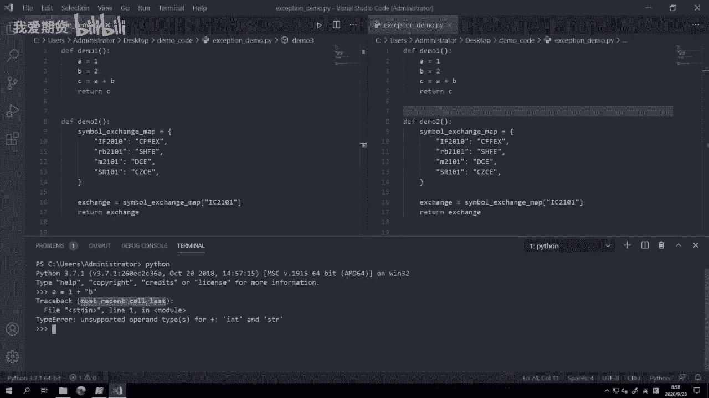
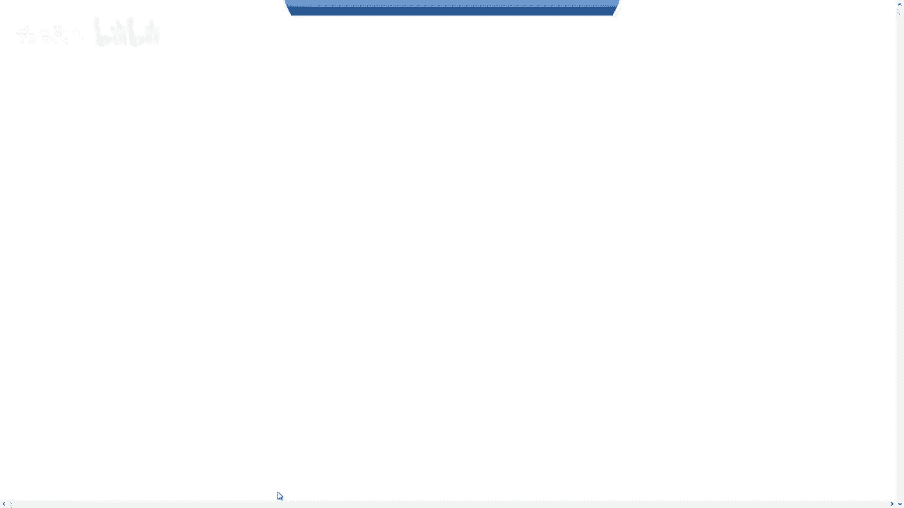
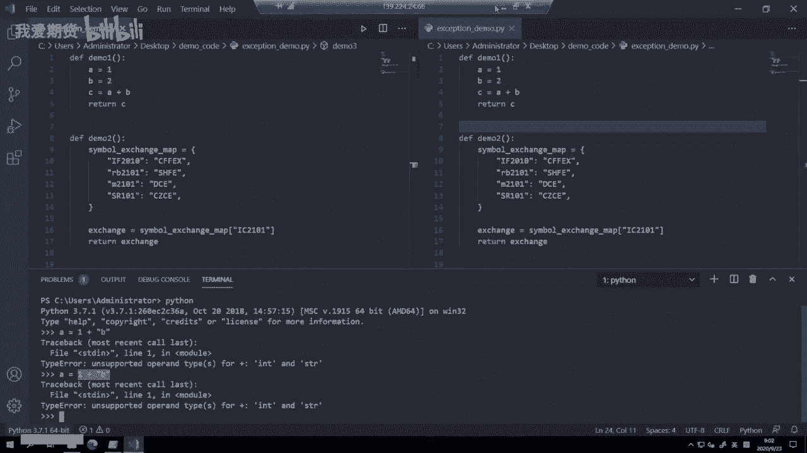
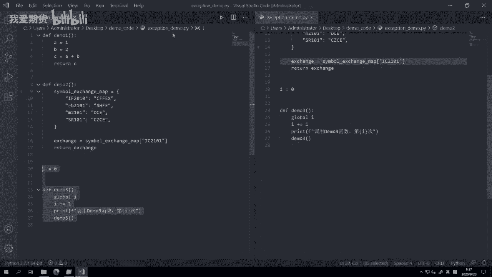

# Python量化开发：29：异常定义与常见类型 🐍

在本节课中，我们将要学习Python编程中一个非常重要的概念——**异常**。异常是程序运行出错时，解释器向我们发出的信号。理解异常有助于我们快速定位和修复代码中的问题。

上一节我们介绍了面向对象开发的知识，本节中我们来看看程序出错时会发生什么。


## 什么是异常？

异常的英文是 `exception`。它主要出现在程序运行出错的时候。在C++、C等编译型语言中，程序出错往往会直接崩溃退出。例如，Windows上的Office或浏览器有时会突然关闭窗口，这通常就是程序内部发生了异常。



对于开发者而言，程序直接崩溃并不友好，因为难以定位问题所在。Python在解释器层面提供了完善的异常捕捉功能。Python内部99%以上的出错情况，解释器都能自动捕捉。这样，即使程序运行被打断，我们也能直观地看到问题出在哪里，并快速修复，让程序恢复正常运行。这也是Python能显著提升开发效率的原因之一。

以下是几种常见的错误类型：



*   **语法错误**：例如，错误地使用了Python关键字，或运算符前后缺少必要的元素。
*   **运算错误**：例如，整数加整数、浮点数乘浮点数是正常的运算。但如果用字符串去乘以一个浮点数，Python就会抛出错误，因为这种计算模式不被支持。
*   **调用错误**：通常围绕函数或对象发生。例如，定义了一个需要两个参数的加法函数，但调用时只传入了一个参数，或传入了三个参数。此时解释器会提示调用出错。

接下来，我们尝试触发一个异常，看看它具体是什么样子。

## 触发一个异常



一个最简单的例子：`a = 1 + “b”`，这里尝试将一个整数与一个字符串相加。


```python
a = 1 + "b"
```

运行这行代码，会抛出一个 `Traceback` 信息。

```
Traceback (most recent call last):
  File "<stdin>", line 1, in <module>
TypeError: unsupported operand type(s) for +: 'int' and 'str'
```

`Traceback` 意为跟踪记录。`most recent call last` 表示最近调用的代码行。Python会在发生异常的那一行立即停止程序并抛出异常信息，这样我们才能定位问题。异常信息不会在程序运行很多行之后才抛出。

## 异常信息的构成

异常信息大体上由三部分构成：

1.  **出错位置**：包括出错发生在哪个Python文件，以及文件中的哪一行。
2.  **异常类型**：例如，是数据类型错误、字典键值未找到错误，还是其他类型的错误。
3.  **提示信息**：即使是同一类型的错误，在不同情境下也有不同的细节。提示信息能帮助我们更快确定错误的具体原因。

以刚才的 `TypeError` 为例，它是因为整数和字符串不能相加。提示信息 `unsupported operand type(s) for +: 'int' and 'str'` 明确指出：对于加号 `+` 这个运算符，不支持 `int`（整数）和 `str`（字符串）这两种类型的操作。

回到异常信息本身：
*   `File "<stdin>"`：表示出错的代码来源于标准输入（即我们手动输入），而非某个文件。
*   `line 1`：表示出错在第一行（因为我们只输入了一行代码）。
*   `in <module>`：表示错误发生在模块的全局作用域中。
*   `TypeError`：是异常类型，表示类型错误。
*   最后一行是具体的错误描述。

## 三种常见的异常示例

上一节我们介绍了异常的基本概念，本节中我们来看看三个更复杂的异常例子，分别是语法错误、字典访问错误和递归深度错误。

以下是三个不同维度的异常示例：

1.  **语法错误 (SyntaxError)**
    代码中缺少必要的元素，例如 `c = a +` 后面缺少了变量 `b`。
    ```python
    def demo1():
        a = 1
        b = 2
        c = a +  # 这里语法错误，缺少了 b
        return c
    ```
    运行时会提示：`SyntaxError: invalid syntax`，并指向出错的行和位置。

2.  **键错误 (KeyError)**
    尝试访问字典中不存在的键。
    ```python
    def demo2():
        symbol_exchange_map = {
            "IF2010": "CFFEX",
            "rb2101": "SHFE",
            "m2101": "DCE",
            "SR101": "CZCE"
        }
        # 尝试访问不存在的键
        exchange = symbol_exchange_map["IC2101"]
        return exchange
    ```
    运行时会提示：`KeyError: 'IC2101'`。在VS Code中，按住 `Ctrl` 键并点击错误行，可以快速跳转到出错的代码位置。

    > **注意**：国内不同期货交易所的合约代码命名规则（如大小写、数字位数）可能不同，这是交易中的常识，需要牢记。

3.  **递归错误 (RecursionError)**
    函数递归调用自身超过Python默认的深度限制（约1000层）。
    ```python
    i = 0
    def demo3():
        global i
        i += 1
        print(f"第 {i} 次调用 demo3")
        # 函数内部调用自身，形成递归
        demo3()
    ```
    运行时会打印约995次后抛出 `RecursionError: maximum recursion depth exceeded`。Python设置递归深度限制是为了防止无限递归耗尽内存，导致程序或系统崩溃。当递归深度接近1000时，通常意味着程序逻辑可能存在问题。

## 总结

本节课中我们一起学习了Python异常的核心概念。我们了解到异常是程序运行时的错误信号，由出错位置、异常类型和提示信息三部分构成。我们通过实例观察了三种常见异常：**语法错误 (SyntaxError)**、**键错误 (KeyError)** 和 **递归错误 (RecursionError)** 的表现形式。

掌握异常信息有助于我们快速调试代码。初学者最常遇到的是语法错误，随着编程深入，可能会遇到更多运行时异常如键错误。递归错误则在特定算法中可能出现。Python完善的异常机制是提升开发效率的重要工具。



---
更多精华内容，请扫码关注我们的社区公众号。