# Python基础：2：条件语句和循环 🐍

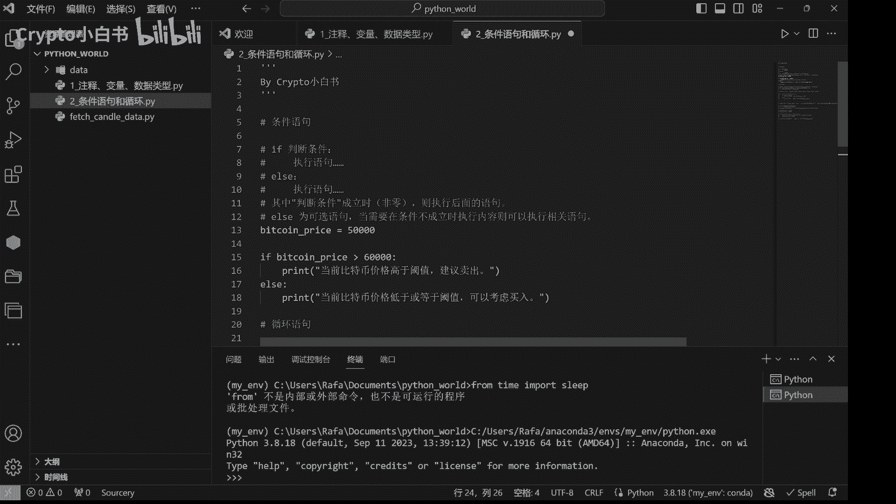

在本节课中，我们将要学习Python中两个非常重要的控制结构：条件语句和循环。它们是编写程序逻辑的基础，能帮助我们根据不同的情况执行不同的代码，或者重复执行某些任务。

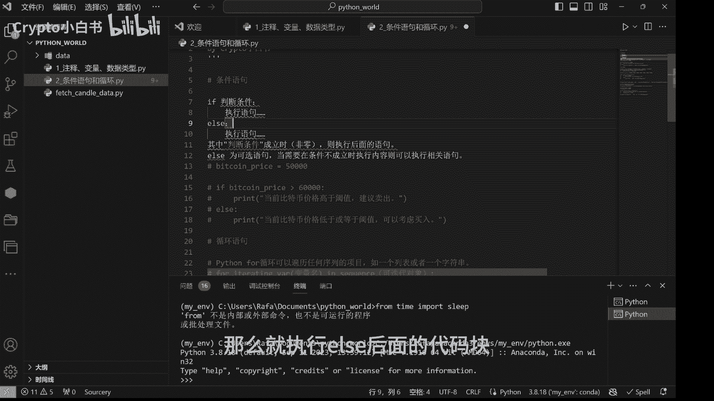

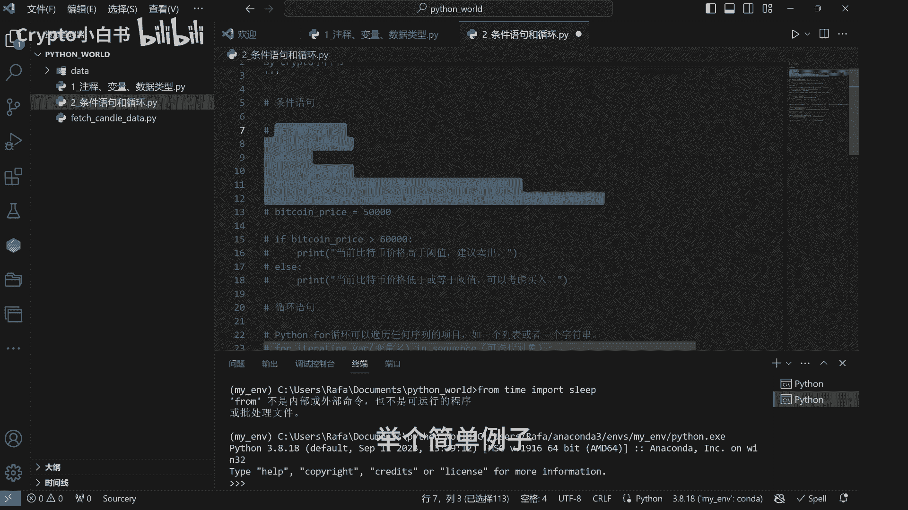

## 条件语句：if-else

上一节我们介绍了Python的基本语法，本节中我们来看看如何让程序根据条件做出决策。条件语句的结构是：如果某个条件成立，就执行一段代码；否则，执行另一段代码。

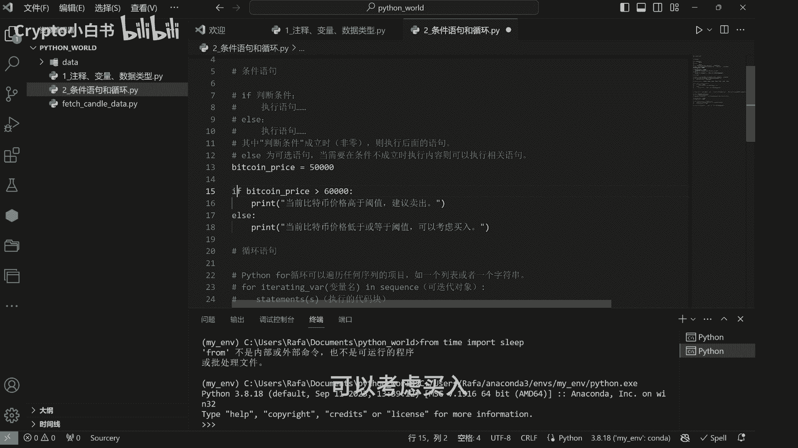

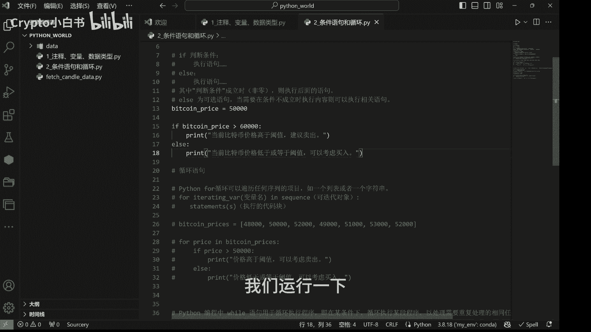

其基本语法结构如下：
```python
if 判断条件:
    执行语句  # 条件为真时执行
else:
    执行语句  # 条件为假时执行
```

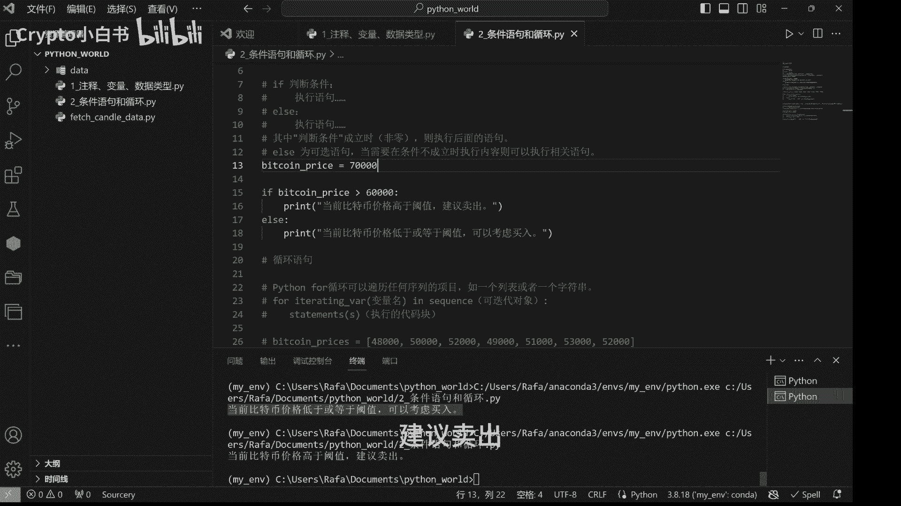

以下是条件语句在数字货币量化投资中的一个简单应用案例。假设我们需要根据比特币价格决定交易策略：

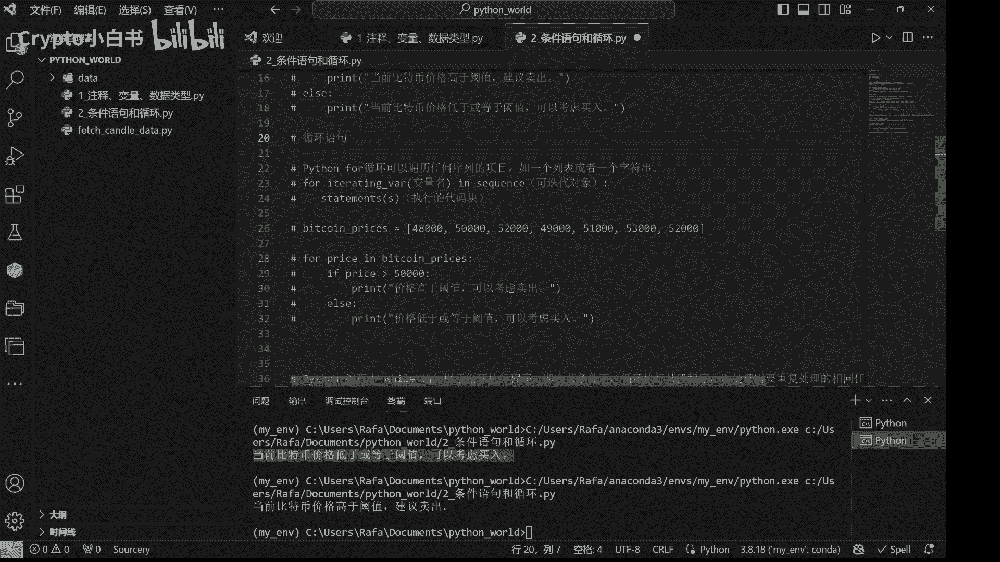

```python
# 设定比特币价格
bitcoin_price = 50000

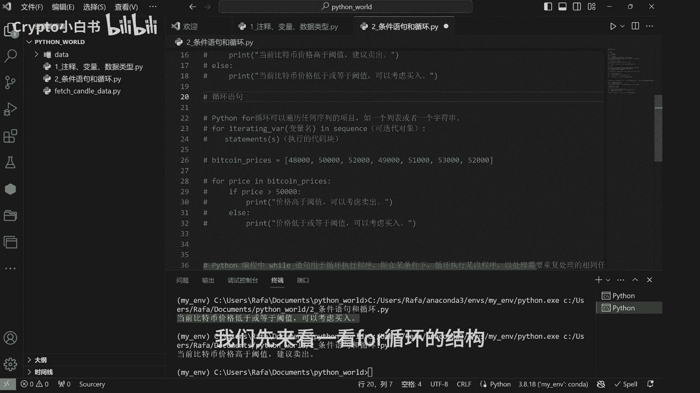

# 判断逻辑
if bitcoin_price > 60000:
    print("当前比特币价格高于阈值，建议卖出。")
else:
    print("当前比特币价格低于或等于阈值，可以考虑买入。")
```
运行上述代码，因为价格是50000，所以会输出“可以考虑买入”。如果将价格改为70000，则会输出“建议卖出”。

## 循环语句：for循环

掌握了条件判断后，我们来看看如何让程序重复执行任务。循环语句允许我们重复执行某一段代码。首先介绍`for`循环，它常用于遍历一个序列（如列表或字符串）中的每个元素。

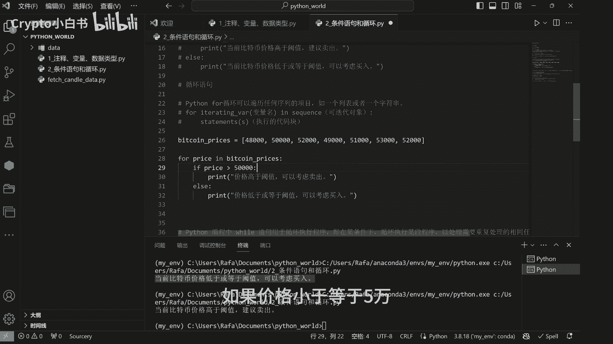

`for`循环的基本结构如下：
```python
for 变量 in 可迭代对象:
    执行语句  # 对每个变量执行的操作
```

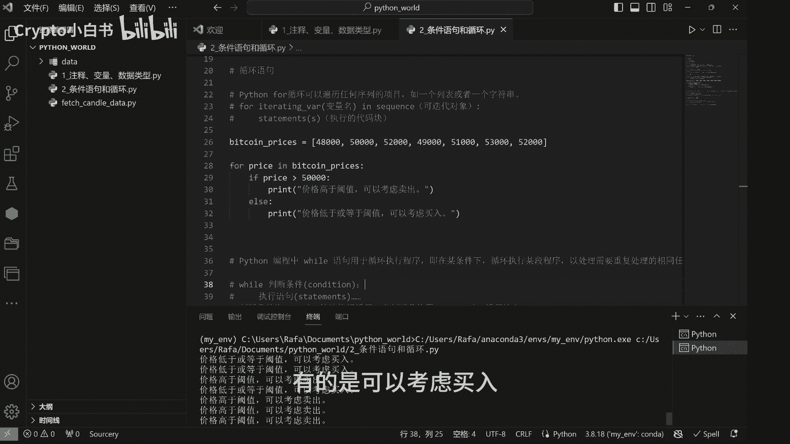

以下是`for`循环的一个应用案例。假设我们有一个列表，存储了过去一周比特币每日的收盘价：

```python
# 过去一周比特币日末价格列表
bitcoin_prices = [52000, 61000, 59000, 48000, 53000, 62000, 51000]

# 遍历列表中的每个价格并进行判断
for price in bitcoin_prices:
    if price > 50000:
        print(f"价格 {price}: 高于阈值，建议卖出。")
    else:
        print(f"价格 {price}: 低于或等于阈值，可以考虑买入。")
```
运行这段代码，程序会对列表中的每一个价格执行判断，并打印出相应的建议。

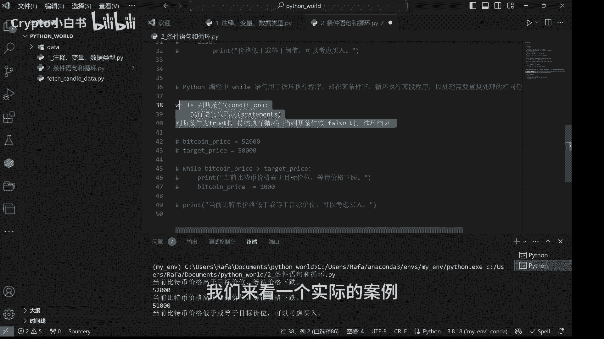

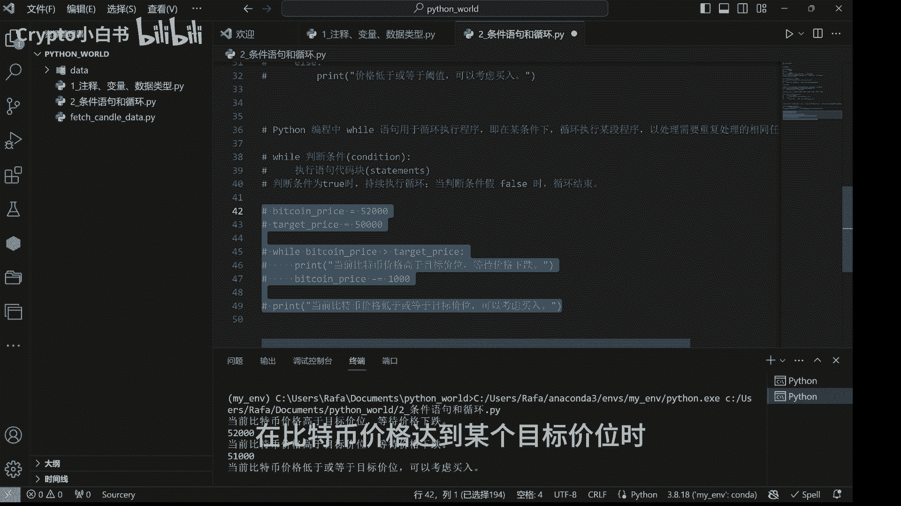

## 循环语句：while循环

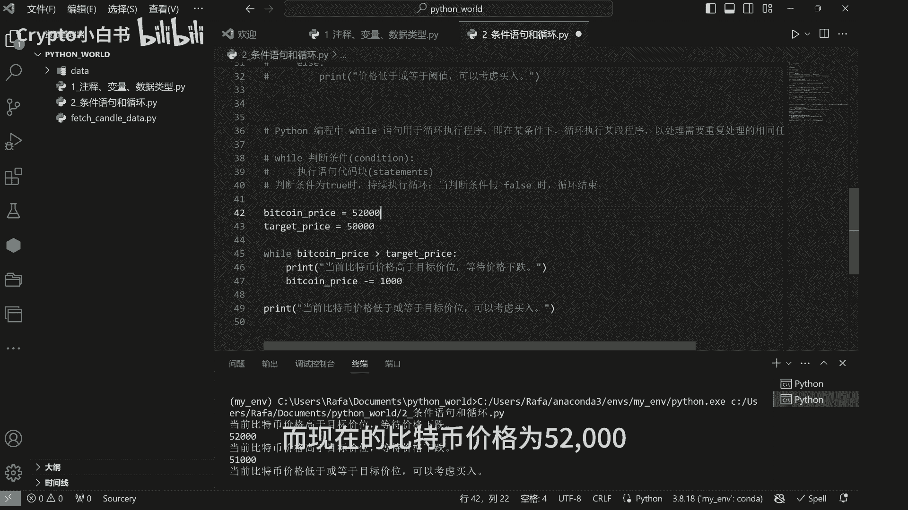

除了`for`循环，Python还提供了`while`循环。`while`循环会在条件为真时，反复执行其代码块，直到条件变为假为止。

`while`循环的基本结构如下：
```python
while 判断条件:
    执行语句  # 条件为真时重复执行
```

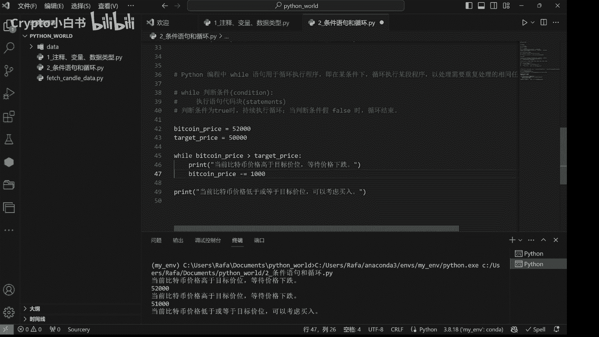

为了帮助理解，我们来看一个模拟交易场景的案例。假设我们希望当比特币价格跌破50000时进行买入操作，而当前价格为52000：

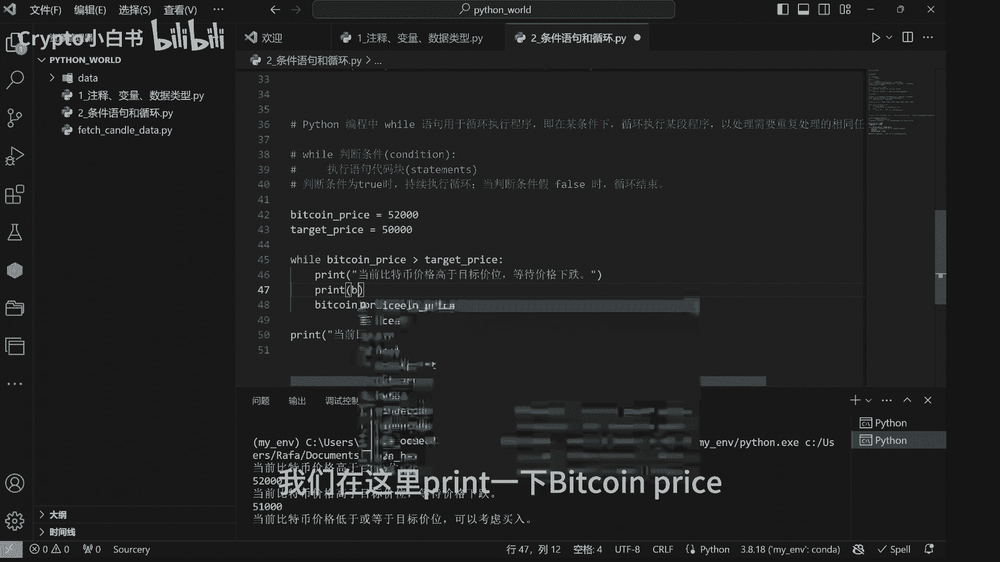

```python
# 初始化价格和目标价
bitcoin_price = 52000
target_price = 50000

# 当价格高于目标价时，持续等待并模拟价格下跌
while bitcoin_price > target_price:
    print(f"当前比特币价格 {bitcoin_price} 高于目标价位，等待价格下跌。")
    # 模拟价格下跌1000
    bitcoin_price -= 1000
    print(f"价格更新为: {bitcoin_price}")

# 循环结束后，价格已低于或等于目标价
print("当前比特币价格低于或等于目标价位，可以考虑买入。")
```
这段代码的逻辑是：只要`bitcoin_price`大于`target_price`，就会打印等待信息并让价格减少1000。当价格减到50000时，条件不再成立，循环结束，程序执行最后的买入建议。

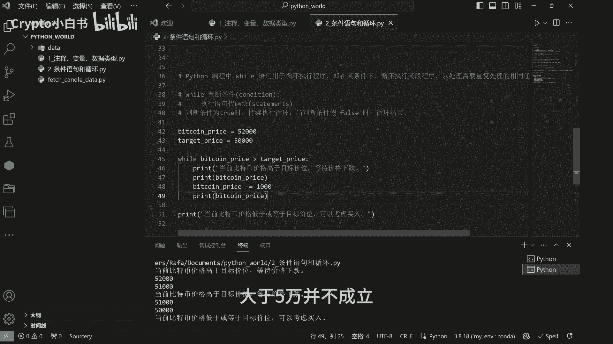

## 总结

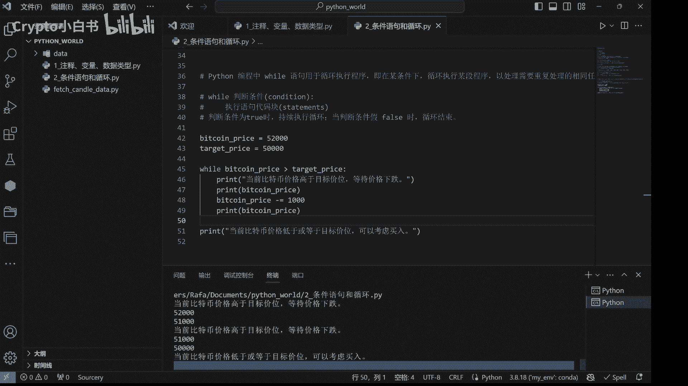

本节课中我们一起学习了Python的条件语句和循环。
*   **条件语句（if-else）** 让程序能够根据不同的条件执行不同的代码路径。
*   **循环语句** 则让重复执行代码变得简单。
    *   **for循环** 通常用于遍历已知的序列。
    *   **while循环** 则在满足某个条件时持续运行。

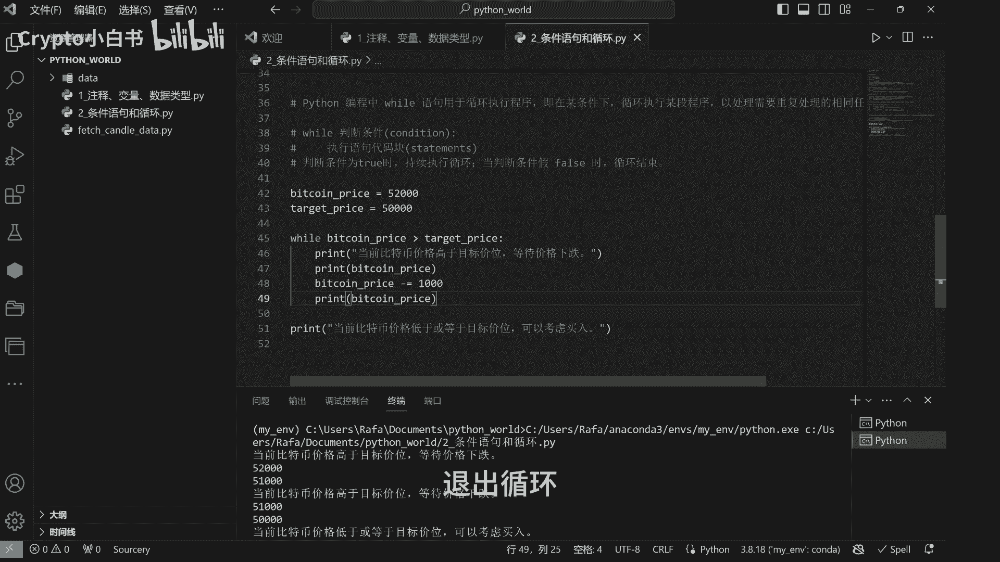

理解并熟练运用这些控制结构，是编写复杂程序逻辑的关键一步。