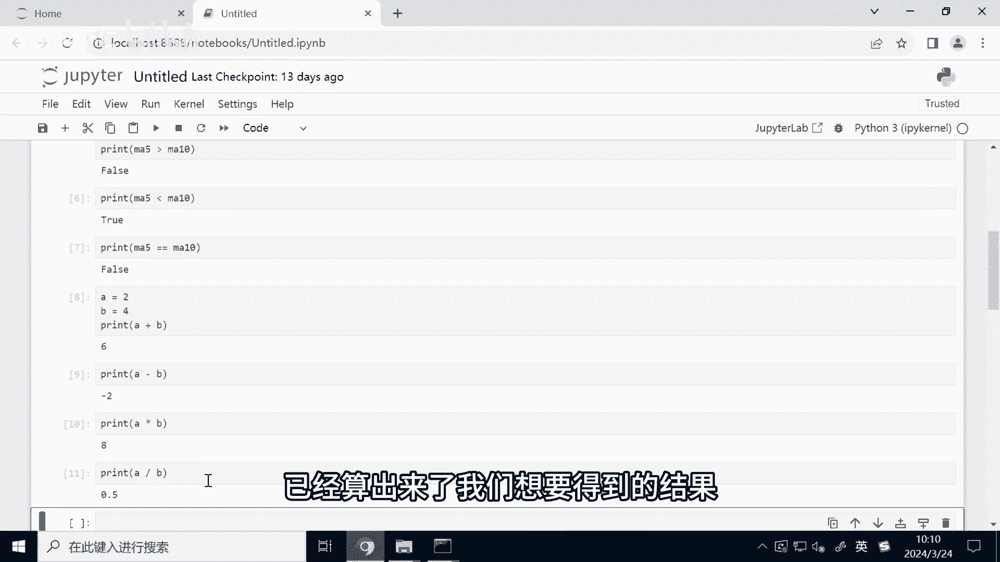
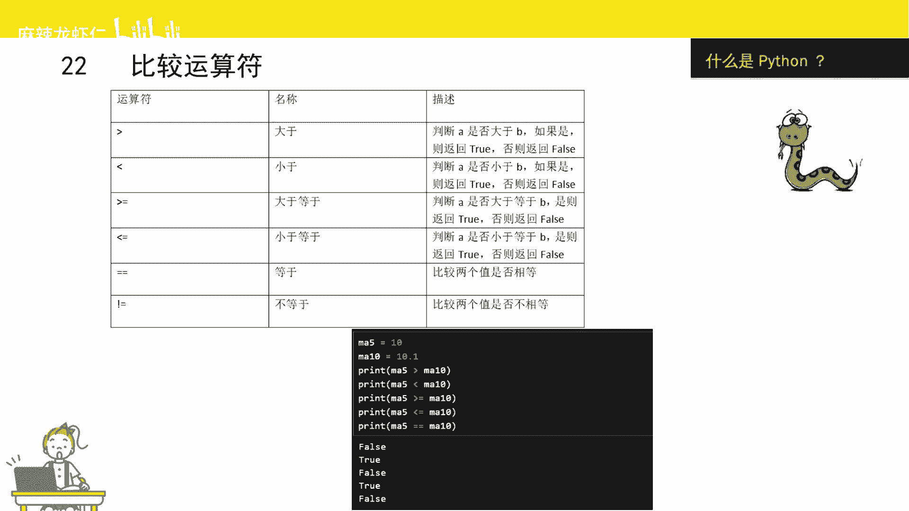
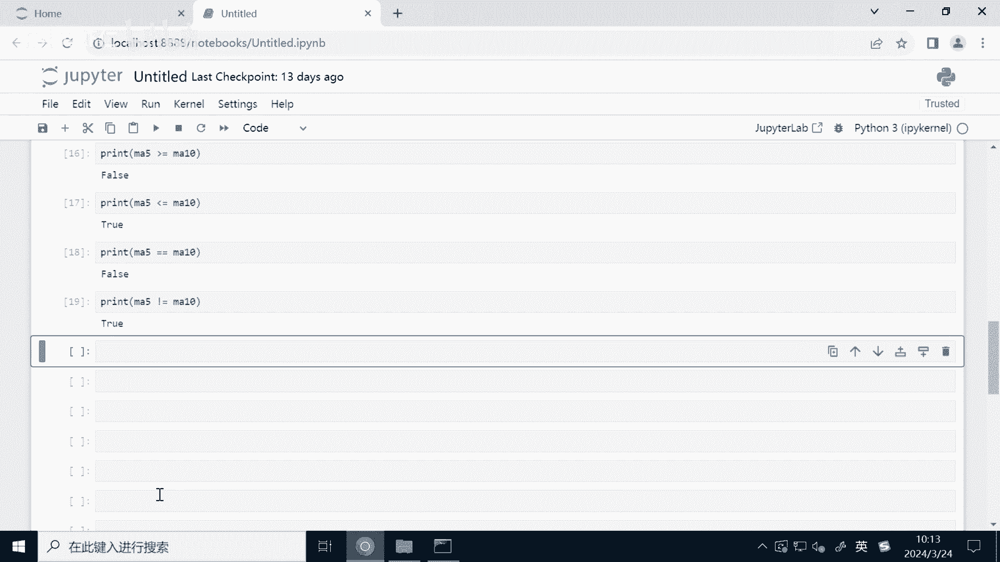
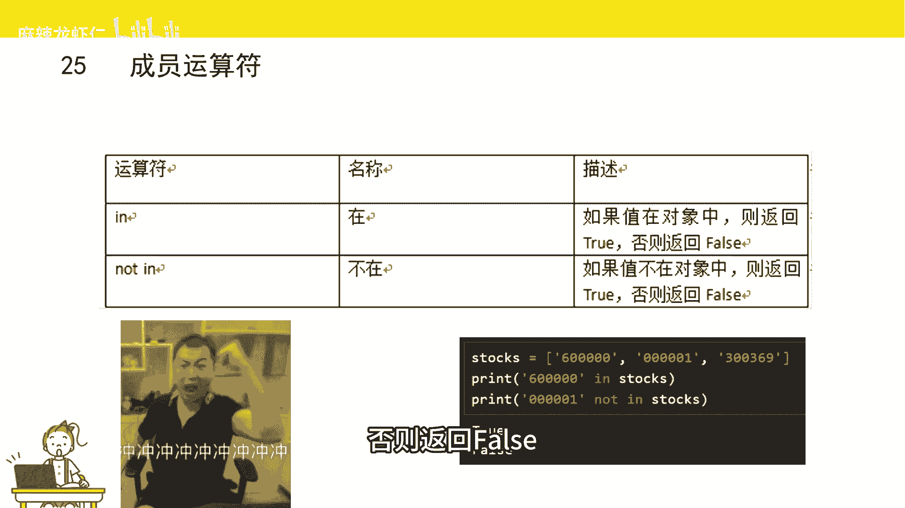

# Python量化交易速成：P1：运算符 🧮

在本节课中，我们将要学习Python中的运算符。运算符是用于对数据进行操作的符号，例如对数字进行加减乘除，或者比较两个值的大小。掌握运算符是编写任何程序，包括量化交易策略的基础。


## 算术运算符 ➕➖✖️➗

上一节我们提到了运算符的基本概念，本节中我们来看看最基础的算术运算符。算术运算符用于执行基本的数学运算，如加、减、乘、除等。

以下是Python中主要的算术运算符：


*   `+`：加法
*   `-`：减法
*   `*`：乘法
*   `/`：除法
*   `%`：取余（返回除法的余数）
*   `//`：整除（返回商的整数部分）
*   `**`：幂运算（计算一个数的多少次方）

让我们通过代码来理解它们：

```python
# 定义两个变量
A = 2
B = 4

# 加法
print(A + B)  # 输出：6



# 减法
print(A - B)  # 输出：-2

# 乘法
print(A * B)  # 输出：8

# 除法
print(A / B)  # 输出：0.5

# 取余
print(B % A)  # 输出：0



# 整除
print(B // A) # 输出：2

# 幂运算
print(A ** B) # 输出：16 (2的4次方)
```

## 比较运算符 ⚖️

除了基本的算术运算，我们经常需要比较两个值的大小或是否相等。比较运算符用于比较两个值，并返回一个布尔值（`True` 或 `False`）。

以下是Python中的比较运算符：

*   `>`：大于
*   `<`：小于
*   `>=`：大于等于
*   `<=`：小于等于
*   `==`：等于（注意是两个等号）
*   `!=`：不等于



在量化交易中，我们常用比较运算符来比较价格或指标。例如，判断5日均线是否大于10日均线。

```python
# 定义两条均线
ma5 = 10
ma10 = 10.1

# 判断 ma5 是否大于 ma10
print(ma5 > ma10)   # 输出：False

# 判断 ma5 是否小于 ma10
print(ma5 < ma10)   # 输出：True

# 判断 ma5 是否大于等于 ma10
print(ma5 >= ma10)  # 输出：False


# 判断 ma5 是否小于等于 ma10
print(ma5 <= ma10)  # 输出：True

# 判断两者是否相等
print(ma5 == ma10)  # 输出：False

# 判断两者是否不相等
print(ma5 != ma10)  # 输出：True
```

> **注意**：在Python中，判断相等使用两个连续的等号 `==`，单个等号 `=` 是赋值运算符，初学者很容易混淆。

## 赋值运算符 🏷️

我们已经多次使用了赋值运算符 `=`，它的作用是将一个值赋给一个变量。除了基本的赋值，Python还提供了一些复合赋值运算符，可以将运算和赋值合并为一步。


以下是常见的赋值运算符：

*   `=`：基本赋值
*   `+=`：加法赋值（`a += b` 等价于 `a = a + b`）
*   `-=`：减法赋值
*   `*=`：乘法赋值
*   `/=`：除法赋值

复合赋值运算符在更新变量值时非常方便。例如，在交易中更新账户资金。

```python
# 初始资金
cash = 1000000

# 卖出股票，资金增加10000
cash += 10000  # 等价于 cash = cash + 10000
print(cash)    # 输出：1010000

# 买入股票，资金减少5000
cash -= 5000   # 等价于 cash = cash - 5000
print(cash)    # 输出：1005000
```

## 逻辑运算符 🔗

逻辑运算符用于组合多个布尔条件，主要用在条件判断中。在量化策略中，我们经常需要同时满足多个条件才执行操作。


Python中的逻辑运算符有三种：

*   `and`：逻辑“与”。**两边条件都为 `True`，结果才为 `True`**。
*   `or`：逻辑“或”。**两边条件有一个为 `True`，结果就为 `True`**。
*   `not`：逻辑“非”。**对布尔值取反**，`True` 变 `False`，`False` 变 `True`。

例如，判断股票是否处于均线多头排列（5日线 > 10日线 > 20日线）。

```python
ma5 = 12
ma10 = 11
ma20 = 10

# 使用 and 判断是否同时满足两个条件
if ma5 > ma10 and ma10 > ma20:
    print("均线呈多头排列")  # 条件成立，会执行打印

# 使用 not 取反
condition = ma5 > ma10
print(not condition)  # 输出：False，因为 condition 是 True

# 使用 or 判断
if ma5 > 20 or ma10 > 15:
    print("至少有一条均线超过阈值")
```

## 成员运算符 📋

成员运算符用于测试一个元素是否存在于一个序列（如列表、元组、字符串）中。在量化中，可以用来检查某只股票是否在我们的自选股列表里。


Python的成员运算符有两个：

*   `in`：如果在序列中找到值，返回 `True`。
*   `not in`：如果在序列中没有找到值，返回 `True`。

```python
# 定义一个自选股票列表
watch_list = ['600000', '000001', '300750']



# 检查 ‘600000’ 是否在列表中
stock_code = '600000'
print(stock_code in watch_list)      # 输出：True

# 检查 ‘000002’ 是否不在列表中
stock_code2 = '000002'
print(stock_code2 not in watch_list) # 输出：True
```

---


本节课中我们一起学习了Python编程中至关重要的运算符。我们介绍了用于数学计算的**算术运算符**，用于比较大小的**比较运算符**，用于给变量赋值的**赋值运算符**，用于组合多个条件的**逻辑运算符**，以及用于检查元素是否在集合中的**成员运算符**。这些是构建任何量化交易策略逻辑判断和计算的基础砖石，请务必熟练掌握。