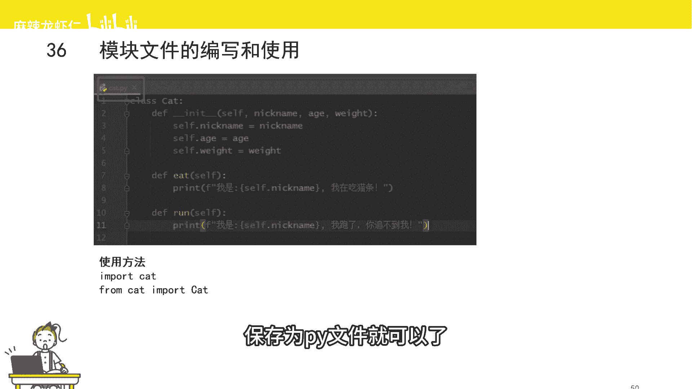
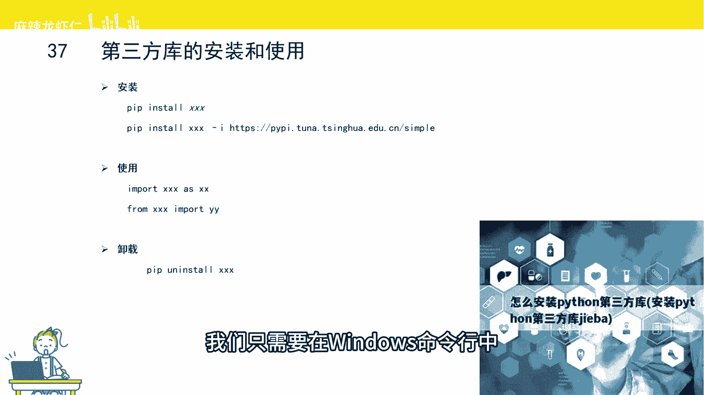
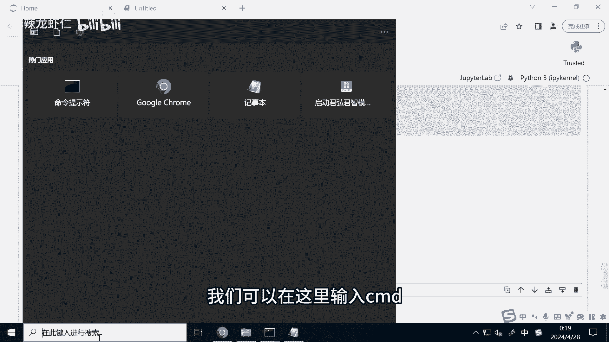
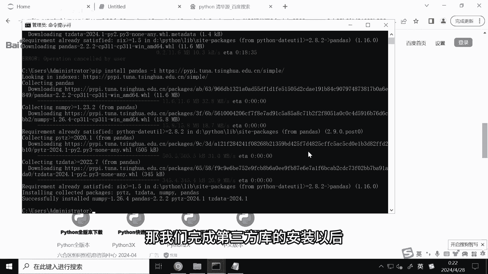
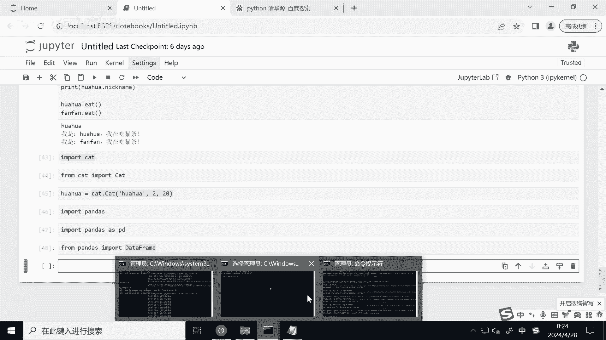
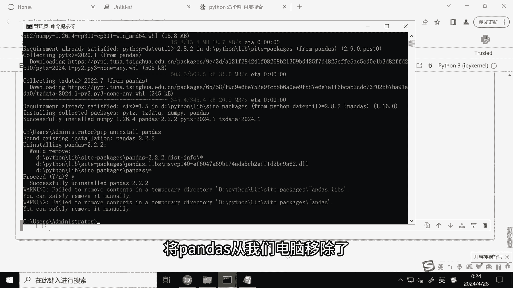
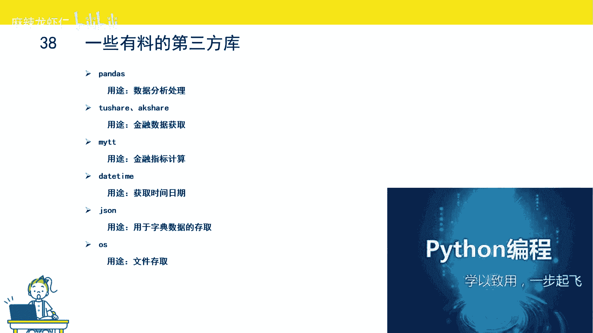

# Python量化交易速成：P1：Python模块 🐍

在本节课中，我们将要学习Python模块的概念、创建方法以及如何安装和使用第三方库。模块是组织Python代码的重要方式，理解它对于后续的量化交易编程至关重要。

## 模块是什么？📦

上一节我们介绍了函数和类，本节中我们来看看更大的代码组织单元——模块。

函数是一个完成特定功能的代码块。类是一个比函数更大的概念，类里面可以包括一批成员函数。模块是比类更大的一个概念，模块里面可以有多个类、多个函数，它是一个打包好的、实现特定功能的代码块。


模块有两种：
*   一种是别人写的，我们称之为第三方模块。业内有个术语叫做“轮子”，我们不要重复造轮子，意思是不要去重复实现那些已经实现的功能。
*   另一种就是我们自己写的模块。

## 如何创建自己的模块？✍️



我们自己要怎么写模块呢？


我们只需要把自己写的代码，保存为 `.py` 文件就可以了。


我们来试一下。复制之前定义的 `Cat` 类的代码。在运行Jupyter Notebook的目录下，新建一个名为 `cat` 的文件，将后缀改为 `.py`。用记事本打开这个文件，把复制好的代码粘贴进去并保存。这样我们就自己写了一个模块。

## 如何使用模块？🔧

如果我们要使用这个模块，该怎么办呢？

我们可以直接 `import` 这个文件名。这样就引入了这个文件下面所有的类和函数。

```python
import cat
```

如果我们只需要这个文件里面的 `Cat` 这个类，其他的暂时不用，那就可以用 `from ... import ...` 来只引入 `Cat` 类。

```python
from cat import Cat
```

要调用模块里面的函数或者是类，需要怎么做呢？只需要“模块的名字”后面加“点”，再跟上需要调用的函数或类名。

例如，我们要初始化 `Cat` 这个类，只需要 `cat.Cat()`。这里的 `cat` 是我们引入的模块的名字，点号后面的 `Cat` 就是我们定义在文件里的那个类。这样我们就完成了模块里类的调用。



## 如何安装第三方库？📥



刚刚我们讲到，不能重复造轮子。对于一些常见的功能，Python几乎都有相应的库。Python提供了很多第三方库，很多功能别人已经帮你写好了，这也是Python这么火的原因之一。

Python如何安装第三方库呢？其实很简单，我们只需要在Windows命令行中去安装即可。


在文件夹地址栏输入 `cmd`。


然后按回车打开命令窗口。例如，安装一个 `pandas` 库，可以输入 `pip install pandas`，然后按回车。系统会自动帮我们去国外的Python源上面下载pandas的文件并进行安装。

由于默认的pip源在国外，下载安装会比较慢。有没有办法能加快速度呢？我们可以把Python的源从国外的源，切换成国内的源，比如清华大学的源。

我们先按 `Ctrl + C` 把当前的安装进程关掉。使用国内的源，需要加上 `-i` 这个参数，后面跟上国内源的地址。

```bash
pip install pandas -i https://pypi.tuna.tsinghua.edu.cn/simple
```

按回车后，可以发现安装速度比刚才快很多。原因是我们从国内的网站下载Python的第三方模块，速度比国外快很多。这样就完成了 `pandas` 这个库的安装。

## 如何使用第三方库？🚀



完成第三方库的安装以后，要怎么使用它呢？


我们可以用 `import` 语句来实现第三方库的引入。

```python
import pandas
```

这样就引入了 `pandas` 这个库。我们还可以用 `as` 关键词来给库起一个简写别名。

```python
import pandas as pd
```

后续调用的时候，就可以用 `pd.` 来进行相应模块的调用。

如果我们只引入这个第三方库里面的某个函数或类，可以这么做：



```python
from pandas import DataFrame
```

这样就只单独引入了 `DataFrame` 这个类。

## 如何卸载第三方库？🗑️



我们演示了怎么安装第三方库，那要怎么去卸载呢？


可以使用 `pip uninstall` 命令。

```bash
pip uninstall pandas
```

安装是 `install`，卸载是 `uninstall`，前面加个 `un`。系统会提示按 `Y` 来确认。这样就成功将 `pandas` 从电脑移除了。

## 量化交易常用第三方库介绍 📚


接下来给大家介绍几个量化交易中常用的第三方库。

以下是几个核心库及其用途：

*   **pandas**：一个用来做数据处理的库。量化交易本质上是数据科学，所以pandas在量化交易里用得非常广泛。
*   **tushare 或 akshare**：这两个都是金融数据库，能提供很多免费的金融数据，比如历史行情、财务数据等，方便我们用来做策略研究。
*   **TA-Lib**：这是一个金融指标计算库，可以将通达信的公式转化为Python代码。因为国内很多股民使用通达信，所以这个库非常实用。
*   **datetime**：这是一个时间库，可以用来获取时间，对时间变量进行操作。这很重要，因为股票交易都有时间限制，我们经常用这个库来进行时间的判断。
*   **json**：用来对字典型数据进行存取的库。我们有时候需要把策略的参数保存到本地，这时就可能会用到JSON文件。
*   **os**：这是文件操作库，用于读取、写入和管理文件。

## 总结 📝



本节课中我们一起学习了Python模块。我们了解了模块是组织代码的容器，可以自己创建 `.py` 文件作为模块，并通过 `import` 语句来使用。更重要的是，我们学会了如何利用 `pip` 命令安装和管理强大的第三方库，并介绍了一些在量化交易领域中不可或缺的库，如 `pandas`、`tushare` 和 `TA-Lib` 等。掌握这些是构建量化交易策略的基础。