# Python量化交易速成：P1：基本数据类型与操作 📊

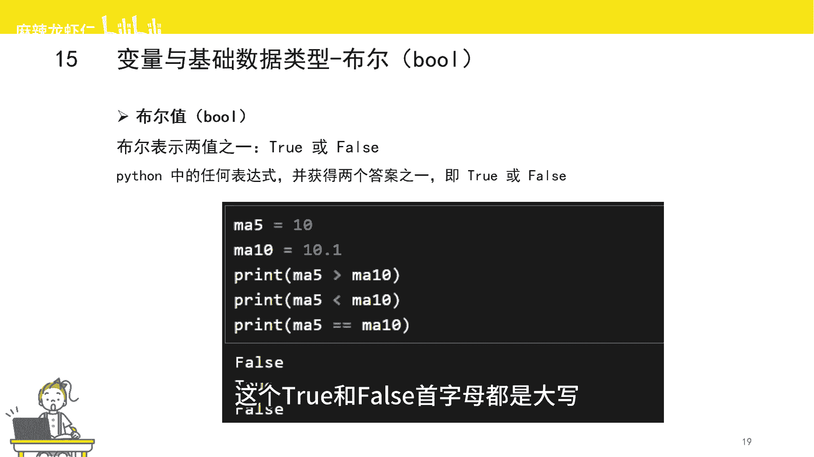

在本节课中，我们将学习Python量化交易中几种最常用的基本数据类型及其核心操作。理解这些数据类型是编写任何策略的基础，它们将帮助你存储、处理和判断市场数据。

## 布尔类型 (Boolean) 🔘

布尔类型用于表示逻辑上的“真”或“假”，在量化策略中常用于条件判断。在Python中，`True`表示正确，`False`表示错误，注意首字母必须大写。

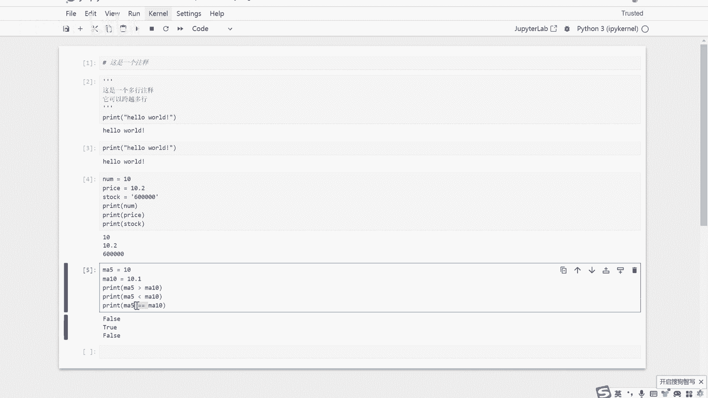

**定义与判断示例：**
```python
ma5 = 10.0  # 5日均线值
ma10 = 10.1 # 10日均线值

print(ma5 > ma10)   # 判断5日均线是否大于10日均线
print(ma5 < ma10)   # 判断5日均线是否小于10日均线
print(ma5 == ma10)  # 判断5日均线是否等于10日均线
```
运行结果依次为 `False`, `True`, `False`。其中 `==` 是“等于”比较运算符。

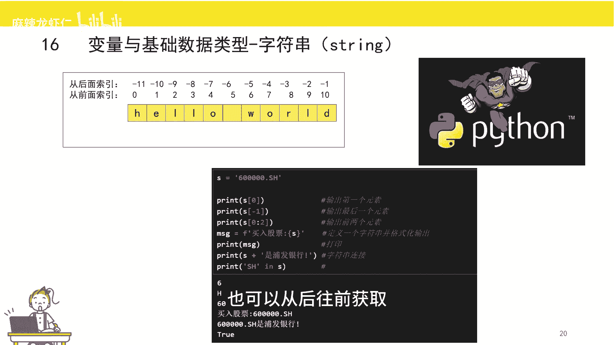

---

## 字符串 (String) 📝

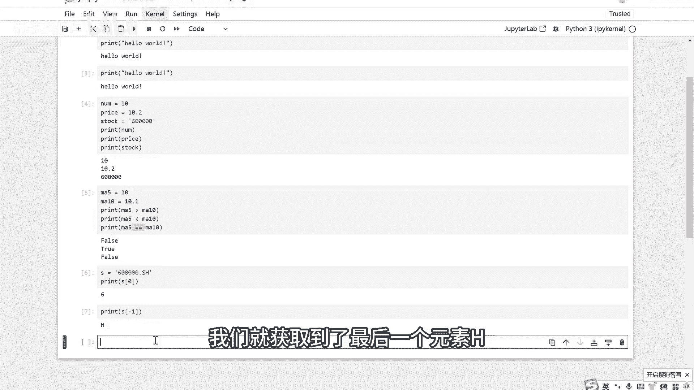

字符串是由单引号、双引号或三引号包裹起来的有序字符序列。有序意味着我们可以通过序号（索引）来访问其中的单个字符。

**索引与访问：**
Python的索引从0开始计数。可以从左向右（0, 1, 2...）或从右向左（-1, -2, -3...）进行索引。
```python
s = “600000.SH”
print(s[0])   # 输出 ‘6’，获取第一个字符
print(s[-1])  # 输出 ‘H’，获取最后一个字符
```

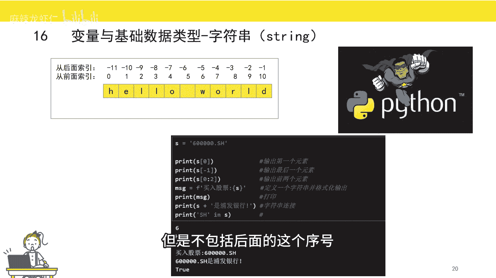

**切片操作：**
切片用于获取字符串的一部分，语法为 `[起始索引:结束索引]`，结果包含起始索引字符，但不包含结束索引字符。
```python
print(s[0:2])  # 输出 ‘60’，获取索引0和1的字符
print(s[:2])   # 同上，起始索引省略代表从开头开始
print(s[2:])   # 输出 ‘0000.SH’，结束索引省略代表到末尾
```

**字符串常用操作：**
以下是字符串在量化策略中的几种常见用法。

*   **格式化输出 (f-string)：** 方便地将变量值嵌入字符串。
    ```python
    stock_code = “600000.SH”
    message = f“当前股票代码是：{stock_code}”
    print(message)  # 输出：当前股票代码是：600000.SH
    ```

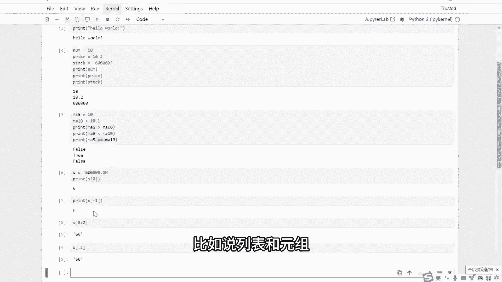

*   **字符串拼接：** 使用 `+` 号连接多个字符串。
    ```python
    print(s + “ 是上海股票”)  # 输出：600000.SH 是上海股票
    ```

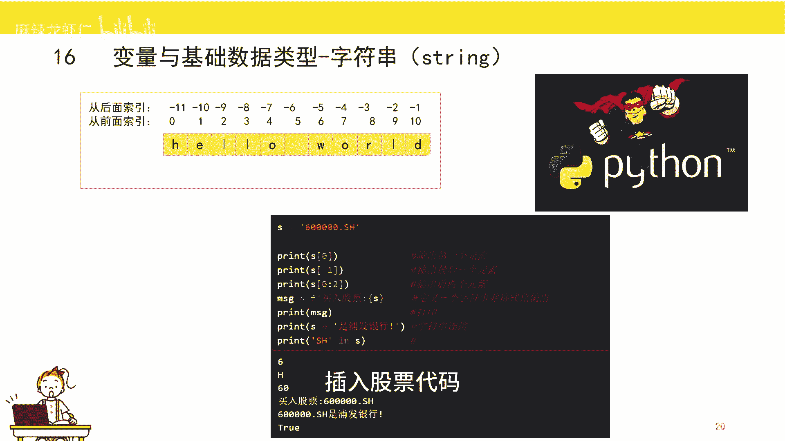

*   **成员判断 (in)：** 判断一个字符串是否包含另一个字符串。
    ```python
    print(“SH” in s)  # 输出 True，用于判断是否为上交所股票
    ```

---

## 列表 (List) 📋

列表是用中括号 `[]` 括起来的有序序列，它是量化策略中最常用的数据结构之一，常用于存储股票池、价格序列等。

**定义与基本操作：**
```python
# 定义一个股票代码列表
stocks = [“600000”, “000001”, “300059”, “000858”, “300122”, “300369”]
```

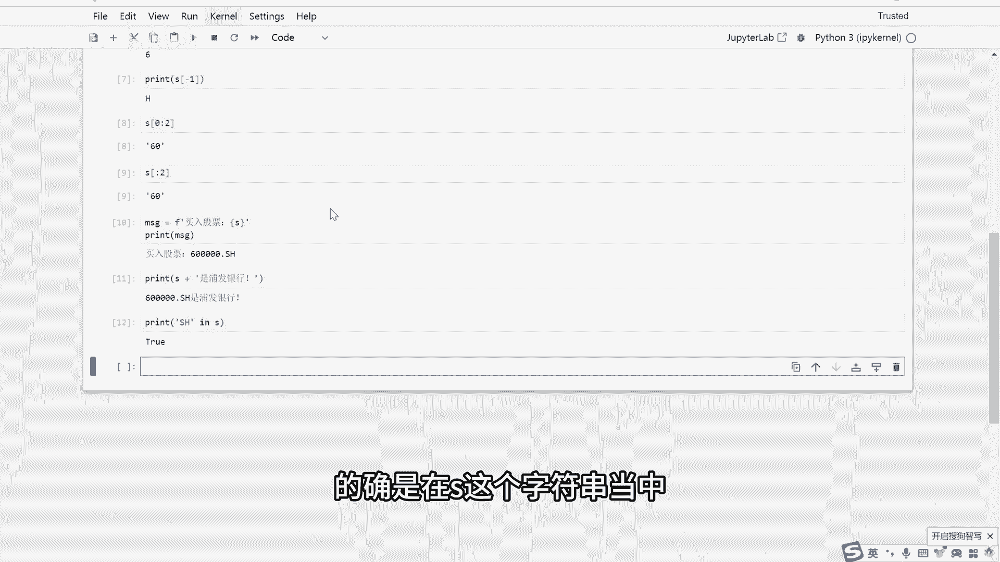

以下是列表的几种核心操作。

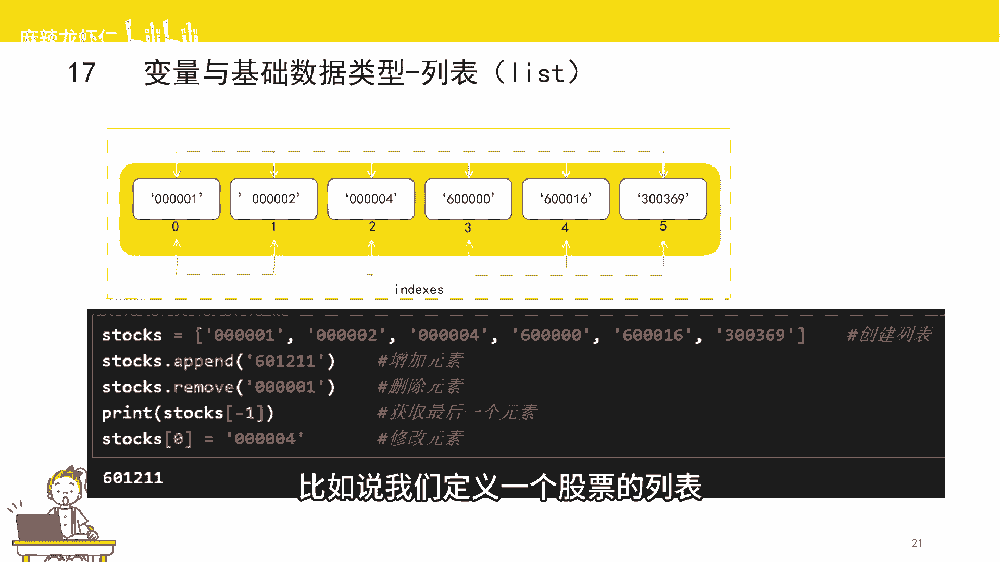

*   **增加元素 (append)：** 在列表末尾添加新元素。
    ```python
    stocks.append(“601211”)  # 将“601211”加入股票池
    ```

*   **删除元素 (remove)：** 删除列表中第一个指定的值。
    ```python
    stocks.remove(“600000”)  # 将“600000”从股票池中删除
    ```

*   **访问元素：** 通过索引访问，与字符串类似。
    ```python
    print(stocks[-1])  # 输出最后一个元素，例如 “601211”
    ```

*   **修改元素：** 通过索引直接赋值进行修改。
    ```python
    stocks[0] = “000002”  # 将第一个元素修改为 “000002”
    ```

---

## 集合 (Set) 🔗

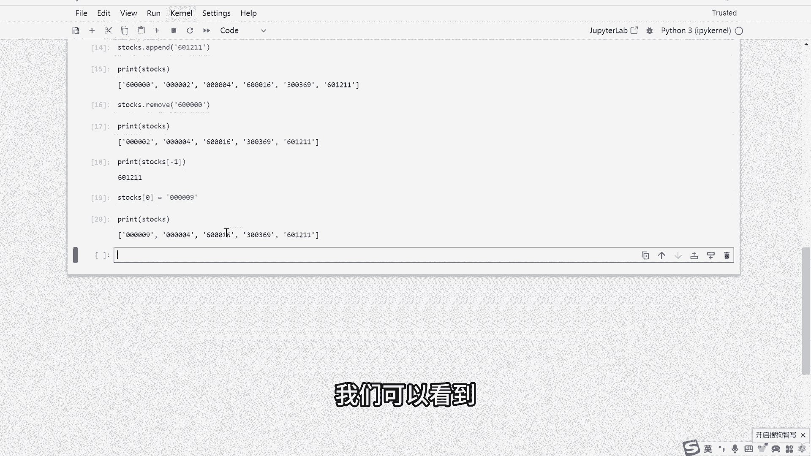

集合是用大括号 `{}` 括起来的**无序**且**元素唯一**的序列。在量化中常用于快速去重。

**去重应用示例：**
```python
stock_list = [“000001”, “600000”, “000001”, “300059”]  # 包含重复元素
unique_stocks = list(set(stock_list))  # 先转集合去重，再转回列表
print(unique_stocks)  # 输出：[‘000001‘， ‘300059‘， ‘600000‘] (顺序可能变化)
```
这里用到了**强制类型转换**，`set()` 和 `list()` 函数分别将数据转换为集合和列表类型。

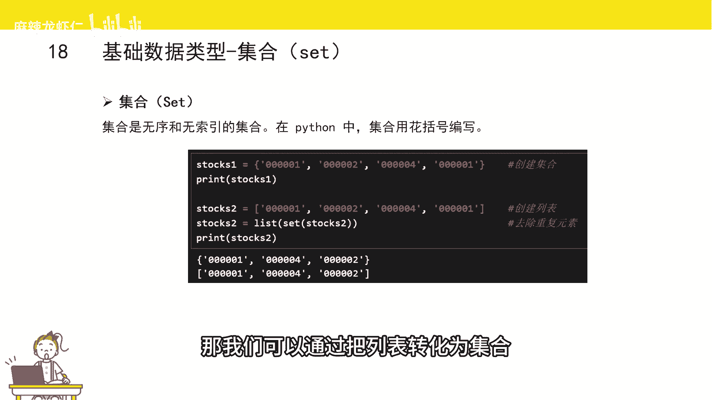

---

## 字典 (Dictionary) 📖

字典是用大括号 `{}` 括起来的**无序**序列，其元素以 **键值对 (Key-Value Pair)** 的形式存在，格式为 `键: 值`。它类似于现实中的字典，通过“键”可以快速查找对应的“值”，常用于存储结构化数据，如股票行情。

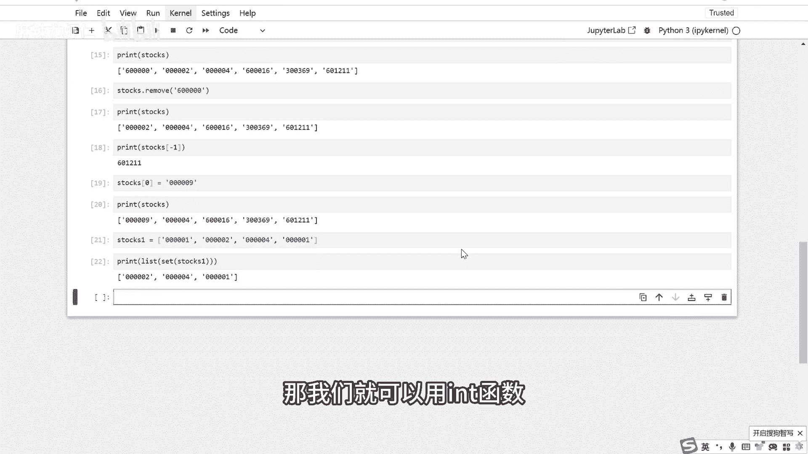

**定义与基本操作：**
```python
# 定义一个存储行情数据的字典
quote = {
    “open”: 11.53,   # 开盘价
    “close”: 11.46,  # 收盘价
    “high”: 11.80,   # 最高价
    “low”: 11.40     # 最低价
}
```

以下是字典的几种核心操作。

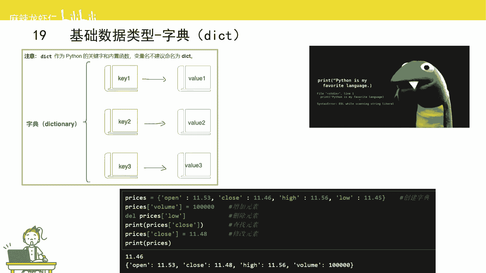

*   **增加键值对：** 直接为新的键赋值。
    ```python
    quote[“volume”] = 1000  # 增加成交量键值对
    ```

*   **删除键值对 (del)：** 使用 `del` 语句。
    ```python
    del quote[“open”]  # 删除 ‘open‘ 这个键及其值
    ```

*   **查找值：** 通过键名在中括号内访问。
    ```python
    print(quote[“close”])  # 输出 11.46，获取收盘价
    ```

*   **修改值：** 通过键名直接重新赋值。
    ```python
    quote[“high”] = 12.00  # 修改最高价
    ```

---

## 元组 (Tuple) 🔒

元组是用小括号 `()` 括起来的**有序**但**不可更改**的序列。其访问方式与列表相同，但一旦创建，内容就不能被修改、添加或删除。

**定义与访问：**
```python
stock_tuple = (“600000”, “000001”, “300059”)
print(stock_tuple[0])  # 输出 ‘600000‘，通过索引访问
# stock_tuple[0] = “000002”  # 这行代码会报错，因为元组不可修改
```

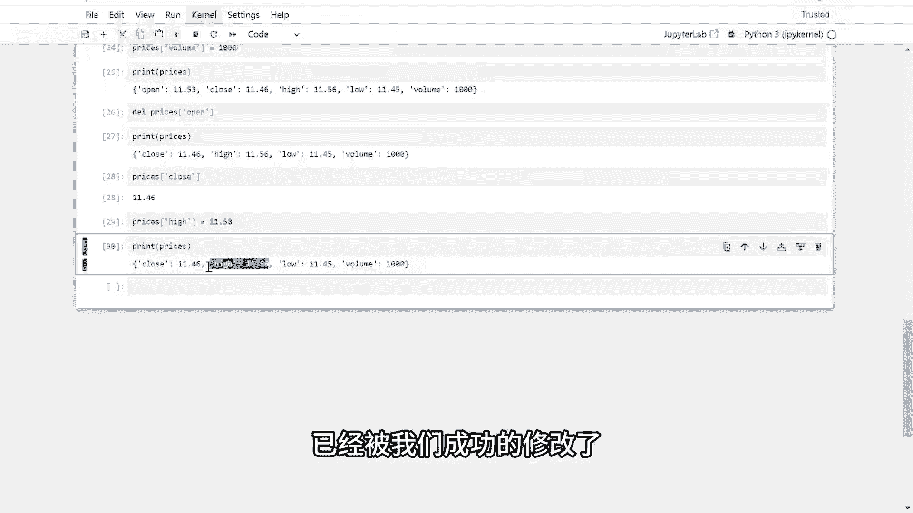

---

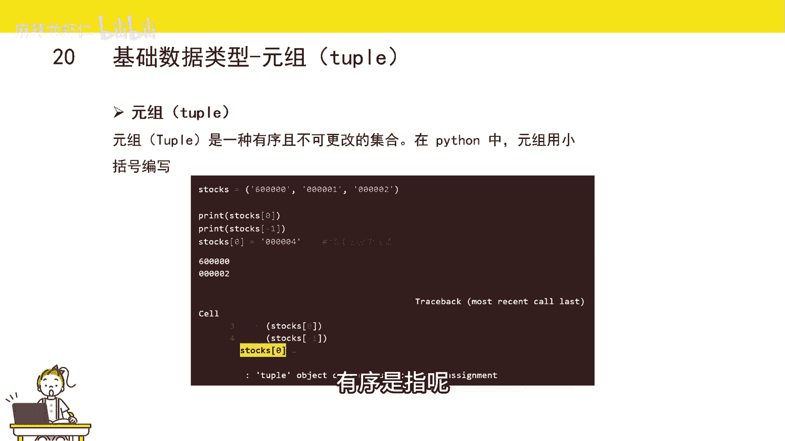

## 总结 🎯

本节课我们一起学习了Python量化交易中六种基本数据类型：
1.  **布尔型 (Boolean)**：用于逻辑判断，值为 `True` 或 `False`。
2.  **字符串 (String)**：有序字符序列，支持索引、切片、格式化与拼接。
3.  **列表 (List)**：有序、可变的序列，是存储股票池等数据的首选。
4.  **集合 (Set)**：无序、唯一的序列，主要用于快速去重。
5.  **字典 (Dictionary)**：通过键值对存储数据，适合存储结构化信息如行情字典。
6.  **元组 (Tuple)**：有序但不可变的序列，用于确保数据不被意外修改。

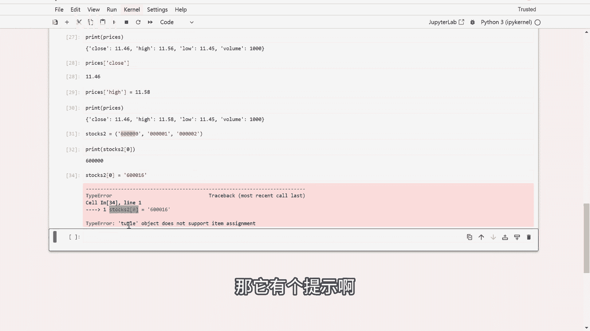

熟练掌握这些类型及其操作，是构建量化策略逻辑的基石。下一节，我们将学习如何利用这些数据类型进行更复杂的运算和流程控制。