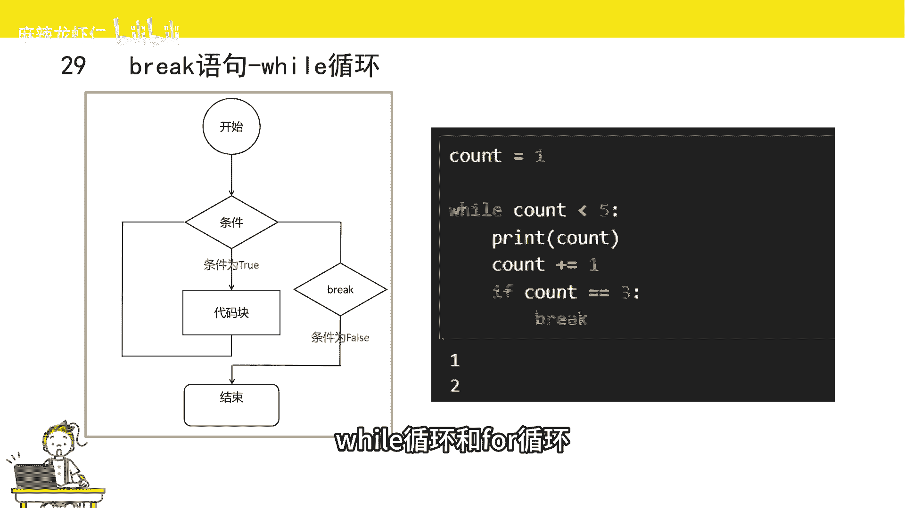
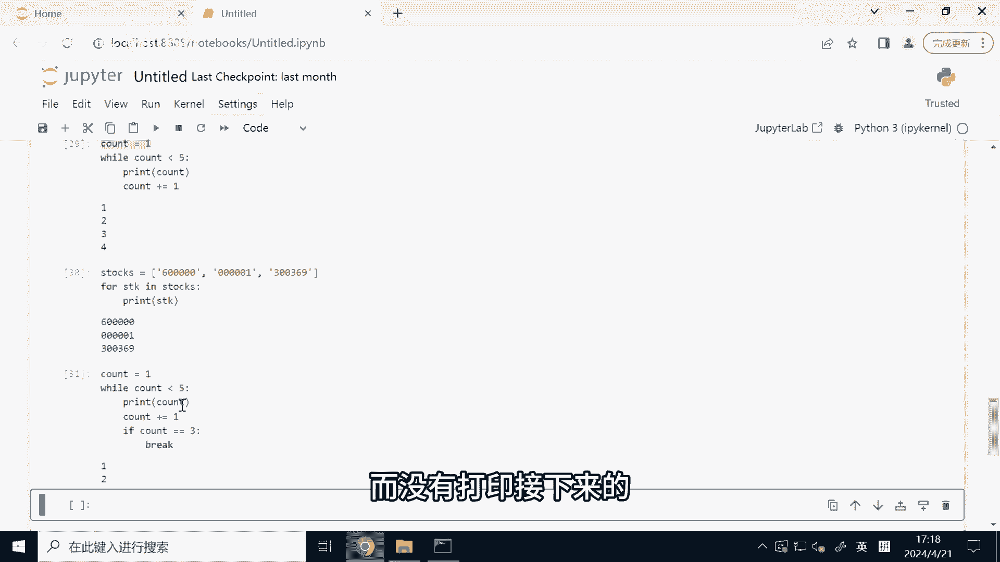
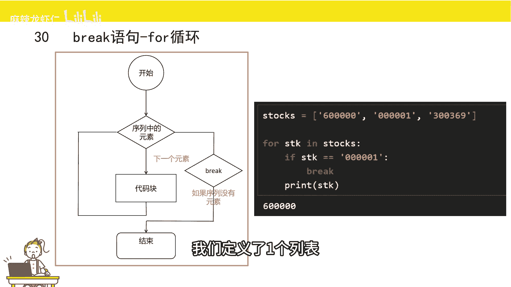
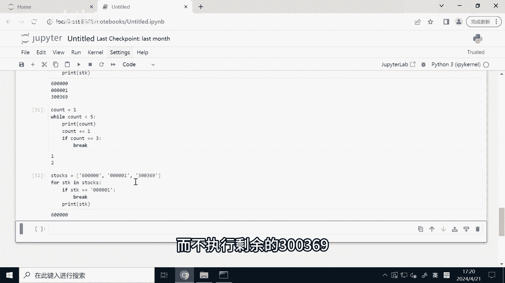
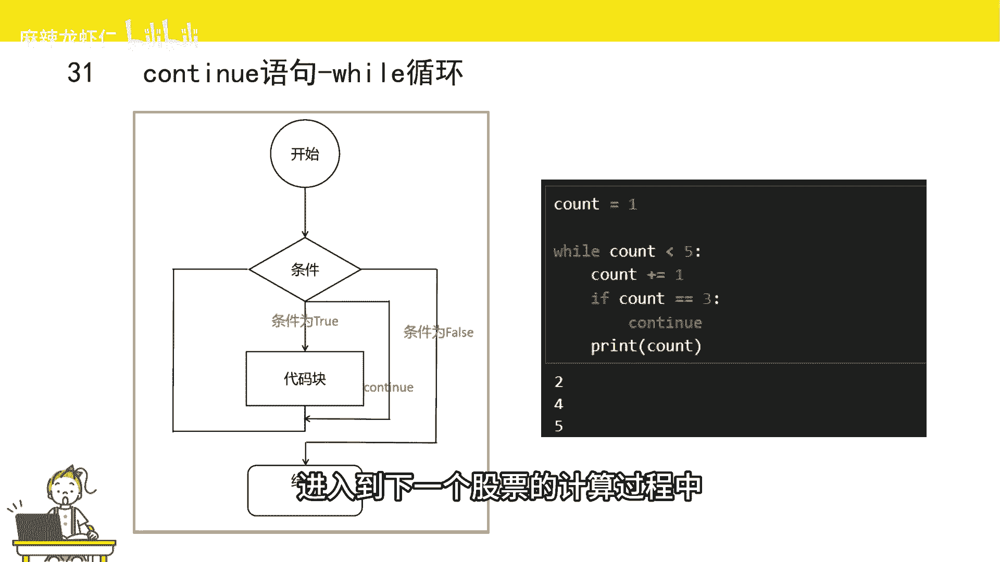
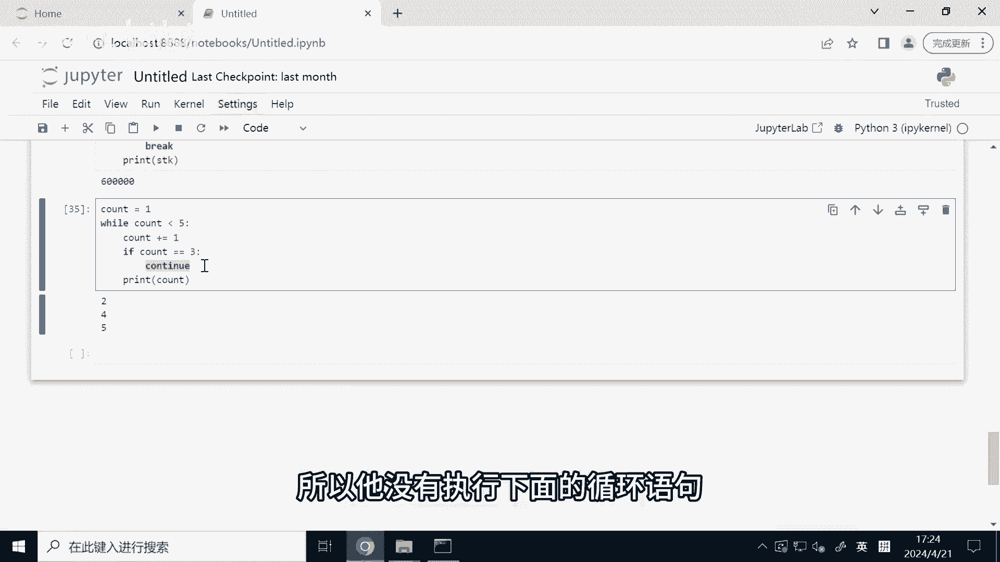
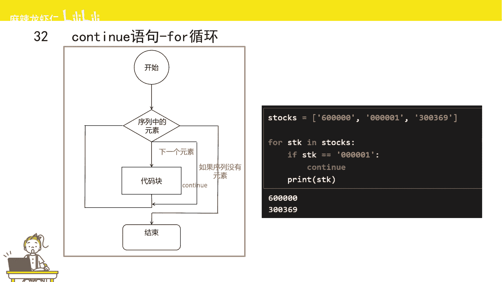
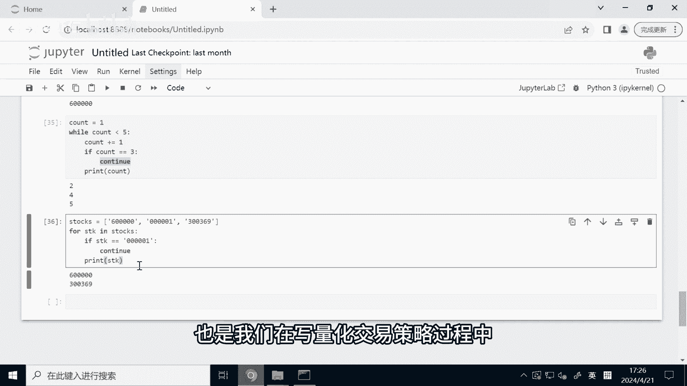

# Python量化交易速成：2.2：break与continue语句 🚦

在本节课中，我们将要学习Python循环中的两个重要控制语句：`break`和`continue`。它们能让我们更灵活地控制循环的执行流程，在量化交易策略编写中非常实用。



## 概述

上一节我们介绍了`while`循环和`for`循环的基本用法。本节中我们来看看如何通过`break`和`continue`语句来更精细地控制循环的执行。`break`用于**立即终止**整个循环，而`continue`用于**跳过**当前循环的剩余代码，直接进入下一次循环。

## break语句：跳出循环



`break`语句的意思是“中断”。当在循环中执行到`break`语句时，程序会立即跳出当前所在的整个循环，不再执行循环中剩余的代码。



一个典型的应用场景是：我们需要在股票池中寻找第一个满足特定条件（例如均线多头排列）的股票。一旦找到，就可以停止遍历剩余的股票，以节省计算资源。

以下是`break`语句在`while`循环中的用法演示：



```python
count = 1
while count < 5:
    print(count)
    count += 1
    if count == 3:
        break
```
这段代码的运行结果是打印出 `1` 和 `2`。执行过程如下：
1.  `count`初始为1，小于5，进入循环。
2.  打印 `1`，`count`自增为2。
3.  判断 `count` (2) 不等于3，不执行`break`。
4.  进入下一次循环，打印 `2`，`count`自增为3。
5.  判断 `count` (3) 等于3，执行`break`，**立即终止整个`while`循环**。
6.  因此，数字3、4、5不会被打印。

接下来，我们看看`break`在`for`循环中的应用：

```python
stocks = ['600000', '000001', '300369']
for stk in stocks:
    if stk == '000001':
        break
    print(stk)
```
这段代码的运行结果是只打印 `600000`。执行过程如下：
1.  第一次循环，`stk`为 `'600000'`，不等于 `'000001'`，不执行`break`，打印 `'600000'`。
2.  第二次循环，`stk`为 `'000001'`，条件成立，执行`break`，**立即终止整个`for`循环**。
3.  因此，列表中的 `'300369'` 不会被遍历到，也不会被打印。



## continue语句：跳过本次循环

`continue`语句的意思是“继续”。当在循环中执行到`continue`语句时，程序会**跳过**当前循环中`continue`之后的所有代码，直接进入下一次循环迭代（注意，不是终止整个循环）。

在量化策略中，一个常见场景是：遍历股票池计算指标时，如果某只股票的历史数据获取失败，为了避免程序出错影响其他股票的计算，我们可以用`continue`跳过这只股票，继续处理下一只。

以下是`continue`语句在`while`循环中的用法演示：



```python
count = 1
while count < 5:
    count += 1
    if count == 3:
        continue
    print(count)
```
这段代码的运行结果是打印 `2`, `4`, `5`。执行过程如下：
1.  `count`初始为1，小于5，进入循环。
2.  `count`自增为2，不等于3，不执行`continue`，打印 `2`。
3.  进入下一次循环，`count`自增为3，等于3，执行`continue`，**跳过本次循环中后面的`print`语句**，直接开始下一次循环。
4.  进入下一次循环，`count`自增为4，不等于3，打印 `4`。
5.  进入下一次循环，`count`自增为5，不等于3，打印 `5`。
6.  `count`为5时不满足`count < 5`的条件，循环结束。



接下来，我们看看`continue`在`for`循环中的应用：

```python
stocks = ['600000', '000001', '300369']
for stk in stocks:
    if stk == '000001':
        continue
    print(stk)
```
这段代码的运行结果是打印 `600000` 和 `300369`。执行过程如下：
1.  第一次循环，`stk`为 `'600000'`，不等于 `'000001'`，不执行`continue`，打印 `'600000'`。
2.  第二次循环，`stk`为 `'000001'`，条件成立，执行`continue`，**跳过本次循环中后面的`print`语句**，直接开始下一次循环。
3.  第三次循环，`stk`为 `'300369'`，不等于 `'000001'`，打印 `'300369'`。

## 总结

本节课中我们一起学习了循环控制语句`break`和`continue`的核心用法：
*   **`break`**：用于**立即完全终止**所在的循环。一旦执行，循环立即结束。
*   **`continue`**：用于**跳过**当前循环的剩余代码，**直接进入**下一次循环迭代。



理解并熟练运用这两个语句，能让你在编写量化交易策略时，更高效地处理数据遍历和条件筛选，使代码逻辑更加清晰和健壮。