# Python量化交易速成：P1：基础语法入门 🐍

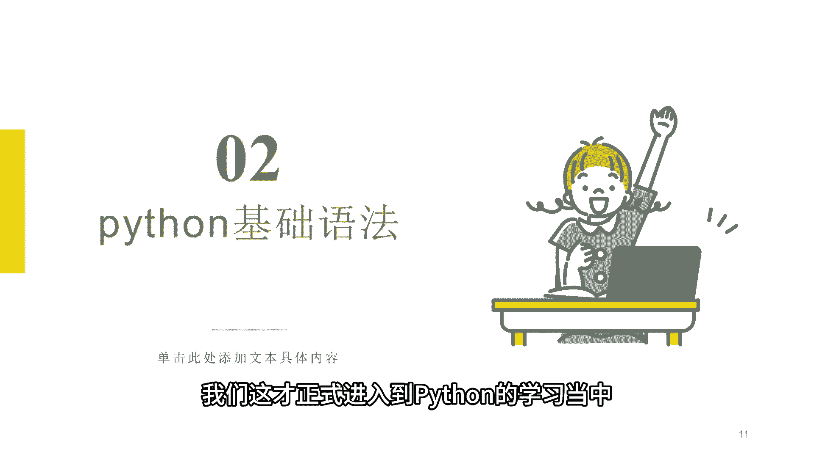

在本节课中，我们将要学习Python编程的基础语法，包括代码的运行方式、缩进规则、注释的写法以及如何编写你的第一行代码。这些是构建任何Python程序的基石。

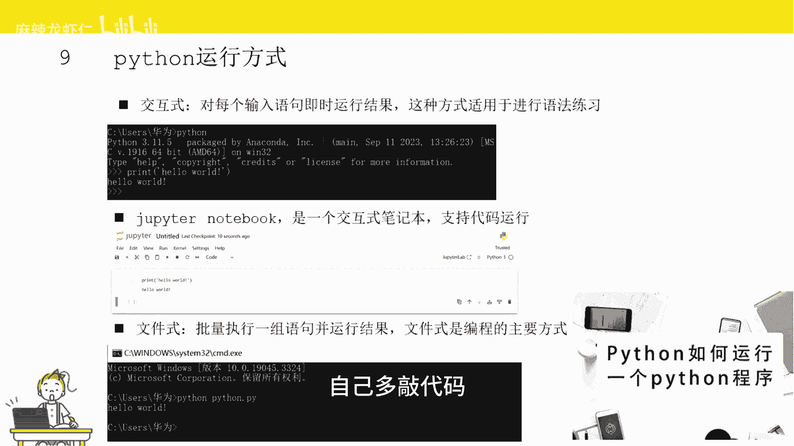

## Python代码的运行方式 💻

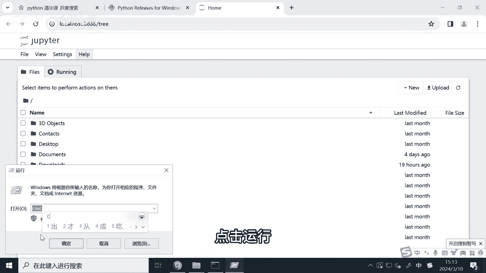

准备好环境后，我们正式进入Python学习。首先介绍Python代码的三种运行方式。

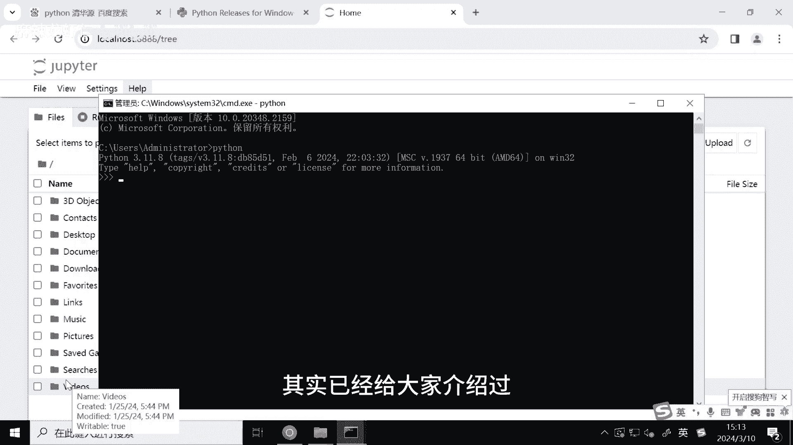

以下是三种主要的运行方式：

1.  **交互式运行**：每输入一行代码，解释器会立即输出运行结果。这种方式适合学习和测试简短代码。例如，在命令行输入 `python` 进入交互环境，然后直接输入代码。
2.  **Jupyter Notebook运行**：类似于交互式，但以“单元格”为单位组织代码和文本，适合数据分析和教学。上一个视频已介绍如何打开。
3.  **文件式运行**：将一组Python代码写入后缀为 `.py` 的文件中，然后一次性执行文件内所有代码。这是实际项目开发的主流方式。运行方法是在命令行输入 `python 文件名.py`。

## 缩进规则 📐

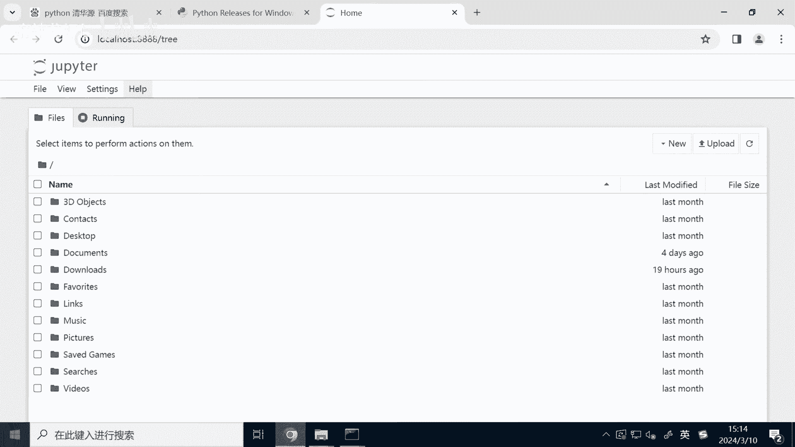

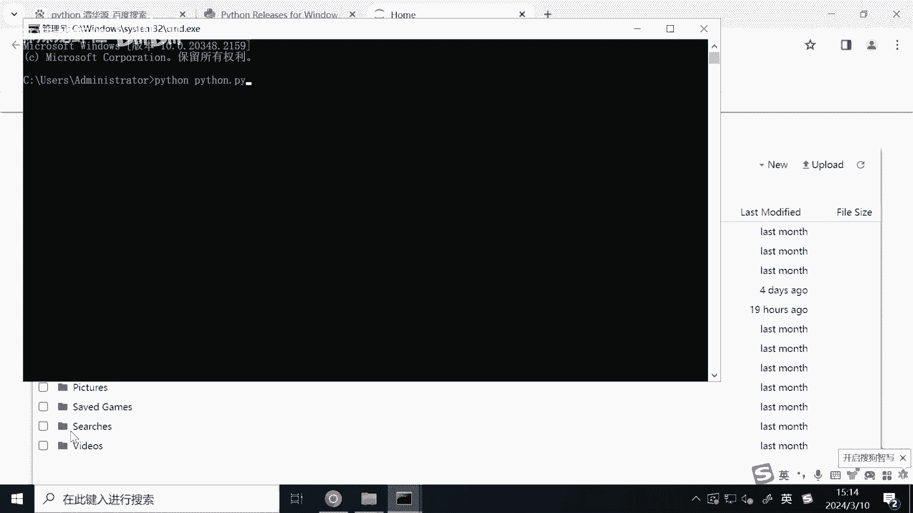

上一节我们介绍了代码的运行方式，本节中我们来看看Python一个非常独特的语法：缩进。缩进用于定义代码块，同一缩进级别的代码属于同一个代码块，执行相同的功能。

缩进通常是**四个空格**或一个**Tab键**。在以下情况必须使用缩进：
*   `if` 条件语句
*   `for` 循环语句
*   `while` 循环语句
*   函数定义等

例如，在条件语句中：
```python
if 22 > 11:
    print(“条件为真”) # 这行开头的空格就是缩进
```
如果忘记缩进，会导致程序报错，这是新手常遇到的问题，需要特别注意。

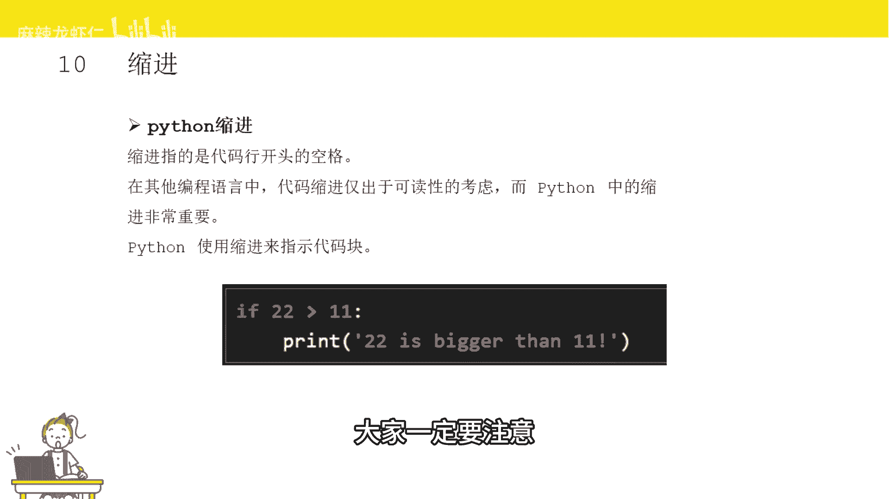

## 代码注释 📝

了解如何组织代码块后，我们还需要学习如何为代码添加说明，这就是注释。注释是对代码的备注，本身不会被执行，仅起到提示作用，能帮助他人或未来的自己理解代码功能。

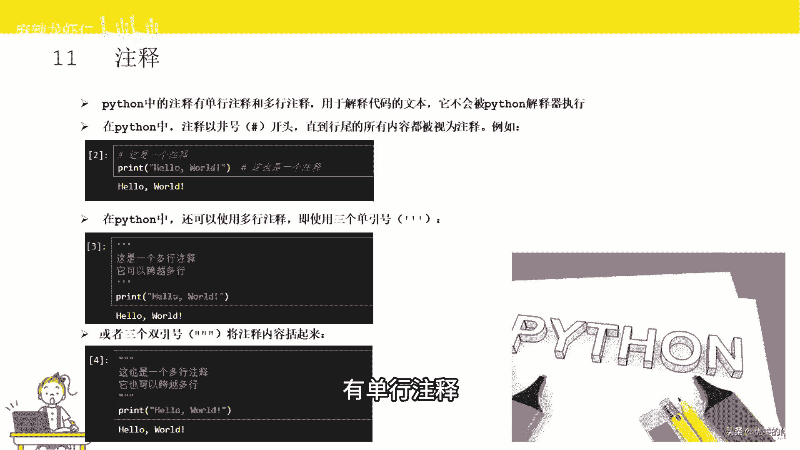

Python注释主要有两种方式：

1.  **单行注释**：以井号 `#` 开头，该行 `#` 之后的内容均为注释。
    ```python
    # 这是一行注释，print函数不会执行
    # print(“这行不会输出”)
    print(“Hello World”) # 这行代码会输出Hello World
    ```

2.  **多行注释**：使用三个单引号 `'''` 或三个双引号 `"""` 将注释内容包裹起来，可以实现多行注释。
    ```python
    '''
    这是多行注释，
    可以写很多行。
    这些都不会被执行。
    '''
    print(“只有这行代码会执行”)
    ```

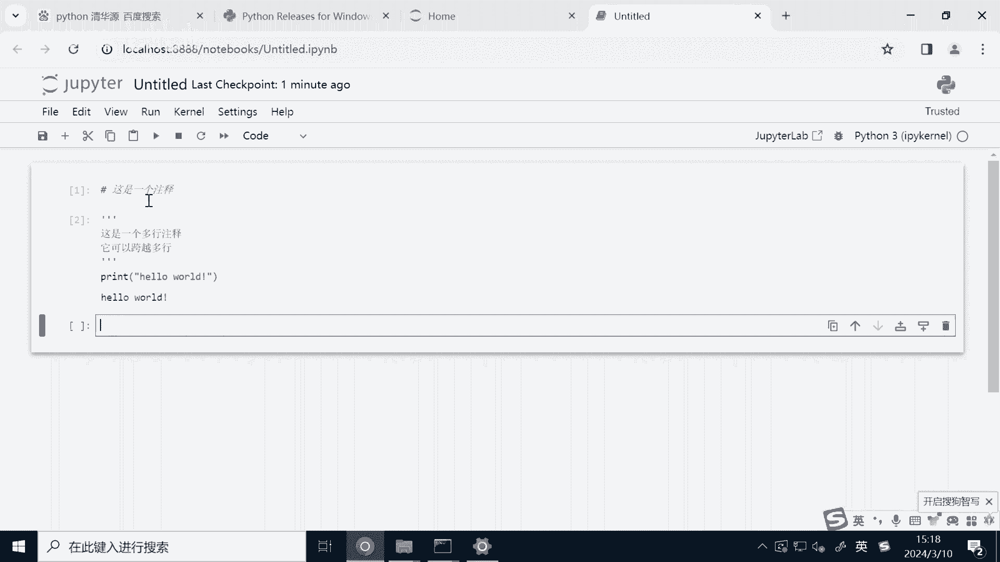

## 第一行代码：打印输出 🖨️

掌握了基本规则后，我们就可以编写第一段Python代码了。你会发现，几乎任何编程语言的第一行代码都是“打印”，即向屏幕输出信息。

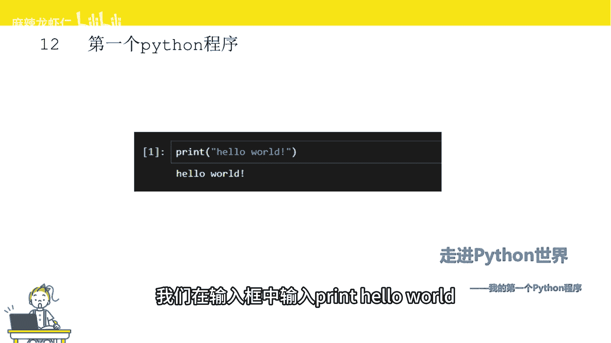

以下是打印“Hello World”的示例：
```python
print(“Hello World”)
```
**注意**：输入代码时，括号和引号都必须在**英文输入法**状态下输入。输入完成后，在Jupyter Notebook中按 `Shift + Enter` 运行该行代码，屏幕上就会输出 `Hello World`。

---

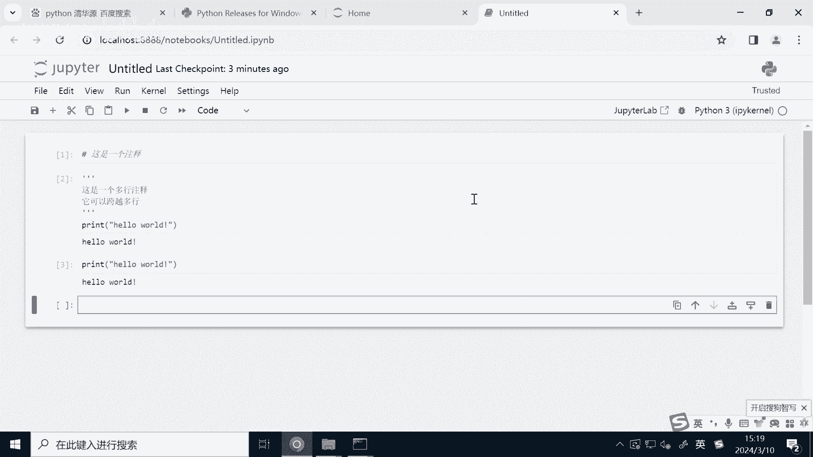

本节课中我们一起学习了Python的基础语法：了解了交互式、Notebook和文件式三种代码运行方式；掌握了用缩进来定义代码块的规则；学会了使用 `#` 和 `'''` 来编写单行及多行注释；最后，成功编写并运行了第一行打印“Hello World”的代码。这些是开始Python编程之旅的第一步。