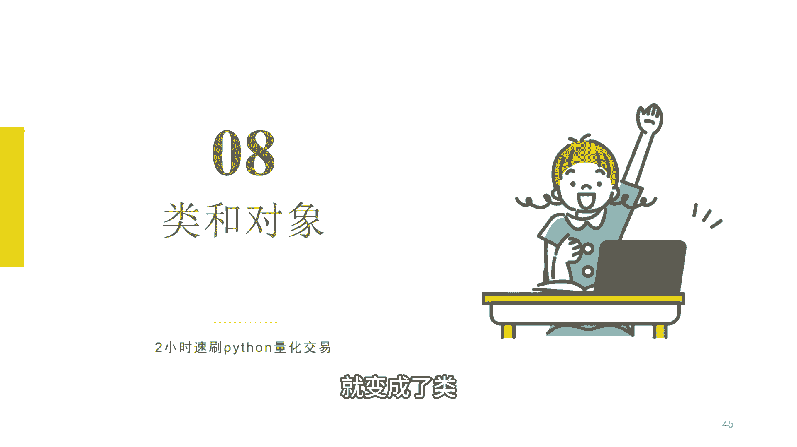
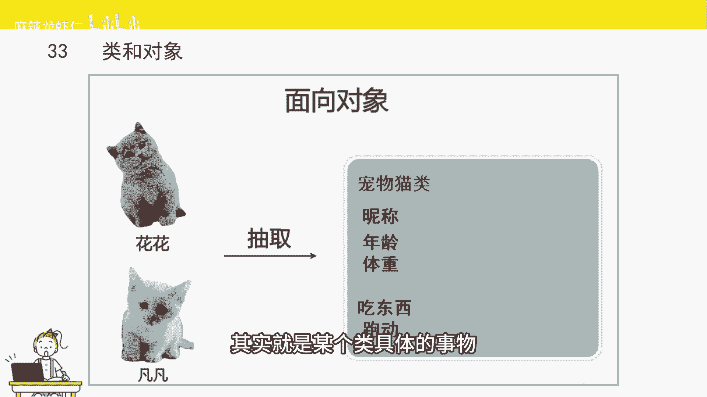
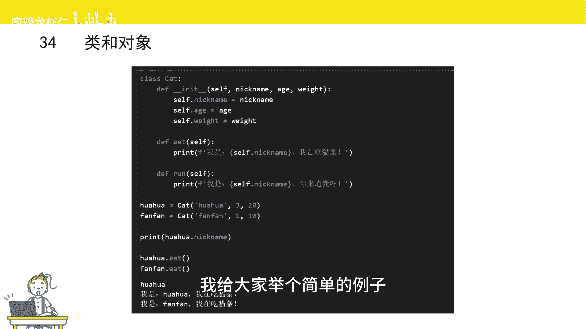
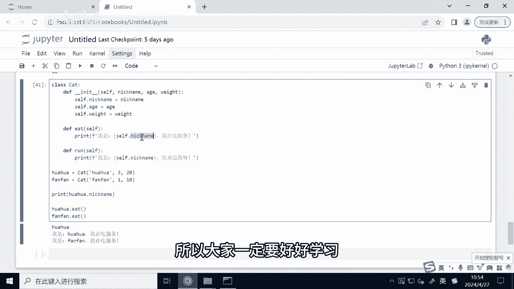

# Python量化交易速成：P1：类和对象 🐱

在本节课中，我们将要学习Python中“类”和“对象”的核心概念。它们是面向对象编程的基础，能帮助我们更好地组织和管理代码，在量化交易策略开发中非常有用。



## 类和对象的概念

上一节我们介绍了编程的基础知识，本节中我们来看看如何用代码模拟现实世界的事物。

类和对象与现实中的概念很相似。人类、猫类都是类。我们把同一类别事物相同的特征抽取出来，就变成了类。

例如两只猫猫“花花”和“凡凡”，它们有什么共同特征呢？它们都有昵称、年龄和体重，这些是静态的特征，也叫做**属性**。它们还有动态的行为，比如都会吃猫粮、都会跑动，这些行为叫做**方法**。



把具有相同属性和行为的事物抽取出来，就定义了一个类。那么什么是对象呢？“花花”就是一个对象。它除了拥有“猫”这个类所有共同的特征以外，还有个性化的特征，比如“花花”是一只银渐层，腿特别短。

对象其实就是某个类具体的事物。

## Python中的类



介绍完类和对象的概念以后，我们来介绍一下在Python当中类长什么样。

在Python中，类是通过 `class` 这个关键词来标识的。`class` 后面是类的名字，然后是冒号，冒号后面就是类的属性和方法。

这里我给大家举个简单的例子。

```python
class Cat:
    def __init__(self, nickname, age, weight):
        self.nickname = nickname
        self.age = age
        self.weight = weight

    def eat(self):
        print(f"我是{self.nickname}，我在吃猫条。")

    def run(self):
        print(f"我是{self.nickname}，我在跑动。")
```

以上代码定义了一个叫做 `Cat` 的猫猫类。冒号后面的就是具体的类的属性和方法。

它的第一个函数是 `__init__` 函数。这个函数是类内置的一个函数，所有的类都会有一个 `__init__` 函数。它被称为类的**构造函数**。当创建这个类的对象时，就会默认地去调用这个函数。这个函数负责将参数赋值给对象的属性，或者完成一些在创建对象时需要执行的其他操作。

我们举的这个例子，它的构造函数有几个参数。首先第一个参数是 `self` 参数。`self` 参数代表了这个类的对象本身。`self` 参数在类的函数里面是必须有的，每个类的函数都会有这个参数，虽然我们在调用的时候不用传入它。

接下来是三个参数，分别代表 `nickname`（昵称）、`age`（年龄）、`weight`（体重）。然后是冒号，接着进入函数体，将三个参数分别赋值给对象的属性。因为是对象它自己的属性，所以用到 `self.` 来代表当前这个对象。

接下来我们定义了两个自定义的函数，分别是 `eat` 和 `run`。刚刚也讲到过，如果是类的函数，都要用 `self` 作为第一个参数。

`eat` 这个函数除了 `self` 参数以外，没有额外的参数。函数体打印一个字符串，用到了格式化输出。如果我们要在函数里面访问对象属性，就可以用 `self.属性名`，比如这里获取昵称，就是 `self.nickname`。

接下来是 `run` 函数，也实现了一个类似的功能，只是打印的内容可能不太一样。

## 创建和使用对象

写完了类以后，我们可以通过这个类来创建实例化的对象。比如我们创建了一个猫猫类，那我们要创建一个具体的猫，比如说“花花”或者“凡凡”。

可以通过类名来实例化，并且类名后面需要带参数。这些参数其实就是 `__init__` 这个函数的参数。当然 `self` 这个参数刚也讲到过，是不用去传的。

以下是创建和使用对象的示例：

```python
# 创建两个类的对象
huahua = Cat("花花", 2, 4.5)
fanfan = Cat("凡凡", 3, 5.0)

# 访问对象的属性
print(huahua.nickname)  # 输出：花花

# 调用对象的方法
huahua.eat()  # 输出：我是花花，我在吃猫条。
fanfan.eat()  # 输出：我是凡凡，我在吃猫条。
```

这里我们创建了两个类的对象，分别是“花花”和“凡凡”。创建对象时，只需要在 `Cat` 后面传入 `nickname`、`age` 和 `weight` 这三个参数就可以了。这么做其实就是调用了 `__init__` 这个函数，系统默认帮我们调用了类的构造函数。

接下来我们把类的对象的结果赋值给一个变量。这样“花花”和“凡凡”就成了猫类的两个对象。

如果我们要访问对象的属性或者方法，只需要通过点号 `.` 来进行访问。比如要访问花花的昵称，就可以 `huahua.nickname`，这样就会获取到花花的昵称。如果要运行类里面的函数，只需要用到对象的名字，然后点号后面是函数的名字，再传入参数就可以调用。因为 `eat` 函数没有额外参数，所以我们这里没有传入任何参数。

运行上面的代码，我们可以发现：
*   通过 `print(huahua.nickname)`，我们获取到了花花这个对象的昵称。
*   调用花花的 `eat` 函数，运行了里面这个函数的内容，打印“我是花花，我在吃猫条”。
*   调用凡凡的 `eat` 函数，也打印了一句话“我是凡凡，我在吃猫条”。

这里我们发现，调用同样的 `eat` 函数，为什么输出的结果不一样呢？原因是在这两个类对象的 `eat` 函数当中，我们在打印的字符串里面插入的是这个对象它自己的属性 `self.nickname`。所以不同对象调用出来的结果是不一样的，因为这两个对象的 `nickname` 这个昵称属性其实是不一样的。

## 总结

本节课中我们一起学习了Python中“类”和“对象”的核心概念。

*   **类** 是对具有相同属性和行为的一类事物的抽象定义，使用 `class` 关键词创建。
*   **对象** 是类的具体实例，拥有类定义的属性和方法，同时可以有自己独特的状态。
*   `__init__` 方法是类的构造函数，在创建对象时自动调用，用于初始化对象的属性。
*   类的方法第一个参数通常是 `self`，它代表对象自身，用于访问对象的属性和其他方法。



类在我们写量化交易策略过程中也是经常能用到的，例如我们可以定义一个“交易策略”类，或者一个“股票”类，来更好地组织和管理我们的代码逻辑。掌握类和对象是迈向更复杂、更模块化编程的重要一步。