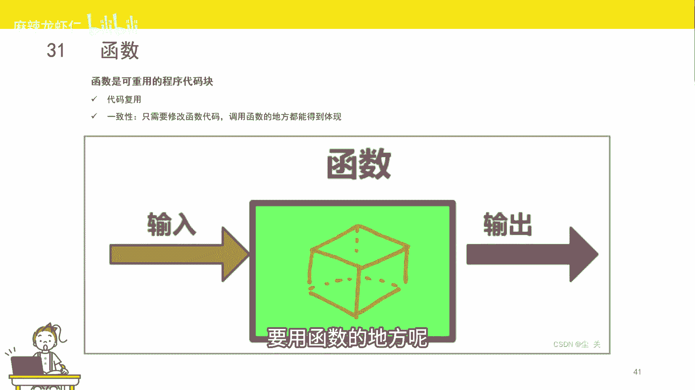
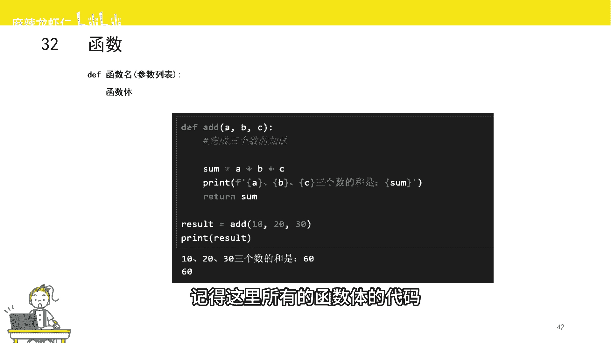
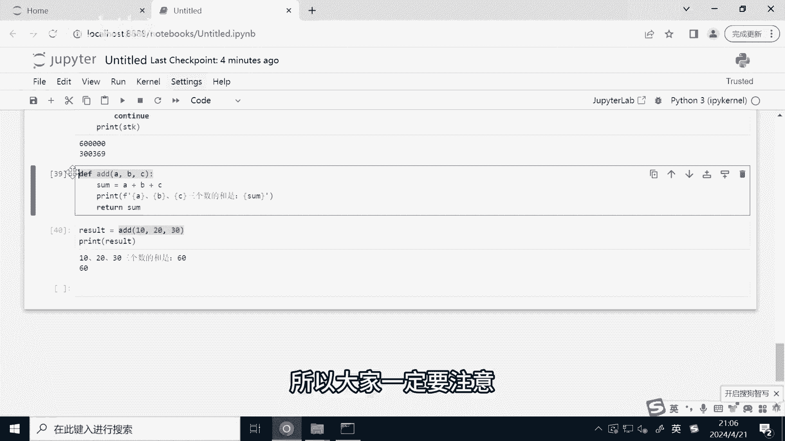

# Python量化交易速成：2：函数 🧮


在本节课中，我们将要学习Python中一个至关重要的概念——函数。函数是组织代码、实现代码复用的核心工具，对于编写清晰、高效的量化交易策略至关重要。

## 函数的概念与作用

上一节我们介绍了Python的基础语法，本节中我们来看看函数。函数类似于数学中的概念，对于一个输入，经过特定的运算后会得到一个输出。



在Python中，函数主要有两大作用：
1.  **代码复用**：将需要重复使用的功能封装成函数，在多个地方调用，避免编写重复代码。
2.  **便于维护**：当功能需要修改时，只需修改函数内部的代码，所有调用该函数的地方都会自动应用更新。

## 函数的定义与结构

理解了函数的作用后，我们来看看如何定义一个函数。函数的一般格式如下：



```python
def 函数名(参数1, 参数2, ...):
    # 函数体（需要缩进的代码块）
    return 返回值
```

以下是定义函数时各部分的说明：
*   **`def`**：定义函数的关键字。
*   **函数名**：遵循变量命名规则，通常使用小写字母和下划线。
*   **参数列表**：位于括号内，类似于数学函数中的自变量，是可选的。
*   **冒号 `:`**：标志着函数头的结束和函数体的开始。
*   **函数体**：需要缩进的代码块，包含函数要执行的具体操作。
*   **`return`**：用于返回函数的结果，是可选的。如果没有`return`语句，函数默认返回`None`。

## 函数的编写与调用示例

下面我们通过一个具体的例子来学习如何编写和调用函数。我们将创建一个计算三个数之和的函数。

```python
def add_three_numbers(a, b, c):
    total_sum = a + b + c
    print(f"计算 {a}, {b}, {c} 的和")
    return total_sum

# 调用函数
result = add_three_numbers(10, 20, 30)
print(f"计算结果为: {result}")
```

运行上述代码，你会看到以下输出：
```
计算 10, 20, 30 的和
计算结果为: 60
```

**关键点**：调用函数时，传入参数的类型和数量必须与函数定义时一致，否则程序会报错。这是初学者在编写策略时常遇到的问题。

## 总结



本节课中我们一起学习了Python函数的核心知识。我们了解了函数在代码复用和维护方面的价值，掌握了使用`def`关键字定义函数、编写函数体以及使用`return`返回值的方法。最后，我们通过一个求和函数的例子实践了如何定义和调用函数。熟练使用函数是构建复杂量化交易策略的基石。