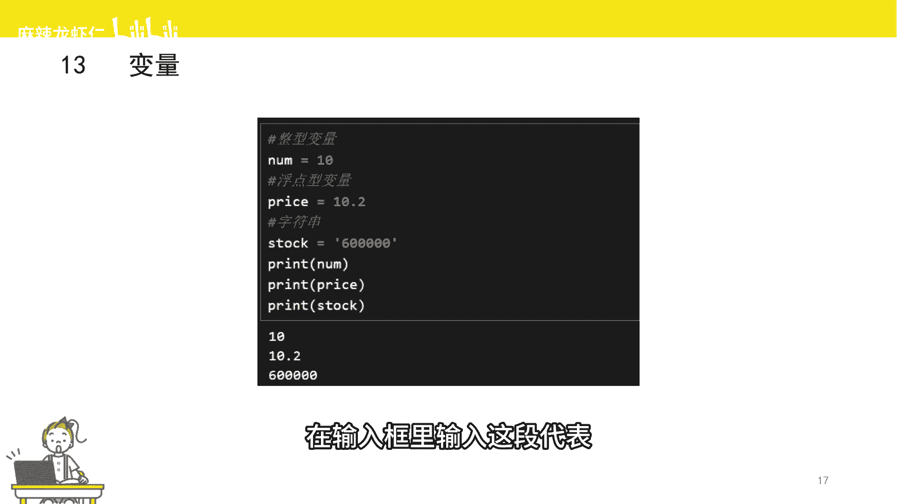
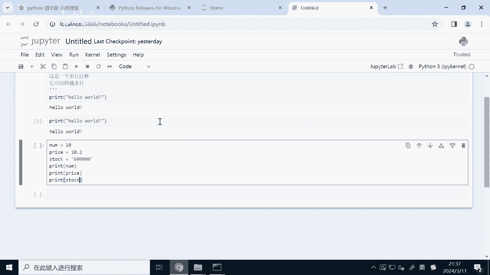
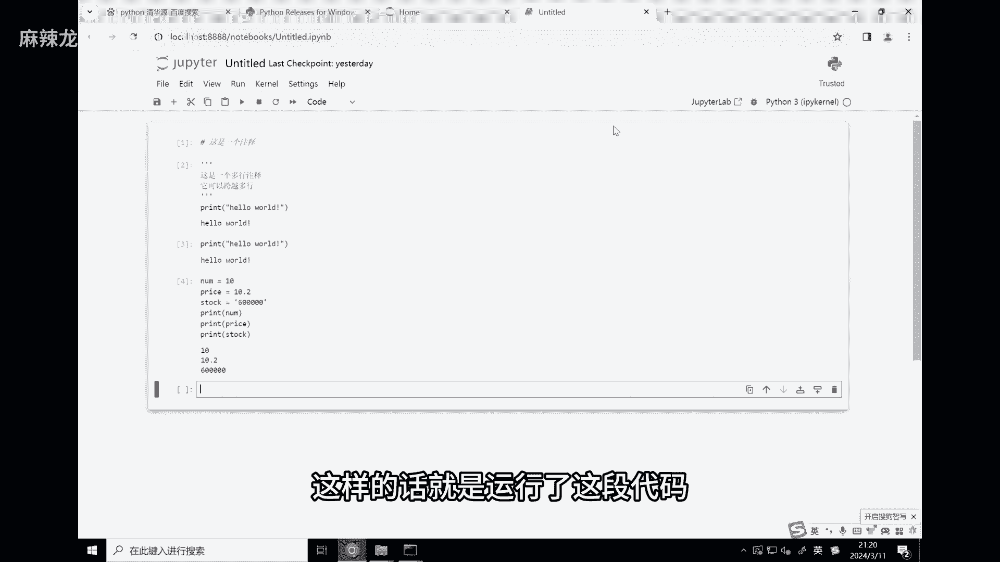
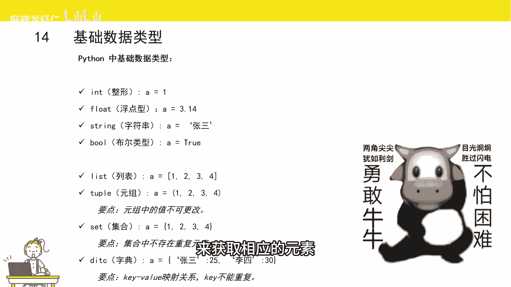

# Python量化交易速成：P1：变量与数据类型 📊


在本节课中，我们将要学习Python编程中最基础也是最重要的两个概念：**变量**和**数据类型**。理解它们是编写任何程序，包括量化交易策略的第一步。

## 什么是变量？🤔

变量是数据的名称，就像我们每个人都有名字一样。例如，你可以叫“张三”，他可以叫“李四”。变量之所以称为“变量”，是因为它代表的值是可以变化的。一个变量可以指代一个数据，稍后也可以指代另一个数据。

当然，变量名不能随意起。Python规定，变量名只能由字母、数字和下划线组成，并且**不能以数字开头**。

在Python中创建一个变量非常简单，只需要遵循以下格式：
`变量名 = 值`

这里的等号`=`不是数学中的“等于”，而是**赋值**的意思。它的作用是告诉Python：“让左边的变量名代表右边的值”。

以下是几个变量赋值的例子：
```python
number = 10
price = 10.2
stock = “贵州茅台”
is_rising = True
```
在上面的代码中：
*   `number` 这个变量代表整数 `10`。
*   `price` 这个变量代表小数 `10.2`。
*   `stock` 这个变量代表一串字符 `“贵州茅台”`。
*   `is_rising` 这个变量代表布尔值 `True`。





当你使用等号为变量赋值时，Python会自动根据你赋予的值来确定这个变量的**数据类型**。

**建议你打开Python编辑器，亲自输入并运行上面的代码，感受一下创建变量的过程。**



---

上一节我们介绍了如何创建变量，本节中我们来看看Python中都有哪些主要的数据类型。

## 认识数据类型 📝

Python对数据进行了分类，目的是为了更好地管理和处理它们。这就像现实生活中我们把数据分为整数、小数、一段话等。Python的数据类型与现实生活中的数据有很好的对应关系。

以下是Python中几种核心的数据类型及其与现实生活的对应：

*   **整型 (`int`)**：对应现实中的**整数**，如 `10`, `-5`, `0`。
*   **浮点型 (`float`)**：对应现实中的**小数**，如 `10.2`, `3.14`, `-0.5`。
*   **字符串 (`str`)**：对应现实中的**一段文本**，需要用单引号 `‘’` 或双引号 `“”` 括起来，如 `“贵州茅台”`, `‘Hello World’`。
*   **布尔型 (`bool`)**：对应现实中的**真/假**，只有两个值：`True` 和 `False`。
*   **列表 (`list`)**：用**中括号 `[]`** 括起来的一串有序数据，如 `[1, 2, 3, “apple”]`。
*   **元组 (`tuple`)**：用**小括号 `()`** 括起来的一串**不可变**的有序数据，如 `(1, 2, “banana”)`。
*   **集合 (`set`)**：对应数学中的**集合**，是一串**没有重复元素**的无序数据，用**大括号 `{}`** 括起来，如 `{1, 2, 3}`。
*   **字典 (`dict`)**：由**键值对**组成的数据集合，同样用**大括号 `{}`** 括起来。每个键值对格式为 `键:值`。键相当于名称，值是对应的数据内容，通过键可以快速找到值。例如：`{“name”: “张三”, “age”: 25}`。

这些数据类型可以从两个角度进一步分类：

1.  **可变性**
    *   **可变类型**：创建后，其内容可以被修改。例如：**列表、字典、集合**。
    *   **不可变类型**：创建后，其内容不能被修改。例如：**字符串、元组、整型、浮点型、布尔型**。

2.  **有序性**
    *   **有序类型**：元素有明确的顺序，可以通过位置（索引）来访问特定元素。例如：**字符串、列表、元组**。
    *   **无序类型**：元素没有固定顺序，不能通过索引访问。例如：**字典、集合**。

---



本节课中我们一起学习了Python的**变量**与**数据类型**。我们知道了变量是数据的别名，通过赋值语句`=`来创建。同时，我们认识了Python中八种核心的数据类型，并了解了它们从**可变性**和**有序性**角度的分类。掌握这些基础知识，是后续进行数据处理、条件判断和循环控制，乃至构建复杂量化交易策略的坚实基石。