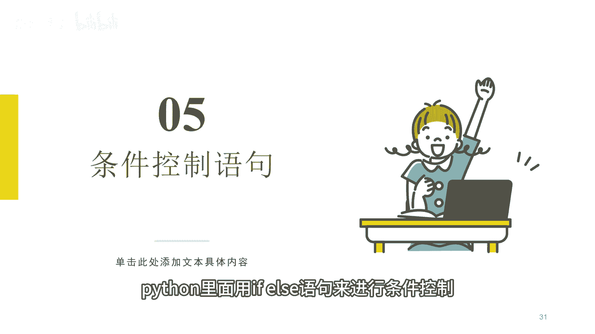
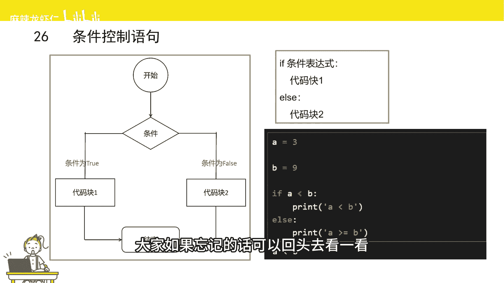
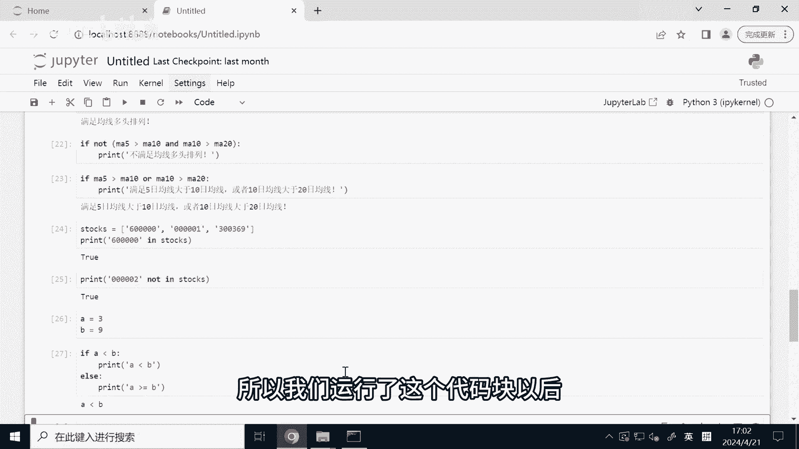
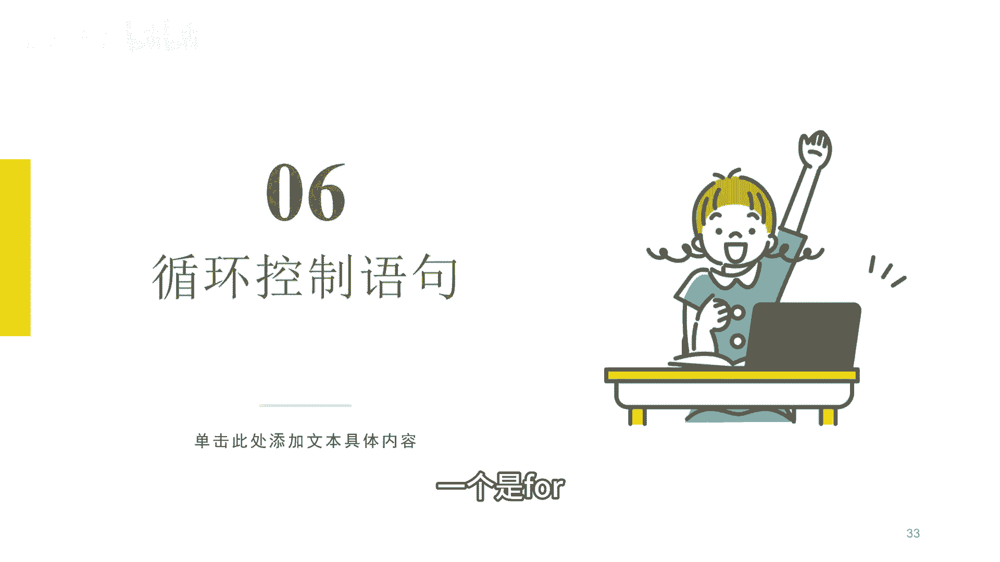
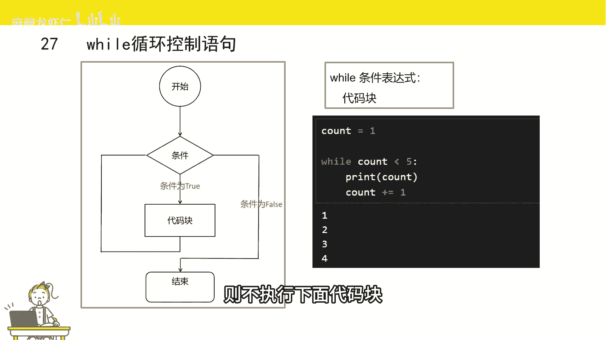
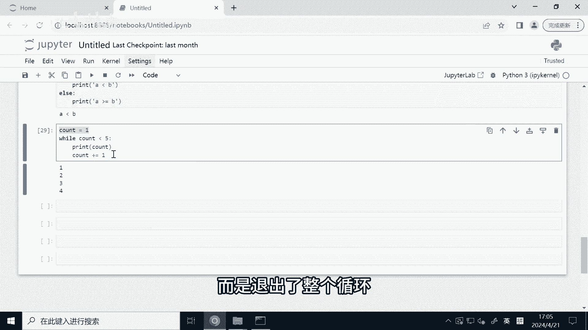
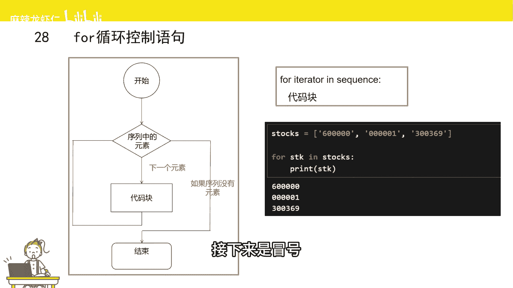
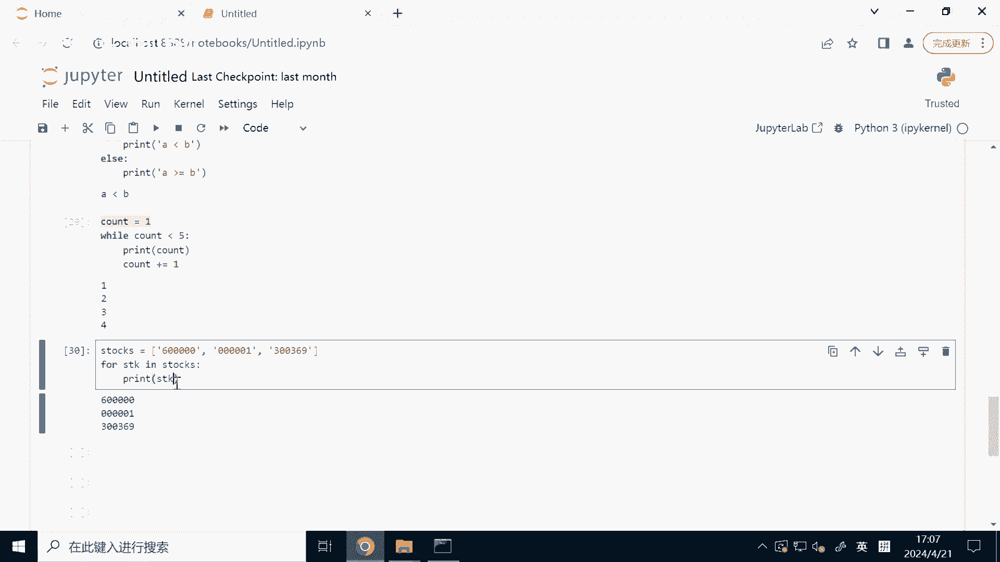

# Python量化交易速成：P1：条件控制与循环控制 🐍

在本节课中，我们将要学习Python编程中两个至关重要的控制结构：**条件控制**与**循环控制**。它们是构建任何量化交易策略的逻辑基础，能帮助我们根据市场条件做出决策，并对大量数据进行批量处理。



## 条件控制语句

上一节我们介绍了编程的基本概念，本节中我们来看看条件控制。什么是条件控制？它指的是当满足某个特定条件时，程序需要执行相应的动作。例如，在量化交易中，当满足“均线多头排列”这个条件时，程序需要执行“买入股票”的操作。

Python使用 `if` 和 `else` 语句来实现条件控制。


其流程图如上所示。程序首先判断条件表达式是否为真（`True`）。如果为真，则执行代码块一，然后结束流程；如果为假（`False`），则执行代码块二（`else`部分），然后结束流程。



`if-else`语句的基本语法如下：
```python
if 条件表达式:
    # 条件为 True 时执行的代码块
else:
    # 条件为 False 时执行的代码块
```
需要注意的是，`else`部分是可选的。同时，`if`和`else`下方的代码块必须通过**缩进**来定义，这是Python语法的重要规则。


以下是一个简单的例子：
```python
A = 3
B = 9

if A < B:
    print(“A小于B”)
else:
    print(“A不小于B”)
```
运行这段代码，因为 `A < B` 的条件为真，所以会打印出“A小于B”。




## 循环控制语句

讲完条件控制语句，接下来给大家介绍一下循环控制语句。循环控制的核心是**重复执行**某段代码。例如，我们需要判断一个股票池中的所有股票是否满足“均线多头排列”条件，这就需要对池中的每只股票都执行一遍判断逻辑，这个过程就是循环。



Python提供了两种主要的循环语句：`while`循环和`for`循环。

### while循环

`while`循环在条件为真时，会反复执行其内部的代码块。




其结构如上图所示。程序首先判断条件是否为真，若为真则执行代码块，执行完毕后再次判断条件，如此循环，直到条件变为假时退出循环。

`while`循环的语法如下：
```python
while 条件表达式:
    # 条件为 True 时重复执行的代码块
```


让我们看一个例子：
```python
count = 1
while count < 5:
    print(count)
    count += 1  # 这是 count = count + 1 的简写
```
这段代码的运行过程是：
1.  `count`初始为1，满足`count < 5`，打印1，然后`count`变为2。
2.  `count`为2，满足条件，打印2，然后`count`变为3。
3.  重复此过程，直到`count`变为5时，不满足`count < 5`的条件，循环结束。
最终会依次打印出：1, 2, 3, 4。

### for循环

`for`循环主要用于**遍历序列**（如列表、字符串等），即逐个访问序列中的每个元素。




其流程是：从序列中取出一个元素，执行代码块，然后取下一个元素继续执行，直到序列中所有元素都被处理完毕。

`for`循环的语法如下：
```python
for 变量 in 序列:
    # 对每个元素执行的代码块
```




以下是一个在量化交易中常见的例子，遍历一个股票代码列表：
```python
stocks = [“600000”, “000001”, “000002”]

for stk in stocks:
    print(stk)
```
运行逻辑：
1.  第一次循环，变量`stk`被赋值为列表的第一个元素`”600000″`，然后打印它。
2.  第二次循环，`stk`被赋值为第二个元素`”000001″`，然后打印。
3.  第三次循环，`stk`被赋值为第三个元素`”000002″`，然后打印。
4.  列表中没有更多元素，循环结束。
程序会依次打印出列表中的所有股票代码。



## 总结

本节课中我们一起学习了Python中两个核心的控制结构：
1.  **条件控制（`if-else`）**：用于根据条件判断决定程序执行哪一部分代码。其核心语法是 `if 条件: … else: …`。
2.  **循环控制**：用于重复执行特定代码块。
    *   **`while`循环**：在条件保持为真时持续循环。语法为 `while 条件: …`。
    *   **`for`循环**：用于遍历序列中的每个元素。语法为 `for 元素 in 序列: …`，在量化分析中常用于处理股票池、时间序列数据等。


掌握条件与循环是编写自动化交易策略的第一步，它们让你能够处理复杂的市场逻辑和海量的金融数据。