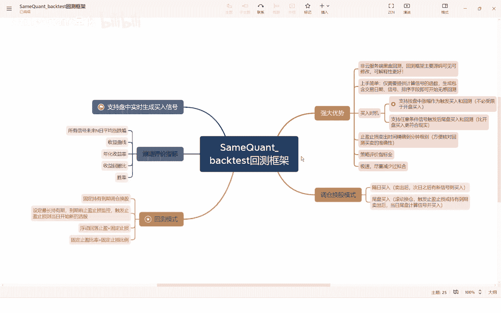
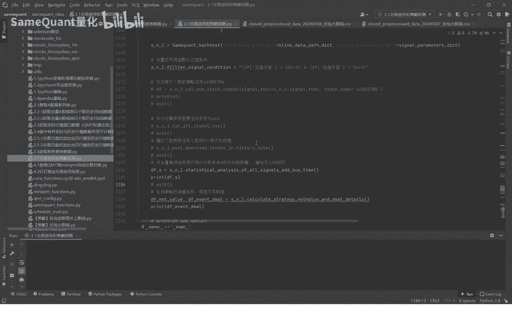
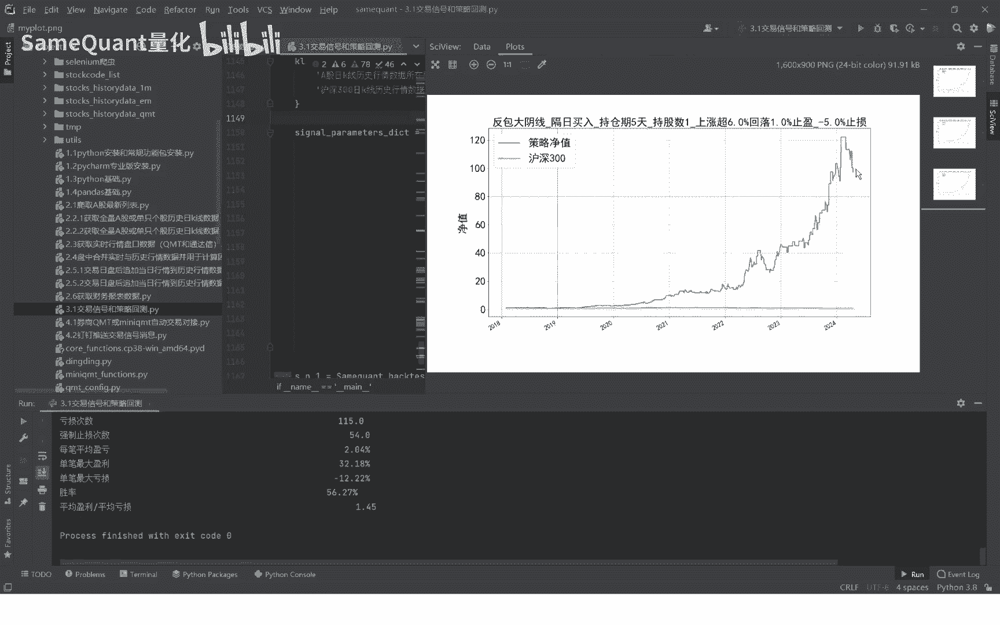
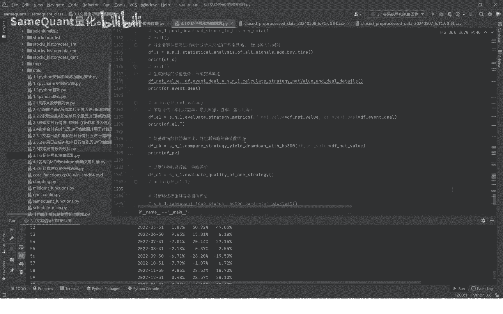
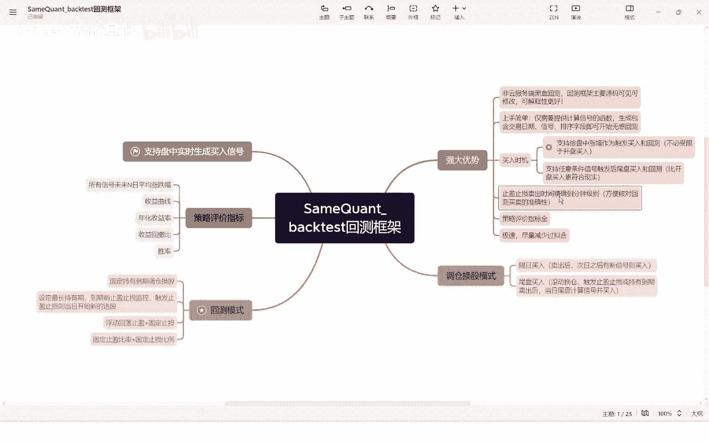
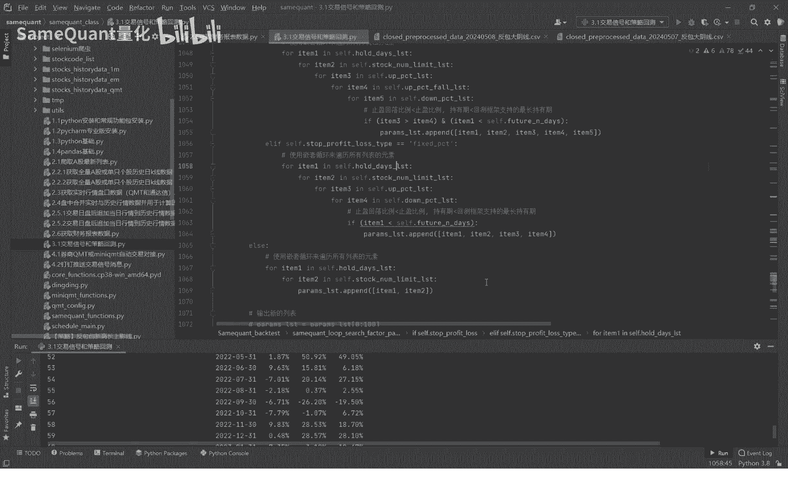
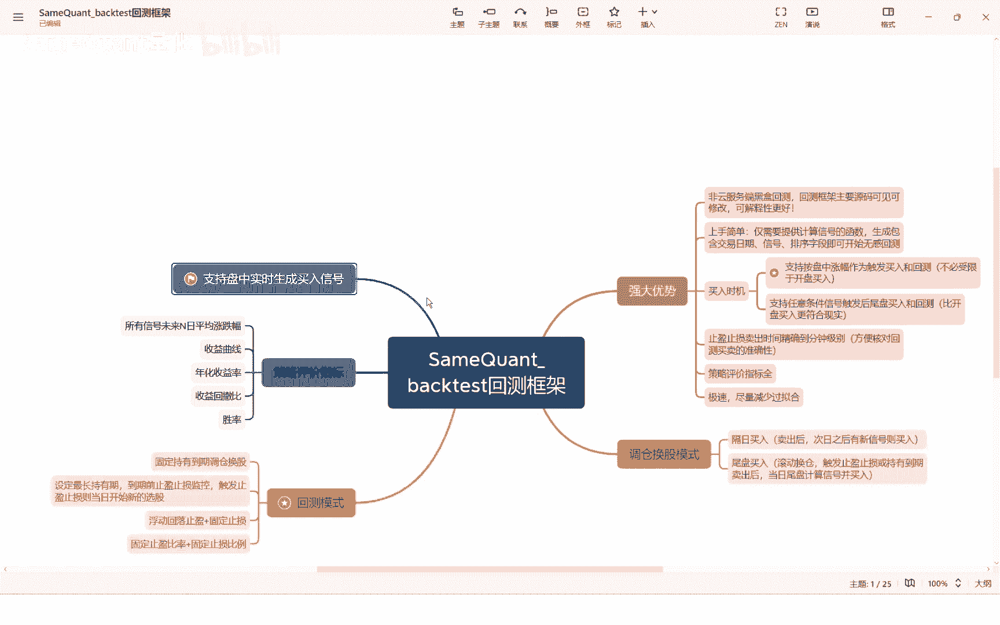
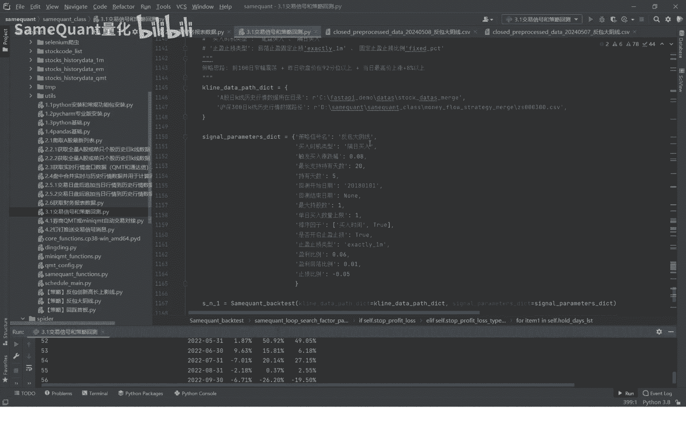

# 量化交易基础：3.1：SameQuant回测框架介绍 🧮

在本节课中，我们将要学习SameQuant量化回测框架的核心概念与优势。这是整个课程体系中最关键的环节，我们将深入讲解策略信号计算与回测的原理。

## 框架概述与演示

上一节我们介绍了量化交易的基础知识，本节中我们来看看一个具体的回测框架。首先，我们通过一个名为“反包大阴线”的策略进行演示。该策略的核心逻辑如下：
*   **买入时机**：隔日买入。
*   **持仓周期**：固定持有5天。
*   **仓位管理**：满仓操作。
*   **止盈规则**：上涨超过6%后，从最高点回落1%则卖出。
*   **止损规则**：亏损达到5%则卖出。

该策略自2018年回测至今，累计收益接近100倍。

## 框架核心输出详解

接下来，我们详细查看该回测框架生成的核心报告与数据，这是评估策略性能的基础。

**策略信号统计表**
此表格统计了所有交易信号发生后第1天至第19天的平均涨跌幅和上涨概率。该表主要用于快速判断策略属性：短线策略的信号在后三天的平均涨跌幅通常为正，且上涨概率较高。

**历史交易明细记录**
这是整个策略所有买卖交易的详细记录。本框架最关键的特色之一是记录**精确到分钟级别**的买卖时间。
*   **买入**：记录买入日期与精确到分钟的买入时间。
*   **卖出**：记录卖出日期与精确到分钟的卖出时间。

例如，一笔交易可能在2018年2月7日10:01因涨幅达到8%而触发买入，并在2月9日09:31因触发止盈规则而卖出。这种精确性允许我们逐一核对每笔交易的逻辑与收益率是否正确，是**避免回测过拟合**、确保结果可信的核心保障。

**策略评价指标**
以下是框架提供的主要评价指标：
*   回测区间
*   累计净值
*   年化收益率
*   最大回撤
*   盈利次数与亏损次数
*   强制止损（触发-5%）次数
*   单笔最大盈利/亏损
*   胜率
*   月度收益率与基准（如沪深300）对比

## SameQuant框架核心优势

在了解了框架的输出后，本节我们深入探讨SameQuant回测框架自身的设计优势。该框架为原创开发，在多个方面具有显著特点。

**1. 白盒化与可解释性**
市场上多数回测框架（如券商软件内置的）是“黑盒”，用户无法查看源码。本框架完全开源可见，甚至允许修改。这提升了策略的可解释性，让使用者能清楚了解回测的每个环节，从根本上评估是否存在过拟合。

**2. 上手简单与灵活性高**
熟悉框架后，用户只需提供包含交易日、信号、排序字段的`DataFrame`，即可自动完成回测。框架支持两种主流买入触发方式：
*   **盘中涨跌幅触发**：例如，`涨幅 >= 8%` 时买入。这涵盖了市场上90%以上的策略逻辑。
*   **尾盘买入**：在收盘时统一执行买入操作。

**3. 精细化的卖出与风控机制**
卖出机制支持以下两种模式，且时间均精确到分钟：
*   **固定持有到期**：例如持有5天后，于尾盘以收盘价卖出。
*   **止盈止损**：在最大持有期内，若触发条件则立即卖出。止盈止损又分为两种子类型：
    *   **浮动回落止盈 + 固定止损**：
        *   止盈条件：`最高价收益率 >= 6%` 且 `从最高点回落幅度 >= 1%`
        *   止损条件：`当前收益率 <= -5%`
    *   **固定比例止盈止损**：
        *   止盈条件：`收益率 >= 6%`
        *   止损条件：`收益率 <= -5%`

**4. 高效的运行速度**
框架经过优化，回测速度极快。例如，对“反包大阴线”策略进行超过4000组参数的循环回测，总耗时仅约40分钟，平均每组参数不到1秒。

**5. 完善的策略评价体系**
除了基础收益指标，框架还提供：
*   信号未来N日表现分析
*   收益曲线
*   夏普比率
*   月度胜率等
为策略评估提供多维度视角。

**6. 实盘对接支持**
框架生成的盘中实时买入信号，可以方便地与实盘交易系统（如QMT）进行对接，打通从回测到实盘的链路。

## 总结与下节预告

本节课中我们一起学习了SameQuant量化回测框架的核心功能与设计优势。我们了解到，一个优秀的回测框架必须具备**精准性**（如分钟级交易记录）、**透明性**（白盒模型）和**高效性**，以帮助我们有效验证策略逻辑，避免过拟合，为实盘交易打下坚实基础。

掌握本回测框架是后续进行策略研发、参数优化和绩效评估的关键。在下一节中，我们将以“反包大阴线”策略为例，深入代码层面，详细讲解如何使用本框架完成一次完整的策略回测。