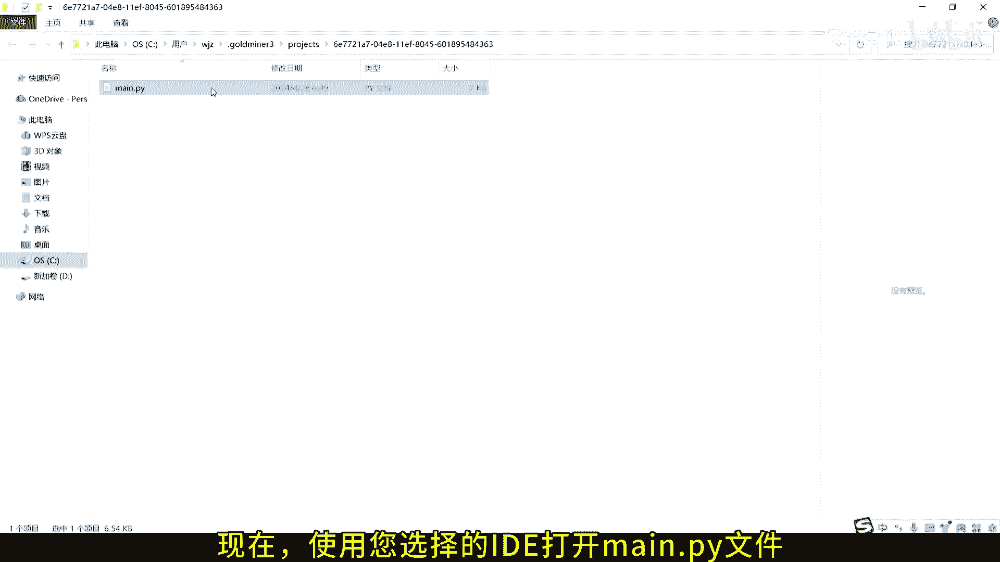
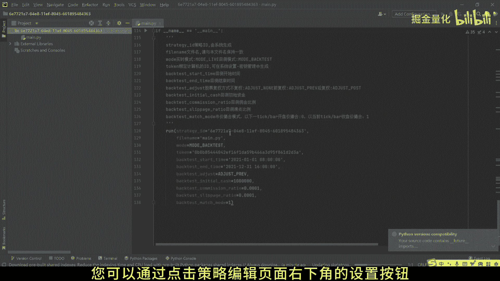
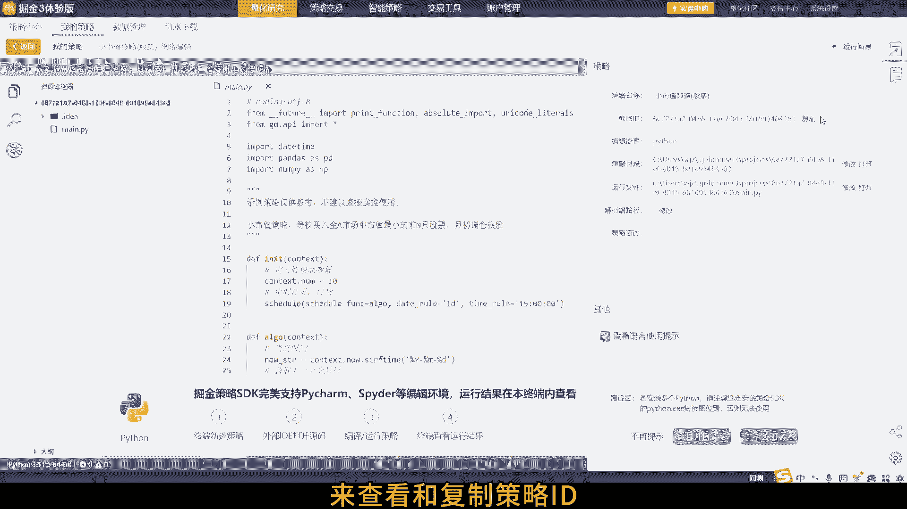
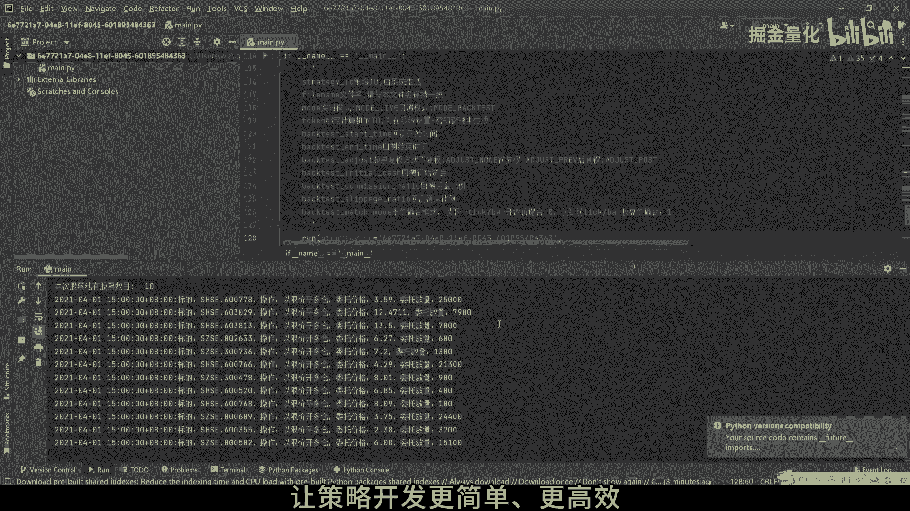

# 掘金量化策略编辑教程：3.2：在第三方IDE中编辑策略 - P1 🛠️

在本节课中，我们将学习如何在第三方集成开发环境中编辑掘金量化策略。我们将从定位策略文件开始，逐步介绍配置环境和关键参数，最终完成策略的编辑与准备工作。

## 概述

本节教程将指导您完成在第三方IDE中编辑量化策略的全过程。核心步骤包括：定位策略文件、配置Python环境、获取关键身份标识，并进行策略编辑。

## 定位并打开策略文件

首先，您需要在掘金量化终端中创建一个策略。我们以示例策略为例进行说明。

1.  在掘金量化终端中，点击右下角的**设置**按钮。
2.  在弹出的菜单中，选择打开包含您策略文件的目录。

成功打开目录后，您需要找到具体的策略文件。

以下是定位策略文件的具体步骤：
*   在打开的文件夹中，找到名为 `main.py` 的策略主文件。
*   使用您选择的第三方IDE（如VSCode、PyCharm等）打开这个 `main.py` 文件。

## 配置Python环境

成功打开策略文件后，为了确保策略能够正常运行，您需要配置正确的Python环境。

上一节我们介绍了如何打开策略文件，本节中我们来看看如何配置运行环境。您需要在IDE中配置一个已安装有掘金量化SDK（`gm`）的Python解释器。

## 获取关键身份标识

配置好环境后，编辑策略前还需要确认两个关键参数：策略ID和令牌ID。它们是策略与服务器通信的身份凭证。

### 策略ID (Strategy ID)

策略ID是终端用来识别策略身份的关键。您可以通过以下方式查看和复制它。

以下是获取策略ID的步骤：
1.  在掘金量化终端的策略编辑页面，点击右下角的**设置**按钮。
2.  在弹出的窗口中即可查看并复制您的策略ID。

### 令牌ID (Token ID)

令牌ID用于服务端识别您的用户身份。

以下是获取令牌ID的步骤：
1.  在掘金量化终端中，点击左上角菜单，进入**系统设置**。
2.  在系统设置页面中，您可以找到或重新生成您的令牌ID。

## 编辑并保存策略

现在，您可以开始在IDE中编辑您的策略代码。编辑时，请务必确保代码中使用的策略ID与终端中的设置保持一致。

以上就是在第三方IDE中编辑掘金量化策略的全部核心步骤。编辑完成后，保存文件即可。

## 总结

本节课中，我们一起学习了在第三方IDE中编辑掘金量化策略的完整流程。关键步骤包括：定位并打开 `main.py` 策略文件、配置包含 `gm` 库的Python环境、获取策略ID与令牌ID，最后进行策略编辑与保存。现在您可以保存策略并开始在终端中回测或运行它。

如果您在使用过程中有任何疑问，欢迎随时联系我们的技术支持团队。

掘金量化

