# 量化策略回测：3.2：计算单只个股策略信号 📈

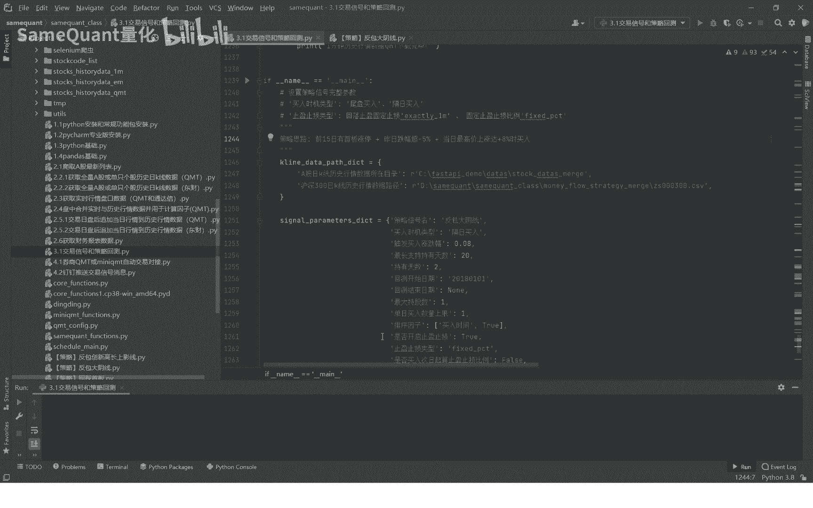

在本节课中，我们将学习量化策略回测框架的核心第一步：如何为单只股票计算历史策略信号。这是构建一个完整、可验证回测流程的基础。

## 回测框架概述

上一节我们介绍了策略回测的整体概念，本节中我们来看看具体如何实现。一个严谨的回测框架通常包含以下环环相扣的七个步骤：

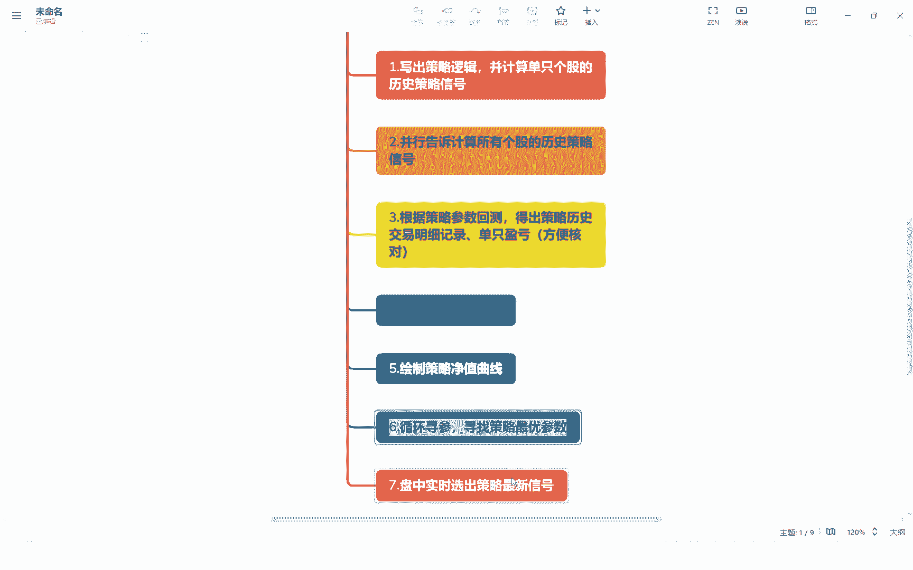

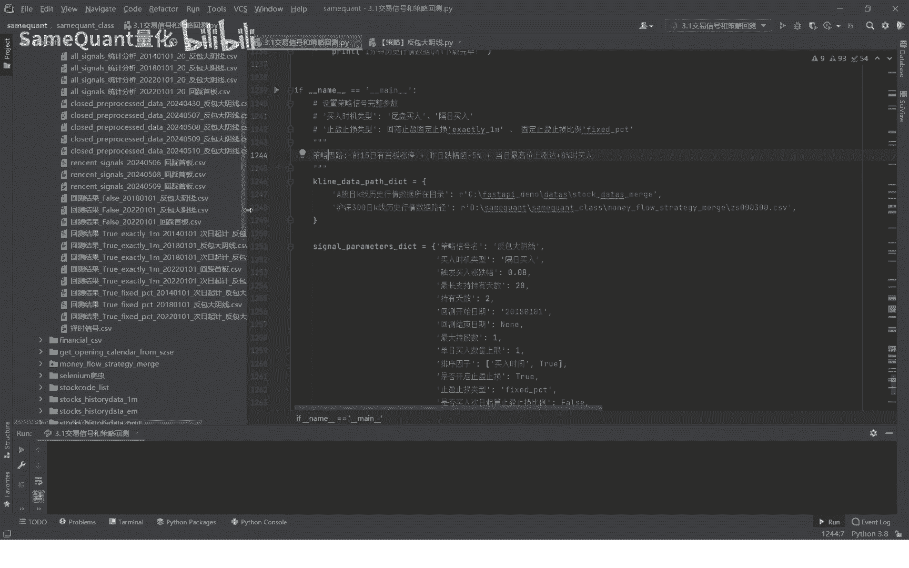

1.  **计算单只个股策略信号**：针对单一股票，编写并验证策略逻辑，计算其历史信号。
2.  **并行计算全市场信号**：将第一步的逻辑应用于所有股票，生成指定回测区间内全市场的策略信号文件。
3.  **生成历史交易明细**：根据策略参数（如持有期、最大持股数、仓位等）和排序因子，从每日信号中筛选出实际买卖的股票，生成详细的交易记录。
4.  **计算策略评价指标**：基于交易记录和每日盈亏，计算策略的净值曲线，并与基准指数（如沪深300）对比，得出夏普比率、最大回撤等评价指标。
5.  **绘制策略净值曲线**：可视化策略与基准的历史表现对比图。
6.  **参数寻优**：对策略核心参数进行网格搜索或循环测试，寻找历史数据上表现最优的参数组合。
7.  **实盘信号生成**：将策略逻辑封装成函数，实现盘中或定时快速计算实时选股信号，为实盘交易提供支持。

我们的框架强调逻辑透明、可核对、计算高效，避免“黑盒”操作，这是与许多现有回测工具的关键区别。

## 策略案例：反包大阴线

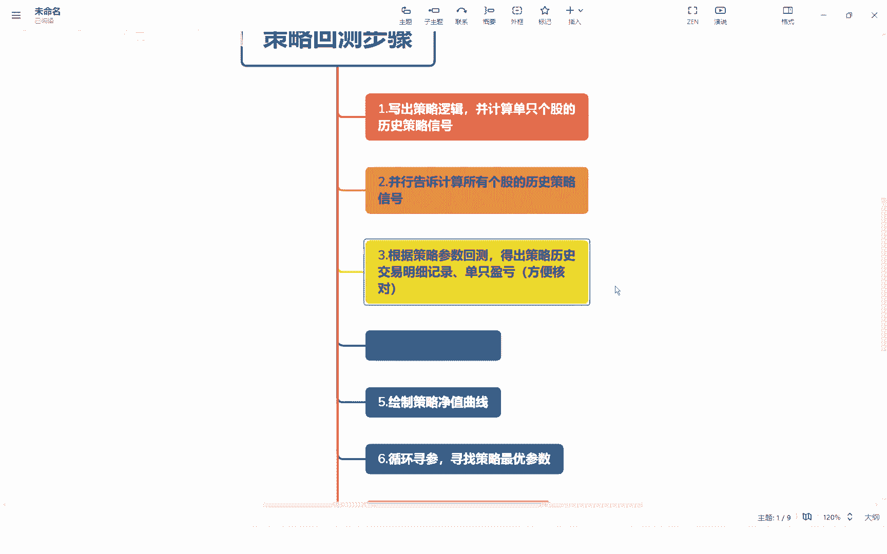

为了具体说明，我们以一个名为“反包大阴线”的策略为例。该策略的核心逻辑如下：

*   **条件一**：股票在最近15个交易日内出现过首次涨停（“首板”）。
*   **条件二**：昨日股价下跌超过5%，但未以跌停价收盘。
*   **条件三**：今日盘中最高价涨幅达到8%（即反包昨日阴线的大部分跌幅）。

**注意**：买入条件必须使用 **`最高价`** 而非收盘价。因为收盘价属于未来函数，会导致过拟合。策略逻辑是“盘中涨幅达到8%即触发买入”，因此必须用 `最高价` 来判断。

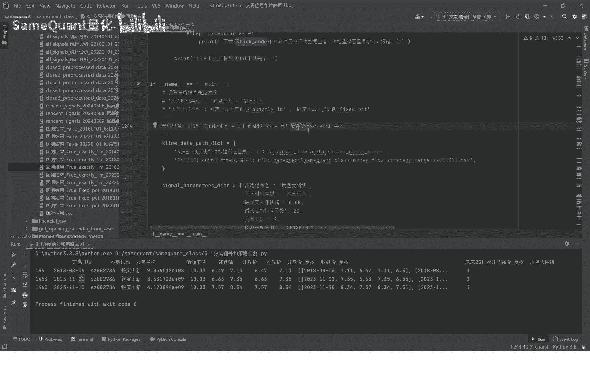

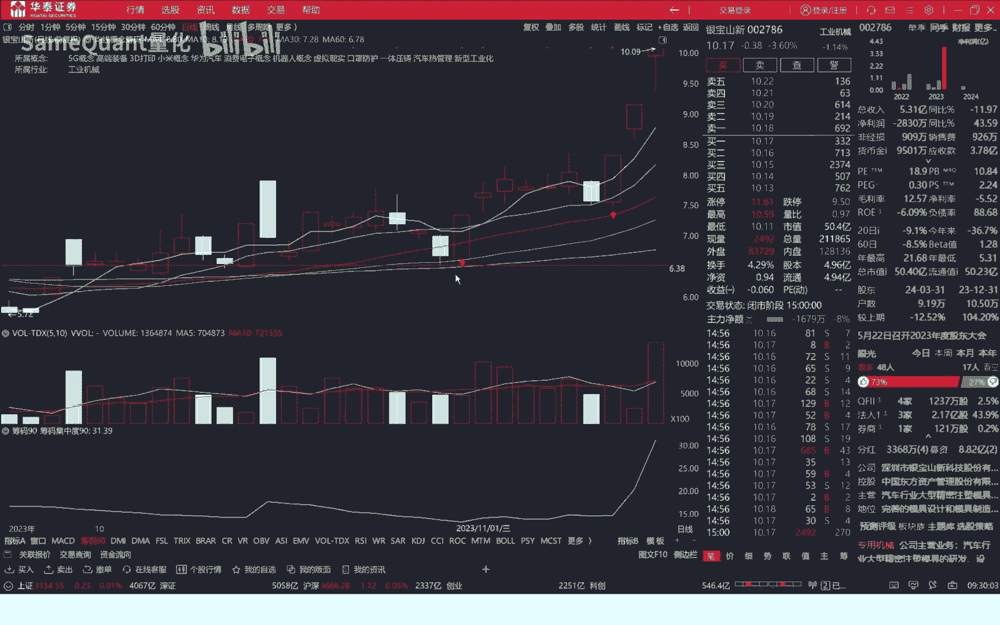

## 单只股票信号计算实战

理解了策略逻辑和回测步骤后，我们现在进入实战环节，编写计算单只股票“反包大阴线”信号的函数。

### 1. 函数定义与数据准备

首先，我们定义函数并获取股票的历史行情数据。

```python
def fanbao_dayinxian_signal(stock_code, end_date=None):
    """
    计算单只股票的反包大阴线策略信号
    :param stock_code: 股票代码
    :param end_date: 回测结束日期，默认为最近交易日
    :return: 包含策略信号的DataFrame
    """
    strategy_name = "反包大阴线"
    # 获取结束日期，若为空则取最近交易日
    if end_date is None:
        end_date = get_recent_trade_date()
    
    # 读取股票历史行情数据（包含日期、开高低收、涨跌幅、流通市值等字段）
    df = read_stock_history(stock_code)
    # 设定回测开始日期，并向前多取90天数据（用于计算均线等指标）
    start_date = ‘2018-01-01‘
    df = df[(df[‘交易日期‘] >= start_date) & (df[‘交易日期‘] <= end_date)]
    
    # 如果数据为空（如股票已退市），则返回空DataFrame
    if df.empty:
        return pd.DataFrame()
```

### 2. 数据预处理与特征计算

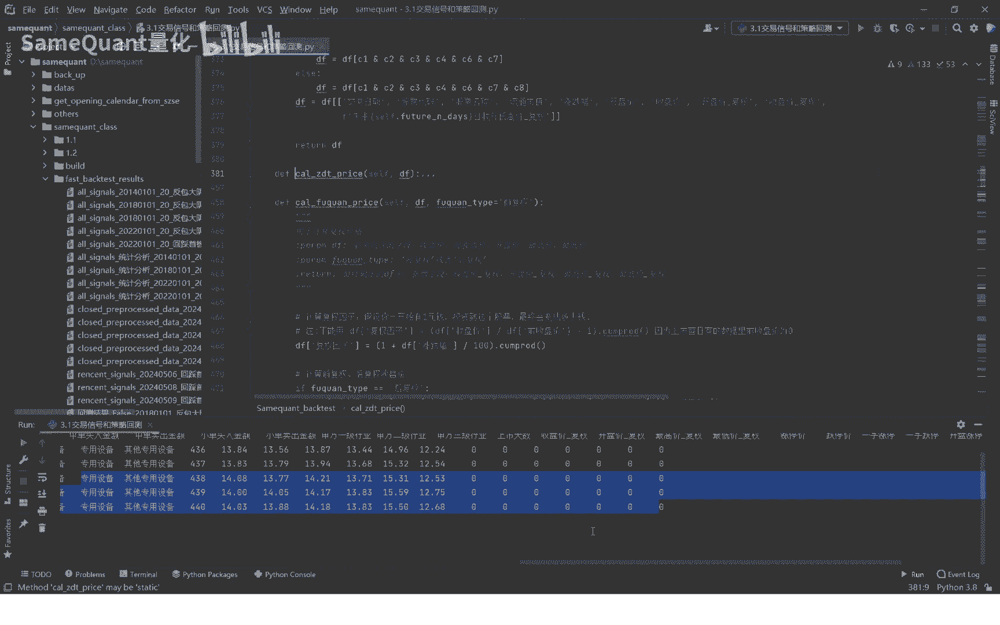

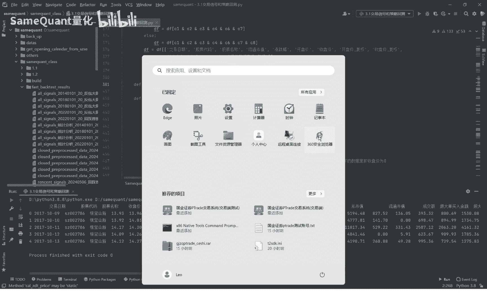

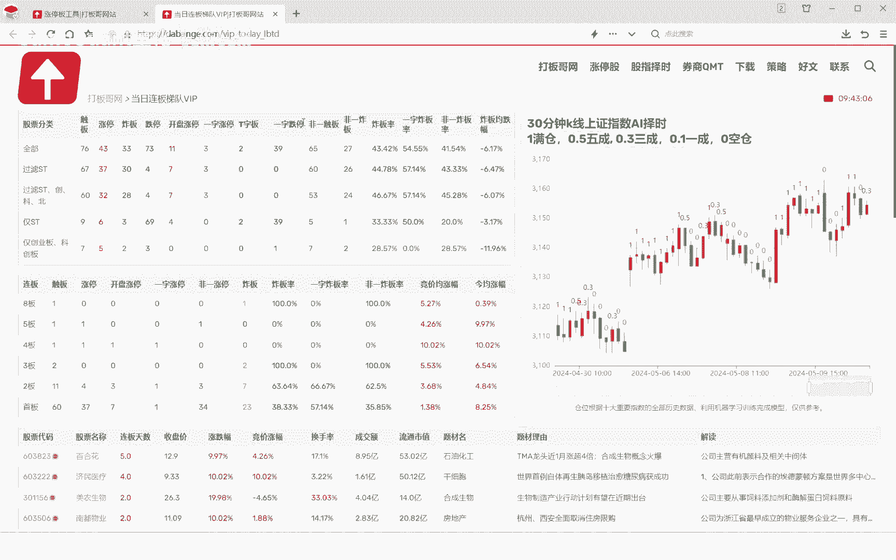

接下来，我们对数据进行清洗并计算策略所需的各种特征。

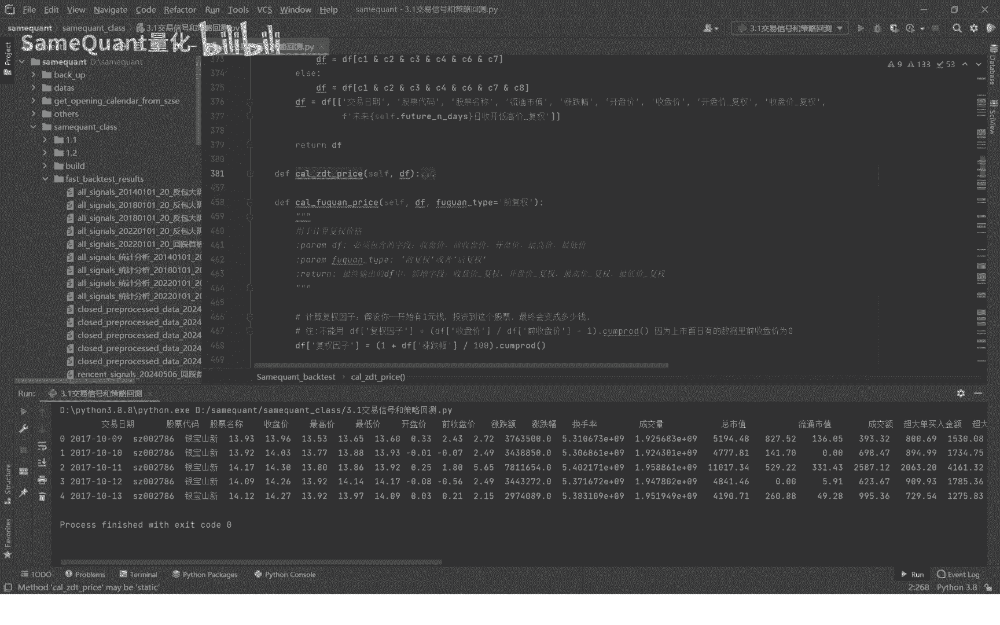

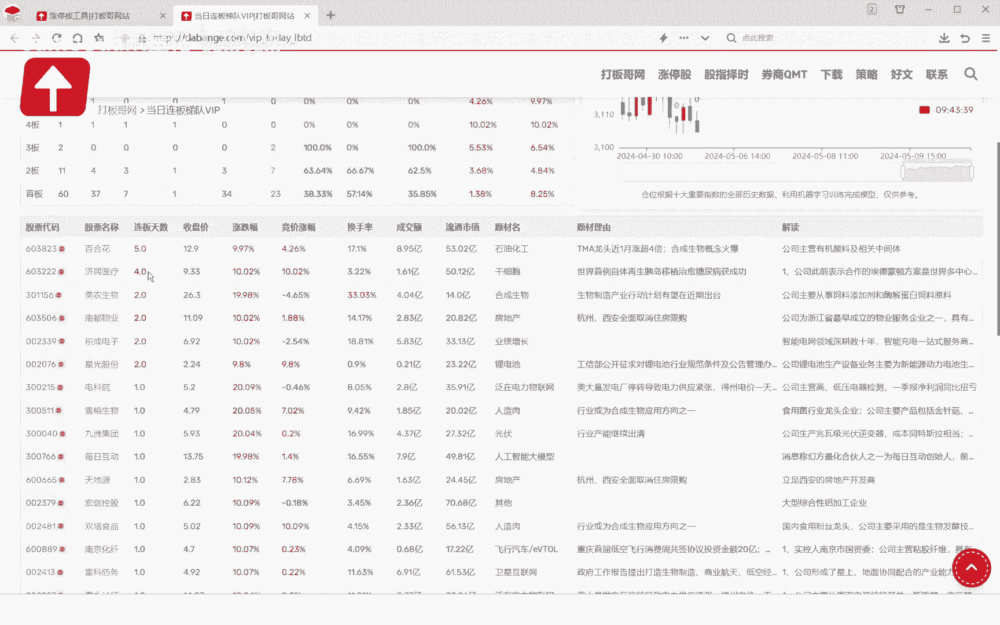

以下是关键的数据处理步骤：
*   **过滤新股**：上市天数小于30天的股票，其价格行为不稳定，应予排除。
*   **计算复权价格**：使用前复权价格进行计算，使历史数据更具可比性。`df = calculate_adjusted_price(df, method=‘前复权‘)`
*   **计算涨停价**：准确计算每日的涨停价，是识别“首板”的关键。`df[‘涨停价‘] = calculate_zt_price(df[‘前收盘价‘])`
*   **标记涨停**：根据收盘价和涨停价的关系，标记当日是否涨停。`df[‘是否涨停‘] = df[‘收盘价‘] >= df[‘涨停价‘]`
*   **计算均线**：计算短期、中期、长期均线，可用于附加过滤条件。`df[‘MA5‘] = df[‘收盘价‘].rolling(5).mean()`
*   **识别首板**：定义“首板”为：前一日未涨停，当日涨停，且近期涨停次数较少。
    ```python
    # 示例：计算前15日内的涨停次数
    df[‘前15日涨停次数‘] = df[‘是否涨停‘].rolling(15).sum()
    # 标记首板：当日涨停，且前一日未涨停，且前15日涨停次数<=2
    df[‘是否首板‘] = (df[‘是否涨停‘]) & (~df[‘是否涨停‘].shift(1)) & (df[‘前15日涨停次数‘] <= 2)
    df[‘前15日首板次数‘] = df[‘是否首板‘].rolling(15).sum()
    ```

### 3. 策略信号条件合成

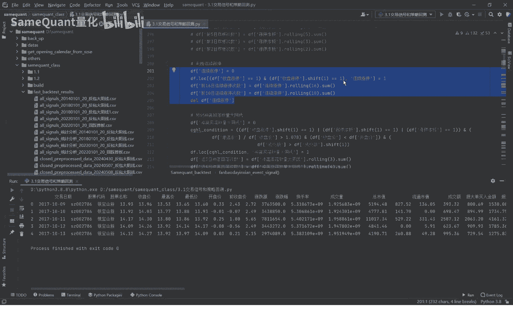

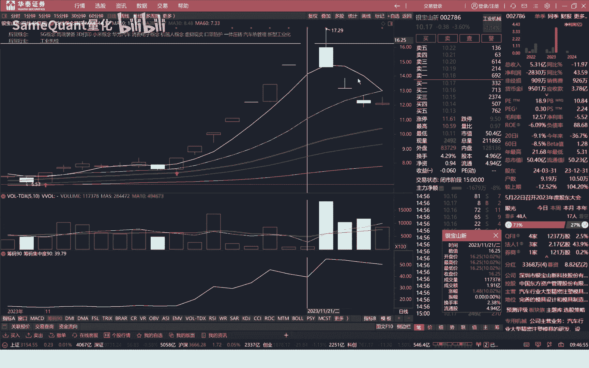

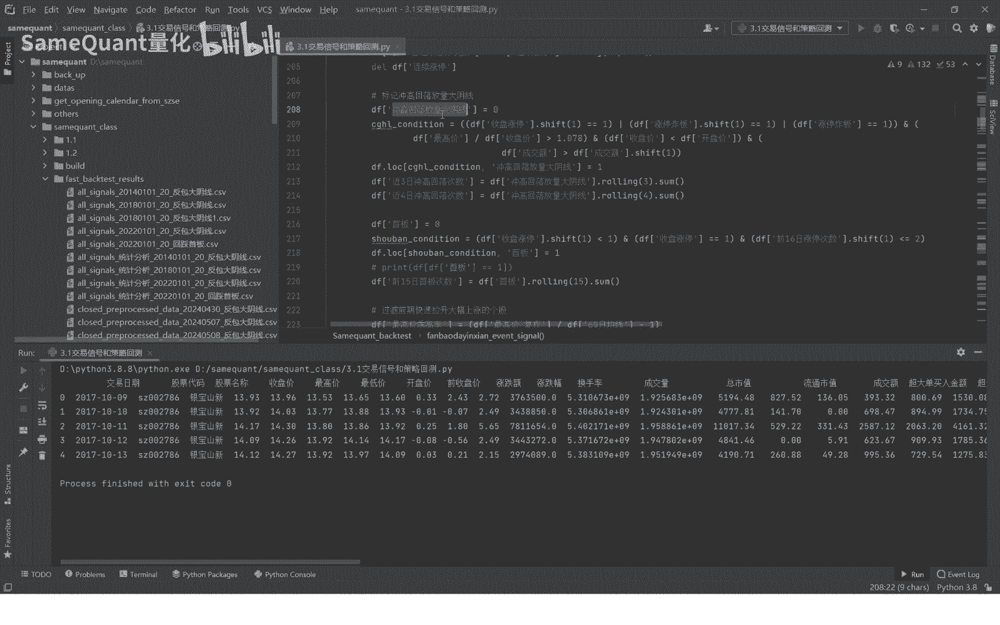

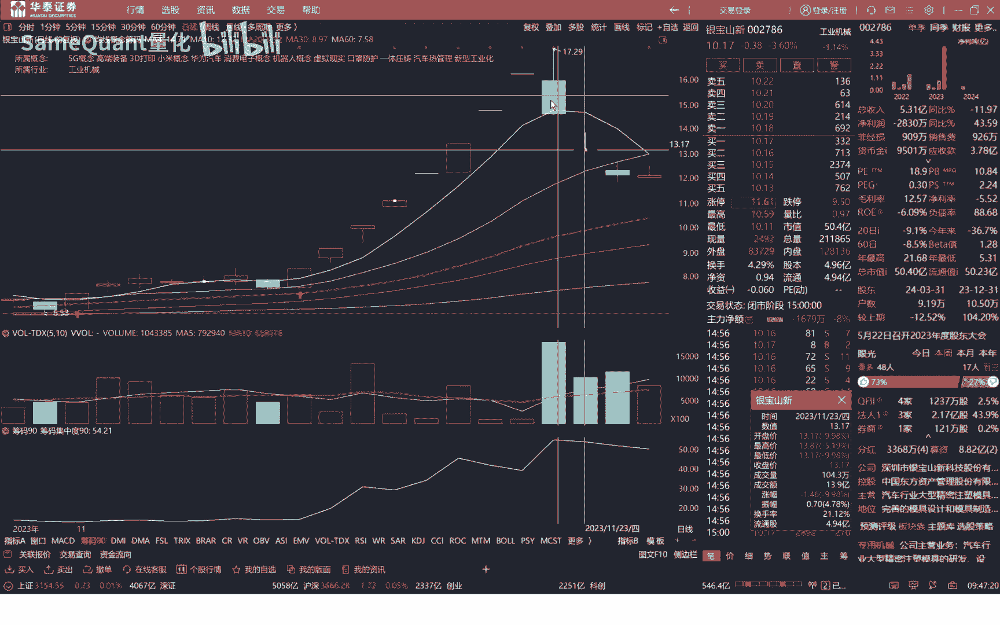

现在，我们将策略的三个核心逻辑条件转化为代码。

以下是构成“反包大阴线”信号的具体条件：
1.  **前15日有首板**：`condition1 = df[‘前15日首板次数‘] >= 1`
2.  **昨日大跌但未跌停**：昨日跌幅超过5%且未以跌停价收盘。
    ```python
    condition2 = (df[‘涨跌幅‘].shift(1) < -0.05) & (df[‘是否跌停‘].shift(1) == False)
    ```
3.  **今日盘中冲高**：今日最高价涨幅达到8%。**注意**：这里使用 `最高价` 计算涨幅。
    ```python
    # 假设‘前收盘价‘是昨日收盘价
    condition3 = df[‘最高价‘] / df[‘前收盘价‘] - 1 >= 0.08
    ```
4.  **排除一字涨停**：为确保买入可行性，需排除开盘即涨停（开盘价>=涨停价）的情况。
    ```python
    condition4 = df[‘开盘价‘] < df[‘涨停价‘]
    ```
5.  **（可选）均线过滤**：例如，要求短期均线在长期均线之上，以保持趋势。
    ```python
    condition5 = (df[‘MA5‘] > df[‘MA20‘]) & (df[‘MA20‘] > df[‘MA60‘])
    ```

最终，将所有条件用逻辑与（`&`）合并，得到策略信号点。
```python
df[‘信号‘] = condition1 & condition2 & condition3 & condition4 # & condition5
signal_df = df[df[‘信号‘] == True][[‘交易日期‘, ‘股票代码‘, ‘股票名称‘, ‘信号‘]]
```

### 4. 结果验证

运行函数，例如对股票“002766”进行计算，输出结果将包含该股票在回测区间内所有触发“反包大阴线”信号的日期。我们可以对照K线图人工验证这些日期是否符合策略逻辑描述，确保代码实现准确无误。

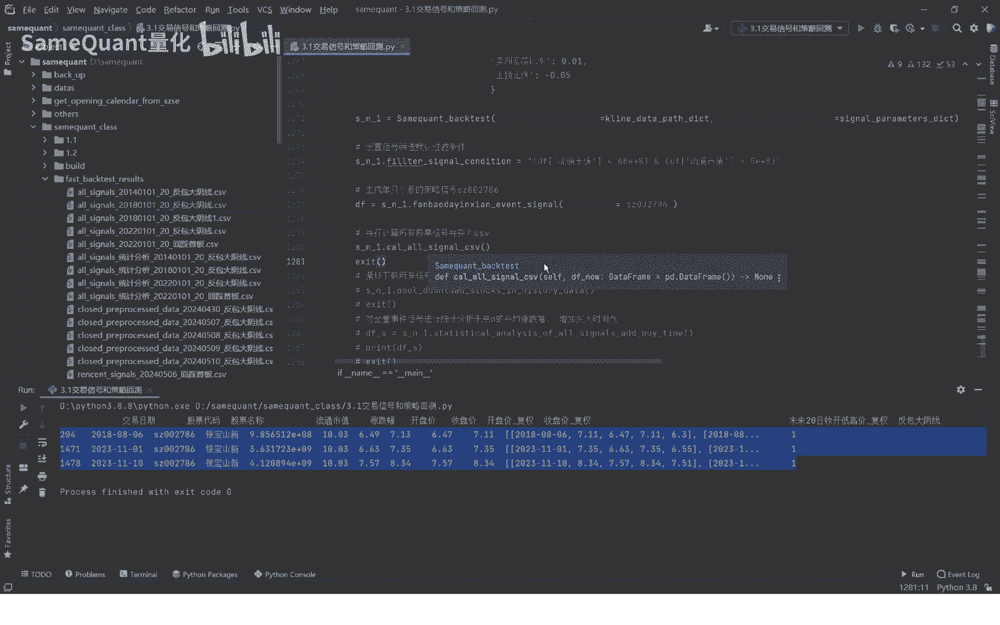

本节课中我们一起学习了量化策略回测的第一步：为单只股票计算历史策略信号。我们以“反包大阴线”策略为例，详细讲解了从数据准备、特征计算到信号合成的完整代码流程，并强调了使用`最高价`而非`收盘价`、排除一字涨停等关键细节，以保证策略逻辑的严谨性和回测的可靠性。下一节，我们将在此基础上，学习如何并行计算全市场所有股票的策略信号。