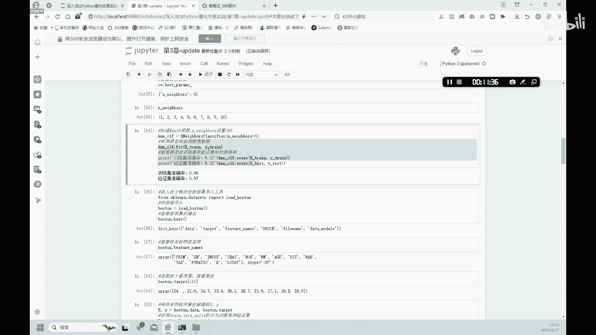

# 金融科技：3.2：机器学习之KNN分类任务 🧠


## 概述
在本节课中，我们将要学习机器学习的一个基础算法——K近邻算法，并使用Python的`scikit-learn`库来完成一个鸢尾花分类的实践任务。我们将从导入数据开始，一步步构建、训练并优化一个KNN分类模型。

---

## 机器学习工具简介
在我们了解了机器学习的基本概念之后，本节中我们来看看实现机器学习所需的工具。Python拥有丰富的第三方库来支持机器学习。

以下是几个常用的机器学习库：
*   **scikit-learn**：一个成熟的通用机器学习库。
*   **TensorFlow / PyTorch**：主要用于深度学习的框架。
*   **XGBoost**：一个高效的梯度提升库。

本节课我们将主要使用`scikit-learn`库来实践分类任务。

---

## KNN算法原理
我们将使用的第一个算法是K近邻算法。KNN的定义是：预测一个数据点在特征空间中**邻域内最频繁的分类**，或在回归任务中取邻域内数据的**平均值**。

具体是什么意思呢？我们通过接下来的案例就能清楚地理解。

---

## 数据准备与探索
首先，我们需要导入数据。`scikit-learn`自带了一些经典数据集，我们将使用其中的鸢尾花数据集。

以下是导入所需库和数据的代码：
```python
# 导入鸢尾花数据集
from sklearn.datasets import load_iris
# 导入KNN分类模型
from sklearn.neighbors import KNeighborsClassifier
# 导入图表工具
import matplotlib.pyplot as plt
```

接下来，我们加载数据并查看其结构。
```python
# 加载数据集
iris = load_iris()
# 查看数据集包含的项目
print(iris.keys())
```
数据集主要包含以下几项：`data`（特征数据）、`target`（分类标签）、`feature_names`（特征名称）、`target_names`（目标类别名称）。

我们重点关注`target`（样本的分类标签）和`feature_names`（特征名称）。我们将根据花的特征对其进行分类。

查看特征名称：
```python
print(iris.feature_names)
```
输出为四个特征：萼片长度、萼片宽度、花瓣长度、花瓣宽度。我们将依据这四个特征对鸢尾花进行分类。

查看已有的分类标签：
```python
print(iris.target)
```
输出显示标签分为0、1、2三类，意味着数据集已将鸢尾花分为三个品种。

---

## 项目目标
我们的目标是：根据鸢尾花的萼片和花瓣的长度与宽度这四个特征，结合已知的分类标签训练一个模型。训练完成后，这个模型能够预测一株未知品种的鸢尾花属于哪一个类别。

---

## 拆分数据集
第一步，我们需要将数据集拆分为训练集和验证集。训练集用于训练模型，验证集用于评估模型性能。

首先，将样本特征和标签分别赋予变量X和Y。
```python
X = iris.data
y = iris.target
```
查看数据形状：
```python
print(X.shape)
```
输出为`(150, 4)`，表示共有150个样本，每个样本有4个特征。

接着，使用`scikit-learn`的`train_test_split`函数拆分数据集。
```python
from sklearn.model_selection import train_test_split
X_train, X_test, y_train, y_test = train_test_split(X, y, test_size=0.25, random_state=42)
```
拆分后，训练集有112个样本，验证集有38个样本，特征数量保持不变。

---

## 构建与训练KNN模型
现在，我们来构建一个KNN分类器并进行训练。

以下是构建和训练模型的代码：
```python
# 创建KNN分类器，使用默认参数（n_neighbors=5）
knn = KNeighborsClassifier()
# 使用训练集数据训练模型
knn.fit(X_train, y_train)
```
训练完成后，我们可以查看模型在训练集和验证集上的准确率。
```python
# 打印训练集准确率
print(‘训练集准确率：‘, knn.score(X_train, y_train))
# 打印验证集准确率
print(‘验证集准确率：‘, knn.score(X_test, y_test))
```
输出结果可能显示训练集准确率约为96%，验证集准确率约为97%。这表明模型的初步效果不错。

---

## 优化模型参数
我们可以通过调整KNN算法的`n_neighbors`参数来尝试改进模型性能。该参数默认值为5，表示考察最近的5个邻居。

为了找到最优参数，我们可以使用网格搜索功能。

以下是使用网格搜索寻找最优`n_neighbors`值的代码：
```python
from sklearn.model_selection import GridSearchCV
# 定义参数搜索范围：n_neighbors从1到10
param_grid = {‘n_neighbors‘: range(1, 11)}
# 创建网格搜索对象
grid_search = GridSearchCV(KNeighborsClassifier(), param_grid, cv=5)
# 在训练集上进行网格搜索
grid_search.fit(X_train, y_train)
# 输出最优参数
print(‘最优 n_neighbors 参数：‘, grid_search.best_params_)
```
网格搜索可能会得出最优的`n_neighbors`值为6。这个值的含义是：在分类时，考察与目标数据点最近的6个邻居的类别，以此做出预测，可能获得更高的准确率。

---

## 使用优化后的模型
现在，我们使用找到的最优参数`n_neighbors=6`来重新训练模型。

代码如下：
```python
# 创建KNN分类器，并设置n_neighbors=6
knn_optimized = KNeighborsClassifier(n_neighbors=6)
# 训练模型
knn_optimized.fit(X_train, y_train)
# 评估模型
print(‘优化后训练集准确率：‘, knn_optimized.score(X_train, y_train))
print(‘优化后验证集准确率：‘, knn_optimized.score(X_test, y_test))
```
输出结果可能显示，优化后的模型在训练集和验证集上的准确率与之前相近（例如，依然在96%和97%左右）。这说明我们的初始模型已经接近最优，参数调整在本案例中提升空间有限。最终，我们得到了一个准确率很高的鸢尾花分类模型。



---

## 总结
本节课中，我们一起学习了K近邻算法的基本原理，并完成了一个完整的机器学习分类项目。我们从加载`scikit-learn`内置的鸢尾花数据集开始，经历了数据探索、数据集拆分、构建KNN模型、训练模型以及通过网格搜索优化模型参数的全过程。最终，我们得到了一个能够高准确率识别鸢尾花品种的分类模型。