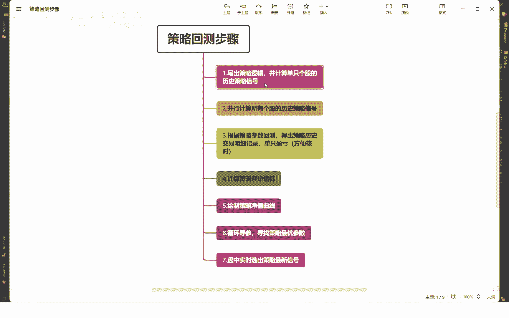
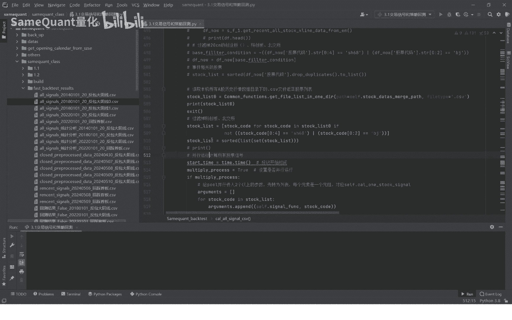
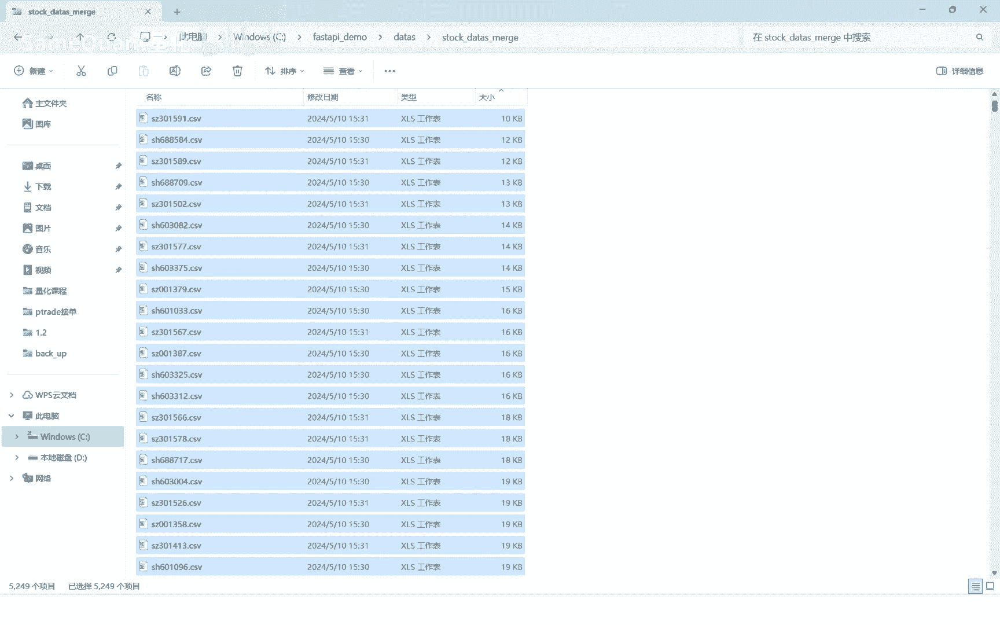
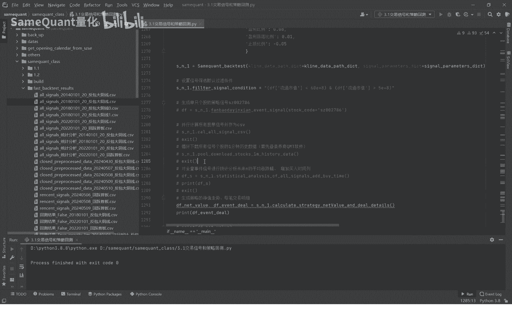

# 量化回测教程：3.3：并行计算所有个股的历史策略信号 - P1



在本节课中，我们将学习策略回测的第二步：如何并行计算所有个股的历史策略信号。上一节我们介绍了单只个股的信号计算，本节中我们将扩展至全市场股票，并利用并行计算技术来提升效率。


## 概述

本节课的核心任务是编写一个函数，批量计算A股市场所有个股（包括已退市股票）的策略信号，并将结果高效地存储下来。我们将使用 `multiprocessing` 库进行并行计算，并讲解数据处理中的关键过滤步骤。


## 设置存储路径与避免重复计算

首先，我们需要设置一个目录来存储计算完成后的策略信号文件。这个目录路径由策略类内部的默认参数构成，建议不要随意修改，以免影响后续环节。

计算完成后，会生成一个CSV文件存储在本机。代码中有一句关键判断：先检查信号文件是否已存在。如果存在，则跳过计算；如果不存在，才开始计算。这可以避免不必要的重复运算。





```python
if os.path.exists(signal_file_path):
    print("信号文件已存在，跳过计算。")
    return
else:
    # 开始计算所有个股信号
    calculate_all_signals()
```


## 获取并过滤股票列表

接下来，我们需要获取所有待计算股票的列表。这个列表必须包含所有历史上正常上市、现已退市或终止上市的股票，以确保回测的历史严谨性。

获取列表后，我们需要过滤掉科创板（688开头）和北交所（8开头）的股票，因为本策略目前只针对主板和部分创业板（10cm涨跌幅限制）的股票。

以下是获取并过滤股票列表的步骤：

1.  读取本地存储的所有个股历史行情数据目录。
2.  统计股票总数（例如5249只，包含已退市股票）。
3.  根据股票代码前缀，过滤掉科创板和北交所的股票。
4.  得到过滤后的股票列表（例如4675只）。


## 引入并行计算库

为了加速计算过程，我们将使用Python的 `multiprocessing` 库进行并行计算。你需要在代码开头引入这个库。如果未安装，可以使用 `pip install multiprocessing` 进行安装。

```python
import multiprocessing as mp
```


## 执行并行计算

准备工作完成后，我们调用并行计算函数。该函数会将股票列表分配给多个进程同时计算每只股票的历史信号。

计算完成后，结果会合并成一个大的 `DataFrame` 表格，其中包含了所有股票符合条件的策略信号（例如“反包大阴线”信号）。


## 对计算结果进行二次过滤

并行计算得到的初始结果需要进一步清洗和过滤，以满足策略要求。以下是关键的过滤步骤：

1.  **过滤新规创业板**：2020年8月24日后上市的创业板股票实行20cm涨跌幅，需被过滤掉。条件是：上市日期晚于2020-08-23且股票代码以“300”开头。
2.  **过滤特殊状态股票**：剔除信号发出当日处于ST、*ST（退市风险警示）或新上市（如上市未满60天）状态的股票信号。
3.  **（可选）流通市值过滤**：策略中还可以增加其他条件，例如只保留流通市值在5亿到60亿之间的股票。此条件为可选，你可以根据需求注释或修改。


## 保存最终结果

所有过滤步骤完成后，将最终的信号 `DataFrame` 保存为CSV文件。程序会打印出整个并行计算过程所消耗的时间。

例如，计算约4700只股票、跨越6年多的数据，可能耗时约1分钟。生成的文件包含后续回测必需的字段，如股票代码、名称、流通市值、信号当日涨跌幅、开盘价、收盘价以及未来N日的最高价等。


## 总结

本节课中我们一起学习了策略回测中批量计算信号的全流程。我们首先设置了存储路径并建立了避免重复计算的机制，然后获取了全面的股票列表并进行初步过滤。接着，我们引入 `multiprocessing` 库对全市场股票进行并行信号计算，极大地提升了效率。最后，我们对计算结果进行了细致的二次过滤，并保存了包含所有必需字段的最终信号文件。



下一节课将是核心内容：为了进行精确到分钟级别的回测，我们需要下载并使用分钟级别的历史行情数据。