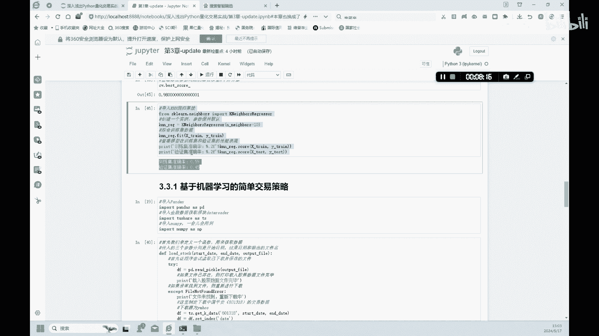

# 金融科技：3.3：机器学习之KNN回归任务 🏠


## 概述
在本节课中，我们将学习如何使用K最近邻（KNN）算法解决回归问题。我们将以经典的波士顿房价数据集为例，演示如何导入数据、划分数据集、训练模型、评估性能，并通过调整参数来尝试优化模型。

---

## 数据导入与探索
首先，我们需要导入波士顿房价数据集。这个数据集包含了影响房价的多个特征。

```python
from sklearn.datasets import load_boston
boston = load_boston()
```

数据集 `boston` 包含以下几个关键部分：`data`（特征数据）、`target`（目标房价）、`feature_names`（特征名称）等。我们可以查看特征名称，了解数据包含哪些信息。

以下是数据集的13个特征：
*   **RM**：每个住宅的平均房间数。
*   **AGE**：1940年之前建成的自住单位比例。
*   其他特征还包括人均犯罪率、一氧化氮浓度、师生比例等。

接着，我们查看一下前十个样本的目标房价（`target`），以了解数据的大致范围。

---

## 数据准备与模型训练
上一节我们查看了数据的基本信息，本节中我们来看看如何准备数据并开始训练模型。

首先，将特征数据赋值给变量 `X`，将目标房价赋值给变量 `y`。然后，将数据集划分为训练集和测试集，用于模型训练和验证。

```python
from sklearn.model_selection import train_test_split
X = boston.data
y = boston.target
X_train, X_test, y_train, y_test = train_test_split(X, y, test_size=0.25, random_state=42)
```

拆分后，训练集有379个样本，测试集有127个样本，每个样本依然保持13个特征。

由于我们的目标是预测具体的房价数值，这是一个回归问题，因此我们使用 `KNeighborsRegressor` 来建立模型。

```python
from sklearn.neighbors import KNeighborsRegressor
knn_reg = KNeighborsRegressor()
knn_reg.fit(X_train, y_train)
```

训练完成后，我们可以计算模型在训练集和测试集上的决定系数（R²）来评估性能。初始模型的训练集准确率约为68%，而测试集准确率只有45%。这通常表明模型可能处于欠拟合状态，性能有待提升。

---

## 模型优化尝试
面对一个表现不佳的模型，我们通常需要尝试优化。本节中我们来看看如何通过调整KNN算法中最重要的参数——邻居数量（`n_neighbors`）来改进模型。

我们采用类似网格搜索的方法，遍历一组可能的 `n_neighbors` 值（例如从1到20），目标是找到一个值，使得模型在训练集和测试集上的R²分数尽可能高。

以下是进行参数搜索的核心思路：
*   循环不同的 `n_neighbors` 值。
*   对每个值训练一个新的KNN回归模型。
*   分别计算该模型在训练集和测试集上的R²分数。
*   记录并比较这些分数，找到最优值。

通过搜索，我们发现当 `n_neighbors=10` 时，模型在训练集上的R²分数达到了约0.98，这是一个非常高的值。

---

## 优化结果分析
根据上一节的搜索结果，我们将 `n_neighbors` 参数设置为10，并重新训练和评估模型。

```python
knn_reg_optimized = KNeighborsRegressor(n_neighbors=10)
knn_reg_optimized.fit(X_train, y_train)
```

然而，重新评估后发现，调整参数后的模型在测试集上的准确率并没有显著提升，甚至可能不如调整前。这说明，仅靠调整 `n_neighbors` 参数，不足以让模型很好地预测波士顿房价。

这个结果提示我们，预测房价是一个复杂的问题，可能受到数据集中未包含的诸多因素影响，例如宏观经济政策、市场整体环境等。在实际的金融科技研究或量化交易策略开发中，我们需要引入更多相关的特征变量或尝试更复杂的模型，才能获得更准确的预测结果。

---



## 总结
本节课中我们一起学习了KNN算法在回归任务中的应用。我们完成了从数据导入、探索、划分到训练KNN回归模型的全过程。通过评估，我们发现初始模型存在欠拟合问题。随后，我们尝试通过网格搜索调整 `n_neighbors` 参数来优化模型，虽然找到了在训练集上表现优异的参数，但模型在测试集上的泛化能力并未得到根本改善。这个案例表明，在实际问题中，特征工程和模型选择与参数调优同等重要。