# 量化交易：Python入门之数据分析【3／4】：3-1. Pandas数据合并 📊

在本节课中，我们将要学习如何使用Pandas库进行DataFrame的合并操作。数据合并是数据分析中的核心技能，它允许我们将来自不同来源的数据集根据特定的键（Key）连接在一起，为后续的金融数据分析打下基础。

上一节我们介绍了DataFrame的基本操作，本节中我们来看看如何将多个DataFrame合并成一个。

## 导入Pandas库

首先，我们需要导入Pandas库，这是进行数据分析的基础。

```python
import pandas as pd
```

## 创建示例DataFrame

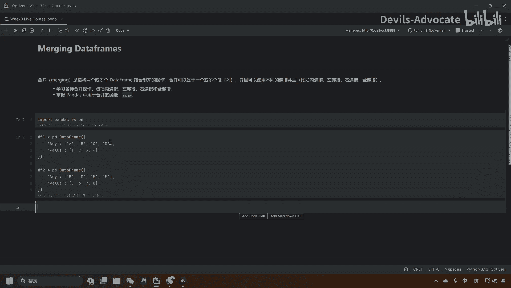

为了演示合并操作，我们先创建两个简单的DataFrame。

```python
df1 = pd.DataFrame({
    ‘key‘: [‘A‘, ‘B‘, ‘C‘, ‘D‘],
    ‘value‘: [1, 2, 3, 4]
})

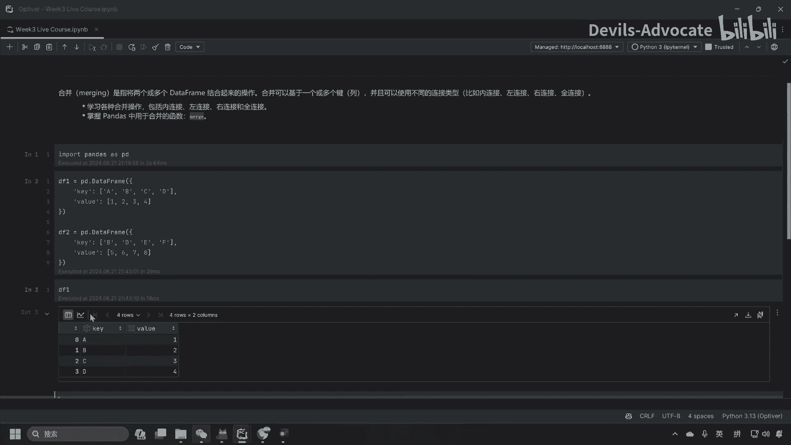

df2 = pd.DataFrame({
    ‘key‘: [‘B‘, ‘D‘, ‘E‘, ‘F‘],
    ‘value‘: [5, 6, 7, 8]
})
```

以下是`df1`的内容：

| key | value |
|-----|-------|
| A   | 1     |
| B   | 2     |
| C   | 3     |
| D   | 4     |

以下是`df2`的内容：

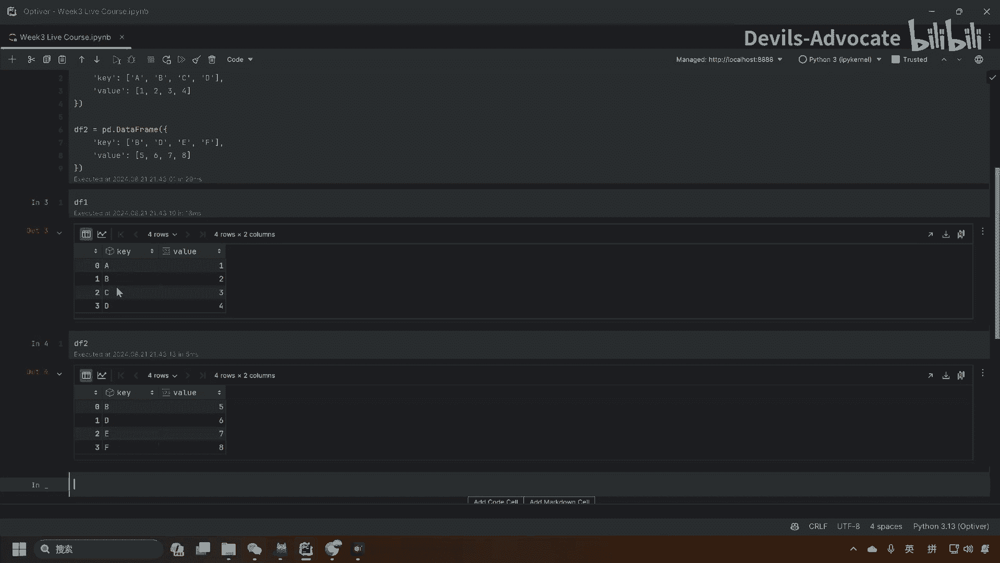

| key | value |
|-----|-------|
| B   | 5     |
| D   | 6     |
| E   | 7     |
| F   | 8     |

可以看到，两个DataFrame都有一列名为`key`，并且`B`和`D`是共有的键，而`A`、`C`、`E`、`F`是各自独有的。

## 使用`pd.merge()`进行合并

Pandas提供了`pd.merge()`函数来执行合并操作。其基本语法是：

```python
pd.merge(left, right, how=‘inner‘, on=None, left_on=None, right_on=None, suffixes=(‘_x‘, ‘_y‘))
```

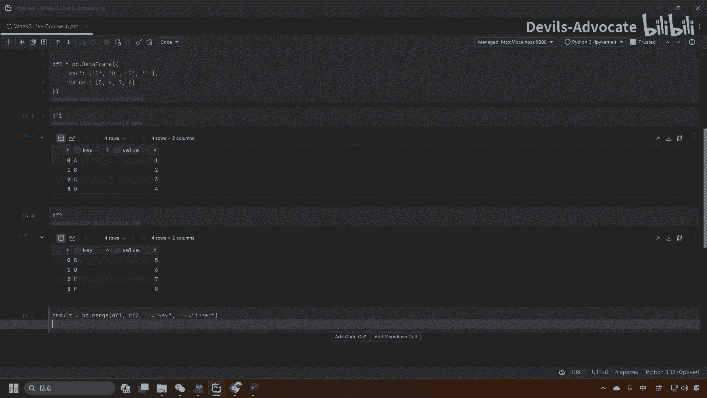

*   `left`：左侧的DataFrame。
*   `right`：右侧的DataFrame。
*   `how`：合并类型，如`‘inner‘`、`‘outer‘`、`‘left‘`、`‘right‘`。
*   `on`：用于连接的列名（两个DataFrame中都有此列名时使用）。
*   `left_on`/`right_on`：当两个DataFrame的键列名不同时，分别指定左右两侧的列名。
*   `suffixes`：当两个DataFrame有同名列（非连接键）时，用于区分它们的后缀。

### 内连接 (Inner Join)

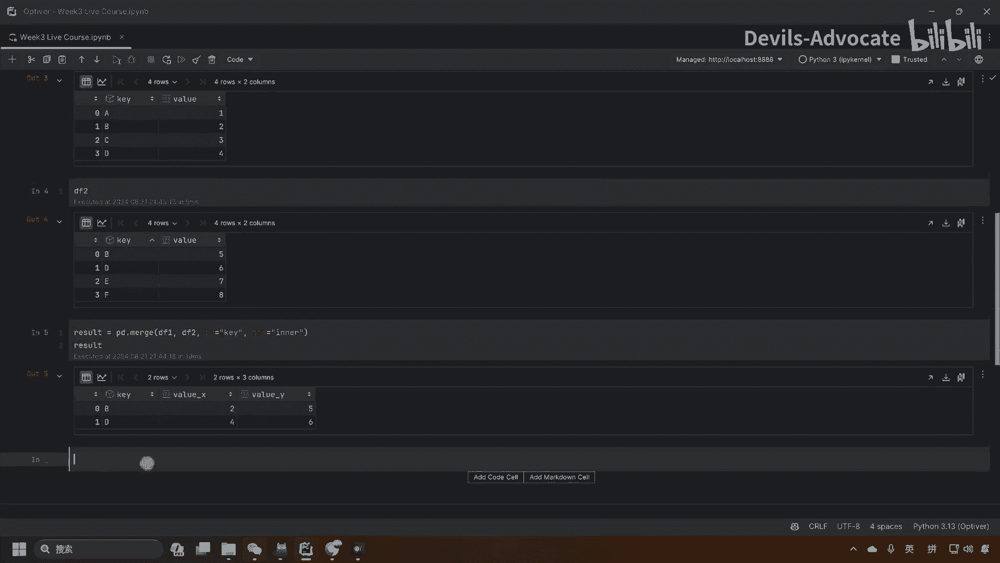

内连接只保留两个DataFrame中键完全匹配的行。

```python
result_inner = pd.merge(df1, df2, on=‘key‘, how=‘inner‘)
print(result_inner)
```

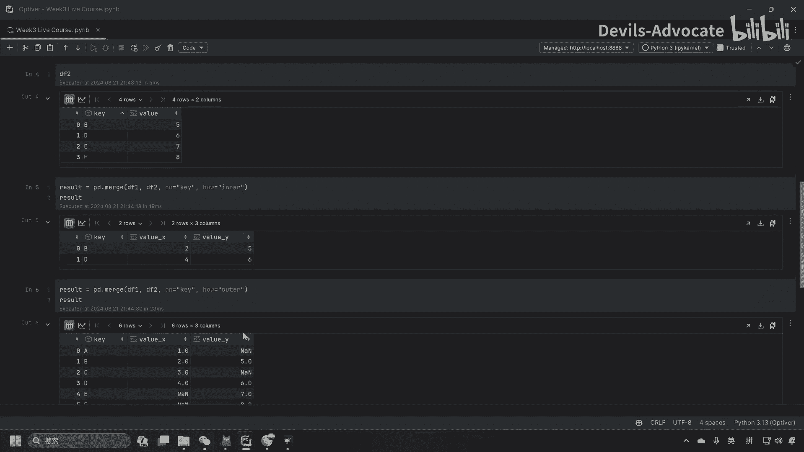

输出结果：

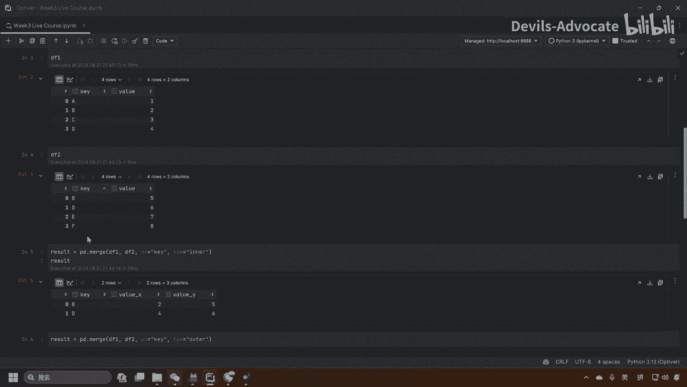

| key | value_x | value_y |
|-----|---------|---------|
| B   | 2       | 5       |
| D   | 4       | 6       |

可以看到，结果中只保留了`df1`和`df2`中都存在的键`B`和`D`。由于两个DataFrame都有`value`列，Pandas自动添加了后缀`_x`和`_y`来区分它们。

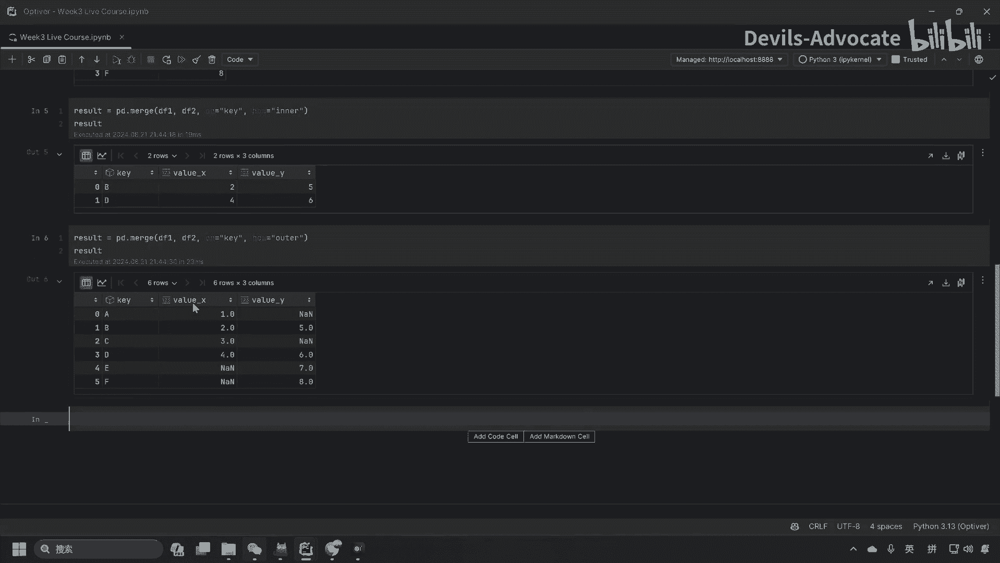

### 外连接/全连接 (Outer Join)

全连接会保留两个DataFrame中所有的键，缺失的值用`NaN`填充。

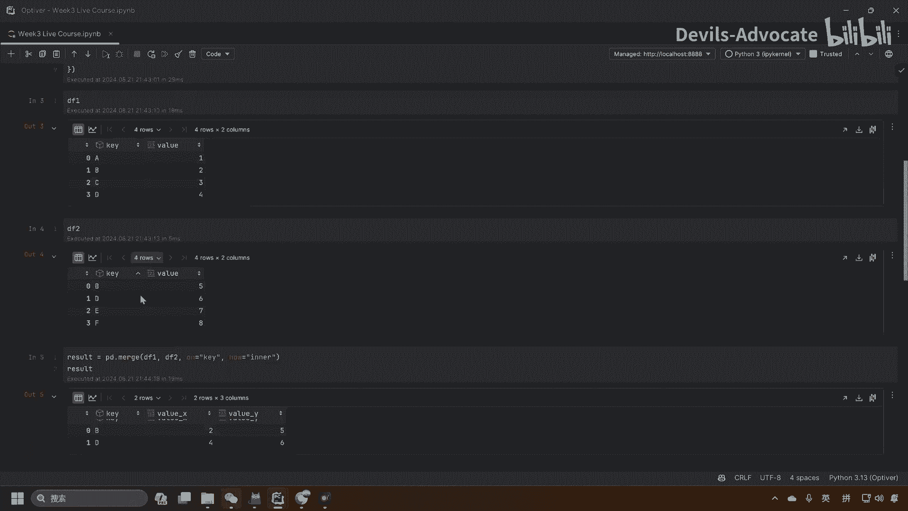

```python
result_outer = pd.merge(df1, df2, on=‘key‘, how=‘outer‘)
print(result_outer)
```

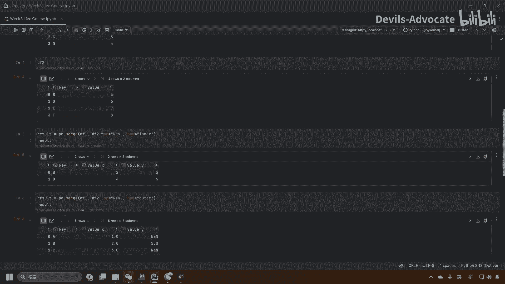

输出结果：

| key | value_x | value_y |
|-----|---------|---------|
| A   | 1.0     | NaN     |
| B   | 2.0     | 5.0     |
| C   | 3.0     | NaN     |
| D   | 4.0     | 6.0     |
| E   | NaN     | 7.0     |
| F   | NaN     | 8.0     |

结果包含了`A`、`B`、`C`、`D`、`E`、`F`所有键。`df1`独有的`A`、`C`在`value_y`列显示为`NaN`；`df2`独有的`E`、`F`在`value_x`列显示为`NaN`。

### 左连接 (Left Join)

左连接以左侧的DataFrame (`df1`) 为基础，保留其所有行，并匹配右侧DataFrame (`df2`) 中存在的键。

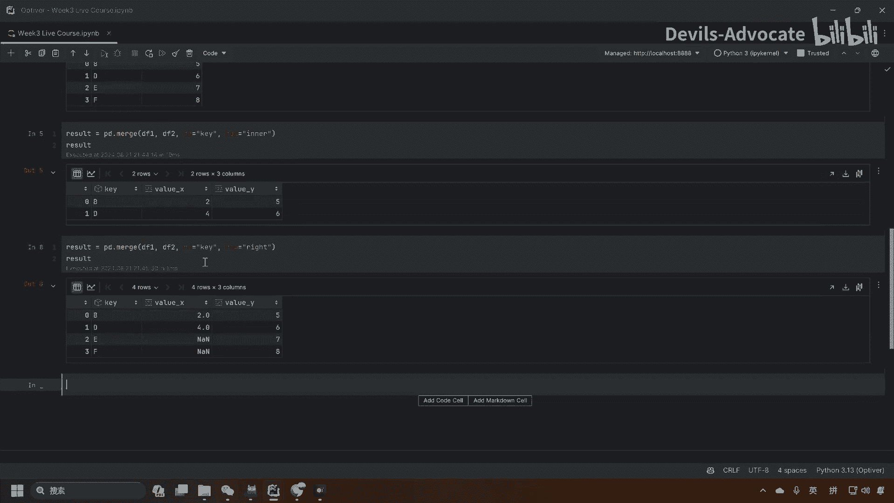

```python
result_left = pd.merge(df1, df2, on=‘key‘, how=‘left‘)
print(result_left)
```

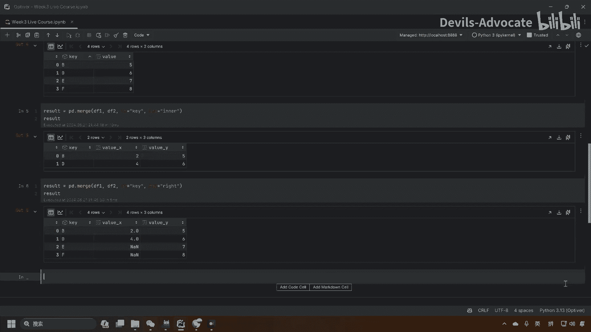

输出结果：

| key | value_x | value_y |
|-----|---------|---------|
| A   | 1       | NaN     |
| B   | 2       | 5.0     |
| C   | 3       | NaN     |
| D   | 4       | 6.0     |

结果包含了`df1`的所有行（`A`, `B`, `C`, `D`）。`df2`中不存在的键`A`和`C`对应的`value_y`为`NaN`。

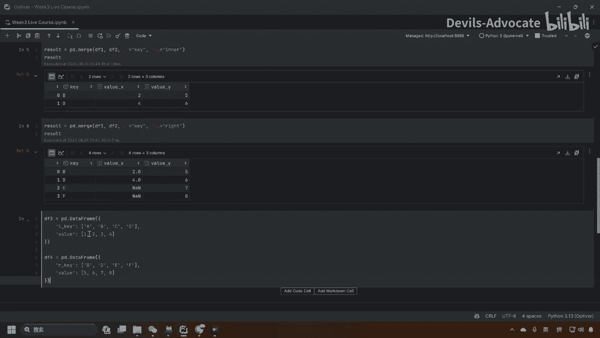

### 右连接 (Right Join)

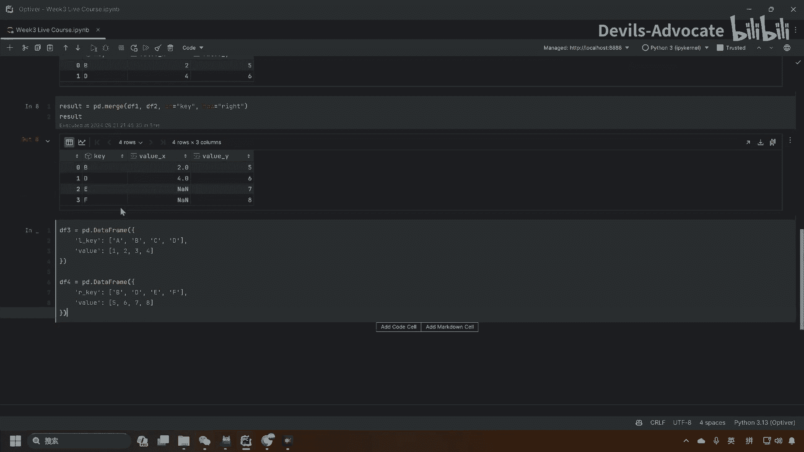

右连接与左连接相反，以右侧的DataFrame (`df2`) 为基础，保留其所有行。

```python
result_right = pd.merge(df1, df2, on=‘key‘, how=‘right‘)
print(result_right)
```

输出结果：

| key | value_x | value_y |
|-----|---------|---------|
| B   | 2.0     | 5       |
| D   | 4.0     | 6       |
| E   | NaN     | 7       |
| F   | NaN     | 8       |

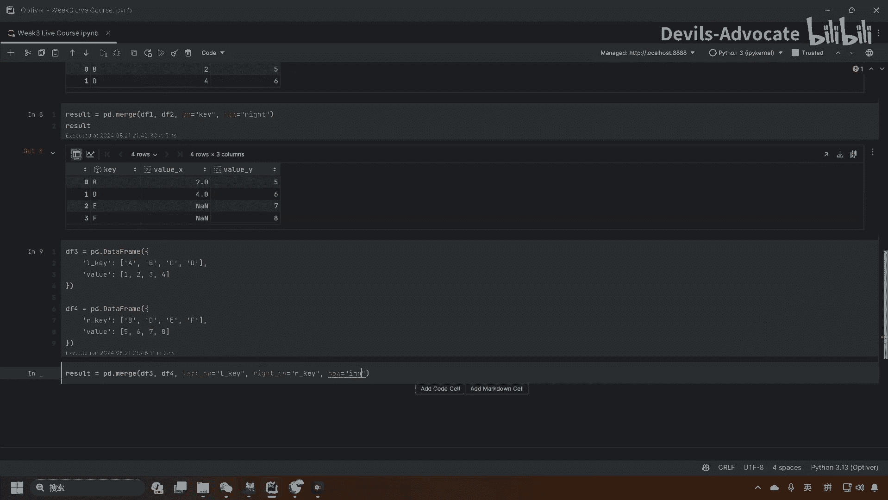

结果包含了`df2`的所有行（`B`, `D`, `E`, `F`）。`df1`中不存在的键`E`和`F`对应的`value_x`为`NaN`。

## 处理不同列名的键

当两个DataFrame中用于连接的键列名不同时，我们需要使用`left_on`和`right_on`参数。

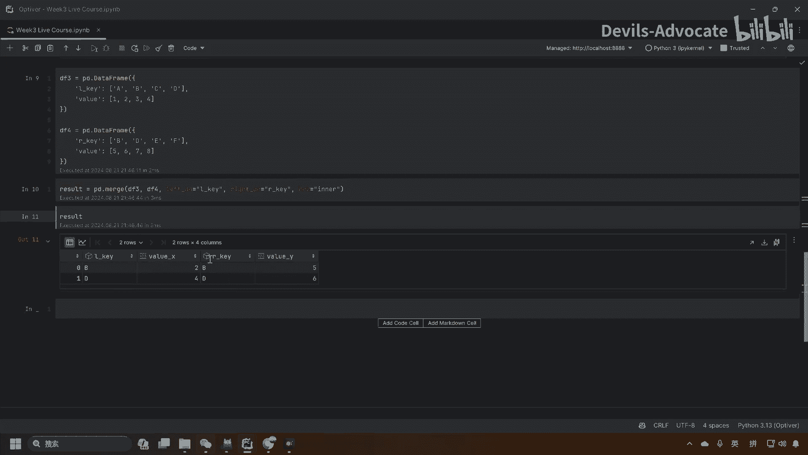

```python
df3 = pd.DataFrame({
    ‘lkey‘: [‘B‘, ‘D‘],
    ‘value‘: [2, 4]
})

df4 = pd.DataFrame({
    ‘rkey‘: [‘B‘, ‘D‘],
    ‘value‘: [5, 6]
})

result_diff_keys = pd.merge(df3, df4, left_on=‘lkey‘, right_on=‘rkey‘, how=‘inner‘)
print(result_diff_keys)
```

输出结果：

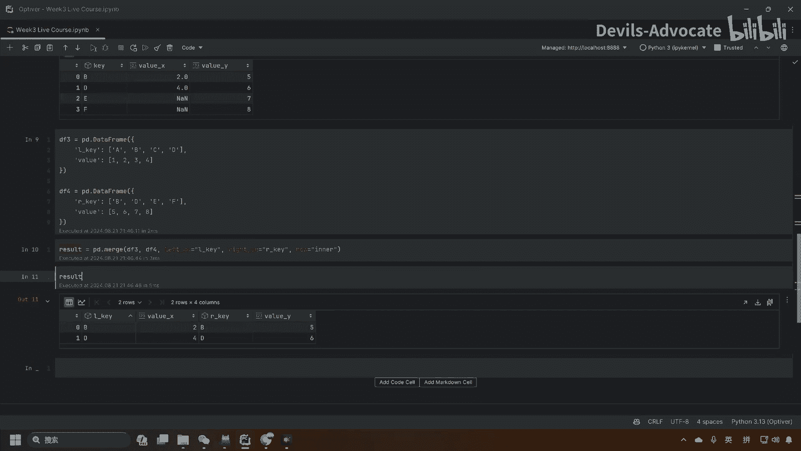

| lkey | value_x | rkey | value_y |
|------|---------|------|---------|
| B    | 2       | B    | 5       |
| D    | 4       | D    | 6       |

我们成功地将`df3`的`lkey`列与`df4`的`rkey`列进行了匹配合并。

## 自定义后缀名

当合并的两个DataFrame存在同名的非键列时，默认后缀是`_x`和`_y`。我们可以使用`suffixes`参数自定义后缀。

```python
result_custom_suffix = pd.merge(df1, df2, on=‘key‘, how=‘outer‘, suffixes=(‘_df1‘, ‘_df2‘))
print(result_custom_suffix)
```

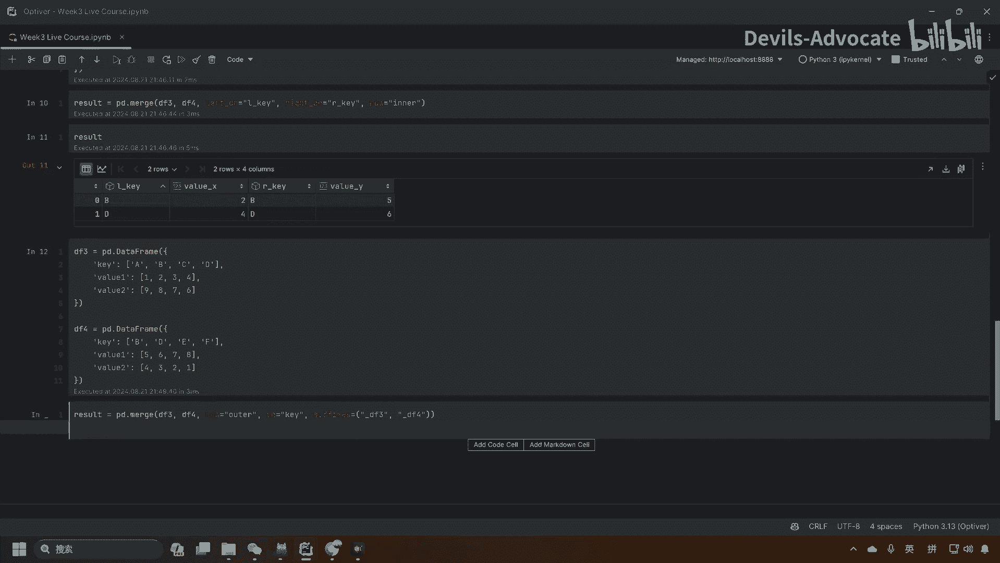

输出结果：

| key | value_df1 | value_df2 |
|-----|-----------|-----------|
| A   | 1.0       | NaN       |
| B   | 2.0       | 5.0       |
| C   | 3.0       | NaN       |
| D   | 4.0       | 6.0       |
| E   | NaN       | 7.0       |
| F   | NaN       | 8.0       |

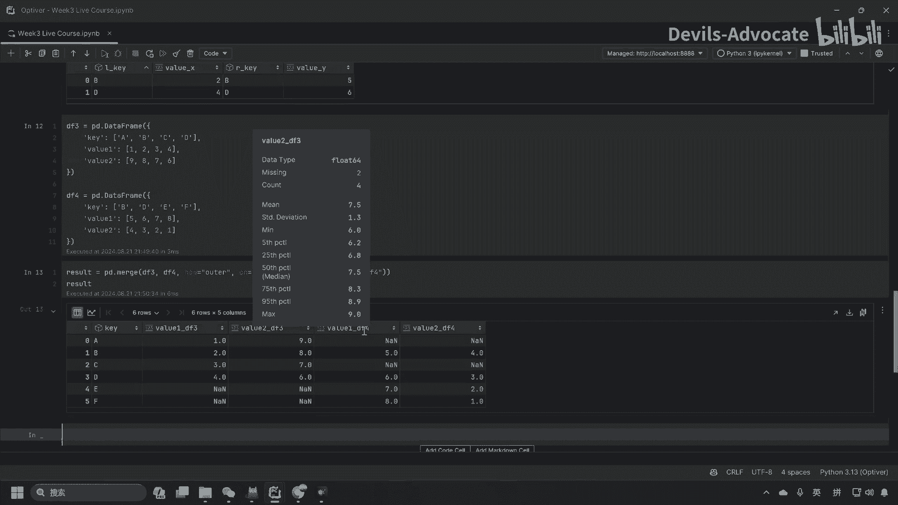

现在，来自`df1`的`value`列被重命名为`value_df1`，来自`df2`的`value`列被重命名为`value_df2`。

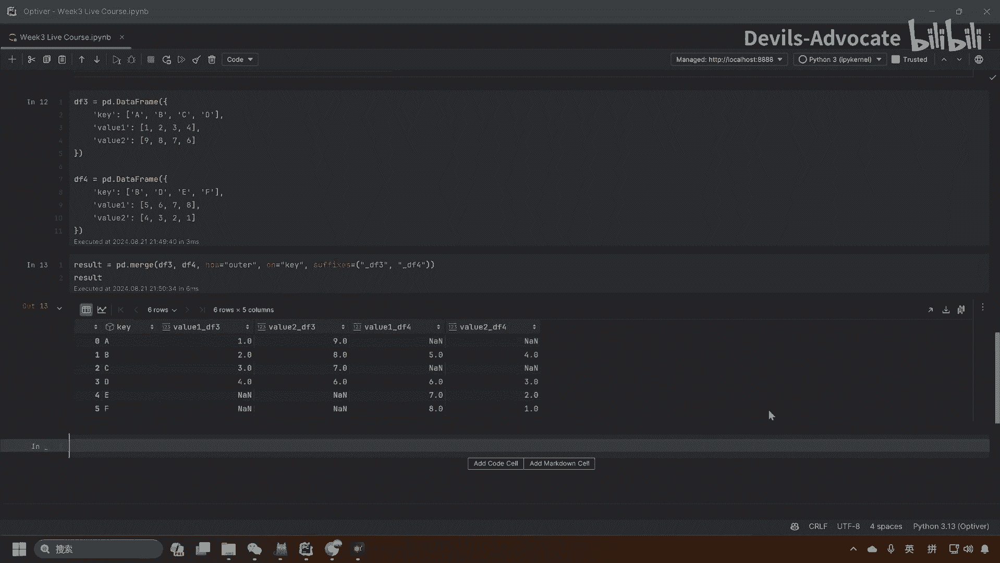

## 总结

本节课中我们一起学习了Pandas中DataFrame的合并操作。我们掌握了四种主要的连接方式：**内连接**、**外连接**、**左连接**和**右连接**，理解了它们各自保留数据行的逻辑。我们还学习了如何处理连接键列名不同的情况，以及如何自定义合并后同名列的后缀。这些技能是整合多源数据、进行深入金融数据分析的关键步骤。