# 量化交易基础：3.4：下载历史行情数据与计算信号平均涨幅 📊

在本节课中，我们将学习如何下载一分钟级别的历史行情数据，并基于此计算策略信号的精确买入时间以及后续N日的平均涨跌幅。这是进行精准策略回测和交易明细分析的关键步骤。

## 数据准备：下载一分钟历史行情数据

上一节我们介绍了策略信号的生成。为了进行精确的回测，我们需要具体到分钟级别的买入和卖出时间，因此必须获取一分钟历史K线数据。

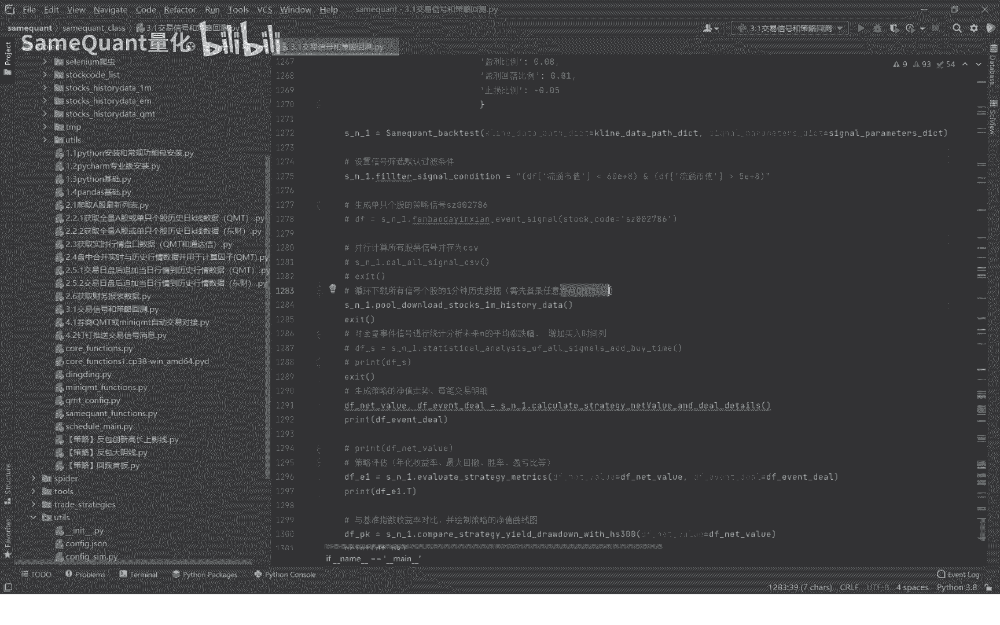

由于一分钟历史行情数据量庞大，我们之前并未下载。现在，我们需要提前准备好这份数据。

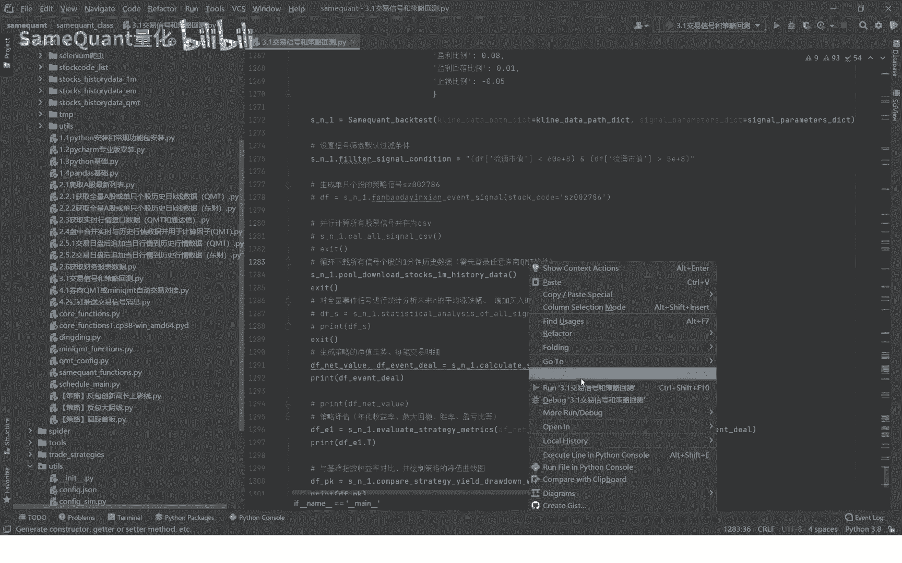

以下是下载步骤：

1.  **开通券商QMT软件**：首先，您需要联系任意一家券商，开通其QMT量化交易软件（建议开通Mini QMT版本）。这是下载数据的必要前提。
2.  **运行下载程序**：开通后，直接运行我们提供的下载脚本。
    
3.  **等待下载完成**：程序将自动开始下载，整个过程通常非常迅速，大约30秒即可完成。
    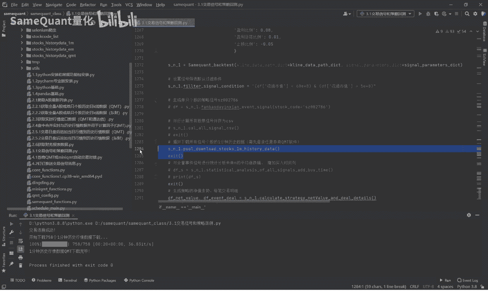


下载完成后，我们便拥有了一分钟级别的历史行情数据库，为后续的精确计算奠定了基础。

## 信号处理：计算精确买入时间

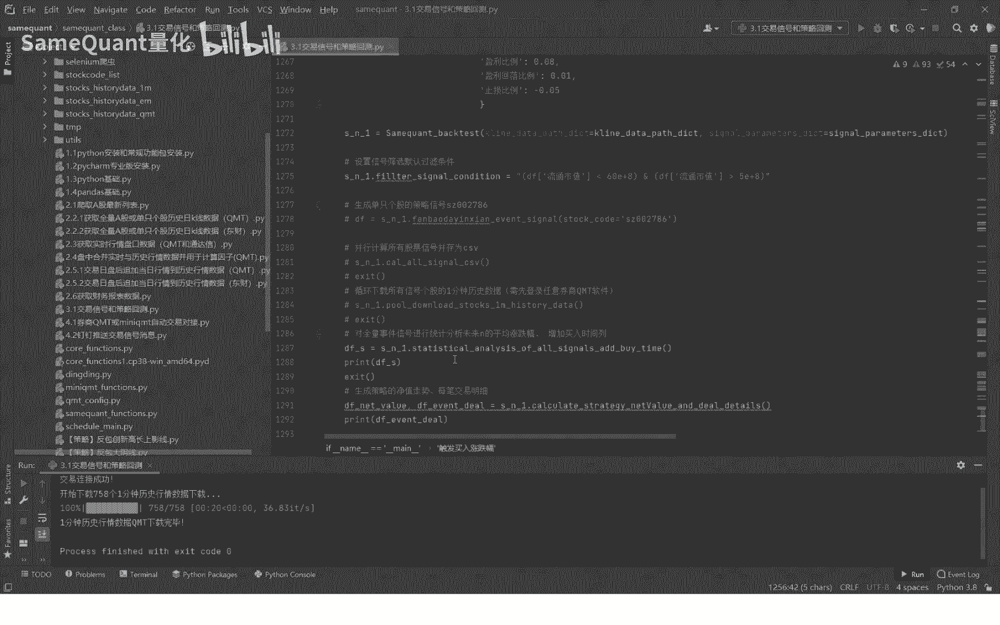

数据准备就绪后，接下来是一个关键操作：为我们的策略信号计算精确的买入时间。

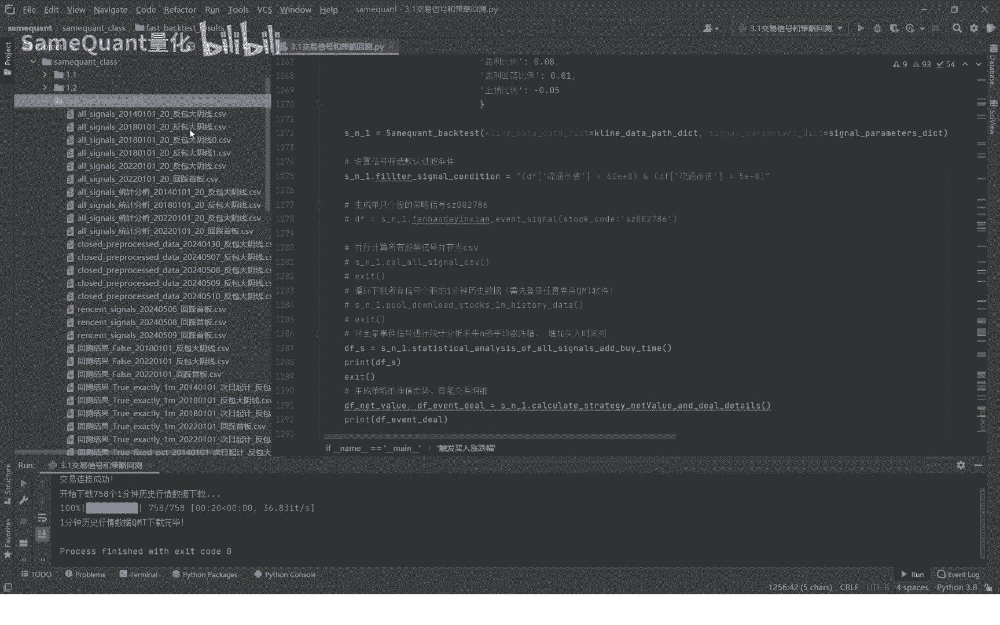

我们的策略规则是：当个股涨幅达到8%时触发买入。因此，我们需要找出每个信号在触发日**首次达到8%涨幅的具体时间点**，并将这个时间追加到上一节生成的信号CSV文件中。

以下是操作流程：

1.  **查看原始信号文件**：首先，我们打开上一节生成的策略信号CSV文件。该文件包含`交易日期`等列，但还没有具体的买入时间。
    
2.  **运行时间追加方法**：我们直接运行专门编写的方法`append_buy_time()`。该方法会自动读取CSV文件，遍历每个信号，并查询对应日期的一分钟行情数据，从而计算出首次触发8%涨幅的精确时间。
    ```python
    # 示例代码：运行追加买入时间的方法
    append_buy_time(‘signals.csv‘)
    ```
    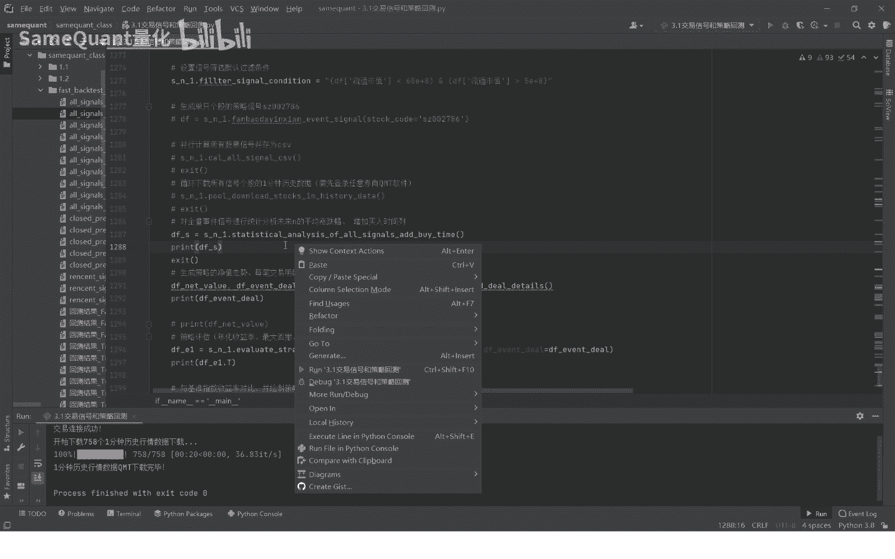
3.  **验证结果**：运行完成后，再次打开CSV文件，你会发现新增了`买入时间`列。您可以对照行情软件验证，例如某支股票在指定日期的10:13分是否确实达到了8%的涨幅。

## 策略分析：计算N日平均涨跌幅


在计算出精确买入时间后，我们还可以进一步分析这些信号在未来的表现。本节中，我们将计算所有信号在买入后第N个交易日的平均涨跌幅和收涨概率。

以下是生成的分析表示例：

| 交易日 (N) | 平均涨跌幅 | 收涨概率 |
| :--- | :--- | :--- |
| 次日 (N=1) | +1.08% | 53.93% |
| 第2日 (N=2) | +1.01% | 49.16% |
| ... | ... | ... |

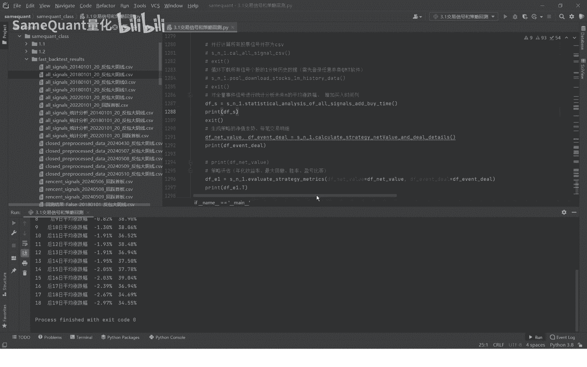

**计算公式**：
*   **平均涨跌幅** = `SUM( (第N日收盘价 - 买入时间后第一个收盘价) / 买入时间后第一个收盘价 ) / 信号总数`
*   **收涨概率** = `(第N日收盘价 > 买入时间后第一个收盘价的信号数量) / 信号总数`

从结果可以看出，这是一个典型的短线策略，信号的有效性随着持有天数的增加而衰减。

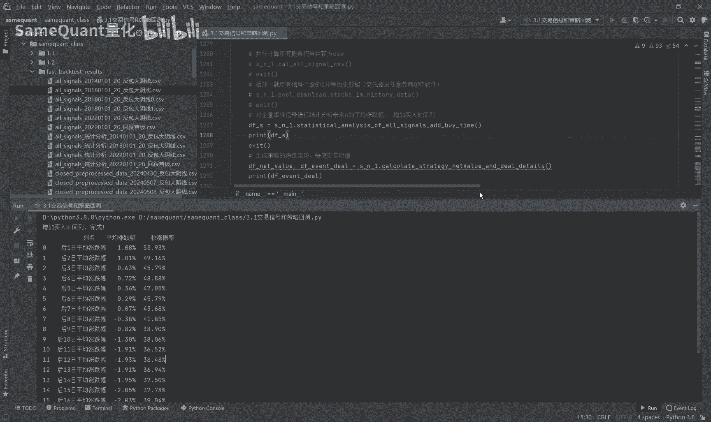

## 核心代码逻辑解析

最后，我们来简要了解上述计算背后的代码逻辑。

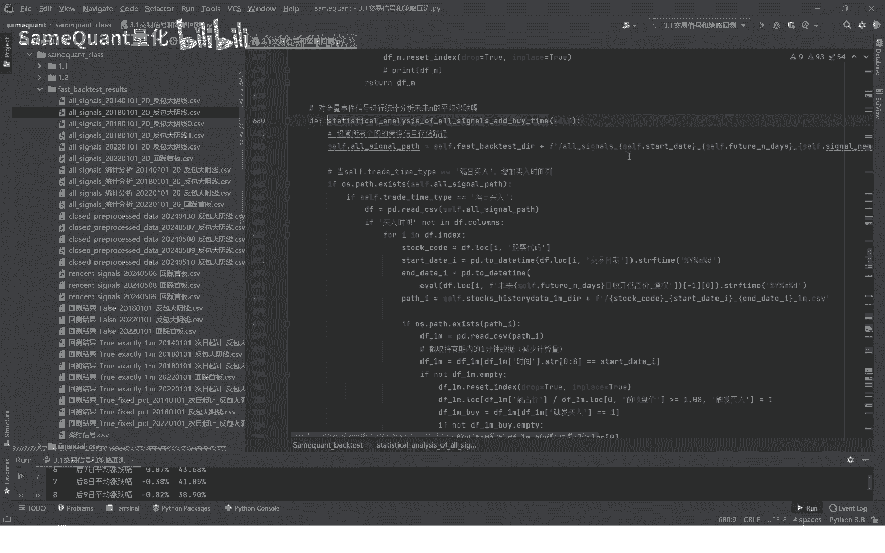

1.  **计算买入时间**：核心是遍历信号，并读取对应股票和日期的一分钟数据，找到涨幅首次超过设定阈值（如8%）的时间点。
    ```python
    # 伪代码逻辑
    for each signal in signals:
        minute_data = load_minute_data(signal[‘股票代码‘], signal[‘交易日期‘])
        for minute_bar in minute_data:
            if minute_bar[‘涨幅‘] >= 0.08: # 8%阈值
                signal[‘买入时间‘] = minute_bar[‘时间‘]
                break
    ```
    

2.  **修改触发阈值**：策略的买入触发阈值（8%）是灵活可调的。您可以在参数配置文件中进行修改。
    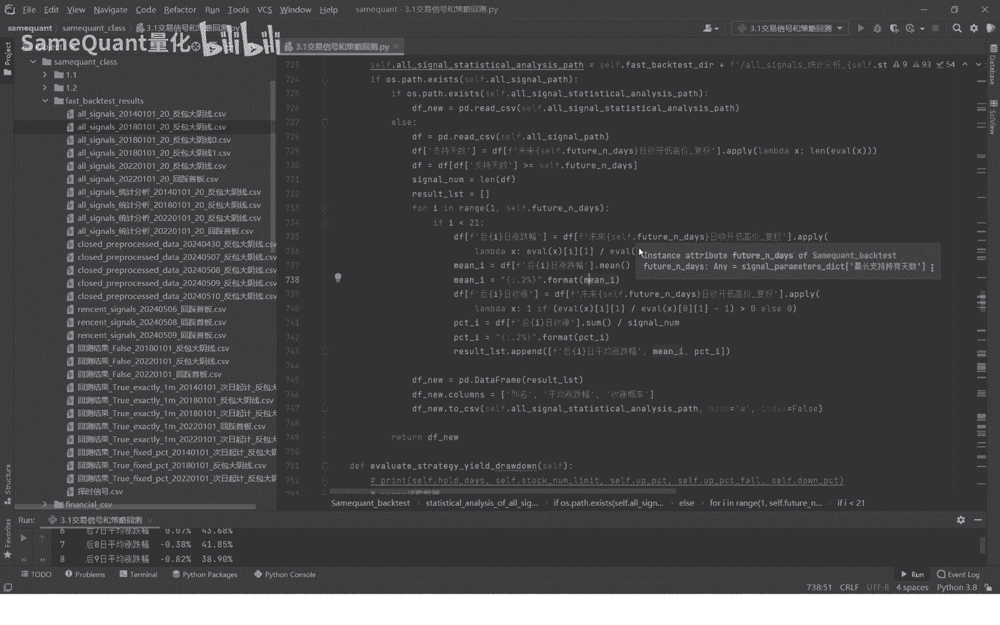


3.  **计算未来表现**：在确定买入时间后，程序会计算该信号在未来20个交易日内每一天的涨跌幅，并最终统计出所有信号的平均值和收涨概率，生成汇总表格。
    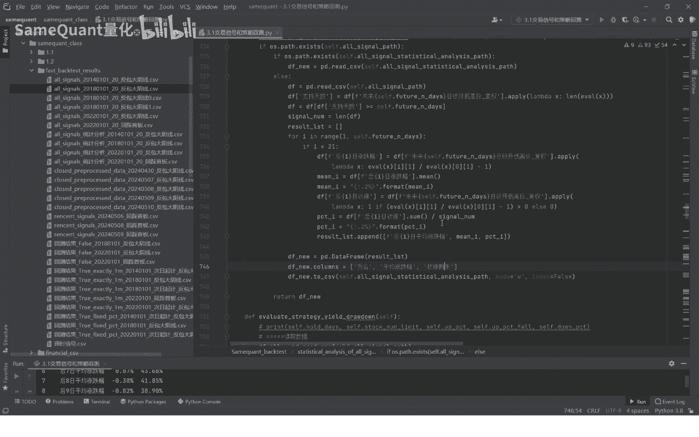

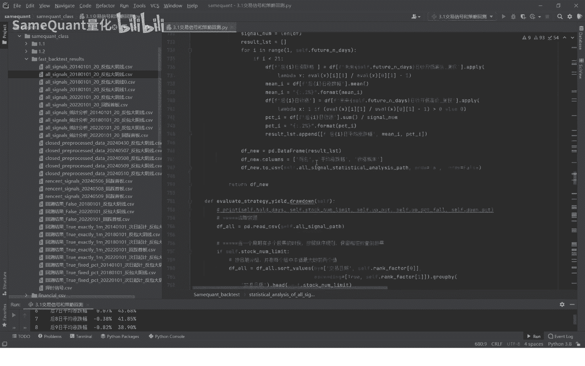

## 课程总结


本节课中，我们一起学习了量化策略回测中两个至关重要的实操环节：

1.  **下载一分钟历史行情数据**，为精确回测提供基础。
2.  **处理策略信号**，计算其精确的买入触发时间。
3.  **分析信号表现**，统计信号在未来N日的平均涨跌幅和收涨概率，以评估策略的短期有效性。

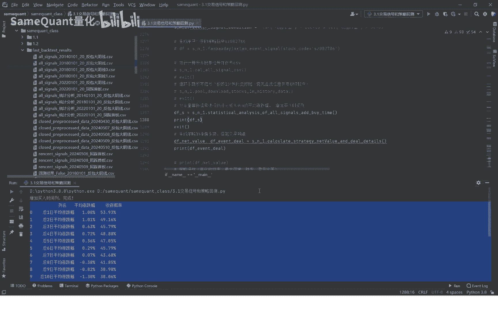

这些步骤使得我们的策略回测从“日级别”精度提升到了“分钟级别”精度，分析结果也更加可靠。下节课将是重中之重，我们将基于这些精确数据，**生成策略的净值走势曲线和每一笔交易的详细明细**，敬请期待。

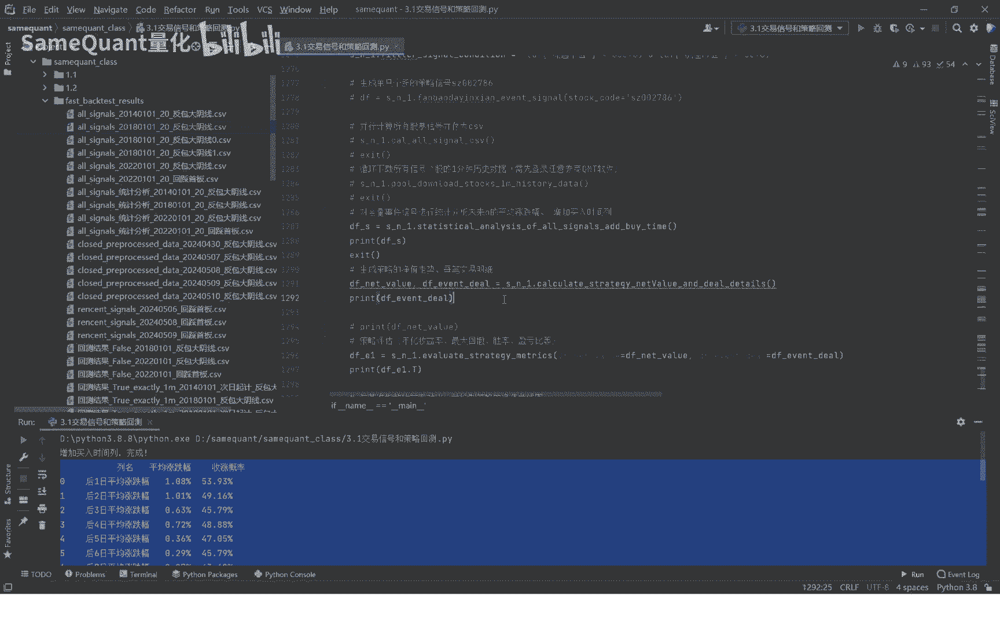

