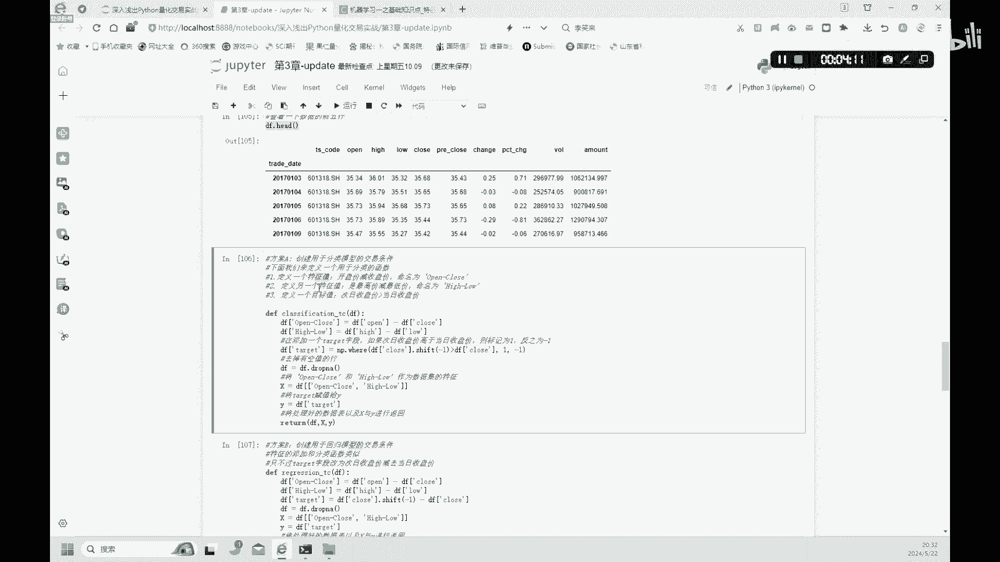
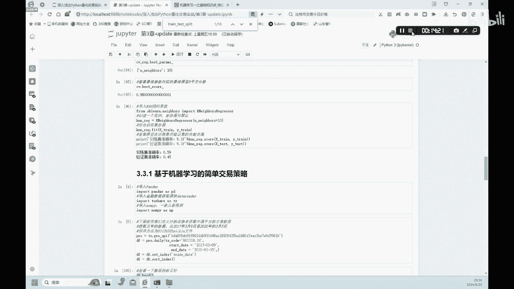

# 金融科技：3.4：机器学习在交易中的简单应用 - P1


在本节课中，我们将学习如何将机器学习应用于简单的股票交易策略。我们将使用中国平安的历史股价数据，通过构建分类模型来预测交易信号，并比较使用策略与不使用策略的累计收益差异。

---

上一节我们介绍了机器学习的基本概念，本节中我们来看看如何将其具体应用于交易策略的构建。

首先，我们需要导入必要的库并获取数据。

```python
import pandas as pd
import tushare as ts
```

我们从Tushare数据库连接并下载中国平安（股票代码：`000001.SZ`）在2017年至2020年间的日线数据。

```python
# 连接Tushare
pro = ts.pro_api('你的token')
# 下载数据
df = pro.daily(ts_code='000001.SZ', start_date='20170101', end_date='20201231')
```

下载数据后，我们设置日期为索引并按日期排序，以便于后续处理。

```python
df['trade_date'] = pd.to_datetime(df['trade_date'])
df.set_index('trade_date', inplace=True)
df.sort_index(inplace=True)
# 展示前几行数据
print(df.head())
```

---

有了数据之后，我们需要定义交易条件。这里我们介绍两种方案：分类模型和回归模型。

以下是方案A，即分类模型的交易条件定义。

```python
import numpy as np



def create_classification_df(df):
    # 定义特征值X1：开盘价与收盘价之差
    df['X1'] = df['open'] - df['close']
    # 定义特征值X2：最高价与最低价之差
    df['X2'] = df['high'] - df['low']
    # 定义目标值Y：次日收盘价是否高于当日收盘价（1为是，0为否）
    df['Y'] = np.where(df['close'].shift(-1) > df['close'], 1, 0)
    # 删除含有空值的行
    df = df.dropna()
    # 分离特征X和目标Y
    X = df[['X1', 'X2']]
    Y = df['Y']
    return X, Y
```

我们为什么要定义特征值和目标值呢？特征值是描述事物的属性（如价格差），目标值是我们希望预测的最终结果（如股价涨跌）。特征值的选取会直接影响目标值的预测准确性，因此选择合适的特征至关重要。

---


上一节我们介绍了分类模型的条件，本节中我们来看看方案B，即回归模型的交易条件。

以下是方案B，即回归模型的交易条件定义。它与分类模型的主要区别在于目标值。

```python
def create_regression_df(df):
    # 特征值定义与分类模型相同
    df['X1'] = df['open'] - df['close']
    df['X2'] = df['high'] - df['low']
    # 定义目标值Y：次日收盘价与当日收盘价的差值
    df['Y'] = df['close'].shift(-1) - df['close']
    # 删除含有空值的行
    df = df.dropna()
    # 分离特征X和目标Y
    X = df[['X1', 'X2']]
    Y = df['Y']
    return X, Y
```

---

接下来，我们将使用分类算法来定制交易策略。本教程后续部分将基于方案A（分类模型）进行演示，课后大家可以自行尝试将代码替换为方案B（回归模型）并观察结果。

首先，我们需要将数据划分为训练集和验证集。

```python
from sklearn.model_selection import train_test_split

# 使用分类函数创建特征和目标
X, Y = create_classification_df(df.copy())
# 划分数据集，80%用于训练，20%用于验证
X_train, X_valid, Y_train, Y_valid = train_test_split(X, Y, test_size=0.2, random_state=42)
print(f"训练集样本数: {X_train.shape[0]}, 特征数: {X_train.shape[1]}")
print(f"验证集样本数: {X_valid.shape[0]}")
```

然后，我们使用K近邻（KNN）算法来训练模型并评估其准确率。

```python
from sklearn.neighbors import KNeighborsClassifier

# 初始化KNN分类器，设置邻居数为95
knn = KNeighborsClassifier(n_neighbors=95)
# 在训练集上训练模型
knn.fit(X_train, Y_train)
# 计算并打印训练集和验证集的准确率
train_accuracy = knn.score(X_train, Y_train)
valid_accuracy = knn.score(X_valid, Y_valid)
print(f"训练集准确率: {train_accuracy:.2%}")
print(f"验证集准确率: {valid_accuracy:.2%}")
```

模型在验证集上的准确率大约只有50%，这并不理想。书中指出，这可能是因为我们选取的特征值（仅两个）过于简单，样本信息不足，导致模型无法做出更准确的判断。后续我们可以引入更多特征或使用更复杂的数据平台来改进模型。

---

尽管模型准确率不高，但我们仍可以继续流程，使用它来预测每日的交易信号。

我们使用训练好的KNN模型来预测整个数据集上的交易信号（1表示看涨买入，0表示看跌卖出或持有），并计算每日对数收益率。

```python
# 预测整个数据集上的交易信号
df['signal'] = knn.predict(X)
# 计算每日的对数收益率：ln(当日收盘价 / 前一日收盘价)
df['return'] = np.log(df['close'] / df['close'].shift(1))
# 删除空值
df = df.dropna()
```

---

现在，我们来计算并比较两种情况的累计收益：基准收益（不使用策略）和使用交易策略后的收益。

以下是计算累计收益的函数。

```python
def calculate_cumulative_returns(returns_series):
    # 累计收益 = (1 + 日收益率).cumprod() - 1
    cumulative = (1 + returns_series).cumprod() - 1
    return cumulative
```

首先计算基准累计收益。

```python
# 基准累计收益（单纯持有股票的收益）
benchmark_cum_return = calculate_cumulative_returns(df['return'])
```

然后计算策略累计收益。策略收益是在每日基准收益的基础上，乘以当日的交易信号（将信号从0/1映射为1/-1，表示持有或反向操作）。这里我们进行简化，假设信号为1时完全跟随市场，信号为0时不产生收益。

```python
# 将信号映射：1 -> 1 (跟随市场), 0 -> 0 (不产生收益)
strategy_returns = df['return'] * df['signal']
# 策略累计收益
strategy_cum_return = calculate_cumulative_returns(strategy_returns)
```

最后，我们将两条累计收益曲线绘制在同一张图中进行对比。

```python
import matplotlib.pyplot as plt

plt.figure(figsize=(12, 6))
# 绘制基准累计收益曲线
plt.plot(benchmark_cum_return.index, benchmark_cum_return.values, 'b--', label='基准累计收益', alpha=0.7)
# 绘制策略累计收益曲线
plt.plot(strategy_cum_return.index, strategy_cum_return.values, 'orange', label='策略累计收益', linewidth=2)
plt.title('基准收益 vs. 交易策略收益')
plt.xlabel('日期')
plt.ylabel('累计收益率')
plt.legend()
plt.grid(True, alpha=0.3)
plt.show()
```

在生成的图中，橘黄色实线代表使用了我们预测的交易信号后的策略累计收益，蓝色虚线代表单纯持有股票的基准累计收益。通过对比，可以直观地看到该简单策略在此数据集上的表现。

---



本节课中我们一起学习了如何将机器学习应用于简单的交易策略。我们从数据获取开始，定义了分类和回归两种交易条件，并使用KNN分类模型进行了实践。虽然本例中模型的预测准确率不高，导致策略效果可能不明显，但完整演示了从特征工程、模型训练、信号预测到收益回测的整个流程。理解这个流程是构建更复杂、更有效的量化交易策略的重要基础。