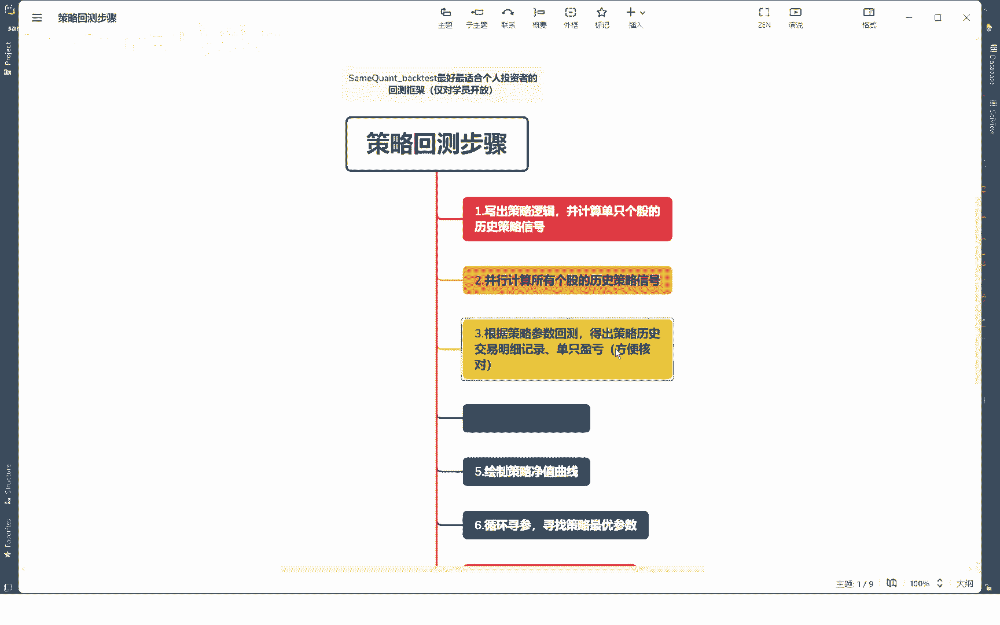
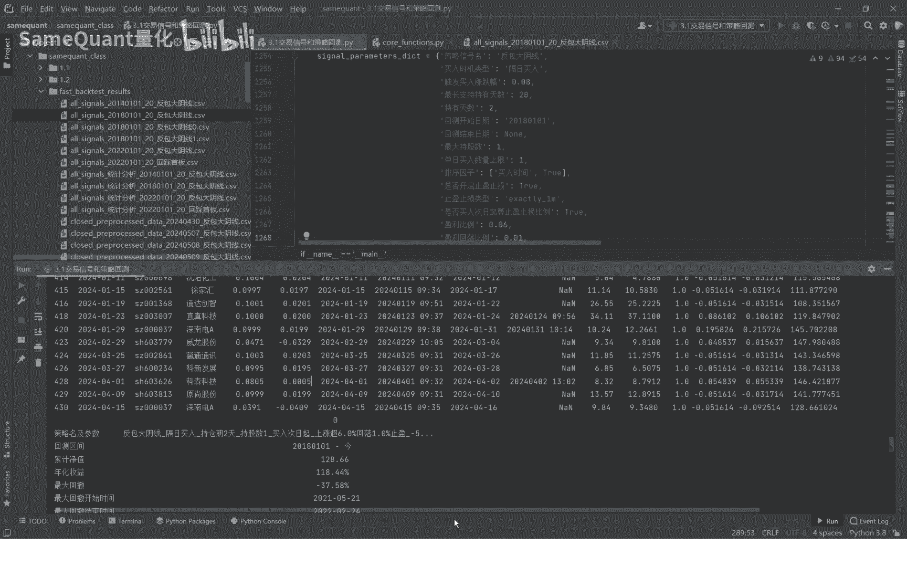
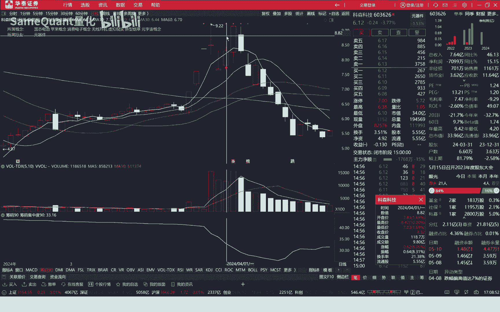
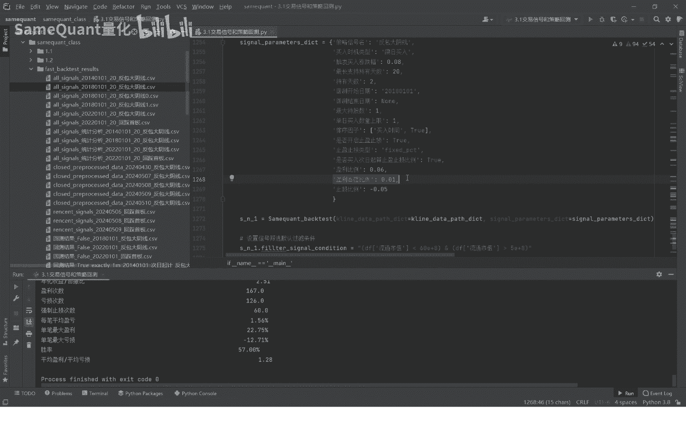
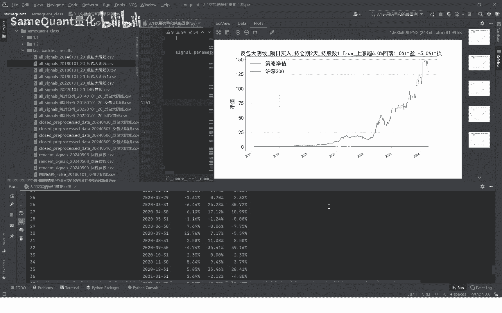
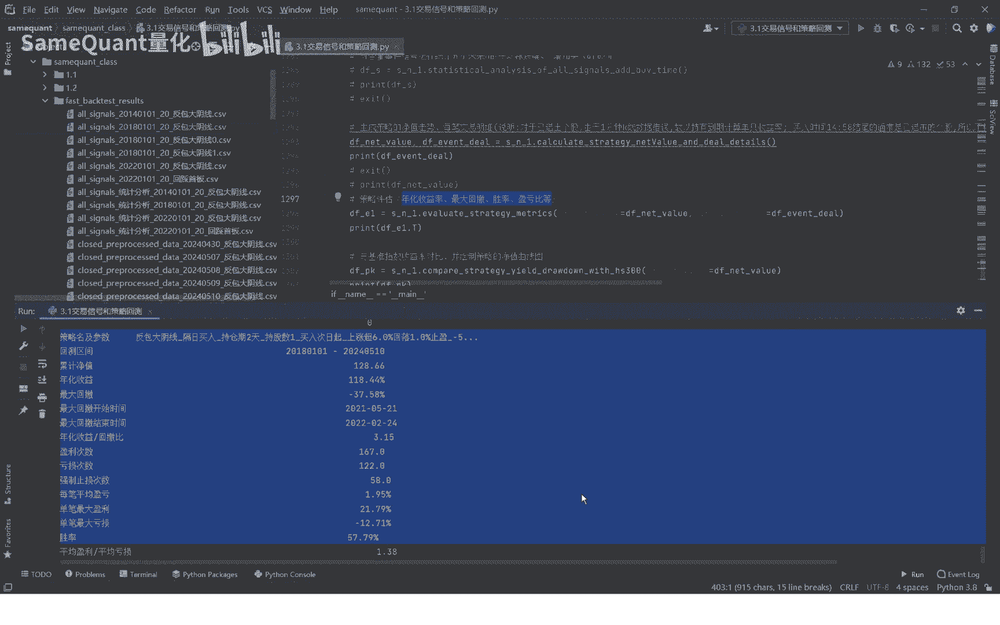

# 量化策略回测：3.5：计算策略历史交易明细与净值走势 📊



在本节课中，我们将学习如何使用回测框架的核心功能，根据策略参数进行回测，并生成详细的历史交易明细和策略净值走势。这是评估和优化策略的关键步骤。

## 概述

上一节我们介绍了策略信号的计算与生成。本节中，我们来看看如何基于这些信号进行回测，并得到每一笔交易的详细信息以及策略的整体净值变化。通过分析这些数据，我们可以验证策略逻辑的严谨性，并核对回测结果的准确性。

## 交易明细表解读

运行回测代码后，我们会得到一份详细的交易明细表。这份表格记录了策略在回测期间的所有交易记录。

以下是交易明细表包含的核心字段：

*   **交易日期与代码**：记录买入和卖出发生的具体日期及股票代码。
*   **买入/卖出时间**：精确到分钟级别的时间戳，这对于日K级别但依赖盘中触发的策略至关重要，能确保回测逻辑的准确性。
*   **买入/卖出价格**：记录实际的成交价格，方便核对盈亏计算。
*   **仓位**：根据策略设定的`最大持股数`分配。例如，若`最大持股数=1`，则仓位为1（满仓）；若`最大持股数=2`，则每只股票仓位为0.5。
*   **当日盈亏比例**：买入当日收盘后的浮动盈亏比例。
*   **次日起盈亏比例**：从买入次日开始，到卖出期间产生的盈亏比例。
*   **单只盈亏比例**：该笔交易的总盈亏，计算公式为：`单只盈亏比例 = 当日盈亏比例 + 次日起盈亏比例`。

## 策略净值计算原理





策略净值是根据每一笔交易的盈亏累乘计算得出的。它反映了策略账户资金随时间的变化情况。

净值计算的核心公式如下：
`当前净值 = 上一期净值 * (1 + 当前交易的单只盈亏比例)`

例如：
1.  初始净值为1。
2.  第一笔交易亏损3%，则净值变为 `1 * (1 - 0.03) = 0.97`。
3.  第二笔交易又亏损3.3%，则净值变为 `0.97 * (1 - 0.033) ≈ 0.938`。
4.  第三笔交易盈利1.3%，则净值回升至 `0.938 * (1 + 0.013) ≈ 0.95`。

如此循环计算，最终得到策略在整个回测期内的净值曲线。本例中的策略在6年多时间内累积净值增长至约128倍。

## 回测逻辑验证：案例剖析

通过分析具体交易案例，可以验证回测逻辑是否严格遵循策略规则。

**案例一：止损交易（深蓝DA）**
*   **买入逻辑**：前一日有涨停板，昨日收盘下跌-5.49%，当日盘中最高涨幅达到8%触发买入。完全符合“反包大阴线”策略条件。
*   **卖出逻辑**：策略设定`止损比例=-5%`（次日起算）。该股买入次日开盘后下跌，盘中浮亏超过-5%，触发止损卖出。交易明细显示`次日起盈亏比例=-5.16%`，总亏损约9.25%（含手续费等），与逻辑吻合。

**案例二：止盈交易（科森科技）**
*   **买入逻辑**：同样满足“反包大阴线”策略条件，在盘中涨幅达到8%时买入。
*   **卖出逻辑**：策略设定`止盈规则=冲高回落`（盈利≥6%后，从高点回落1%）。该股买入次日，股价上涨超过6%后回落，触发止盈卖出。交易明细显示卖出时间为13:02，`次日起盈亏比例=5.4%`，与分时图表现一致。

## 关键参数与注意事项

为了确保回测的严谨性，以下几个参数和概念需要特别注意：

**1. 买入时机类型 (`buy_timing`)**
此参数决定买入信号的执行方式，直接影响资金占用和交易逻辑。
*   **隔日买入**：适用于以**盘中涨跌幅触发**买入的策略（如本例）。必须确保卖出日期与下一笔买入日期不重叠，避免出现“未卖先买”的资金逻辑错误。
*   **尾盘买入**：适用于在收盘前统一换仓的策略。卖出和买入均在尾盘完成，不存在时间冲突，`排序因子`的选择也更加自由。

**2. 排序因子 (`sort_by`)**
当单日出现多个买入信号时，此参数决定优先买入哪一只股票。选择必须与`买入时机类型`逻辑自洽。
*   **隔日买入**：必须选择 `sort_by=‘buy_time‘`（买入时间），并设置为升序(`ascending=True`)。因为盘中触发的信号有先后顺序，应买入最先触发信号的股票，使用市值等因子排序会造成逻辑错误。
*   **尾盘买入**：可以选择市值、动量等任何因子进行排序，例如 `sort_by=‘circ_mv‘`（流通市值）并选择升序或降序。



**3. 止盈止损类型 (`stop_profit_type`)**
此参数控制卖出条件。
*   **回落止盈 (`‘fallback‘`)**：当盈利超过`止盈比例`（如6%）后，从高点回落`回落比例`（如1%）时卖出。需要用到分钟级行情数据。
*   **固定比例 (`‘fixed‘`)**：当盈利达到固定`止盈比例`时立即卖出，或亏损达到固定`止损比例`时立即卖出。此模式生效时，`回落止盈`参数失效。



**4. 最大持股数与单日买入上限**
*   `最大持股数`：策略允许同时持有的最大股票数量，用于计算每只股票的仓位（`仓位 = 1 / 最大持股数`）。
*   `单日买入股票数量上限`：每个交易日最多买入的信号数量。通常建议与`最大持股数`设置相同，以保证仓位充分利用。

## 完整回测流程回顾与补充

在开始回测前，必须按顺序完成以下所有步骤，特别是当`回测开始日期`改变时，需要重新执行：

1.  **计算单只个股策略信号**：编写并验证策略函数（如`fanbao_dayin_signal`）。
2.  **设置策略函数名**：**这是一个关键且易遗漏的步骤**。必须将你的策略函数名赋值给框架的`signal_function`变量。
    ```python
    signal_function = fanbao_dayin_signal  # 替换为你自己的策略函数名
    ```
3.  **生成全市场信号**：遍历所有股票，应用策略函数，生成包含买入时间等信息的信号CSV文件。
4.  **下载所需行情数据**：根据策略需要（如分钟数据用于回落止盈），下载对应的历史行情数据。
5.  **执行回测**：配置好所有参数（如`回测开始日期`、`最大持股数`、`止盈止损类型`等），运行回测引擎。

## 总结

本节课我们一起学习了量化策略回测的核心环节：生成并解读交易明细，理解策略净值的计算原理，并通过实际案例验证回测逻辑的严谨性。我们重点探讨了`买入时机类型`、`排序因子`、`止盈止损类型`等关键参数的正确设置方法，这些是保证回测结果准确、逻辑自洽的基石。最后，我们回顾了从策略编写到完成回测的完整工作流程。掌握这些内容，你就能独立地对策略进行回测和初步分析了。



下节课，我们将进入策略评估阶段，学习如何计算年化收益率、最大回撤、胜率、盈亏比等关键绩效指标。