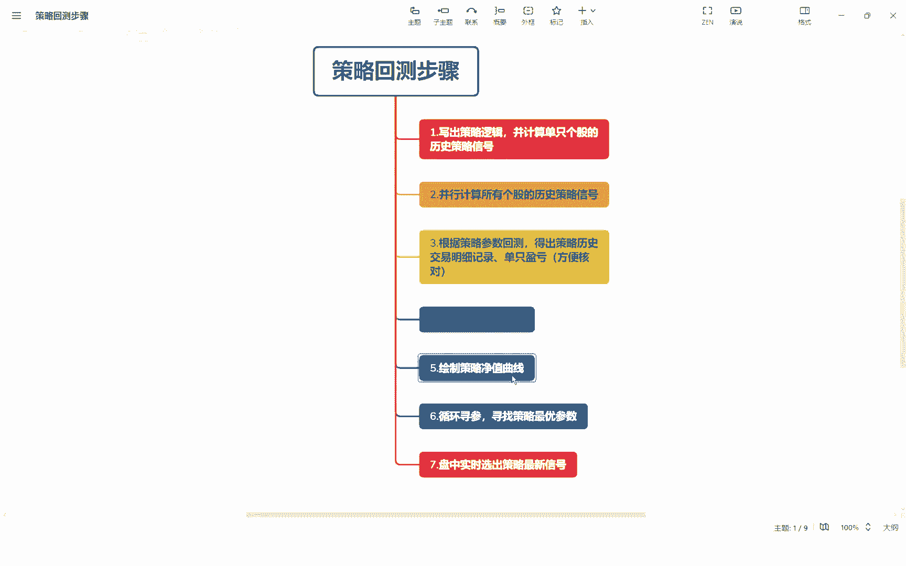
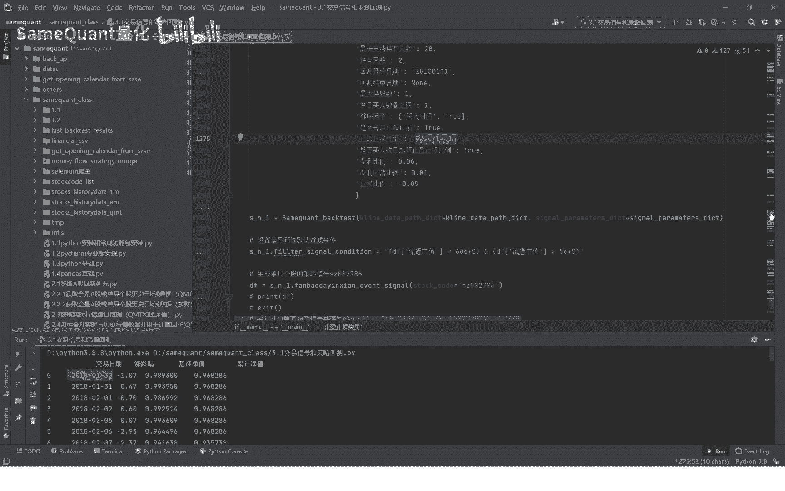

# 量化策略回测：3.6：策略评价指标与收益率曲线绘制 📈



在本节课中，我们将学习策略回测中至关重要的一步：如何计算关键的评价指标并绘制策略的净值曲线图。通过将策略的收益表现与基准指数（如沪深300）进行对比，我们可以直观地评估策略的有效性。

上一节我们介绍了策略回测的基本框架和数据结构，本节中我们来看看如何从回测结果数据中提取信息，并进行可视化分析。

## 数据准备

绘制策略净值曲线图，需要依赖一个记录了每日净值变化的数据表。这个数据表通常来自上一期课程中生成的回测结果。

以下是构成该数据表的核心列及其含义：

*   **交易日期**：记录每个交易日的日期，这是必须的一列。
*   **涨跌幅**：基准指数（如沪深300）的每日涨跌幅。
*   **基准净值**：根据基准指数涨跌幅计算得出的累计净值，计算公式为 `(1 + 涨跌幅).cumprod()`。
*   **累计净值**：我们策略的累计净值，由策略的每日收益率同样通过 `(1 + 策略日收益率).cumprod()` 计算得出。

通过长期积累，策略的累计净值最终可能达到一个可观的倍数，例如示例中的128倍。拥有这样一个结构清晰的表格，是进行后续分析和绘图的基础。

## 代码解读与收益率计算

接下来，我们将深入解读绘制图表所涉及的代码逻辑。核心步骤包括数据重采样、收益率计算以及图表绘制。

首先，代码会检查净值数据表是否为空，若为空则调用相应方法进行计算。我们假设数据已准备好，并存储在名为 `df` 的DataFrame中。

**第一步是将交易日期列转换为Pandas的日期时间格式，以便进行时间序列操作。**

```python
df[‘交易日期’] = pd.to_datetime(df[‘交易日期’])
```

**第二步是按特定周期（如月度‘M’、季度‘Q’、年度‘Y’）对日度净值数据进行重采样。** 这让我们能够从不同时间维度观察策略表现。

```python
# 按月度重采样，取每月最后一天的净值
df_resampled = df.set_index(‘交易日期’).resample(‘M’).last().reset_index()
```

**第三步是计算策略收益率、基准收益率和超额收益率。**

*   **策略收益率**：使用 `pct_change()` 方法计算策略累计净值相对于前一个周期的百分比变化。公式为 `(当期净值 / 上期净值) - 1`。
*   **基准收益率**：同理，计算基准净值的周期百分比变化。
*   **超额收益率**：策略收益率减去基准收益率，代表策略跑赢基准的部分。

计算后，第一行数据（因没有前一期）会得到空值，需要进行填充。通常使用初始净值（默认为1）进行计算填充。

```python
# 计算策略月度收益率
df_resampled[‘策略收益率’] = df_resampled[‘累计净值’].pct_change()
# 填充第一行的空值： (第一期净值 - 1) / 1
df_resampled[‘策略收益率’].fillna(df_resampled[‘累计净值’].iloc[0] - 1, inplace=True)

# 计算基准月度收益率（同理）
df_resampled[‘基准收益率’] = df_resampled[‘基准净值’].pct_change()
df_resampled[‘基准收益率’].fillna(df_resampled[‘基准净值’].iloc[0] - 1, inplace=True)

# 计算超额收益率
df_resampled[‘超额收益率’] = df_resampled[‘策略收益率’] - df_resampled[‘基准收益率’]
```

完成计算后，可以将收益率数据转换为更易读的百分比格式，并重置索引、重命名列，为绘图做好准备。

## 绘制净值曲线与收益对比图

数据准备就绪后，即可进行可视化。我们将绘制两种图表：策略与基准的净值曲线对比图，以及按周期的收益对比柱状图。

**绘制净值曲线图的步骤如下：**

1.  **设置画布**：使用Matplotlib创建指定大小的图形窗口。
2.  **设置标题**：生成包含策略名称、关键参数（如买入规则、持有天数、止盈止损比例等）的详细标题，使图表信息一目了然。
3.  **准备坐标轴数据**：确保X轴（交易日期）为日期时间格式，Y轴数据为策略净值和基准净值。
4.  **绘制双曲线**：在同一坐标系中，分别绘制策略净值曲线和基准净值曲线，并使用不同颜色和标签区分。
5.  **添加图表元素**：添加图例、网格线，并优化X轴日期标签的显示格式，避免过于密集。
6.  **显示图表**：调用 `plt.show()` 展示最终图像。

最终生成的净值曲线图，可以清晰展示策略在整个回测周期内相对于基准指数的表现优劣。

**绘制收益对比柱状图的方法类似，但数据源是计算好的周期收益率（策略收益率、基准收益率）。** 通过并列或堆叠的柱状图，可以直观对比策略在每年、每季度或每月的收益表现，以及超额收益的来源。

例如，在示例中，策略在2022、2020、2019年均大幅跑赢指数，但在2024年（可能因市场进入牛市阶段）表现相对一般。这揭示了策略可能更适应某些市场环境。

---



本节课中我们一起学习了策略评价的核心环节：从回测结果数据中计算策略收益率、基准收益率和超额收益率，并利用Matplotlib库绘制直观的净值曲线图和收益对比图。这些可视化工具是评估策略历史表现、理解其收益特征和风险敞口的重要手段。下一节，我们将进入更关键的环节——参数优化，通过循环测试不同的参数组合，来寻找策略的最佳配置。