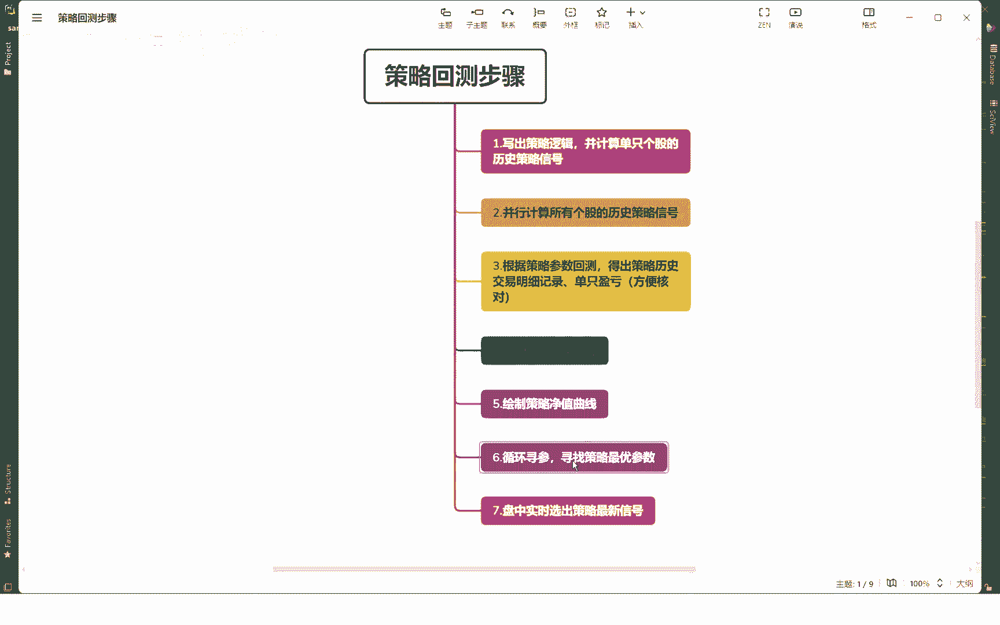
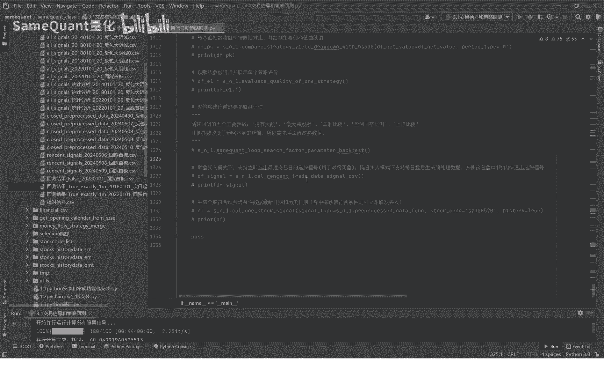
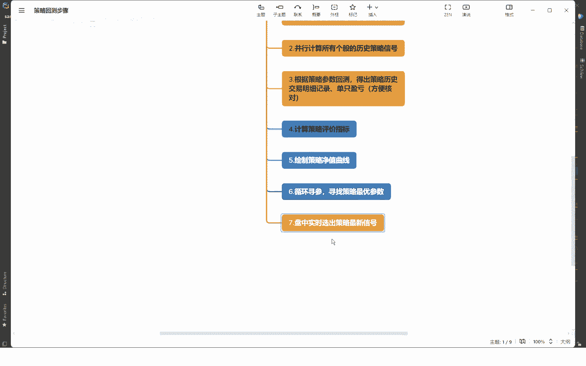

# 量化交易策略：3.7：循环回测寻参找最优策略参数 🎯

在本节课中，我们将学习如何使用循环回测的方法，为量化交易策略寻找最优的参数组合。这是决定策略能否获得高收益并用于实盘的关键步骤。

## 概述

循环回测寻参的核心逻辑是，通过遍历预设的参数列表，自动测试成千上万种参数组合，从而找出历史表现最佳的策略参数。这个过程能帮助我们客观地了解策略在不同参数下的表现，为实盘交易提供依据。

## 代码准备与逻辑讲解

上一节我们介绍了策略的基本框架，本节中我们来看看如何进行参数寻优。首先，我们需要专注于循环回测的代码部分，可以将之前演示的其他代码暂时注释掉。

循环寻参的逻辑是遍历我们设置好的参数列表。以下是需要循环测试的主要参数及其含义：

*   **持股期**：股票买入后持有的天数。例如，列表 `[2, 9]` 表示将分别测试持股2天和持股9天的情况。
*   **最大持股数**：策略每天最多同时持有多少只股票。例如 `[1, 2, 3]`。这个值取决于策略每日产生信号的多少。如果信号很少，此值应设小；如果信号很多，可以设大一些，以使收益曲线更平滑。
*   **止盈比例**：股票上涨多少百分比后考虑止盈。例如 `[0.06, 0.4]` 表示测试从6%到40%的止盈线。
*   **回落止盈比例**：从最高点回落多少百分比时触发止盈卖出。例如 `[0.01, 0.5]`。
*   **止损比例**：股票亏损多少百分比时触发止损卖出。例如 `[-0.03, -0.1]`。

这五个参数对应策略代码中的五个关键变量，在循环回测中会被自动修改和测试。默认情况下，这五个参数的组合会生成约4000多个不同的策略进行回测。

如果你想修改其他策略参数（例如将动态止损改为固定止损），需要手动修改代码。但修改后，你仍然可以对上述五个参数进行循环寻优。不过请注意，修改核心参数可能会改变策略的性质。

## 执行循环回测

接下来我们进入代码执行部分。首先需要设置回测结果的存储路径。回测结束后，会生成一个CSV文件，里面记录了所有参数组合及其对应的回测指标。

代码中包含一个判断：如果某个参数组合已经回测过，则不会重复回测，以提高效率。

以下是循环遍历参数并执行回测的核心步骤：

1.  代码会遍历所有参数组合，形成策略列表。
2.  我们可以先打印查看本次循环总共有多少个策略需要测试。公式可表示为：**策略总数 = len(持股期列表) * len(持股数列表) * len(止盈比例列表) * len(回落比例列表) * len(止损比例列表)**。
3.  每个策略的回测大约需要1秒钟。为了演示，我们先测试前100个策略。
4.  运行回测，并将所有策略的结果合并保存。

运行前100个策略大约需要1分钟。回测结果表格会包含丰富的指标，例如：
*   **累计净值**：策略最终资产相对于初始资产的倍数。
*   **年化收益率**
*   **最大回撤**及其开始/结束时间
*   **年化收益回撤比**（夏普比率类似物）
*   **胜率**（盈利交易次数占比）

结果会按照累计净值从高到低排序。

## 结果分析与参数启示

通过观察前100个策略的回测结果，我们可以获得重要启示：

*   **表现优异的策略**：例如，排名第一的策略参数可能是“持股期2天，持股数1，上涨超6%且从高点回落1%止盈，亏损5%止损”。其累计净值可能达到128倍。
*   **表现很差的策略**：例如，某个策略的净值归零（亏损99%），其参数可能是“持股期2天，持股数1，上涨超15%且回落10%止盈，亏损3%止损”。

对比可知，**“小幅止盈、严格止损”的参数设置，通常优于“大幅止盈、小幅止损”的设置**。后者更容易导致策略归零。因此，止盈止损参数的设置非常关键。

我们的回测框架支持基于盘中价格的止盈止损逻辑，这比许多仅以收盘价计算的回测系统更为严谨和真实，是框架的核心优势之一。

通过这次小规模的循环寻参，你就能对策略参数的敏感性和合理设置范围有一个客观的了解。

## 给学员的实践指南

各位学员在拿到源码后，若要进行完整的参数寻优，请注意：

1.  可以注释掉其他回测代码，只运行循环寻参的部分。
2.  将测试数量从100改为全部（约4000次）。完整测试可能需要40分钟以上。
3.  测试完成后，仔细分析结果CSV文件，找到最适合你风险收益偏好的参数组合。

## 总结

本节课中，我们一起学习了循环回测寻参的全过程。我们了解了核心的五个参数，掌握了执行回测和分析结果的方法，并认识到止盈止损参数设置对策略表现的巨大影响。通过这种方法，你可以系统性地优化策略，找到历史回测中表现最优的参数，为实盘交易打下坚实的基础。

---

下一节课（3.8）将是另一个关键环节：**实盘对接**。当我们找到一个历史表现优秀的策略后，需要确保它能快速捕捉盘中信号（例如1秒内），并即时对接QMT等交易终端进行实盘交易。这将把我们的策略从理论真正推向实践。