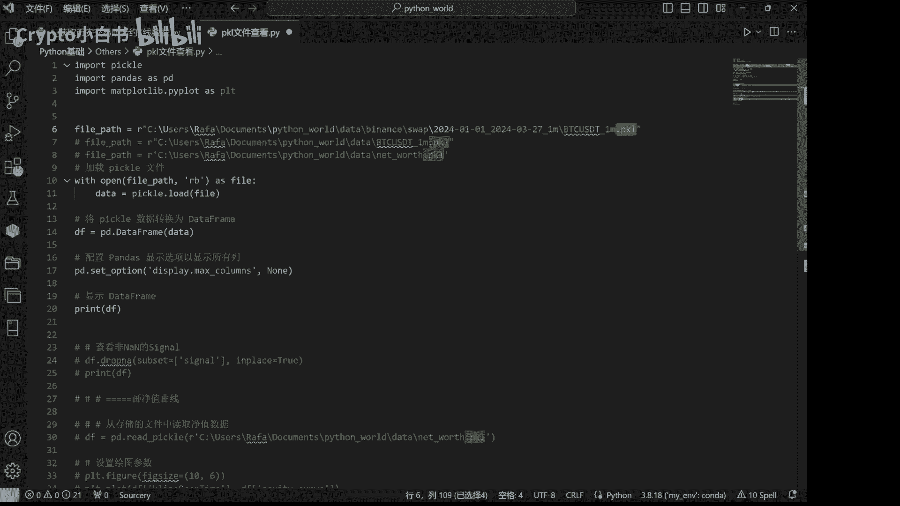
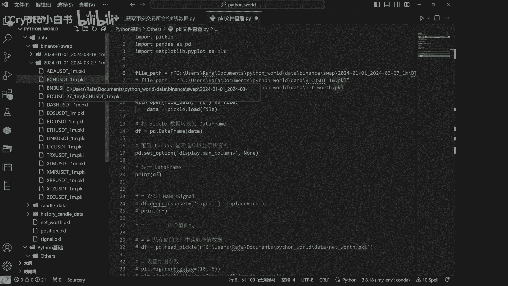
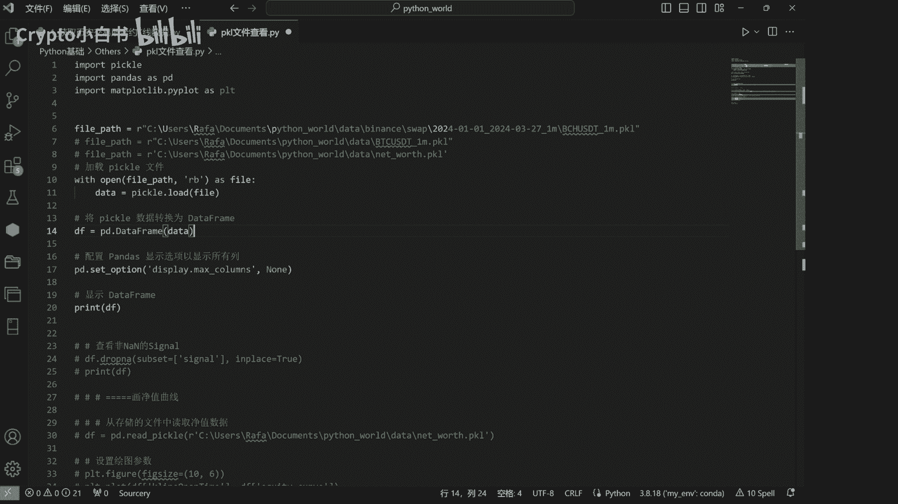
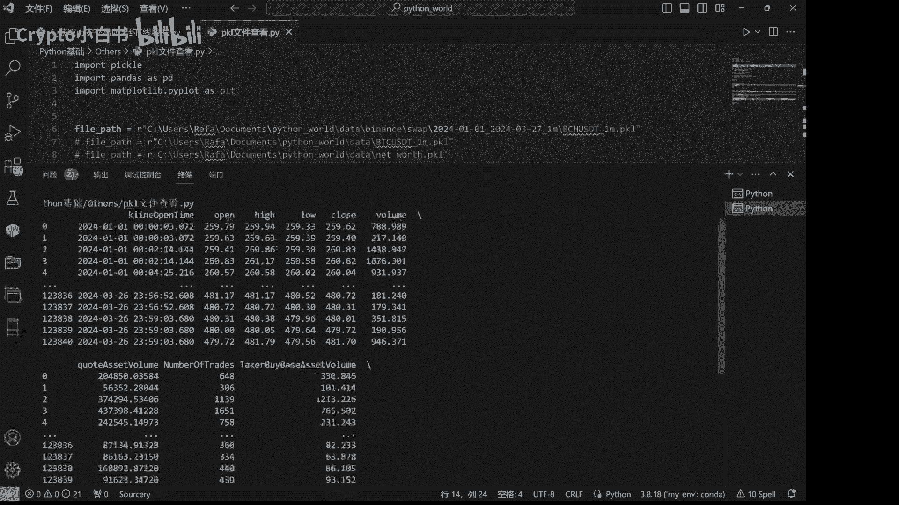

# 小白书：3：如何查看下载的K线数据 📊

在本节课中，我们将学习如何查看已下载的、以`.pkl`格式保存的历史K线数据文件。我们将通过简单的代码，将数据加载并转换为易于阅读的表格形式。

## 定位数据文件

首先，我们需要找到之前下载好的`.pkl`格式历史K线数据文件所在的文件夹。




## 复制文件路径

找到目标文件后，复制其完整的文件路径，以备后续在代码中使用。




## 加载与查看数据

上一节我们定位了数据文件，本节中我们来看看如何用代码打开并查看其内容。核心原理是使用Python的`pandas`库来加载`.pkl`文件，并将其转换为`DataFrame`格式进行打印。

以下是实现此功能的核心代码步骤：

```python
import pandas as pd

# 将复制的文件路径粘贴到这里
file_path = ‘你的文件路径/文件名.pkl’

# 使用pandas加载pkl文件
data = pd.read_pickle(file_path)



# 将数据转换为DataFrame并打印查看
print(data)
```

运行上述代码，即可在控制台看到数据的详细内容。


## 理解数据结构

运行代码后，我们可以看到获取的K线数据以表格形式呈现。它通常包含多列，每一列代表一个特定的市场信息。

以下是数据表中常见的列及其含义：

*   **kline_start_time**: K线周期的开始时间。
*   **open**: 该周期内的开盘价。
*   **high**: 该周期内的最高价。
*   **low**: 该周期内的最低价。
*   **close**: 该周期内的收盘价。
*   **volume**: 该周期内的成交量。
*   后续可能还有成交额等其他指标列。




本节课中我们一起学习了如何定位、加载和查看下载的`.pkl`格式K线数据。通过简单的Python代码，我们可以将二进制数据文件转换为清晰的结构化表格，从而为后续的数据分析打下基础。