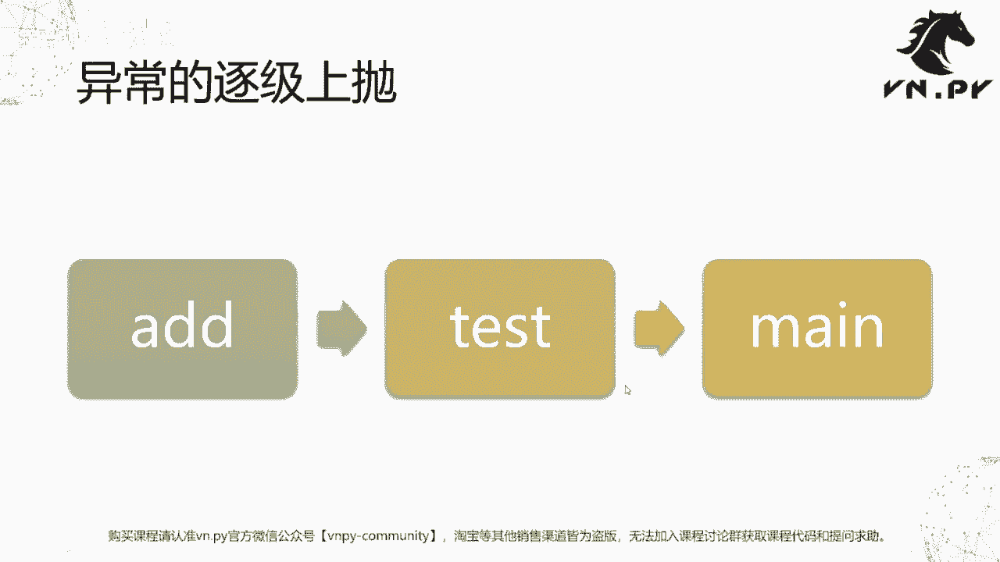
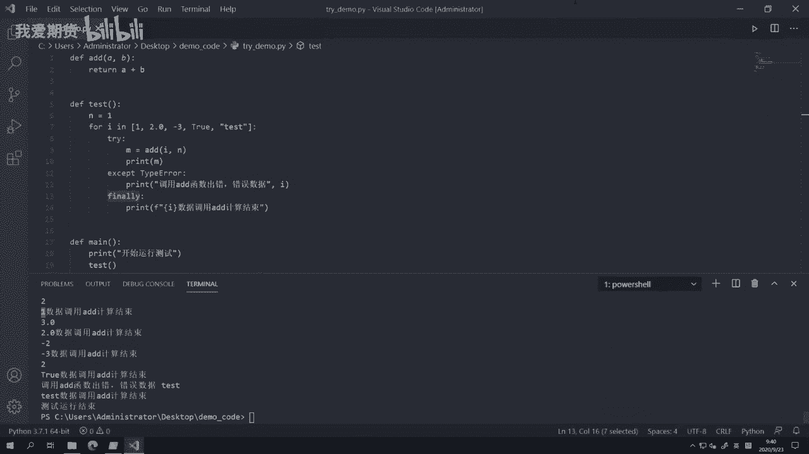

# Python量化开发：30：异常处理实战 🚨

在本节课中，我们将学习如何捕捉和处理Python程序中的异常。异常是程序运行时发生的错误，如果不加处理，会导致程序意外终止。通过学习`try`、`except`和`finally`语句，我们可以优雅地处理这些错误，确保程序在遇到问题时能够继续运行或妥善退出。

上一节我们初步接触了异常的概念，本节中我们来看看如何主动捕捉和处理它们。

## 为什么需要处理异常？

在程序执行过程中，如果某行代码出错，解释器会立即抛出异常。这会导致程序停止执行。在快速脚本开发时，这有助于快速定位错误。但在实际应用中，程序意外停止可能带来更多问题。

以下是几种需要处理异常并让程序继续运行的情形：

**1. 预期操作**
在交易接口中，我们可能根据合约代码查询对应的交易所信息。如果查询时数据尚未到达，字典中可能不存在该键值。此时，程序不应停止，而应处理“键不存在”的情况，例如本次放弃发单，等待下一轮再尝试。

**2. 处理外部数据**
当通过`socket`从外部交易所接收行情数据时，网络传输可能导致数据包错误或格式异常。如果解析数据时出错，程序不应崩溃，而应丢弃错误的数据包，继续处理下一个。

**3. 主动处理资源**
例如，尝试打开一个本地文件进行写入，但文件可能已被其他程序占用。此时，程序不应退出，而应提示用户关闭占用程序，然后重试打开操作。

几乎所有编程语言都提供了异常处理机制。在Python中，我们使用`try`、`except`和`finally`关键字来实现。

## 异常处理语法：try, except, finally

异常处理通常包含三步操作，对应三个关键字：



*   **`try`**：尝试执行可能出错的代码块。
*   **`except`**：捕捉并处理特定类型或所有类型的异常。
*   **`finally`**：无论是否触发异常，最终必定执行的代码块，常用于清理资源（如关闭文件）。

其基本结构如下：
```python
try:
    # 可能出错的代码
    risky_operation()
except SomeSpecificError: # 捕捉特定异常
    # 处理该异常
    handle_error()
except: # 捕捉所有其他异常（不推荐）
    handle_other_errors()
finally:
    # 最终必须执行的代码
    cleanup()
```

## 代码示例与分析

我们通过一个示例来理解异常处理的实际应用。以下是示例代码`try_demo.py`：

```python
def add(a, b):
    return a + b

def test():
    n = 1
    # 列表包含不同类型的数据
    data_list = [1, 2.0, -3, True, "test"]
    for i in data_list:
        try:
            m = add(i, n)
            print(m)
        except TypeError: # 明确捕捉类型错误
            print(f"调用add函数出错，错误数据: {i}")
        finally:
            print(f"使用数据 {i} 的计算流程结束")

def main():
    print("开始运行测试")
    test()
    print("测试运行结束")

if __name__ == "__main__":
    main()
```

**代码解析：**

1.  `add(a, b)`函数执行加法操作。
2.  `test()`函数遍历一个包含整数、浮点数、布尔值和字符串的列表。
3.  在循环内部，使用`try`块尝试调用`add(i, n)`。
4.  当`i`为字符串`"test"`时，`add`函数尝试执行 `"test" + 1`，这会引发`TypeError`。
5.  `except TypeError:` 语句捕捉到这个特定的类型错误，并打印错误信息，而不是让程序崩溃。
6.  `finally:` 块中的语句无论是否发生异常都会执行，用于标识每次计算尝试的结束。
7.  `main()`函数成功从头运行到尾，证明了异常被妥善处理。

**运行结果：**
```
开始运行测试
2
3.0
-2
2
调用add函数出错，错误数据: test
使用数据 test 的计算流程结束
测试运行结束
```
可以看到，即使处理字符串时发生了异常，程序也没有终止，`main`函数最后的打印语句得以执行。

## 异常的传播与调用栈

当异常在函数内部被触发时，如果未被该函数内的`try-except`块捕捉，它会向上一层调用者传播。Python解释器会输出完整的调用栈信息，帮助开发者定位问题根源。



在我们的例子中，如果`test()`函数中没有`try-except`，异常传播路径将是：
`add`函数内触发异常 → 传播到调用者`test`函数 → 传播到调用者`main`函数 → 导致程序终止，并打印出从`main`到`add`的完整调用链。这种机制极大地方便了调试。

## 总结


本节课我们一起学习了Python中异常处理的核心机制。我们了解了为何需要处理异常，掌握了使用`try`、`except`和`finally`语句来捕捉和处理异常的基本方法，并通过实例看到了异常处理如何让程序更加健壮。记住，在处理异常时，应尽量指定具体的异常类型，避免使用空的`except:`语句，这有助于更精确地定位和处理问题。下节课，我们将学习如何使用调试工具来查找和修复代码中的错误。