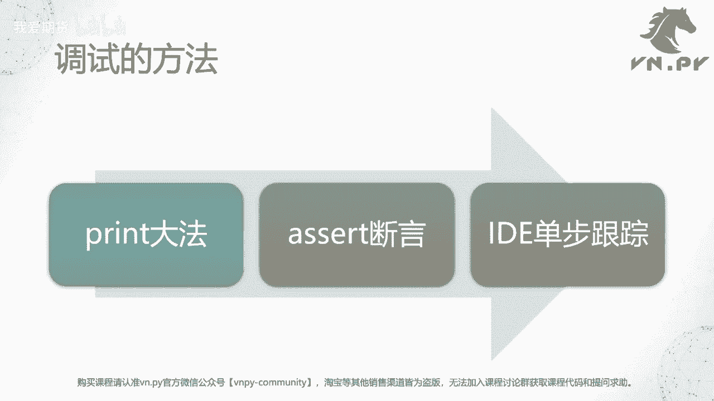
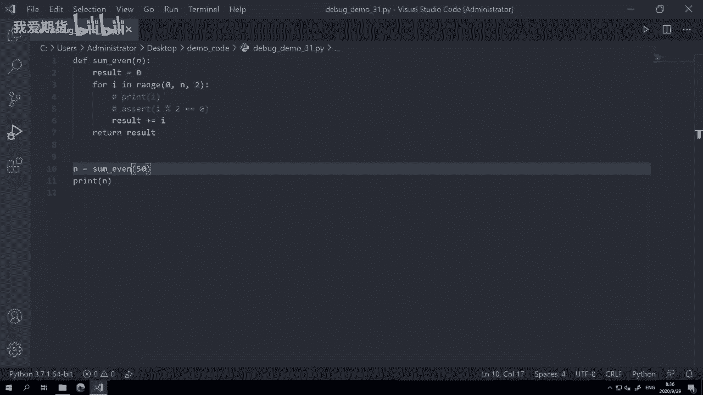
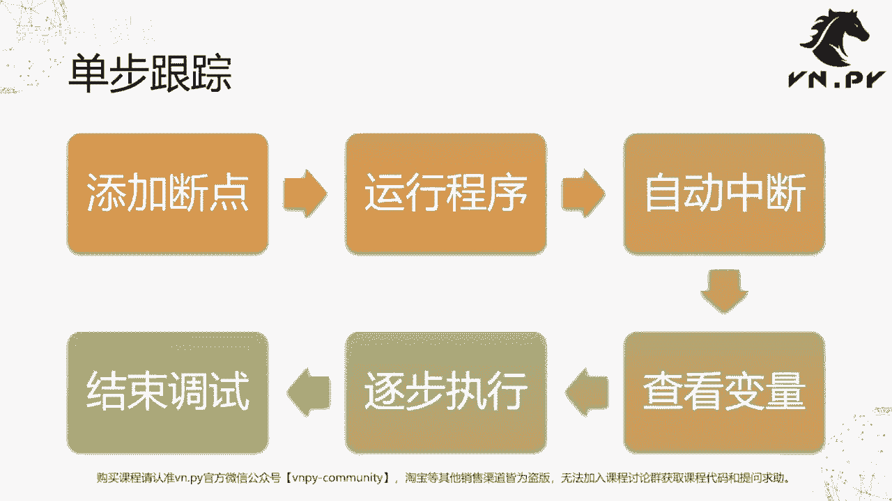

# 量化交易零基础入门：31：代码调试方法详解 🐛

在本节课中，我们将学习三种核心的代码调试方法，以处理程序运行中预期之外的错误。掌握这些方法，能帮助你更高效地定位和修复代码中的问题。

在上一节课中，我们学习了如何使用 `try...except` 来捕捉预期内的运行时异常。本节中，我们来看看如何处理那些意料之外的错误，即代码调试。

## 什么是调试？

调试的英文是 **debug**。**bug** 指编写程序时出现的各种错误，因此 **debug** 就是找出并处理这些错误的过程。

到目前为止，我们已经学习了30多节课，编写代码并运行程序通常遵循以下四步流程：

1.  **编写代码**：遵循规范（如Python的PEP 8），使用空格、换行和注释，并可用 `flake8` 等工具检查。
2.  **尝试运行**：运行写好的代码。由于可能存在拼写或逻辑错误，此步骤成功运行的概率并不高。若运行失败，Python会抛出异常信息，指出错误位置。
3.  **排查错误**：根据异常信息判断问题所在，并修复代码。
4.  **成功运行**：重复“尝试运行”和“排查错误”的步骤，直到所有错误修复，程序成功运行并达成目标。



写代码就是这四步流程的不断重复。今天，我们将重点讲解第三步中“排查错误”的具体方法。

以下是本节课将介绍的三种调试方法：

*   **Print大法**：最简单直接、效率最高的方法，适用于绝大多数常规查错场景。
*   **Assert断言**：常用于大型团队集成开发项目，用于在代码中嵌入检查点。
*   **IDE单步跟踪**：集成开发环境提供的可视化调试功能，可以逐行执行并观察程序状态。

---

## 方法一：Print大法

这是最快速、最常用的调试方法。其核心思想是在代码的关键位置插入 `print()` 语句，输出变量的值或程序执行到哪一步，从而判断逻辑是否正确。

我们通过一个示例函数来演示。该函数的目标是计算从0到N之间所有偶数的和。

```python
def sum_even(N):
    result = 0  # 用于缓存求和结果的变量
    for i in range(0, N, 2):  # 从0开始，到N结束（不含N），步长为2，即只循环偶数
        result += i  # 累加操作
    return result

# 测试函数
N = 50
print(sum_even(N))  # 输出结果
```

运行后得到结果 **600**。但对于一个不熟悉的计算，我们如何验证其正确性呢？一个简单的方法就是打印循环中的每一个 `i` 值。

以下是使用Print大法进行验证的步骤：

1.  在循环内部添加 `print(i)` 语句，观察每次循环的 `i` 值。
2.  运行程序，检查输出的数值序列是否符合“0, 2, 4, 6...”的偶数预期。
3.  如果序列正确，则可以相信累加逻辑（`result += i`）和最终结果也是正确的。
4.  确认无误后，可移除或注释掉调试用的 `print` 语句。

这种方法直接有效，尤其适用于检查特定变量在运行过程中的变化。

---

## 方法二：Assert断言

`assert`（断言）用于在代码中设置检查点。如果其后的条件表达式为 `True`，程序继续正常运行；如果为 `False`，则会抛出 `AssertionError` 异常，提示此处可能出现问题。

继续使用上面的 `sum_even` 函数。我们可以用断言来确保循环中的每个 `i` 确实都是偶数。

```python
def sum_even(N):
    result = 0
    for i in range(0, N, 2):
        # 断言：i 除以 2 的余数必须等于 0（即为偶数）
        assert i % 2 == 0, f"i={i} is not an even number!"
        result += i
    return result
```

以下是使用断言进行调试的说明：

*   当 `i` 是偶数时，`i % 2 == 0` 为 `True`，断言通过，程序继续。
*   如果我们的 `range` 步长参数设置错误（例如设为1），导致 `i` 出现奇数，那么 `i % 2 == 0` 为 `False`，程序会立即在此处停止并报告错误。
*   断言常用于在开发阶段验证代码的假设条件，在团队协作或复杂项目中能帮助快速定位违反约定的代码。

---

## 方法三：IDE单步跟踪

集成开发环境（如VS Code）提供了强大的图形化调试工具，允许你逐行执行代码（单步跟踪），并实时查看所有变量的值。这是最直观的调试方式之一。

上一节我们介绍了通过打印和断言来观察代码状态。本节中我们来看看如何利用IDE进行更细致的交互式调试。

我们以在VS Code中调试 `sum_even` 函数为例，演示单步跟踪的完整流程。

### 单步跟踪六步流程

1.  **添加断点**：在你想暂停执行的代码行左侧（行号附近）点击，会出现一个红点。例如，在 `result += i` 这一行设置断点。
2.  **启动调试**：按下 `F5` 键，选择调试模式为 **“Python File”**。这将启动调试会话，而非普通运行。
3.  **程序中断**：程序运行到断点处会自动暂停。该行代码会高亮显示。
4.  **查看变量**：在VS Code左侧的 **“变量”** 面板中，可以查看当前函数内的局部变量（如 `i`, `N`, `result`）的实时值。
5.  **控制执行**：使用调试工具栏上的按钮控制程序：
    *   **Step Over (F10)**：执行当前行，并跳到下一行。
    *   **Step Into (F11)**：如果当前行有函数调用，会进入该函数内部。
    *   **Continue (F5)**：继续运行，直到下一个断点或程序结束。
    *   **Stop**：终止调试会话。
6.  **修改与重启**：在调试过程中，如果发现错误，可以直接修改代码。然后点击 **“重启”** 按钮（绿色圆形箭头）重新开始调试，无需先停止。

通过单步执行，你可以清晰地看到每一行代码执行后程序状态的变化，非常适合分析复杂的逻辑流或查找隐藏的错误。

---



## 方法对比与注意事项

尽管我们介绍了三种调试方法，但需要注意，**IDE单步跟踪的应用场景有一定限制**。

其核心限制在于：它主要适用于调试纯Python代码的执行流。在以下两种常见情况下，断点可能无法生效：

1.  **调用C/C++扩展模块的回调函数**：例如，某些量化交易API的底层是C++实现的，当其回调Python函数时，IDE可能无法捕获并在此处中断。
2.  **某些GUI框架（如PyQt）的复杂线程模型**：由于其底层基于C++库（Qt），在某些事件回调或线程中设置的断点可能断不下来。

对于上述情况，**Print大法**是通用性最强、最可靠的方法，因为它不依赖于调试器，总能将信息输出到控制台。虽然需要人工查看输出，但在调试与原生扩展交互的代码时，它往往是首选。

Assert断言则更适合在代码中嵌入永久性的检查逻辑，用于确保某些条件在开发和质量保证阶段始终成立。

---



本节课中我们一起学习了三种核心的代码调试技术：简单直接的Print大法、用于嵌入检查的Assert断言、以及直观的IDE单步跟踪。每种方法都有其适用场景，掌握它们将极大提升你排查和解决代码问题的效率。在实际开发中，可以根据具体问题灵活选用或组合使用这些方法。