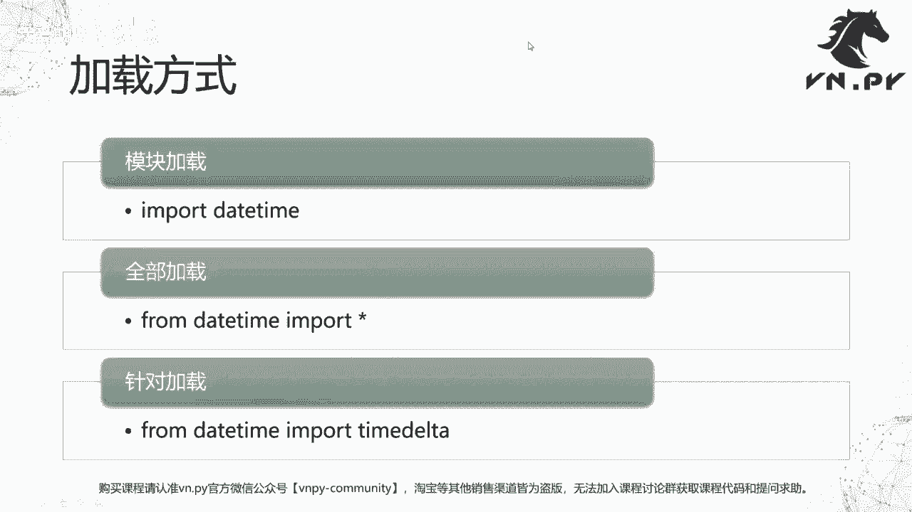
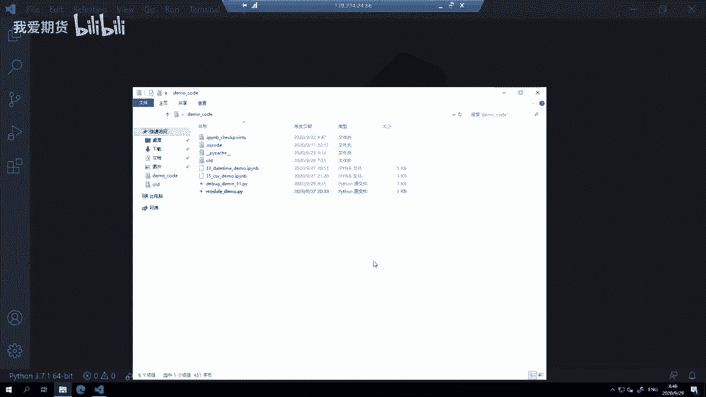
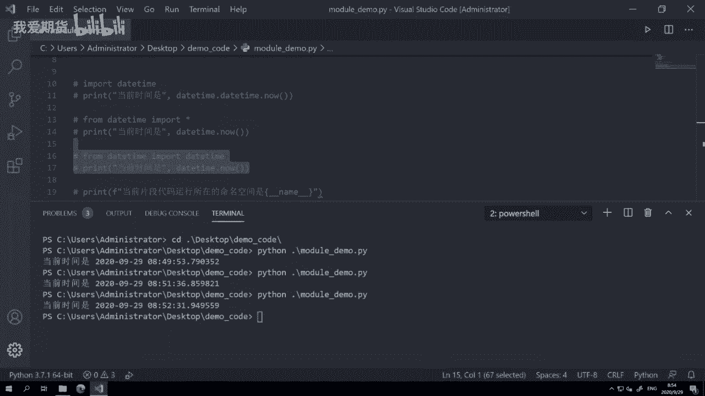
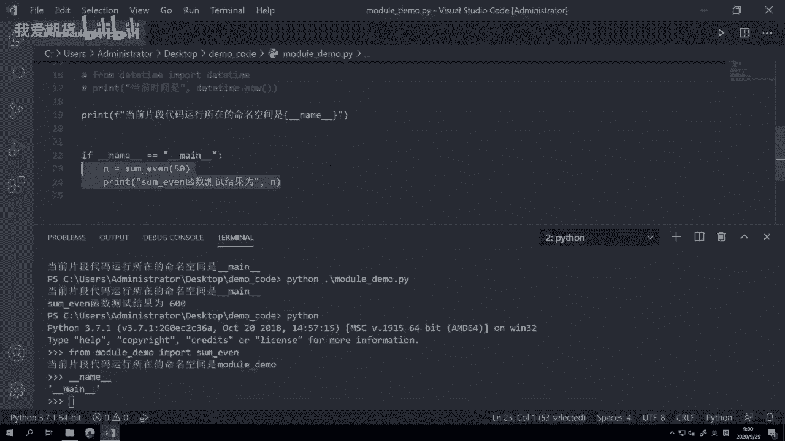
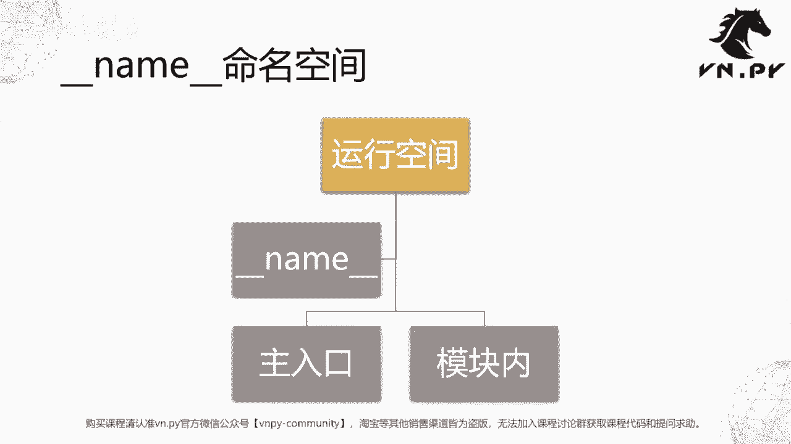

# Python量化开发：32：Python模块 - P1

在本节课中，我们将要学习Python中一个极其重要的概念——模块。模块是代码复用的基础，也是Python生态如此强大的原因。我们将了解模块的分类、加载方式以及一个关键的运行时变量 `__name__`。

上一节课我们完成了Python异常处理的学习。从本节课开始，我们将用十几节课的时间，集中讲解Python模块这个核心话题。

Python语言在过去十年发展非常迅猛，先后占领了量化交易、大数据和机器学习等领域。除了易学易用和动态语言的特性外，一个关键原因是整个社区遵循“站在巨人的肩膀上”的精神。在Python中，你可以将写好的功能打包成模块（module）或包（package），以便在未来的代码中重复使用，这避免了复制粘贴带来的麻烦和错误。这种模式叫做代码复用。

现阶段我们自己写的代码复用价值可能不高，但对于全球Python开源社区而言，无数人投入精力开发了众多强大的模块。例如，NumPy的早期开发得到了摩根大通银行的赞助；pandas起源于美国对冲基金AQR，现已成为大数据处理的标准。这些模块都可以方便地在线获取和使用。与C/C++等语言需要下载源码编译不同，Python通常只需`pip install`和`import`两行命令即可。因此，掌握模块的使用至关重要。

Python基础语法我们已经学完，接下来就是学习如何使用这些模块，快速实现功能，避免重复造轮子。一定要学会站在巨人的肩膀上。

接下来我们要讲的模块知识包括三块内容。

以下是模块的三种分类：

1.  **内置模块**：所有Python发行版都会提供的模块，由Python官方开发。例如，`datetime`模块用于处理时间和日期。
2.  **三方模块**：由Python官方和用户以外的第三方提供的模块。许多应用功能模块属于此类，例如：
    *   `numpy`：用于矩阵运算。
    *   `matplotlib`：用于绘图。
    *   `vn.py`（或`veighna`）：用于量化交易。
3.  **本地模块**：由开发者自己编写的模块。例如，本节课我们将使用一个名为`module_demo`的演示模块。

整体上，模块分为内置模块、三方模块和本地模块三类。

上一节我们介绍了模块的分类，本节中我们来看看如何加载这些模块。





模块的加载方式分为三种级别。

以下是三种模块加载方式：

1.  **模块级别加载**：使用 `import datetime` 语句。这会直接加载整个`datetime`模块。
2.  **全部加载**：使用 `from datetime import *` 语句。这种方法会将模块内的所有内容（无论是否需要）都加载进来。Python官方社区现在不推荐使用这种方法，因为不同模块中可能存在同名函数，容易引发命名冲突。
3.  **针对性加载**：使用 `from datetime import datetime` 语句。这种方法直接从模块中加载你需要使用的特定功能（函数或类），是目前推荐的方式。

下面我们通过代码来演示这三种加载方式的效果。我们假设有一个`module_demo.py`文件，其中包含一个函数`sum_even`。

```python
# module_demo.py 文件内容
def sum_even(n):
    """计算从2到n（包含n）的所有偶数之和"""
    total = 0
    for i in range(2, n+1, 2):
        total += i
    return total

# 以下是演示三种import方式的代码，实际应写在文件顶部
# 1. 模块级别加载
import datetime
print(f"模块级别加载 - 当前时间: {datetime.datetime.now()}")

# 2. 全部加载 (不推荐)
# from datetime import *
# print(f"全部加载 - 当前时间: {datetime.datetime.now()}") # 可能引发检查工具警告

# 3. 针对性加载 (推荐)
from datetime import datetime
print(f"针对性加载 - 当前时间: {datetime.now()}")
```

**运行结果示例**：
```
模块级别加载 - 当前时间: 2023-09-29 08:49:53.xxxxxx
针对性加载 - 当前时间: 2023-09-29 08:49:53.xxxxxx
```

**如何选择加载方式**：
*   **针对性加载**是目前Python官方和许多团队（如VNPY团队）推荐的写法。它明确指出了加载了哪些内容，便于检查和避免冲突，也对代码检查工具（如flake8）和编辑器智能提示更友好。
*   **模块级别加载**在需要用到模块内大量功能时比较方便，无需一一列出。
*   **全部加载**仅在编写简短、临时的脚本时可能为了省事而使用，在正式、长期维护的项目中应避免。

了解了模块的加载方式后，我们需要认识一个Python中特殊的运行时变量：`__name__`。




`__name__`是一个“魔法变量”，由Python解释器在运行时自动设置，用于标识当前代码所在的命名空间。它主要有两种值：

1.  **`"__main__"`**：当Python文件作为主程序入口直接运行时（例如在终端执行`python module_demo.py`），其`__name__`变量的值就是`"__main__"`。
2.  **模块名**：当Python文件被作为模块导入时（例如在其他文件中`import module_demo`），其`__name__`变量的值就是该模块的名字（例如`"module_demo"`）。


这个特性非常有用，它允许我们编写既能被导入使用，又能独立运行的脚本。

我们通过`module_demo.py`来演示：

```python
# module_demo.py
def sum_even(n):
    """计算从2到n（包含n）的所有偶数之和"""
    total = 0
    for i in range(2, n+1, 2):
        total += i
    return total

# 打印当前命名空间，用于演示
print(f"当前代码运行所在的命名空间是: {__name__}")

# 利用 __name__ 判断是否作为主程序运行
if __name__ == "__main__":
    # 只有当直接运行此文件时，才会执行以下代码
    result = sum_even(50)
    print(f"sum_even函数测试结果为: {result}")
```

**场景一：直接运行文件**（在终端执行 `python module_demo.py`）
```
当前代码运行所在的命名空间是: __main__
sum_even函数测试结果为: 650
```

**场景二：作为模块导入**（在Python交互环境或另一个文件中执行 `from module_demo import sum_even`）
```
当前代码运行所在的命名空间是: module_demo
# 注意：不会打印测试结果
```

这种写法非常常见。它确保了模块中的测试代码或某些初始化逻辑只在直接运行该模块时执行，而在被其他模块导入时不会自动执行，从而提高了代码的灵活性和可复用性。

本节课中我们一起学习了Python模块的基础知识。我们首先了解了模块的三种分类：内置模块、三方模块和本地模块。然后，我们详细讲解了三种模块加载方式：模块级别加载、全部加载（不推荐）和针对性加载（推荐），并演示了如何选择。最后，我们探讨了`__name__`这个魔法变量的作用，它能够区分模块是作为主程序运行还是被导入，这对于编写可复用的脚本至关重要。





掌握模块是高效使用Python的关键。在接下来的课程中，我们将深入更多具体的模块及其应用。