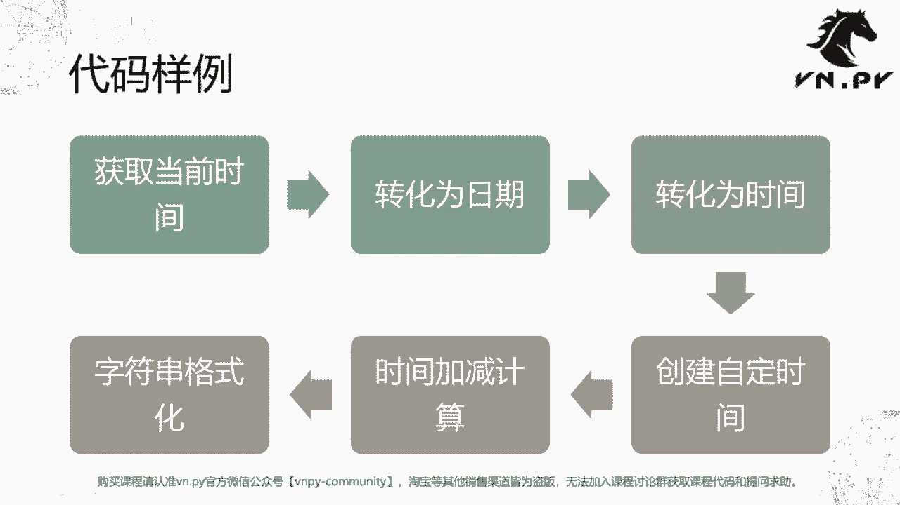
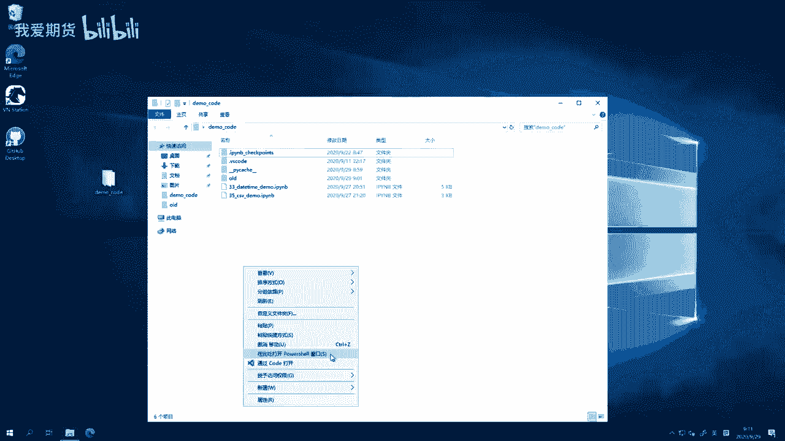
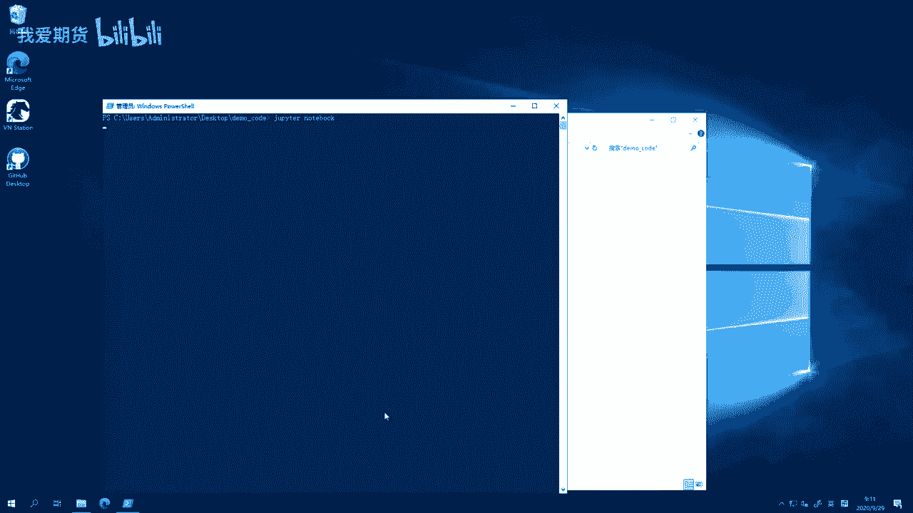
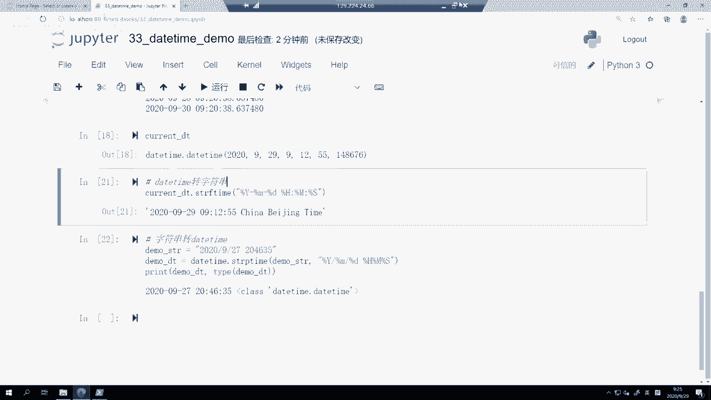

# 量化交易零基础入门：33：datetime模块详解

在本节课中，我们将学习Python中一个非常核心的模块——`datetime`模块。该模块专门用于处理日期和时间相关的计算与操作，是量化交易中记录时间戳、计算时间间隔、判断交易时段等功能的基石。

上一节我们简单提及了常用模块的概念，本节中我们将深入探讨`datetime`模块的具体构成和用法。

## 模块核心类介绍

`datetime`模块主要提供了四个核心类，用于不同场景下的日期时间处理。

以下是四个核心类的简要说明：



*   **`date`类**：代表一个日期，包含**年、月、日**信息。
*   **`time`类**：代表一个时间，包含**时、分、秒、微秒**信息。
*   **`datetime`类**：这是最常用的类，它整合了`date`和`time`，能精确表示**某年某月某日某时某分某秒**。
*   **`timedelta`类**：代表两个时间点之间的**差值**，或用于时间的**加减运算**。例如，计算今天到某个期权到期日还有多少天。





接下来，我们将通过六个步骤的代码示例，来具体学习这些类的使用方法。

## 代码实践：六步掌握datetime

我们将按照获取当前时间、提取日期/时间、创建自定义时间、进行时间计算以及字符串格式化的顺序进行学习。

### 第一步：获取当前时间

首先，我们需要从`datetime`模块中导入所需的类，并获取当前的完整时间。

```python
from datetime import datetime, date, time, timedelta

# 获取当前时间
current_dt = datetime.now()
print(current_dt)  # 输出示例：2020-09-29 09:12:55.123456
print(type(current_dt))  # 输出：<class 'datetime.datetime'>
```
`datetime.now()`是一个静态方法，可以直接调用并返回一个表示当前时间的`datetime`对象。输出结果包含年、月、日、时、分、秒和微秒。

### 第二步：提取日期部分

有时我们只关心日期，不关心具体时间。这时可以从`datetime`对象中提取出`date`对象。

```python
# 从datetime对象中提取日期部分
current_date = current_dt.date()
print(current_date)  # 输出示例：2020-09-29
print(type(current_date))  # 输出：<class 'datetime.date'>
```

### 第三步：提取时间部分

同理，我们也可以只提取时间部分，得到一个`time`对象。这在判断日内交易时段时非常有用。

```python
# 从datetime对象中提取时间部分
current_time = current_dt.time()
print(current_time)  # 输出示例：09:12:55.123456
print(type(current_time))  # 输出：<class 'datetime.time'>

# 应用示例：判断是否到达平仓时间
end_time = time(14, 55)  # 创建下午2:55的时间对象
if current_time >= end_time:
    print("到达平仓时间，执行平仓操作。")
else:
    print("正常交易时段。")
```
在量化策略中，若策略规定每天14:55平仓，则应将每个tick的时间戳转换为`time`对象后与`end_time`进行比较，而不是使用带日期的`datetime`对象。

### 第四步：创建自定义时间

我们可以手动创建一个特定的`datetime`对象，例如某个期权的到期日。

```python
# 创建自定义的datetime对象
option_expire = datetime(2020, 10, 28)  # 年月日为必填参数
print(option_expire)  # 输出：2020-10-28 00:00:00

# 也可以指定时分秒
option_expire_detail = datetime(2020, 10, 28, 15, 0, 0)
print(option_expire_detail)  # 输出：2020-10-28 15:00:00
```
创建`datetime`对象时，**年、月、日**是必须提供的参数，**时、分、秒、微秒**可选，默认为0。

### 第五步：时间的加减计算

使用`timedelta`可以方便地进行时间的加减运算，例如计算剩余时间或获取前一天/后一天的日期。

```python
# 计算两个时间点的差值（得到timedelta对象）
time_left = option_expire - current_dt
print(time_left)  # 输出示例：28 days, 14:47:04.851324
print(type(time_left))  # 输出：<class 'datetime.timedelta'>

# 获取差值中的具体天数或总秒数
print(f"剩余整日天数：{time_left.days}")
print(f"剩余总秒数：{time_left.total_seconds()}")

# 时间的加减运算
today = datetime.now()
yesterday = today - timedelta(days=1)
tomorrow = today + timedelta(days=1)
print(f"昨天：{yesterday}")
print(f"今天：{today}")
print(f"明天：{tomorrow}")
```
`timedelta`对象可以表示两个时间点的差值，也可以与`datetime`对象相加减，生成新的时间点。

### 第六步：时间与字符串的相互转换

在实际应用中，经常需要在`datetime`对象和字符串之间进行转换，例如将数据保存到文件或解析API返回的时间字符串。

以下是转换方法：

*   **对象 -> 字符串**：使用`strftime(format)`方法。
*   **字符串 -> 对象**：使用`strptime(string, format)`方法。

```python
# 1. datetime对象 转 字符串
format_string = current_dt.strftime("%Y-%m-%d %H:%M:%S.%f 北京时")
print(format_string)  # 输出示例：2020-09-29 09:12:55.123456 北京时

# 2. 字符串 转 datetime对象
demo_str = "2020/09/27 204635"  # 一个格式特殊的字符串
parsed_dt = datetime.strptime(demo_str, "%Y/%m/%d %H%M%S")
print(parsed_dt)  # 输出：2020-09-27 20:46:35
```
在格式字符串中，以百分号`%`开头的字母是特殊格式代码（如`%Y`代表四位年份），其他字符（如`-`、`/`、空格）会原样输出或匹配。

## 总结

本节课中我们一起学习了Python `datetime`模块的核心功能。我们认识了`date`、`time`、`datetime`和`timedelta`四个核心类，并通过六个步骤实践了如何获取当前时间、提取日期时间成分、创建特定时间、进行时间差计算以及完成时间与字符串之间的转换。



`datetime`模块是量化交易中进行时间处理的基础工具，熟练掌握它能帮助你有效管理策略的时间逻辑，例如记录交易时间、计算持有期、设定定时任务等。在接下来的课程中，我们将在实际的量化框架中看到它的具体应用。